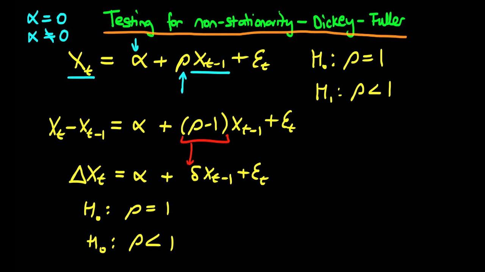

## Table of Contents

## What is the Dickey-Fuller test?

The Dickey-Fuller test is a statistical test used to find out if a time series data set is stationary or not. Stationary means that the data's statistical properties, like the mean and variance, do not change over time. This test is important because many statistical models work better with stationary data. The test was created by statisticians David Dickey and Wayne Fuller, which is why it's called the Dickey-Fuller test.

The test works by looking at the difference between the current value of the time series and its previous value. It then checks if this difference is related to the previous value itself. If the test shows that there is no relationship, it suggests that the time series is stationary. There are different versions of the test, like the Augmented Dickey-Fuller test, which can handle more complex data. If the test result is below a certain critical value, we say the data is likely stationary. If it's above, the data is probably not stationary.

## Why is the Dickey-Fuller test used in time series analysis?

The Dickey-Fuller test is used in time series analysis to check if the data is stationary. Stationary data means that its average, spread, and other key stats stay the same over time. This is important because many time series models, like ARIMA, work best with stationary data. If the data isn't stationary, these models might give wrong predictions or not work at all. So, by using the Dickey-Fuller test, analysts can make sure their data fits the model's needs.

The test looks at how the current value of the time series relates to its past values. It does this by seeing if the difference between the current and past values depends on the past values themselves. If there's no such dependence, the test suggests the data is stationary. This helps analysts decide if they need to make changes to their data, like differencing, to make it stationary before using it in their models. In short, the Dickey-Fuller test is a key tool that helps make time series analysis more accurate and reliable.

## What are the different types of Dickey-Fuller tests?

There are a few different types of Dickey-Fuller tests, each designed to handle different situations in time series analysis. The basic Dickey-Fuller test, also known as the original Dickey-Fuller test, is used to check if a time series is stationary. It does this by looking at the difference between the current value and the past value of the series to see if there's a pattern that suggests the data isn't stationary.

The Augmented Dickey-Fuller (ADF) test is another type. It's an improved version of the original test that can handle more complex data. The ADF test adds extra terms to the equation to account for things like trends and other factors that might affect the data, making it more reliable when the data has these extra elements.

Lastly, there's the Phillips-Perron test, which is similar to the ADF test but uses a different way to handle the data's structure. It's good for when the data might have issues like serial correlation or changing variance, which can make other tests less accurate. Each of these tests helps analysts decide if their time series data is stationary, but they use different methods to get there.

## How does the Augmented Dickey-Fuller test differ from the basic Dickey-Fuller test?

The Augmented Dickey-Fuller (ADF) test and the basic Dickey-Fuller test both check if a time series is stationary, but they do it in different ways. The basic Dickey-Fuller test looks at the difference between the current value and the past value of the series to see if there's a pattern that suggests the data isn't stationary. It's simple and works well for basic time series data.

The ADF test, on the other hand, is more advanced. It adds extra terms to the equation to account for things like trends and other factors that might affect the data. This makes the ADF test more reliable when the data has these extra elements. So, while the basic Dickey-Fuller test is good for simple data, the ADF test is better for more complex time series data where trends or other patterns might be present.

## What is the null hypothesis in a Dickey-Fuller test?

The null hypothesis in a Dickey-Fuller test is that the time series data is not stationary. This means that the statistical properties of the data, like its average and spread, change over time. When you do the test, you are trying to see if there is enough evidence to say that the data is actually stationary.

If the test result is below a certain critical value, you can reject the null hypothesis. This means you have evidence to say that the data is likely stationary. But if the test result is above the critical value, you can't reject the null hypothesis, so you would say the data is probably not stationary.

## How do you interpret the results of a Dickey-Fuller test?

When you do a Dickey-Fuller test, you get a test statistic and some critical values. The test statistic is a number that shows how likely it is that your data is stationary. The critical values are numbers that you compare the test statistic to. If the test statistic is less than the critical value, it means you can reject the null hypothesis. The null hypothesis says that your data is not stationary. So, if you can reject it, that means your data is probably stationary.

If the test statistic is more than the critical value, you can't reject the null hypothesis. This means you don't have enough evidence to say your data is stationary, so you would think it's not stationary. The p-value is another thing to look at. If the p-value is small (usually less than 0.05), it also means you can reject the null hypothesis and say your data is likely stationary. If the p-value is big, you can't reject the null hypothesis, and you would say your data is probably not stationary.

## What are the common critical values used in the Dickey-Fuller test?

The Dickey-Fuller test uses critical values to help decide if the data is stationary. These critical values depend on the size of the sample and the type of test you're doing. Common critical values are usually given for three different levels of significance: 1%, 5%, and 10%. For example, if you're using a 5% significance level, the critical value might be around -2.86 for a sample size of 50, but it can change a bit depending on the exact test and data.

When you do the test, you compare the test statistic to these critical values. If the test statistic is less than the critical value, you can say the data is likely stationary. For example, if your test statistic is -3.5 and the critical value at the 5% level is -2.86, you would reject the null hypothesis and say your data is stationary. But if the test statistic is higher than the critical value, like -2.5 compared to -2.86, you wouldn't reject the null hypothesis, meaning your data is probably not stationary.

## Can you explain the mathematical formula behind the Dickey-Fuller test?

The Dickey-Fuller test uses a simple math formula to check if a time series is stationary. The basic idea is to look at how the current value of the series relates to its past value. The formula for the basic Dickey-Fuller test is: ΔYt = α + βYt-1 + εt. Here, ΔYt is the difference between the current value (Yt) and the past value (Yt-1). α is a constant term, β is the coefficient we're interested in, and εt is the error term. The test checks if β is zero. If β is zero, it means the past value doesn't affect the difference, suggesting the series is stationary.

The Augmented Dickey-Fuller (ADF) test adds more terms to this formula to handle more complex data. The ADF test formula looks like this: ΔYt = α + βYt-1 + γ1ΔYt-1 + γ2ΔYt-2 + ... + γpΔYt-p + εt. Here, γ1, γ2, and so on are coefficients for the lagged differences (ΔYt-1, ΔYt-2, etc.), and p is the number of lags used. The ADF test still focuses on β, but it also accounts for trends and other patterns in the data. If β is zero, it suggests the series is stationary, just like in the basic test, but the ADF test gives a more accurate result for complex data.

## What are the limitations of the Dickey-Fuller test?

The Dickey-Fuller test has some limitations that you should know about. One big limitation is that it can give wrong results if the time series data has a changing pattern or trend. If the data has a trend, like going up or down over time, the test might say the data is not stationary even if it is after you remove the trend. Another problem is that the test assumes the errors in the data are not related to each other. If the errors are related, like if one big error leads to another big error, the test results might not be right.

Another limitation is that the Dickey-Fuller test can be sensitive to how you set it up. For example, if you use the Augmented Dickey-Fuller test, you have to decide how many past values to include. If you choose the wrong number, the test might not work well. Also, the test can have trouble with data that has big changes or jumps. If the data has sudden changes, the test might not be able to tell if the data is really stationary or not. So, it's important to think about these limitations when you use the Dickey-Fuller test.

## How does the Dickey-Fuller test handle different types of time series data?

The Dickey-Fuller test can be used on different types of time series data, but it works best with simple data that doesn't have trends or patterns. The basic Dickey-Fuller test looks at the difference between the current value and the past value of the series to see if there's a pattern that suggests the data isn't stationary. If the data is simple and doesn't have a trend, the test can tell you if it's stationary or not. But if the data has a trend, like going up or down over time, the test might say it's not stationary even if it is after you remove the trend.

The Augmented Dickey-Fuller (ADF) test is better for more complex data that might have trends or other patterns. The ADF test adds extra terms to the equation to account for these trends and other factors that might affect the data. This makes the ADF test more reliable when the data is more complicated. However, both tests assume that the errors in the data are not related to each other. If the errors are related, like if one big error leads to another big error, the test results might not be right. So, it's important to think about the type of data you have and choose the right test to get the best results.

## What are some alternatives to the Dickey-Fuller test for testing stationarity?

Besides the Dickey-Fuller test, there are other ways to check if time series data is stationary. One popular alternative is the KPSS test, which stands for Kwiatkowski-Phillips-Schmidt-Shin test. The KPSS test is different because it starts by assuming the data is stationary, which is the opposite of the Dickey-Fuller test. If the KPSS test result is too big, you might think the data is not stationary. This test is good for data that might have a trend, and it helps make sure you don't miss a trend if there is one.

Another option is the Phillips-Perron test. It's a lot like the Augmented Dickey-Fuller test, but it uses a different way to handle the data's structure. The Phillips-Perron test is good for when the data might have issues like related errors or changing spread, which can make other tests less accurate. It's a strong choice when you want to check for stationarity in data that might have these problems. Both the KPSS and Phillips-Perron tests give you different ways to look at your data and help you decide if it's stationary or not.

## How can the Dickey-Fuller test be implemented in statistical software like R or Python?

In R, you can use the `tseries` package to do a Dickey-Fuller test. First, you need to install and load the package. Then, you can use the `adf.test()` function to run the test on your time series data. For example, if your data is in a variable called `my_data`, you would type `adf.test(my_data)`. The function will give you a test statistic and a p-value. If the p-value is small (usually less than 0.05), you can say your data is likely stationary. The `adf.test()` function also gives you critical values to compare your test statistic to, helping you decide if you should reject the null hypothesis that your data is not stationary.

In Python, you can use the `statsmodels` library to do a Dickey-Fuller test. First, you need to import the `adfuller` function from `statsmodels.tsa.stattools`. Then, you can run the test on your time series data. For example, if your data is in a variable called `my_data`, you would type `result = adfuller(my_data)`. The `result` will be a tuple that includes the test statistic, p-value, and critical values. If the p-value is small (usually less than 0.05), you can say your data is likely stationary. You can compare the test statistic to the critical values to decide if you should reject the null hypothesis that your data is not stationary.

## What is the Dickey-Fuller Test?

The Dickey-Fuller test is a statistical methodology specifically designed to determine the presence of a unit root in a given time series sample. Identifying a unit root is crucial as it provides insights into the stationarity of the time series. A time series is considered stationary when it displays a constant mean, variance, and autocorrelation over time, which is vital for forecasting and modeling.

In the context of this test, the hypothesis under scrutiny is whether the time series possesses a unit root. The null hypothesis (H0) posits that a unit root is present, suggesting the time series is non-stationary and follows a stochastic trend. Alternatively, the rejection of the null hypothesis indicates the absence of a unit root, characterizing the series as stationary and implying potential mean reversion.

The mathematical underpinning of the Dickey-Fuller test involves the following regression model:

$$

\Delta y_t = \alpha + \beta t + \gamma y_{t-1} + \delta_1 \Delta y_{t-1} + \delta_2 \Delta y_{t-2} + \ldots + \delta_k \Delta y_{t-k} + \varepsilon_t 
$$

where $\Delta y_t$ is the change in the time series, $\alpha$ is a constant, $\beta t$ is a trend term, $\gamma y_{t-1}$ tests the presence of a unit root, and $\varepsilon_t$ represents the error term. In its simplified form, the regression can assess whether the coefficient $\gamma$ differs significantly from zero, which is integral to understanding unit root presence.

The presence of a unit root often correlates with patterns like random walks, where future values evolve independently of historical patterns devoid of mean reversion. In contrast, a stationary time series tends to revert to its mean, allowing for better prediction capabilities.

In practical applications, particularly in financial markets, stationary time series lend themselves to models where past values significantly influence current and future price movements. This predictability is harnessed in numerous financial strategies, especially in algorithmic trading scenarios where the Dickey-Fuller test facilitates the identification of statistically significant mean reversion opportunities.

## References & Further Reading

[1]: Fuller, W. A. (1976). ["Introduction to Statistical Time Series."](https://onlinelibrary.wiley.com/doi/pdf/10.1002/9780470316917.fmatter) John Wiley & Sons.

[2]: Dickey, D. A., & Fuller, W. A. (1979). ["Distribution of the Estimators for Autoregressive Time Series with a Unit Root."](https://www.jstor.org/stable/pdf/2286348.pdf) Journal of the American Statistical Association, 74(366), 427-431.

[3]: Enders, W. (2004). ["Applied Econometric Time Series."](https://www.wiley.com/en-us/Applied+Econometric+Time+Series%2C+4th+Edition-p-9781118808566) Wiley.

[4]: Lo, A. W., & MacKinlay, A. C. (1988). ["Stock Market Prices Do Not Follow Random Walks: Evidence from a Simple Specification Test."](https://academic.oup.com/rfs/article-abstract/1/1/41/1601244) The Review of Financial Studies, 1(1), 41-66.

[5]: Chan, E. (2013). ["Algorithmic Trading: Winning Strategies and Their Rationale."](https://github.com/hudson-and-thames/arbitragelab/blob/master/docs/source/cointegration_approach/cointegration_tests.rst) Wiley Trading.