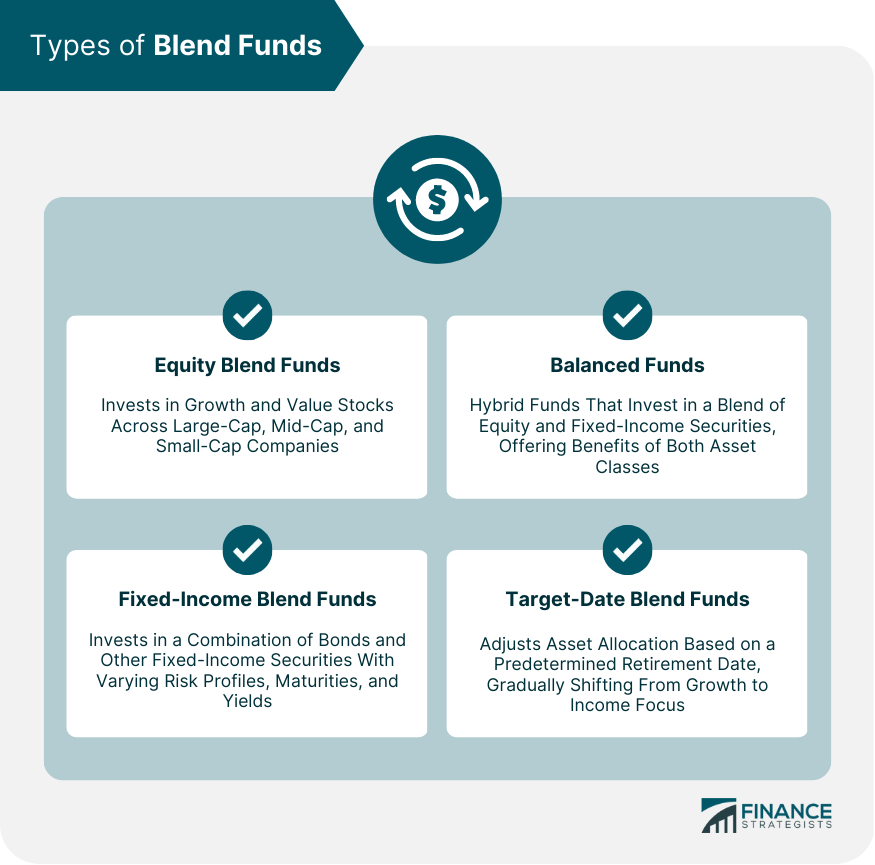

## Table of Contents

## What is a blend fund?

A blend fund, also known as a hybrid fund, is a type of investment fund that combines both growth and value stocks. This means it includes companies that are expected to grow quickly and others that are seen as good value because they are priced lower than their true worth. By mixing these two types of stocks, a blend fund tries to balance the potential for high returns from growth stocks with the stability and lower risk of value stocks.

Blend funds are often used by investors who want to diversify their portfolio without having to choose between growth and value strategies. They offer a middle ground, aiming to provide steady growth over time while also protecting against big drops in value. This makes them a popular choice for people who want a balanced approach to investing, hoping to benefit from both worlds without putting all their money into one type of stock.

## What is a balanced fund?

A balanced fund is a type of investment fund that mixes different kinds of investments, like stocks and bonds, to create a balanced mix. The goal is to grow your money over time while also keeping it safe. By having both stocks and bonds, a balanced fund tries to give you the best of both worlds: the chance to make money from stocks and the safety of bonds.

People like balanced funds because they do the hard work of choosing the right mix of investments for you. If you're not sure how much risk you want to take, a balanced fund can be a good choice. It's like having a little bit of everything, so your money can grow but it's also protected if the stock market goes down.

## How do blend funds and balanced funds differ in terms of asset allocation?

Blend funds and balanced funds are different in how they choose to spread out their investments. A blend fund focuses on stocks, mixing growth stocks and value stocks together. Growth stocks are from companies that might grow fast, while value stocks are from companies that seem like a good deal. Blend funds don't usually include bonds or other types of investments. They just try to balance the risk and reward within the stock part of the market.

On the other hand, balanced funds mix different types of investments, not just stocks. They usually have both stocks and bonds in them. The stocks can be a mix of growth and value, but the big difference is that balanced funds also have bonds, which are safer and give steady income. This mix helps balanced funds to be less risky than blend funds because bonds can protect the fund if the stock market goes down. So, while blend funds focus on balancing within stocks, balanced funds aim to balance between stocks and other investments like bonds.

## What are the primary investment objectives of blend funds?

The main goal of blend funds is to give investors a mix of growth and value stocks. This means they want to help your money grow by picking companies that are expected to do well in the future, while also choosing companies that are a good deal right now. By doing this, blend funds try to balance the risk and reward of investing in stocks. They aim to give you the chance to make money from companies that are growing fast, but also protect you a bit by investing in companies that are cheaper but still good.

Blend funds are all about finding a middle ground. They don't want to take too much risk by only investing in fast-growing companies, but they also don't want to miss out on the potential big gains from those companies. By mixing growth and value stocks, blend funds try to smooth out the ups and downs of the stock market. This can make them a good choice for people who want to invest in stocks but are not sure if they want to focus only on growth or only on value.

## What are the primary investment objectives of balanced funds?

The main goal of balanced funds is to grow your money over time while also keeping it safe. They do this by mixing different types of investments, like stocks and bonds. Stocks can help your money grow faster, but they can also go up and down a lot. Bonds, on the other hand, are usually safer and give you steady income. By having both, balanced funds try to give you the best of both worlds.

Balanced funds want to make sure your money is not too risky but still has a chance to grow. They are good for people who don't want to pick their own mix of stocks and bonds. The fund managers do the work for you, choosing how much to put into stocks and how much into bonds. This way, you can have a little bit of everything, helping your money grow while also protecting it if the stock market goes down.

## Can you explain the risk profile associated with blend funds?

Blend funds have a risk profile that sits somewhere in the middle when it comes to stock investments. Since they mix growth and value stocks, they try to balance the risk that comes with investing in stocks. Growth stocks can be riskier because they might go up a lot but can also drop if the company doesn't do as well as expected. Value stocks are usually seen as less risky because they are cheaper and might be a safer bet, but they still carry some risk because their prices can change too.

Because blend funds have both types of stocks, they aim to lower the overall risk compared to just investing in growth stocks. However, they are still mostly made up of stocks, which means they can go up and down more than funds that have bonds or other safer investments. So, while blend funds are less risky than pure growth funds, they are still more risky than funds that mix in bonds or other types of investments. This makes them a good choice for people who want to invest in stocks but don't want to take on too much risk.

## Can you explain the risk profile associated with balanced funds?

Balanced funds have a risk profile that's lower than funds that only invest in stocks. They mix stocks with bonds, which helps to make them safer. Stocks can go up and down a lot, but bonds are usually more stable and give you steady income. By having both, balanced funds try to protect your money if the stock market goes down. This mix makes them less risky overall, which is good for people who don't want to lose too much money.

Even though balanced funds are safer than just investing in stocks, they still have some risk. The part of the fund that's in stocks can still go up and down. If the stock market does really badly, the whole fund might lose value, even with the bonds helping to cushion the fall. But because they have bonds, balanced funds are less likely to lose a lot of money all at once. They're a good choice for people who want to grow their money but also want to keep it safe.

## How do the performance histories of blend funds and balanced funds compare?

Blend funds and balanced funds can have different performance histories because they invest in different things. Blend funds focus on stocks, mixing growth and value stocks. This means they can go up a lot when the stock market does well, but they can also go down a lot if the market does badly. Over time, blend funds might give you bigger gains than balanced funds, but they can also be more up and down. If you look at the past, you might see that blend funds had some years where they did really well, but also some years where they didn't do so great.

Balanced funds, on the other hand, mix stocks with bonds. This mix makes them safer than blend funds because bonds don't go up and down as much as stocks. So, when you look at the performance history of balanced funds, you might see that they don't go up as much as blend funds during good times, but they also don't go down as much during bad times. Over the long run, balanced funds might not grow your money as fast as blend funds, but they can be more steady and less risky.

In the end, it depends on what you want. If you're okay with more risk for the chance of bigger gains, blend funds might be better for you. But if you want to keep your money safer and don't mind if it grows a bit slower, balanced funds could be the way to go. Looking at past performance can help you see how each type of fund has done, but remember, past results don't tell you what will happen in the future.

## What are the typical fees associated with investing in blend funds versus balanced funds?

The fees for blend funds and balanced funds can be different because they are managed in different ways. Blend funds, which focus only on stocks, usually have what's called an expense ratio. This is a yearly fee that you pay as a percentage of the money you have in the fund. The expense ratio for blend funds can be around 0.5% to 1.5% of your investment each year. Sometimes, if you buy or sell shares of the fund, you might also have to pay a small fee called a transaction fee.

Balanced funds, which mix stocks and bonds, also have an expense ratio. Because they need to manage both stocks and bonds, the expense ratio for balanced funds might be a bit higher than for blend funds, often ranging from 0.6% to 1.75% a year. Like blend funds, you might also have to pay a transaction fee when you buy or sell shares of a balanced fund. The exact fees can change depending on the specific fund and the company that manages it, so it's always a good idea to check before you invest.

## How does the management style of blend funds differ from that of balanced funds?

Blend funds and balanced funds are managed differently because they focus on different types of investments. Blend funds are all about stocks, mixing growth stocks and value stocks to try and balance the risk and reward. The people who manage blend funds spend their time picking the right stocks, looking at which companies might grow fast and which ones are a good deal. They don't usually worry about bonds or other types of investments, so their job is all about understanding the stock market and making choices within it.

Balanced funds, on the other hand, need to manage a mix of stocks and bonds. This means the managers of balanced funds have to think about both parts. They pick stocks, just like the managers of blend funds, but they also need to choose the right bonds to keep the fund safe. Balancing the mix between stocks and bonds is a big part of their job, and they have to keep an eye on how both parts are doing. This makes their job a bit more complicated because they're trying to grow your money with stocks while also protecting it with bonds.

## In what scenarios would an investor prefer a blend fund over a balanced fund?

An investor might choose a blend fund over a balanced fund if they want to focus more on stocks and are okay with a bit more risk. Blend funds mix growth and value stocks, which means they're all about the stock market. If someone believes the stock market will do well and they want to take advantage of that, a blend fund could be a good pick. They might be looking for higher returns and are willing to accept the ups and downs that come with investing mostly in stocks.

Another reason someone might prefer a blend fund is if they already have other investments that are safer, like bonds, in their portfolio. If they want to add more stocks to balance out their other investments, a blend fund can help them do that without having to pick individual stocks. This way, they can keep their overall investment mix the way they want it, with the blend fund focusing just on stocks.

## What advanced strategies can be used to optimize returns from blend and balanced funds?

To optimize returns from blend funds, an investor can use a strategy called tactical asset allocation. This means changing the mix of growth and value stocks in the fund based on what's happening in the market. If they think growth stocks will do well, they might put more money into those. If they think value stocks are a better bet, they can shift more into value stocks. Another strategy is to use dollar-cost averaging, where you invest a fixed amount of money into the fund at regular times, like every month. This can help you buy more shares when prices are low and fewer when prices are high, which can lead to better returns over time.

For balanced funds, one strategy to boost returns is rebalancing. This means checking the mix of stocks and bonds in the fund regularly and adjusting it to keep the right balance. If stocks have gone up a lot and now make up too much of the fund, you might sell some stocks and buy more bonds to get back to your target mix. Another approach is to look for balanced funds that use active management, where the fund managers are actively picking stocks and bonds they think will do well. This can sometimes lead to better returns than funds that just follow a set index. Both these strategies can help you get the most out of your balanced fund.

## References & Further Reading

- Reference articles on mutual funds, blend funds, and balanced funds provide invaluable insights. A highly recommended book is "Advances in Financial Machine Learning" by Marcos Lopez de Prado, which explores the integration of machine learning in finance, including algorithmic trading strategies that can be applied to mutual fund management.

- For comprehensive understanding of investing strategies and asset management, consider exploring the article "Understanding Mutual Fund Types" available on Investopedia. This resource offers detailed explanations of various mutual fund options, focusing on their respective strategies and risks.

- The article "Algorithmic Trading and Portfolio Management" by Robert Kissell provides an excellent exploration of how algorithmic trading can enhance portfolio performance. It discusses the methodologies and strategies for implementing algorithmic systems in fund management.

- Websites like the Financial Industry Regulatory Authority (FINRA) and the U.S. Securities and Exchange Commission (SEC) offer regulatory guidelines and insights on mutual fund management and trading, providing investors with crucial compliance information.

- For those interested in real-time applications of algo trading within mutual funds, consider reading "Machine Learning for Asset Managers" by Marcos Lopez de Prado. This text provides practical applications and case studies on the subject. 

- You can find further detailed readings and data-driven insights at SSRN and arXiv, which host numerous papers on finance, algorithmic trading, and investment strategies.

- Lastly, the Journal of Portfolio Management publishes research on advanced investment methodologies, including quantitative strategies and their influence on mutual fund management.

