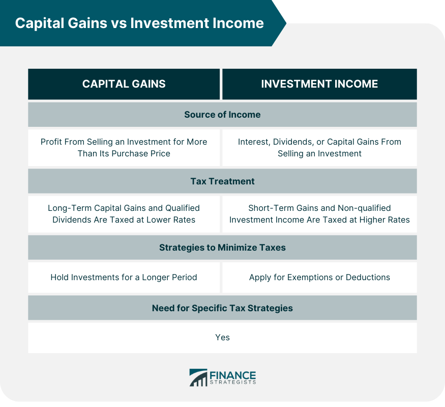

## Table of Contents

## What is capital gains?

Capital gains is the profit you make when you sell something for more than you paid for it. This can happen with things like stocks, real estate, or other investments. If you bought a stock for $100 and sold it later for $150, your capital gain would be $50.

There are two types of capital gains: short-term and long-term. Short-term capital gains are profits from selling something you owned for one year or less. These are usually taxed at your regular income tax rate. Long-term capital gains are profits from selling something you owned for more than one year. These are often taxed at a lower rate, which can make them more attractive for investors looking to save on taxes.

## What is investment income?

Investment income is the money you earn from your investments. This can come from different places like interest from savings accounts or bonds, dividends from stocks, and rental income from properties. When you put your money into these kinds of investments, they can give you back some money over time without you having to do much work.

This kind of income can be really helpful because it can grow your wealth without you needing to work more hours at a job. It's like your money is working for you. But, it's important to know that investment income can change. Sometimes, the amount you get can go up or down depending on how well your investments are doing. So, it's a good idea to keep an eye on your investments and maybe talk to a financial advisor to make smart choices.

## How is capital gains calculated?

Capital gains is figured out by finding the difference between what you sold something for and what you paid for it. Let's say you bought a stock for $100 and then sold it for $150. Your capital gain would be $50 because that's how much more you got back than you spent. It's that simple - just subtract the cost from the selling price.

But, sometimes you might need to think about other costs too. If you paid fees or made improvements to what you're selling, you can subtract those from your selling price before figuring out your gain. For example, if you bought a house for $200,000, spent $20,000 fixing it up, and then sold it for $250,000, you'd subtract both the original cost and the fix-up costs from the selling price. So, your capital gain would be $30,000 ($250,000 - $200,000 - $20,000).

## What types of income are considered investment income?

Investment income is money you get from your investments. It can come from different places. For example, you might earn interest from a savings account or from bonds. When you put money in a bank or buy a bond, you get paid interest over time. Another type of investment income is dividends, which are payments you get from owning stocks in a company. If the company does well, it might share some of its profits with you by paying dividends.

You can also earn investment income from rental properties. If you own a house or an apartment and rent it out to someone, the money they pay you each month is rental income. This can be a good way to earn money without having to work more hours at a job. All these types of income - interest, dividends, and rental income - are considered investment income because they come from your investments rather than from working a job.

## What are the tax implications of capital gains?

When you make money from selling something for more than you paid for it, that's called a capital gain. The tax you pay on that money depends on how long you owned what you sold. If you owned it for less than a year, it's a short-term capital gain, and you'll pay taxes on it at the same rate as your regular income. That means if you're in a high tax bracket, you'll pay more, and if you're in a lower bracket, you'll pay less. 

If you owned it for more than a year, it's a long-term capital gain, and the tax rate is usually lower. For most people, the rate is 0%, 15%, or 20%, depending on their income. This can be a big advantage because you might pay less in taxes than you would if it were short-term. But, there are some special cases where you might owe more, like if you're selling collectibles or certain types of real estate. It's a good idea to keep track of how long you own things and maybe talk to a tax advisor to make sure you're paying the right amount.

## How does the tax treatment of investment income differ from capital gains?

Investment income and capital gains are taxed differently. Investment income includes things like interest from savings accounts or bonds, dividends from stocks, and rental income from properties. The tax you pay on this kind of income depends on what type it is. For example, interest income is usually taxed at your regular income tax rate, which can be high if you're in a high tax bracket. Dividends can be taxed at a lower rate, especially if they're qualified dividends, which are usually taxed at the long-term capital gains rate. Rental income is also taxed as regular income, but you can deduct expenses like mortgage interest and repairs, which can lower your tax bill.

Capital gains, on the other hand, are the profits you make when you sell something for more than you paid for it. How long you owned the thing you sold matters a lot for taxes. If you owned it for a year or less, it's a short-term capital gain, and you'll pay taxes on it at your regular income tax rate. If you owned it for more than a year, it's a long-term capital gain, and the tax rate is usually lower - 0%, 15%, or 20%, depending on your income. This difference in tax rates can make a big difference in how much you pay. So, knowing whether your income is from investments or capital gains can help you plan better and maybe save on taxes.

## Can you provide examples of capital gains?

Imagine you bought a piece of art for $1,000. A few years later, you sold that piece of art for $2,500. The extra $1,500 you made is a capital gain. This is because you sold the art for more than you paid for it. If you owned the art for more than a year before selling it, that $1,500 would be a long-term capital gain, which usually means you pay less in taxes.

Another example is if you bought some stock in a company for $50 per share. After holding onto the stock for a few months, you sold it for $75 per share. The $25 extra per share is a short-term capital gain because you owned the stock for less than a year. You would pay taxes on this gain at your regular income tax rate, which could be higher than if it were a long-term gain.

## What are some common sources of investment income?

One common source of investment income is interest from savings accounts and bonds. When you put your money in a savings account at a bank, the bank pays you interest over time. It's like a small reward for letting them use your money. Bonds work in a similar way. You lend money to a company or the government, and they pay you interest until the bond matures. This interest can add up and become a nice extra bit of income.

Another source is dividends from stocks. When you own stocks in a company, and that company does well, they might share some of their profits with you. These payments are called dividends. Not all companies pay dividends, but the ones that do can provide you with regular income without you having to sell your stocks.

Lastly, rental income from properties is also a common source of investment income. If you own a house or an apartment and rent it out to someone, the money they pay you each month is rental income. This can be a steady way to earn money, especially if you manage the property well and keep it in good shape.

## How do holding periods affect the taxation of capital gains?

The length of time you own something before selling it, called the holding period, really matters when it comes to how much tax you pay on your capital gains. If you own something for a year or less and then sell it for more than you paid, that's called a short-term capital gain. You'll pay taxes on that gain at the same rate as your regular income. So, if you're in a high tax bracket, you'll pay more in taxes, and if you're in a lower bracket, you'll pay less.

But if you own something for more than a year before selling it, that's a long-term capital gain. The tax rate for long-term gains is usually lower than for short-term gains. Most people pay 0%, 15%, or 20% on their long-term capital gains, depending on their income. This lower rate can save you a lot of money in taxes, so it's often a good idea to hold onto your investments for more than a year if you can.

## What strategies can be used to minimize taxes on investment income?

One way to lower the taxes on your investment income is to put your money into tax-advantaged accounts like an IRA or a 401(k). These accounts let your investments grow without being taxed right away. If you use a traditional IRA or 401(k), you don't pay taxes on the money you put in until you take it out when you're older. If you use a Roth IRA or 401(k), you pay taxes on the money you put in, but you don't pay any taxes on the money when you take it out later. This can help you save a lot on taxes over time.

Another strategy is to focus on investments that are taxed at a lower rate. For example, qualified dividends and long-term capital gains are usually taxed at a lower rate than your regular income. So, if you can, try to hold onto your stocks for more than a year before selling them. That way, any profit you make will be taxed as a long-term capital gain, which can save you money. Also, you can look into tax-exempt bonds, like municipal bonds, which don't get taxed at the federal level, and sometimes not at the state level either. This can be a good way to earn income without having to pay a lot in taxes.

## How do capital losses impact the taxation of capital gains?

When you sell something for less than you paid for it, you have a capital loss. You can use these losses to help reduce the taxes you owe on your capital gains. If you made a profit on one investment but lost money on another, you can subtract the loss from the gain. This can lower the amount of money you have to pay taxes on. For example, if you made a $1,000 profit on one stock but lost $500 on another, you can subtract that $500 loss from your $1,000 gain, so you only pay taxes on $500.

If your capital losses are more than your capital gains, you can use the extra loss to lower your regular income. You can do this up to a certain amount each year, which is usually $3,000. If you still have more losses after that, you can [carry](/wiki/carry-trading) them over to future years. This means you can keep using those losses to lower your taxes in the future until you use them all up. It's a good way to make the best out of a bad situation and save some money on taxes.

## What advanced investment strategies can optimize the balance between capital gains and investment income?

One advanced strategy to optimize the balance between capital gains and investment income is called tax-loss harvesting. This means selling investments that have gone down in value to realize a capital loss, which you can then use to offset any capital gains you might have made from other investments. By doing this, you can lower the amount of taxes you owe on your gains. It's a smart way to make the best out of investments that didn't do well, and it can help you keep more of your money. Just make sure you follow the rules about what counts as a capital loss, and maybe talk to a financial advisor to do it right.

Another strategy is to use a mix of investments that give you different kinds of income. For example, you might put some of your money into stocks that pay dividends, which can give you regular investment income. At the same time, you could hold onto other stocks for the long term, hoping they'll go up in value so you can sell them later for a capital gain. By balancing these different types of investments, you can get both regular income and the chance for big profits down the road. It's like having the best of both worlds, and it can help you manage your taxes better because you can plan when to take your gains and when to take your income.

Lastly, consider using tax-advantaged accounts like Roth IRAs or traditional IRAs to hold your investments. In a Roth IRA, you pay taxes on the money you put in, but you don't pay any taxes on the money you take out later, including any capital gains or investment income. In a traditional IRA, you don't pay taxes on the money you put in until you take it out, which can be helpful if you expect to be in a lower tax bracket when you retire. By using these accounts wisely, you can grow your investments without worrying as much about taxes, which can help you keep more of your money over time.

## References & Further Reading

[1]: ["Advances in Financial Machine Learning"](https://www.amazon.com/Advances-Financial-Machine-Learning-Marcos/dp/1119482089) by Marcos Lopez de Prado

[2]: ["Evidence-Based Technical Analysis: Applying the Scientific Method and Statistical Inference to Trading Signals"](https://www.amazon.com/Evidence-Based-Technical-Analysis-Scientific-Statistical/dp/0470008741) by David Aronson

[3]: ["Machine Learning for Algorithmic Trading"](https://github.com/stefan-jansen/machine-learning-for-trading) by Stefan Jansen

[4]: ["Quantitative Trading: How to Build Your Own Algorithmic Trading Business"](https://www.amazon.com/Quantitative-Trading-Build-Algorithmic-Business/dp/1119800064) by Ernest P. Chan

[5]: ["A Primer on Trading and Taxation"](https://www.fidelity.com/learning-center/trading-investing/tax-trading-tips) by Quantria Strategies

[6]: ["Investment Income Taxation: A Comparative Study"](https://ifs.org.uk/sites/default/files/output_url_files/bertlesmann.pdf) by Hinduja G and Sanjiv Chaudhary

[7]: ["Algorithmic Trading: Winning Strategies and Their Rationale"](https://onlinelibrary.wiley.com/doi/pdf/10.1002/9781118676998.fmatter) by Ernie Chan