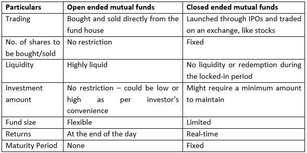

Investing can be a complex and challenging endeavor, with myriad options available for potential investors seeking to navigate the financial landscape. Among these options, open-end and closed-end funds provide distinct pathways to portfolio diversification and maximizing returns. Additionally, algorithmic trading has emerged as a transformative force in how investments are managed and executed, redefining the traditional approaches to fund management.

Open-end funds, commonly including mutual funds and most exchange-traded funds (ETFs), offer investors the flexibility of purchasing and redeeming shares directly with the fund. These funds are structured to accommodate continuous share issuance and redemption, with prices based on their net asset value (NAV), calculated at the end of each trading day. Conversely, closed-end funds trade on the open market with a fixed number of shares, similar to stocks. Their market prices can fluctuate, creating opportunities for trading at discounts or premiums relative to their NAV.

Algorithmic trading, or algo trading, integrates technology into the investment framework, using computer algorithms to automate trading decisions and reduce human intervention. This approach brings advantages such as increased speed, precision, and cost efficiency but also introduces new challenges and risks that require careful consideration by fund managers and individual investors.

The impact of these investment vehicles and strategies is profound, offering various advantages and complexities that require careful analysis and understanding. As we explore the intricacies of open-end and closed-end funds and the incorporation of algorithmic trading into modern investment strategies, investors will be equipped with a comprehensive understanding of these financial instruments. This knowledge is essential for making informed decisions that align with their financial goals and market perspectives.

## Table of Contents

## Understanding Open-End Funds

Open-end funds are investment vehicles that maintain flexibility in their structure by allowing an unlimited number of shares to be issued and redeemed based on investor demand. They offer a dynamic, responsive approach to investment that adapts to market conditions as they evolve. The most common examples of open-end funds are mutual funds and exchange-traded funds (ETFs), which provide investors with a broad spectrum of investment options across various asset classes and market sectors.

The valuation of open-end funds is determined by their net asset value (NAV), which is calculated at the end of each trading day. This valuation method ensures that the share price reflects the fund's current value, accounting for changes in the market and the fund's asset holdings. The NAV is calculated using the formula:

$$

\text{NAV} = \frac{\text{Total Assets} - \text{Total Liabilities}}{\text{Number of Outstanding Shares}}
$$

This price recalibration at market close each day is a key characteristic of open-end funds and ensures transparency and fairness for investors entering or exiting the fund.

A striking advantage of open-end funds is their [liquidity](/wiki/liquidity-risk-premium). Investors can purchase or redeem shares directly from the fund at its current NAV, which makes it relatively easy to move in and out of investments without the restrictions typically encountered in other investment types. This attribute appeals particularly to investors seeking flexibility in their investment strategy. Liquidity in open-end funds results from the fund's ability to continuously manage inflows and outflows of investor capital, maintaining an investment balance aligned with the fund's objectives.

Open-end funds typically diversify their holdings across a wide array of securities, which can help mitigate risk. This diversification is managed by professional fund managers, who make decisions aimed at optimizing returns while aligning with the fund’s investment strategies and risk profile. This professional management is particularly beneficial for individual investors who may lack the expertise or resources to manage a broad portfolio independently.

Despite these advantages, open-end funds have drawbacks. The constant fluctuation in the number of shares can lead to dilutive effects on the fund's returns, particularly if there's significant net demand for redemptions. Additionally, the management fees associated with hiring professional managers can be higher than other types of investments, such as index funds.

In summary, open-end funds offer a flexible and liquid investment option well-suited to investors looking for diversified, professionally managed portfolios. However, investors should be mindful of the potential for dilution and management fees, which can impact overall returns. Understanding the operational dynamics and cost structure of open-end funds is key to making informed investment decisions.

## Exploring Closed-End Funds

Closed-end funds are a distinct type of investment vehicle that differentiates itself from open-end funds primarily through the fixed issuance of shares. Once the shares are initially offered, no additional shares are created, and they trades on public exchanges much like individual stocks. This structure provides closed-end funds with unique attributes in their operation and valuation.

### Structure and Operation

In contrast to open-end funds that issue or redeem shares on demand based on net asset value (NAV), closed-end funds maintain a constant number of shares in the market. Investors who wish to enter or [exit](/wiki/exit-strategy) must do so by buying or selling shares on the secondary market. This trading mechanism means closed-end funds do not need to hold large cash reserves for redemptions, potentially allowing them to remain more fully invested in securities.

### Market Pricing vs. Net Asset Value

A critical characteristic of closed-end funds is the disparity that can arise between the market price of their shares and their NAV. The NAV is determined by the value of the securities held by the fund divided by the number of shares. However, the market price is dictated by supply and demand dynamics on the stock exchanges. This often results in shares trading at a premium (above NAV) or a discount (below NAV). 

The fluctuation between the market price and NAV offers investors unique opportunities. For instance, purchasing shares at a discount may provide a margin of safety if the market adjusts to bring the share price closer to the NAV over time. Conversely, funds trading at a premium may reflect market speculation or investor perceptions of superior fund management.

### Benefits and Risks

Closed-end funds offer several benefits. They can engage in investing strategies that might be difficult for open-end funds, such as utilizing leverage, which can amplify potential returns (and risks). Their fixed capital structure also allows fund managers to pursue long-term investment strategies without the need to sell assets to meet redemptions.

However, these advantages come with inherent risks. The use of leverage can significantly increase [volatility](/wiki/volatility-trading-strategies), and the potential for shares to trade at significant discounts or premiums can add another layer of price uncertainty. Additionally, the lack of liquidity compared to open-end funds may pose challenges, especially during market downturns.

### Examples in the Market

Closed-end funds are represented across various sectors and asset classes, from equities and bonds to real estate and commodities. Notable examples include municipal bond funds, which often appeal to investors seeking tax-advantaged income, and international equity funds that focus on non-domestic markets. 

By understanding the structural nuances of closed-end funds and how these affect investment dynamics, investors can better assess the potential benefits and pitfalls, making informed decisions that align with their financial goals and risk tolerance.

## Algorithmic Trading and Its Impact

Algorithmic trading, commonly known as algo trading, involves the use of computer algorithms to automate the process of making trading decisions. This approach minimizes human intervention and can lead to more efficient and precise execution of trades. The integration of [algorithmic trading](/wiki/algorithmic-trading) into both open-end and closed-end fund management marks a significant evolution in investment strategies, as it can greatly affect how investments are managed and optimized.

Algorithmic trading is adopted by fund managers for several key benefits. First and foremost, it increases the speed of transaction execution. Algorithms can process vast amounts of market data and execute trades at speeds unattainable by human traders, thereby capitalizing on fleeting market opportunities. This speed can lead to improved returns, particularly in competitive and fast-moving markets.

Accuracy in trade execution is another notable advantage of algorithmic trading. Algorithms execute trades based on predefined criteria and parameters, reducing the potential for human error. This precision helps maintain consistent execution, adhering to the strategies laid out by fund managers without emotion or hesitation.

Cost reduction is a further benefit associated with algo trading. By automating the trading process, funds can lower operational costs, such as those related to manual trading. Furthermore, the ability to execute trades at optimal prices can reduce transaction costs, leading to improved net returns for investors.

Despite these benefits, there are challenges and risks associated with algorithmic trading. One significant risk stems from the reliance on technology and data integrity. Errors in the underlying algorithms or data inaccuracies can lead to substantial financial losses. Moreover, the complexity of coding these algorithms necessitates sophisticated programming skills and robust risk management protocols.

The increasing role of technology in modern investment strategies presents both opportunities and complexities. For fund managers, the adoption of algorithmic trading requires a balance between leveraging technology and mitigating its associated risks. Likewise, individual investors need to be aware of the impact of these automated strategies on their investment portfolios.

In conclusion, algorithmic trading represents a transformative shift in the management of open-end and closed-end funds. While it offers significant advantages such as speed, accuracy, and cost-effectiveness, it also introduces challenges that require careful oversight and management. As technology continues to advance, algorithmic trading is poised to play a crucial role in shaping the future of investment management.

## Comparative Analysis: Open-End vs. Closed-End Funds

Open-end and closed-end funds represent two fundamental types of investment funds, each with distinct characteristics that determine their suitability for different investor needs and market conditions. Understanding these differences is essential for investors to make informed decisions that align with their financial objectives.

### Liquidity

**Open-End Funds:** One of the main features of open-end funds is their ability to provide high liquidity to investors. The fund continuously issues and redeems shares at the end of each trading day based on the net asset value (NAV). This allows investors to enter or exit the fund with a degree of flexibility, making open-end funds attractive to those who may require ready access to their investment capital.

**Closed-End Funds:** In contrast, closed-end funds issue a fixed number of shares that are traded on stock exchanges. Consequently, the liquidity of these funds is determined by market demand rather than the fund's operations. Shareholders may have to sell their holdings at a discount (or premium) to the NAV, affecting their ability to liquidate assets quickly. Thus, these funds are suitable for investors with a longer investment horizon who are willing to accept less liquidity.

### Valuation

**Open-End Funds:** The valuation of shares in open-end funds is straightforward, as they are priced at the NAV, calculated at the end of each trading day. This transparency in pricing helps investors understand the true value of their investments when transacting in or out of the fund.

**Closed-End Funds:** Closed-end fund shares are usually traded at prices that differ from their NAV. These discrepancies occur due to market supply and demand dynamics. Investors might benefit from understanding these variations, as opportunities may arise to purchase shares at a discount to the actual value of the fund's assets.

### Share Availability

**Open-End Funds:** Open-end funds offer an unlimited number of shares, which are created or redeemed according to investor demand. This feature ensures that the fund's growth is primarily driven by investor interest rather than market performance.

**Closed-End Funds:** With a fixed share supply, closed-end funds must rely on secondary market transactions for any changes in ownership. This feature can introduce potential volatility in share price, as market perceptions and demand directly impact share value.

### Investor Flexibility

**Open-End Funds:** The structure of open-end funds affords investors substantial flexibility in managing their portfolios. The ease of buying or redeeming shares without affecting the market price aligns with investors seeking a dynamic approach to their investments.

**Closed-End Funds:** Closed-end funds, while offering less flexibility in terms of transactions, can provide strategic advantages. They can pursue longer-term investments without the need to maintain a cash reserve for potential redemptions, which can lead to more stable performance over time.

### Scenarios for Fund Selection

- **For Short-term Liquidity Needs:** Investors requiring easy access to their funds might prefer open-end funds due to their liquidity and straightforward pricing.

- **Seeking Long-Term, Stable Investments:** Those with a longer investment horizon might consider closed-end funds, taking advantage of potentially stable returns and opportunities to buy at a discount.

- **Risk Tolerance and Market Timing:** Open-end funds can be suitable for investors with a low-risk tolerance, ensuring that share prices reflect the true market value. Conversely, closed-end funds may appeal to risk-tolerant investors who can capitalize on market inefficiencies.

Through a thorough comparison of the intrinsic qualities of open-end and closed-end funds, investors can better align their fund selection with their personal financial strategies and market conditions. This understanding empowers investors to make strategic decisions that best fulfill their investment objectives and risk preferences.

## Conclusion

Both open-end and closed-end funds present distinct advantages and challenges for investors. Open-end funds, with their flexibility and ability to constantly issue and redeem shares, provide liquidity and ease of entry and exit for investors. This flexibility is beneficial for those who prioritize liquidity and wish to adjust their holdings in response to market conditions. On the other hand, closed-end funds, with a fixed number of shares, offer opportunities to trade shares at prices that may differ from the net asset value (NAV), allowing investors to capitalize on market inefficiencies. These funds can be particularly attractive during periods of market volatility when discounts or premiums to NAV may present lucrative opportunities.

With the integration of algorithmic trading, fund management has experienced a profound transformation. Algorithms have enabled faster execution of trades, enhanced accuracy, and reduced associated costs. This technological advancement allows fund managers to implement complex trading strategies that were previously unattainable with traditional methods. The use of algorithm-driven strategies allows both open-end and closed-end funds to optimize investment portfolios and improve returns for investors.

When deciding between open-end and closed-end funds, investors should carefully evaluate their personal financial circumstances and future objectives. Considerations such as risk tolerance, liquidity needs, and market conditions are crucial in making the right choice. An understanding of both fund types, combined with an awareness of algorithmic trading's potential, empowers investors to make informed decisions that align with their financial goals.

Becoming familiar with these investment options allows investors to utilize them effectively within a diversified portfolio. By leveraging the unique benefits of each fund type and integrating advanced trading technologies, investors can achieve their desired financial outcomes while managing risks effectively.

## FAQs

### What is the main difference between open-end and closed-end funds?

The primary difference between open-end and closed-end funds lies in their structure and share trading mechanism. Open-end funds continuously issue and redeem shares at the fund's net asset value (NAV), which is calculated at the end of each trading day. Investors can buy or sell shares directly from the fund. In contrast, closed-end funds issue a fixed number of shares that are traded on an exchange like stocks. The market price of closed-end fund shares can deviate from their NAV based on supply and demand dynamics.

### How does algorithmic trading influence investment strategies?

Algorithmic trading employs computer algorithms to automate trading decisions, minimizing human intervention. This approach enhances investment strategies by increasing trading speed, improving accuracy, reducing transaction costs, and enabling rapid execution of complex strategies. Algorithms can also assist in managing large volumes of data and executing trades based on predetermined criteria, therefore playing a pivotal role in contemporary investment management.

### Are closed-end funds riskier than open-end funds?

Closed-end funds can be considered riskier than open-end funds due to their price volatility and market trading mechanism. Since the shares of closed-end funds trade on an exchange, they can deviate from their NAV, leading to potential discounts or premiums. This aspect introduces an additional layer of market risk compared to open-end funds, which are bought or sold at NAV, ensuring price stability.

### How can algorithmic trading be a part of my investment strategy?

To incorporate algorithmic trading into an investment strategy, investors can either develop their own algorithms using programming languages like Python or utilize platforms that offer algorithmic trading services. Key steps involve defining the trading rules and strategy based on historical data analysis, selecting the right technology and infrastructure for execution, and ensuring robust risk management. Investors may tailor algorithms to capitalize on specific market opportunities or to systematically balance portfolios.

### Can both open-end and closed-end funds be part of a diversified portfolio?

Yes, both open-end and closed-end funds can be part of a diversified portfolio. They offer unique advantages that cater to different investment needs. Open-end funds provide liquidity and the ability to trade shares at the NAV, which is beneficial for managing cash flow needs. Closed-end funds, with potentially higher returns due to market price fluctuations, can offer opportunities for capital gains. Combining both funds can enhance a portfolio's diversification and risk management profile.

## References & Further Reading

[1]: ["Investment Analysis and Portfolio Management"](https://www.investopedia.com/terms/p/portfoliomanagement.asp) by Frank K. Reilly and Keith C. Brown.

[2]: ["Common Sense on Mutual Funds: New Imperatives for the Intelligent Investor"](https://www.amazon.com/Common-Sense-Mutual-Funds-Imperatives/dp/0471392286) by John C. Bogle.

[3]: O'Hara, M. (2015). ["High Frequency Market Microstructure."](https://www.sciencedirect.com/science/article/pii/S0304405X15000045) Annual Review of Financial Economics, 7, 133-152.

[4]: ["All About High-Frequency Trading"](https://www.investopedia.com/terms/h/high-frequency-trading.asp) by Michael Durbin.

[5]: Elton, E. J., Gruber, M. J., Brown, S. J., & Goetzmann, W. N. (2014). ["Modern Portfolio Theory and Investment Analysis"](https://books.google.com/books/about/Modern_Portfolio_Theory_and_Investment_A.html?id=181CEAAAQBAJ). 9th Edition. Wiley.

[6]: Jagerson, J., & Hansen, W. (2011). ["All About Investing in Closed-End Funds"](https://www.mhebooklibrary.com/doi/book/10.1036/9780071768351). 

[7]: ["Algorithmic and High-Frequency Trading"](https://assets.cambridge.org/97811070/91146/frontmatter/9781107091146_frontmatter.pdf) by Álvaro Cartea, Sebastian Jaimungal, and José Penalva.