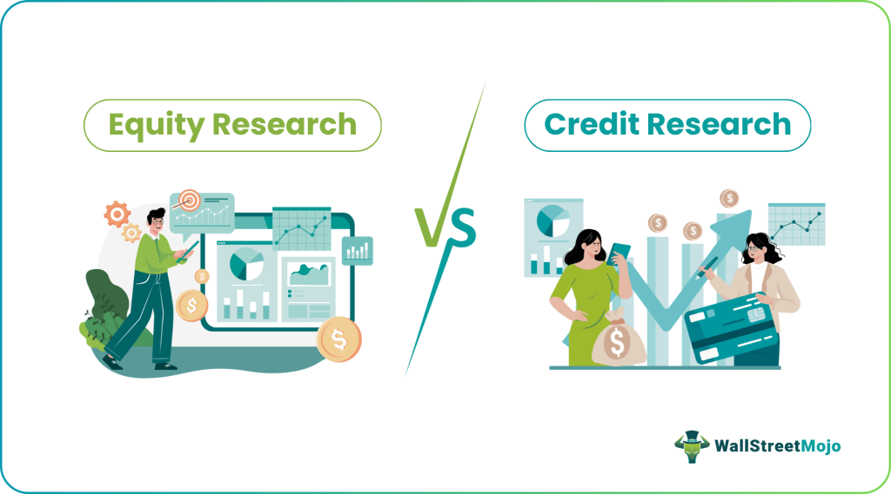

## Table of Contents

## What is a credit rating?

A credit rating is a score given to a person or a company to show how likely they are to pay back money they borrow. It's like a report card for borrowing money. Banks and other lenders use this score to decide if they should lend money and how much interest to charge. A good credit rating means you are seen as reliable and likely to pay back the loan on time.

Credit ratings are important because they affect how easy it is to get a loan and how much it will cost. If you have a high credit rating, lenders trust you more and might give you a lower interest rate. But if your credit rating is low, it can be harder to borrow money, and you might have to pay more interest. Keeping a good credit rating can save you money and help you get better deals on loans.

## What is equity research?

Equity research is when people study companies to figure out if their stocks are good to buy or sell. They look at things like how much money the company makes, how it's run, and what's happening in the world that might affect it. This helps them guess if the company's stock price will go up or down in the future. People who do equity research are called analysts, and they write reports to share what they find out.

These reports are really important for people who want to invest in stocks. Investors read them to make smarter choices about which stocks to buy or sell. The reports can tell them if a stock is a good deal or if it's too expensive. By using the information from equity research, investors hope to make more money from their investments.

## How do credit ratings affect borrowing costs?

Credit ratings have a big impact on how much it costs to borrow money. When someone or a company has a high credit rating, it means they are seen as reliable and likely to pay back their loans on time. Because of this, banks and other lenders feel safer lending them money. As a result, they often offer lower interest rates to people with high credit ratings. This makes borrowing cheaper for them.

On the other hand, if someone or a company has a low credit rating, it means they are seen as riskier to lend to. Lenders worry more about getting their money back, so they charge higher interest rates to make up for that risk. This makes borrowing more expensive for people with low credit ratings. So, having a good credit rating can save you a lot of money when you need to borrow.

## What role does equity research play in investment decisions?

Equity research is super important when people are deciding where to put their money. It's like homework that analysts do to understand if a company's stock is a good buy or not. They look at stuff like how much money the company is making, who's running it, and what's going on in the world that might affect it. By doing all this, they can guess if the stock's price will go up or down. This helps investors make smarter choices about which stocks to pick.

When investors read these equity research reports, they get a clearer picture of whether a stock is a good deal. The reports can tell them if a stock is priced too high or if it's a bargain. This information is really helpful because it can guide investors to make better decisions and hopefully make more money from their investments. So, equity research is a big part of figuring out where to invest, making it easier for people to choose the right stocks.

## Who are the main providers of credit ratings?

The main providers of credit ratings are big companies called credit rating agencies. The three most well-known ones are Standard & Poor's (S&P), Moody's, and Fitch Ratings. These agencies look at how likely a person or a company is to pay back their loans. They give a score, called a credit rating, to show if someone is reliable or not. Banks and other lenders use these scores to decide if they should lend money and how much interest to charge.

These credit rating agencies are important because they help lenders understand the risk of lending money. If someone has a high credit rating, it means they are seen as trustworthy and likely to pay back their loans on time. This can lead to lower interest rates for them. On the other hand, a low credit rating means someone is seen as riskier, so they might have to pay higher interest rates. By providing these ratings, the agencies help make the borrowing process smoother and more informed.

## Who typically conducts equity research?

Equity research is usually done by people called analysts who work for big investment banks, brokerage firms, or independent research companies. These analysts spend a lot of time studying companies to figure out if their stocks are worth buying or selling. They look at things like how much money the company makes, how it's run, and what's happening in the world that might affect it. By doing all this, they can guess if the stock's price will go up or down.

The reports that these analysts write are really important for people who want to invest in stocks. Investors read these reports to help them make smarter choices about which stocks to buy or sell. The reports can tell them if a stock is a good deal or if it's too expensive. By using the information from equity research, investors hope to make more money from their investments. So, equity research is a big part of figuring out where to put your money.

## How are credit ratings determined?

Credit ratings are figured out by looking at a bunch of things about a person or a company. Credit rating agencies, like Standard & Poor's, Moody's, and Fitch, check stuff like how much money you make, how much you owe, and if you've paid back loans on time before. They also look at how the economy is doing and if there are any big changes happening that might affect you. All this information helps them decide how likely you are to pay back money you borrow.

After they gather all this info, the agencies give you a score, which is your credit rating. This score can be high, like AAA or A, which means you're seen as very reliable and likely to pay back loans on time. Or it can be low, like BB or CCC, which means you're seen as riskier and might have trouble paying back loans. This score is super important because it tells lenders how safe it is to lend you money, and it can affect how much interest you have to pay.

## What methodologies are used in equity research?

Equity research uses different ways to figure out if a company's stock is a good buy or not. One common way is called [fundamental analysis](/wiki/fundamental-analysis). This means looking at the company's money stuff, like how much it makes, how much it spends, and how much it's worth. Analysts also check out the company's plans for the future and how it's run. They compare all this with other companies in the same business to see if the stock is priced right. Another way is technical analysis, which looks at the stock's price history and trading patterns to guess where the price might go next.

Another method used in equity research is called quantitative analysis. This involves using math and numbers to make predictions about a stock's future. Analysts might use computer programs to look at lots of data and find patterns that can help them decide if a stock is a good buy. They might also use models to see how different things, like changes in the economy or interest rates, could affect the stock's price. All these methods help analysts give investors good advice on which stocks to pick.

Sometimes, equity research also includes qualitative analysis. This means looking at things that are harder to measure, like the company's brand, its leaders, and what people think about it. Analysts might talk to the company's managers, read news stories, and think about what's happening in the world that could affect the company. By putting all these different pieces together, analysts can give a full picture of whether a stock is a smart investment or not.

## Can you explain the impact of a credit rating downgrade on a company?

When a company gets a credit rating downgrade, it means that credit rating agencies think the company is riskier than before. This can make it harder for the company to borrow money. Lenders might not want to give the company loans, or they might charge higher interest rates because they're worried about getting their money back. This can make it more expensive for the company to do things like expand their business or pay for day-to-day costs.

A credit rating downgrade can also shake up the company's stock price. Investors might start to worry about the company's future and sell their shares, which can make the stock price drop. This can make it harder for the company to raise money by selling more stock. Plus, if people think the company is in trouble, it can hurt the company's reputation and make it harder to do business with other companies or customers. So, a credit rating downgrade can have a big impact on a company in many ways.

## How does equity research influence stock prices?

Equity research can really move stock prices. When analysts write reports about a company, they share their thoughts on whether the stock is a good buy or not. If lots of people read these reports and agree with what the analysts say, it can make more people want to buy or sell the stock. For example, if an analyst says a stock is a great deal and will go up in price, more people might buy it, pushing the price up. On the other hand, if an analyst says a stock is too expensive and might go down, more people might sell it, making the price drop.

This influence happens because investors trust what analysts say. When a respected analyst gives a stock a thumbs up or a thumbs down, it can change how people see the stock. If many investors follow the advice in the reports, it can lead to a lot of buying or selling, which directly affects the stock's price. So, equity research is a big deal in the stock market because it helps shape what people think and do with their investments.

## What are the regulatory differences between credit rating agencies and equity research firms?

Credit rating agencies and equity research firms are both watched by rules, but in different ways. Credit rating agencies, like Standard & Poor's and Moody's, have to follow strict rules set by the government. In the United States, they are regulated by the Securities and Exchange Commission (SEC) under the Credit Rating Agency Reform Act. This law makes sure that these agencies are honest and clear about how they rate companies. They have to tell people if they make mistakes and can't let their ratings be influenced by money or other favors. This is to make sure that everyone can trust the credit ratings they give out.

Equity research firms, on the other hand, are also regulated, but the rules are a bit different. They are mainly watched by the Financial Industry Regulatory Authority (FINRA) in the U.S. These rules focus on making sure that the research reports are fair and not biased. For example, there are rules to stop conflicts of interest, like when a firm does research on a company it also does business with. The idea is to keep the research honest and helpful for investors. While both types of firms have to follow rules to keep things fair, the specific rules and who watches them are different because they do different jobs in the financial world.

## How do advanced quantitative models enhance credit rating and equity research accuracy?

Advanced quantitative models help make credit ratings and equity research more accurate by using math and data to predict what might happen in the future. For credit ratings, these models look at a lot of numbers about a person or a company, like how much money they make and how much they owe. They use this information to guess how likely someone is to pay back their loans. By using big computers and lots of data, these models can spot patterns that people might miss. This helps credit rating agencies give more reliable scores, making it easier for lenders to decide who to lend money to and at what [interest rate](/wiki/interest-rate-trading-strategies).

In equity research, advanced quantitative models help analysts make better guesses about a company's stock price. These models can look at tons of information, like how the company is doing, what's happening in the economy, and even what people are saying on social media. By putting all this data together, the models can predict if a stock's price will go up or down. This helps investors make smarter choices about which stocks to buy or sell. Using these models, equity research becomes more accurate and useful, giving investors a better chance to make money from their investments.

## What is the importance of understanding credit ratings?

Credit ratings are critical evaluations that measure the creditworthiness of various entities, from corporations and financial institutions to governments. These assessments directly influence an entity's ability to borrow money and the conditions under which they can do so. By determining the relative risk of default, credit ratings affect the interest rates that entities may be charged, thereby influencing their financial strategies and management decisions.

The major players in the credit rating industry are Standard & Poor's (S&P), Moody's Investor Services, and Fitch Ratings. These agencies follow a structured approach to provide standardized ratings, which serve as benchmarks for investors globally. The ratings communicate crucial information about the likelihood of an entity fulfilling its financial commitments.

Credit ratings are indispensable in risk assessment, primarily for bond investments and a wide range of debt instruments. By providing a succinct measure of risk, credit ratings help investors assess potential returns against the viability of issuers meeting their obligations. For instance, higher-rated securities (like 'AAA' or 'AA') signify lower risk, potentially leading to lower yields. Conversely, lower-rated securities ('BB', 'B', etc.) might offer higher yields due to their increased risk.

The formula used by rating agencies typically involves a comprehensive analysis of quantitative and qualitative measures. While the exact models are proprietary, they generally include factors such as:

$$
\text{Rating} = f(\text{Financial Ratios}, \text{Economic Conditions}, \text{Management Quality}, \text{Industry Outlook})
$$

This equation underscores the multifaceted nature of credit assessments, blending historical data with forward-looking expectations.

In practice, credit ratings not only influence interest rates but also signal financial health to investors. A downgrade in credit rating can signify potential financial distress, raising borrowing costs or restricting access to capital markets. Conversely, an upgrade can enhance an entity's reputation and lower its borrowing costs, making it more attractive to potential investors.

In conclusion, credit ratings are pivotal in shaping the financial landscape. They offer investors a tool for informed decision-making, balancing potential risks and rewards associated with various financial securities. Reliable credit ratings support the efficient functioning of global financial markets by promoting transparency and reducing information asymmetry.

## What is the Role of Equity Research?

Equity research is a fundamental component of modern financial analysis and investment strategies, playing a crucial role in evaluating companies for potential stock value appreciation. At its core, equity research involves an in-depth examination of a company’s financials, including income statements, balance sheets, and cash flow statements. This analysis provides essential insights into the performance, growth prospects, and market position of a company, which are vital for investors seeking to make informed investment decisions.

The primary objective of equity research is to assess a company's intrinsic value and forecast its future stock performance. This is achieved through a combination of quantitative and qualitative analysis. Quantitative analysis involves financial modeling and the use of various financial metrics such as the price-to-earnings (P/E) ratio, return on equity (ROE), and debt-to-equity ratio. For instance, the P/E ratio is calculated as follows:

$$
\text{P/E Ratio} = \frac{\text{Market Price per Share}}{\text{Earnings per Share (EPS)}}
$$

This ratio helps investors determine if a stock is overvalued or undervalued relative to its earnings.

Qualitative analysis, on the other hand, involves understanding the company’s business model, management team, competitive advantages, and industry dynamics. Sector-specific analysis forms part of this qualitative approach, enabling analysts to evaluate a company's performance within its specific industry context and against its peers.

Equity research is primarily conducted by financial analysts working in investment banks and independent research firms. These analysts develop comprehensive reports that include financial forecasts, valuation models, and investment recommendations, such as "buy," "sell," or "hold." These reports are used by both institutional and retail investors to guide their investment decisions.

The value of equity research is most evident in its ability to reduce information asymmetry between company insiders and outside investors. By providing detailed analysis and insights, equity research helps level the playing field, ensuring that investors have access to critical information necessary for evaluating a company’s potential.

Furthermore, equity research contributes to market efficiency by facilitating price discovery. When investors act on research insights, their trading activities help align stock prices more closely with intrinsic values, thereby enhancing the overall efficiency of financial markets. As such, equity research remains a vital tool for ensuring informed decision-making in financial markets, alongside credit ratings, financial analysis, and [algorithmic trading](/wiki/algorithmic-trading) methodologies.

## What are Financial Analysis Techniques?

Financial analysis techniques are essential for evaluating a company's performance and potential for growth. This process involves both quantitative and qualitative methods to provide a thorough assessment of an entity's financial health. At its core, financial analysis is about evaluating financial statements, which include the balance sheet, income statement, and cash flow statement.

**Financial Statements and Ratio Analysis**

Financial statements are foundational documents that offer insight into a company's financial position. The balance sheet provides a snapshot of an entity's assets, liabilities, and shareholders' equity at a specific point in time. The income statement reveals revenue and expenses over a period, ultimately showing profit or loss, while the cash flow statement outlines cash inflows and outflows, highlighting [liquidity](/wiki/liquidity-risk-premium) and financial flexibility.

Ratio analysis is a quantitative method that uses data from financial statements to glean insights into a company's operations. Key ratios include:

- **Price-to-Earnings (P/E) Ratio**: This measures a company's current share price relative to its per-share earnings. It is calculated as:
$$
  \text{P/E Ratio} = \frac{\text{Market Value per Share}}{\text{Earnings per Share (EPS)}}

$$

  A high P/E ratio could indicate positive future performance expectations, while a low P/E might suggest undervaluation.

- **Current Ratio**: A liquidity ratio that measures a company's ability to cover its short-term liabilities with its short-term assets. It is calculated as:
$$
  \text{Current Ratio} = \frac{\text{Current Assets}}{\text{Current Liabilities}}

$$

- **Return on Equity (ROE)**: This measures a company's profitability by revealing how much profit it generates with the money shareholders have invested. It is expressed as:
$$
  \text{ROE} = \frac{\text{Net Income}}{\text{Shareholder's Equity}}

$$

**Cash Flow Analysis**

Cash flow analysis is critical for understanding a company's liquidity and operational effectiveness. Free cash flow (FCF), which is the cash generated by the company after accounting for capital expenditures, is a vital metric. FCF is derived from the cash flow statement and is calculated as follows:

$$
\text{Free Cash Flow} = \text{Operating Cash Flow} - \text{Capital Expenditures}
$$

Positive cash flow is a sign of financial health, indicating that a company has sufficient capital to expand, pay dividends, and reduce debt.

**Market Trend Evaluation**

Analyzing market trends involves using historical data and economic indicators to predict future performance. This can include monitoring the company's industry, assessing economic conditions, and understanding market sentiment. Tools such as moving averages, RSI (Relative Strength Index), and MACD (Moving Average Convergence Divergence) are frequently used in technical analysis to forecast potential price movements.

**Integration with Credit Ratings and Equity Research**

Financial analysis supports both credit ratings and equity research. By comprehensively assessing a company's financial statements, analysts can provide reliable inputs for credit rating agencies, guiding them in evaluating creditworthiness. Similarly, equity researchers rely on this analysis to recommend investment opportunities, making it essential for informed decision-making.

In conclusion, financial analysis techniques encompass a broad array of tools and methods designed to evaluate the financial viability and growth prospects of companies. They are indispensable for investors, credit analysts, and equity researchers, enabling them to form comprehensive views of investment opportunities.

 to Algorithmic Trading

Algorithmic trading employs advanced computer algorithms to execute trading orders at speeds and frequencies beyond human capabilities. These algorithms are designed to follow defined rules for trading decisions, including timing, pricing, and quantity of trades, often integrating complex models to optimize transaction performance. The main advantage of algorithmic trading lies in its ability to process vast volumes of market data rapidly, identifying and exploiting trading opportunities that may be imperceptible to human traders.

At the core of algorithmic trading are statistical models and analysis methods used to predict future price movements. By analyzing historical data, these statistical models can identify patterns and trends that inform trading decisions. For example, algorithms may utilize methods such as moving averages, mean reversion, or [momentum](/wiki/momentum) indicators to decide when to enter or [exit](/wiki/exit-strategy) trades.

```python
# Example of a simple moving average crossover strategy in Python
import pandas as pd

# Assume 'data' is a DataFrame with datetime index and a 'Close' column for prices
short_window = 40
long_window = 100

# Calculate moving averages
data['Short_MA'] = data['Close'].rolling(window=short_window, min_periods=1).mean()
data['Long_MA'] = data['Close'].rolling(window=long_window, min_periods=1).mean()

# Generate signals
data['Signal'] = 0
data['Signal'][short_window:] = np.where(data['Short_MA'][short_window:] > data['Long_MA'][short_window:], 1, 0)
data['Positions'] = data['Signal'].diff()

# Signals will indicate buy/sell with 1/-1 and hold/no action with 0
```

The speed of execution in algorithmic trading is another key advantage. Algorithms can execute trades in fractions of a second, allowing traders to capture fleeting opportunities and potentially improve the price at which they buy or sell assets. This speed is critical in markets where price swings can occur in milliseconds.

Despite its advantages, algorithmic trading introduces several challenges to market dynamics. It can contribute to increased market [volatility](/wiki/volatility-trading-strategies), particularly if many algorithms act simultaneously based on similar signals. Such volatility necessitates stringent oversight and regulatory frameworks to maintain market integrity and protect against potential abuses, such as market manipulation or flash crashes. Regulators aim to ensure that algorithmic trading firms adhere to standards that enhance transparency and accountability.

Overall, algorithmic trading represents a transformative approach in modern financial markets, combining speed and data analysis to enhance trading performance while simultaneously challenging traditional market structures that require careful regulatory attention.

## References & Further Reading

[1]: ["Standard & Poor's (S&P) Global Ratings"](https://www.spglobal.com/ratings/en/)

[2]: ["Moody's Investor Services"](https://www.moodys.com/)

[3]: ["Fitch Ratings"](https://www.fitchratings.com/)

[4]: Aswath Damodaran, ["Investment Valuation: Tools and Techniques for Determining the Value of Any Asset"](https://www.amazon.com/Investment-Valuation-Tools-Techniques-Determining/dp/111801152X)

[5]: Joel Greenblatt, ["The Little Book That Still Beats the Market"](https://www.amazon.com/Little-Book-Still-Beats-Market/dp/0470624159)

[6]: Benjamin Graham and David Dodd, ["Security Analysis"](https://en.wikipedia.org/wiki/Security_Analysis_(book))

[7]: Eugene F. Fama, "Efficient Capital Markets: A Review of Theory and Empirical Work," *The Journal of Finance*, Vol. 25, No. 2 (May, 1970), pp. 383-417.