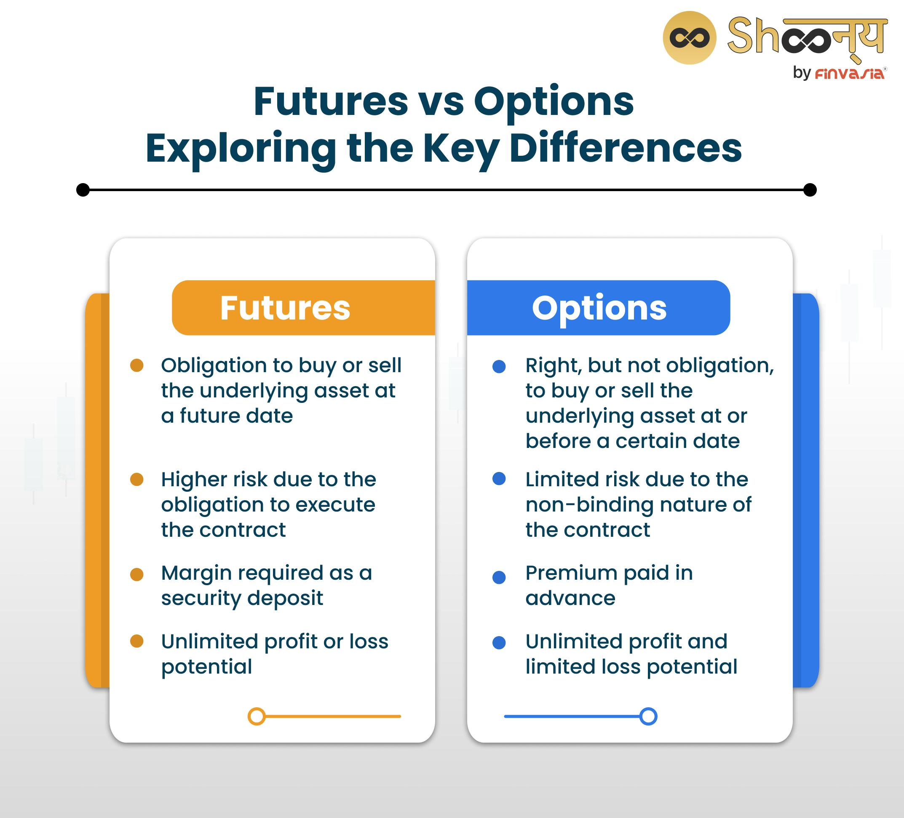

## Table of Contents

## What are derivatives?

Derivatives are financial instruments whose value depends on the value of an underlying asset. These underlying assets can be stocks, bonds, commodities, currencies, interest rates, or even market indexes. The most common types of derivatives are futures, options, and swaps. They are used for various purposes, including hedging against price movements, speculating on future price changes, and gaining access to otherwise hard-to-reach markets or assets.

In simple terms, derivatives allow people to bet on the future price of something without actually owning it. For example, a farmer might use a futures contract to lock in a price for their crops ahead of the harvest, protecting themselves from potential price drops. On the other hand, an investor might buy an option to speculate on the stock price of a company, hoping to profit from its rise or fall. While derivatives can be useful tools for managing risk and enhancing investment strategies, they can also be complex and carry significant risks if not used carefully.

## What are options?

Options are a type of derivative that give you the right, but not the obligation, to buy or sell an asset at a specific price before a certain date. Think of an option like a ticket that lets you decide if you want to make a trade later on. There are two main types of options: calls and puts. A call option lets you buy an asset, while a put option lets you sell it. 

For example, imagine you think the price of a stock will go up. You can buy a call option for that stock at today's price. If the stock price does go up, you can use your option to buy the stock at the lower price you locked in and then sell it at the higher market price, making a profit. If the stock price doesn't go up, you don't have to buy it, and you only lose the cost of the option, which is usually less than buying the stock outright. Options can be useful for betting on price movements without needing a lot of money upfront, but they can also be risky if the market moves against your predictions.

## How do derivatives and options differ in their basic structure?

Derivatives are financial tools that get their value from something else, like stocks or commodities. They come in different forms, like futures, options, and swaps. The main idea is that you can use derivatives to bet on what will happen to the price of the underlying asset without actually owning it. For example, if you think the price of oil will go up, you can use a derivative to make money if it does, without needing to buy and store barrels of oil.

Options are a specific kind of derivative. They give you the right, but not the duty, to buy or sell an asset at a set price before a certain time. There are two types: call options let you buy, and put options let you sell. So, if you buy a call option on a stock, you can choose to buy that stock at the price you agreed on if the market price goes up. If the price doesn't go up, you can just let the option expire and only lose the small fee you paid for it. This makes options different from other derivatives because you have the choice to act or not, which adds a layer of flexibility.

## What are the main types of derivatives?

Derivatives come in a few main types: futures, options, and swaps. Futures are agreements to buy or sell something at a set price on a future date. They're often used by farmers and businesses to lock in prices for their products, like corn or oil, so they know what they'll get paid or have to pay later. Options give you the right, but not the obligation, to buy or sell an asset at a set price before a certain date. They're like tickets that let you decide if you want to make a trade later on. Swaps are agreements to exchange cash flows or other financial instruments. For example, you might swap a variable interest rate for a fixed one to make your payments more predictable.

Each type of derivative has its own way of working and its own uses. Futures are straightforward and often used for hedging against price changes. They're common in commodity markets. Options add flexibility because you don't have to go through with the trade if it's not in your favor, which can be great for speculation or protecting against price drops. Swaps are more complex and usually used by big businesses or financial institutions to manage different kinds of risks, like interest rate changes or currency fluctuations. Understanding these types helps people use derivatives to manage their financial needs better.

## What are the main types of options?

Options are a kind of derivative that come in two main types: call options and put options. A call option gives you the right to buy an asset at a set price before a certain date. For example, if you think a stock's price will go up, you can buy a call option. If the stock price does go up, you can use your option to buy the stock at the lower price you agreed on and then sell it at the higher market price, making a profit. If the stock price doesn't go up, you don't have to buy it, and you only lose the small fee you paid for the option.

A put option, on the other hand, gives you the right to sell an asset at a set price before a certain date. If you think a stock's price will go down, you can buy a put option. If the stock price does go down, you can use your option to sell the stock at the higher price you agreed on, making a profit from the difference. If the stock price doesn't go down, you don't have to sell it, and you only lose the small fee you paid for the option. Both types of options give you flexibility and can be used to bet on price movements without needing a lot of money upfront.

## How do the risk profiles of derivatives and options compare?

Derivatives and options both carry risks, but their risk profiles can be different. Derivatives like futures and swaps often involve a commitment to buy or sell an asset at a future date. This means you might have to deal with the price changes of the asset, which can lead to big wins or losses. If the market moves against you, you could lose more money than you put in, especially with futures where you might need to add more money to your account if the price goes the wrong way.

Options, on the other hand, give you the right but not the obligation to buy or sell an asset. This means your risk is limited to the price you paid for the option. If the market doesn't move in your favor, you can just let the option expire and only lose the small fee you paid. But, options can still be risky because they can lose value quickly if the market doesn't move as you expected. Plus, if you're selling options, you could face unlimited losses if the market moves against you a lot.

## What are the common uses of derivatives in financial markets?

Derivatives are used in financial markets for a few main reasons. One big use is hedging, which means protecting against price changes. For example, a farmer might use a futures contract to lock in a price for their crops before they're harvested. This way, if the price of crops goes down, the farmer still gets the price they agreed on. Companies also use derivatives to manage risks from things like interest rates or currency changes. By using derivatives, they can make their financial planning more stable and predictable.

Another use of derivatives is speculation, where people try to make money by betting on price movements. For instance, an investor might buy an option on a stock, hoping the stock's price will go up or down. If they're right, they can make a profit without needing to own the stock itself. This can be risky because if the market moves the wrong way, they could lose money. But it also allows people to make big gains with a smaller amount of money upfront.

Derivatives are also used to gain access to markets or assets that might be hard to reach otherwise. For example, someone might use a swap to switch from a variable interest rate to a fixed one, making their loan payments more predictable. Or an investor might use options to get exposure to a stock they can't afford to buy outright. This way, derivatives can help people and businesses manage their money better and take advantage of opportunities they might not have otherwise.

## What are the common uses of options in financial markets?

Options are commonly used in financial markets for two main reasons: hedging and speculation. Hedging is about protecting against price changes. For example, if you own a stock and you're worried its price might go down, you can buy a put option. This gives you the right to sell the stock at a set price, even if the market price drops. This way, you limit your losses. Companies use options to hedge against changes in things like interest rates or commodity prices, making their financial planning more stable.

Speculation is another big use of options. People buy options to bet on whether a stock's price will go up or down. If you think a stock's price will rise, you can buy a call option. If you're right and the price goes up, you can make money by buying the stock at the lower price you agreed on and then selling it at the higher market price. If you're wrong, you only lose the small fee you paid for the option. This lets people try to make money without needing a lot of cash upfront, but it can be risky because the market might not move as expected.

Options also help people access markets or assets they might not be able to afford otherwise. For example, if you want to invest in a high-priced stock but can't buy it outright, you can buy an option on it. This way, you can still make money if the stock's price moves in your favor, without needing to own the stock itself. Options give investors flexibility and can be a useful tool for managing money and taking advantage of market opportunities.

## How does the pricing of derivatives differ from the pricing of options?

The pricing of derivatives, like futures and swaps, is based on the value of the underlying asset they are tied to. For futures, the price is set at the time of the contract and reflects what people think the asset's price will be on the future date. If you're buying a futures contract for oil, the price you agree on today is what you'll pay later, no matter what happens to oil prices in between. Swaps involve agreeing to exchange cash flows, and their pricing depends on things like interest rates or currency exchange rates at the time of the swap. So, the price of these derivatives is directly linked to the expected future value of the asset or the financial conditions at the time of the swap.

Options pricing is a bit more complex because it involves the right, but not the obligation, to buy or sell an asset. The price of an option, called the premium, is influenced by several factors, including the current price of the underlying asset, how long until the option expires, the volatility of the asset's price, and the difference between the current price and the price at which you can buy or sell the asset (the strike price). For example, if you buy a call option on a stock, the premium you pay reflects not just the stock's current price, but also how likely it is that the stock's price will go up before the option expires. This makes options pricing more dynamic and dependent on market expectations and conditions.

## What are the regulatory considerations for trading derivatives versus options?

Trading derivatives and options both come with a lot of rules to follow, but they can be a bit different. For derivatives like futures and swaps, regulators focus a lot on making sure there's enough money in the accounts to cover any losses. They also want to make sure that the people trading these know what they're doing because derivatives can be risky. So, there are rules about who can trade them and how much they need to report to the regulators. This helps keep the market fair and safe for everyone.

Options trading has its own set of rules too. Since options give you the right but not the obligation to do something, regulators make sure people understand the risks. They often require traders to have a certain level of experience or money before they can trade options. There are also rules about how options are sold and what information needs to be shared with buyers. This helps make sure that people aren't tricked and that they know what they're getting into when they trade options.

## How do the strategies for trading derivatives compare to those for trading options?

Trading derivatives like futures and swaps often involves strategies that focus on hedging and speculation. For hedging, people use derivatives to protect themselves from price changes. For example, a farmer might use a futures contract to lock in a price for their crops before they're harvested, so they know what they'll get paid even if prices go down. Speculation with derivatives means trying to make money by betting on price movements. Traders might buy or sell futures contracts hoping that the price will go their way, which can be risky but can also lead to big profits if they guess right. These strategies need careful planning because derivatives can lead to big losses if the market moves against you.

Options trading strategies are a bit different because options give you the choice to buy or sell something at a set price. One common strategy is buying call options to bet that a stock's price will go up. If you're right, you can make money by exercising the option and buying the stock at a lower price. Another strategy is buying put options to protect against a stock's price dropping. If the price does go down, you can sell the stock at the higher price you agreed on. Options strategies can be less risky than some derivatives because you only lose the price you paid for the option if things don't go your way. But they still need careful planning because the value of options can change quickly based on the market.

## What advanced techniques can be used to hedge with derivatives and options?

One advanced technique for hedging with derivatives is using a strategy called a "delta hedge." This involves buying or selling futures contracts to offset the price risk of an asset you own. For example, if you own a stock and you're worried its price might go down, you can sell futures contracts on that stock. If the stock price does drop, the money you lose on the stock can be made up by the gains from the futures contracts. This way, you can protect yourself from big losses. It's a bit tricky because you need to keep adjusting the number of futures contracts as the stock price changes, but it can be a powerful way to manage risk.

Another advanced technique is using options to create a "collar" strategy. This involves buying a put option to protect against a drop in the price of an asset you own, while also selling a call option to help pay for the put. For example, if you own a stock, you can buy a put option to sell it at a set price if it goes down, and sell a call option to buy it at a higher price if it goes up. This limits both your potential losses and gains, creating a "collar" around the stock's price. It's a good way to protect your investment without spending too much money, but it also means you might miss out on big gains if the stock price goes up a lot.

## What is the understanding of financial instruments?

Financial instruments form the backbone of trading activities in both traditional and modern financial markets. These instruments are assets that hold monetary value and can be bought, sold, or traded. They exist in numerous forms, from simple stocks and bonds to more complex derivatives, each serving distinct functions and purposes.

Stocks represent ownership in a company and entitle the holder to a portion of the company’s profits, typically distributed as dividends. Bonds are fixed-income instruments that represent a loan made by an investor to a borrower, usually corporate or governmental, with the promise of repaying the principal along with interest at specified intervals.

Derivatives, however, are a class of financial instruments whose value is dependent on or derived from an underlying asset or group of assets. These underlying entities could be commodities, stocks, currencies, interest rates, or market indices. Derivatives are primarily used for hedging risk or for speculative purposes. Some common types of derivatives include futures, forwards, options, and swaps.

The essence of financial instruments lies in their ability to facilitate the transfer of capital in the markets. This transfer is crucial for both investors and issuers, as it reflects varied risk appetites and investment strategies. Investors leverage these instruments to optimize portfolios, hedge against potential price changes, and amplify potential returns through leverage. For example, derivatives like options can be used to hedge against adverse price movements of an asset, thus providing a safety net for investors.

The complex nature of derivatives arises from their dependency on the price movements of underlying assets. This complexity requires a comprehensive understanding of market dynamics and the specific characteristics of each instrument. For example, an option's value is influenced by factors such as the underlying asset's price, time to expiration, [volatility](/wiki/volatility-trading-strategies), and prevailing interest rates, which can be represented mathematically in models like the Black-Scholes formula:

$$
C = S_0 \cdot N(d_1) - X \cdot e^{-rT} \cdot N(d_2)
$$

Where:
- $C$ = Call option price
- $S_0$ = Current stock price
- $X$ = Strike price
- $T$ = Time to expiration
- $r$ = Risk-free interest rate
- $N$ = Cumulative distribution function of the standard normal distribution
- $d_1$ and $d_2$ are calculated values based on the options variables.

Understanding how these instruments work and their strategic applications is essential for market participants looking to navigate the complexities of financial markets effectively. With the introduction of advanced technology and [algorithmic trading](/wiki/algorithmic-trading), the utilization and importance of financial instruments are continually evolving, reinforcing their critical role in modern finance.

## What are the ways to explore options and derivatives?

Derivatives are financial instruments that derive their value from an underlying asset, such as stocks, commodities, or indices. These contracts are pivotal in contemporary finance because they offer flexibility and are essential for various market strategies. Among the derivatives, options are a noteworthy class. An option provides the holder with the right, but not the obligation, to buy (call option) or sell (put option) an asset at a predetermined price, known as the strike price, within a specified time period.

Options are characterized by several parameters, including expiration date, strike price, and premium. These variables influence the option's pricing, which is often modeled using mathematical frameworks like the Black-Scholes model. The fundamental equation of the Black-Scholes model is:

$$
C(S, t) = S N(d_1) - Xe^{-rt} N(d_2)
$$

Where:
- $C(S, t)$ is the call option price,
- $S$ is the current stock price,
- $X$ is the strike price,
- $t$ is the time to expiration,
- $r$ is the risk-free interest rate,
- $N$ is the cumulative distribution function of the standard normal distribution,
- $d_1$ and $d_2$ are calculated as follows:

$$

d_1 = \frac{\ln(S/X) + (r + \sigma^2/2)t}{\sigma \sqrt{t}} 
$$

$$

d_2 = d_1 - \sigma \sqrt{t} 
$$

Hedging and speculation are popular strategies involving options. Hedging involves using options to mitigate risk exposure from underlying assets. For instance, a portfolio manager holding a long position in a stock might purchase put options to protect against a potential price decline. On the other hand, speculation allows traders to bet on the price movement of an asset without owning it. For example, they might buy call options if they anticipate a rise in stock prices.

Derivatives have revolutionized risk management and investment strategies. They enhance market [liquidity](/wiki/liquidity-risk-premium) and enable price discovery. However, their complexity necessitates understanding and careful management to avoid excessive risk exposure, as historical financial crises have shown. Understanding the intricacies of options and derivatives is crucial for effectively leveraging their benefits while mitigating potential risks.

## References & Further Reading

[1]: Black, F., & Scholes, M. (1973). ["The Pricing of Options and Corporate Liabilities."](https://www.cs.princeton.edu/courses/archive/fall09/cos323/papers/black_scholes73.pdf) Journal of Political Economy, 81(3), 637-654.

[2]: Hull, J. C. (2018). ["Options, Futures, and Other Derivatives."](https://www.semanticscholar.org/paper/Options%2C-Futures%2C-and-Other-Derivatives-Hull/89bdee500c8623864fc9eb7a471546aa713acc44) Pearson Education.

[3]: Lopez de Prado, M. (2018). ["Advances in Financial Machine Learning."](https://www.amazon.com/Advances-Financial-Machine-Learning-Marcos/dp/1119482089) Wiley.

[4]: Jansen, S. (2018). ["Machine Learning for Algorithmic Trading."](https://github.com/stefan-jansen/machine-learning-for-trading) Packt Publishing.

[5]: Chan, E. P. (2009). ["Quantitative Trading: How to Build Your Own Algorithmic Trading Business."](https://github.com/ftvision/quant_trading_echan_book) Wiley.

[6]: Aldridge, I. (2013). ["High-Frequency Trading: A Practical Guide to Algorithmic Strategies and Trading Systems."](https://www.ahmetbeyefendi.com/wp-content/uploads/2020/07/High-Frequency-Trading-Irene-Aldridge.pdf) Wiley.

[7]: Taleb, N. N. (2010). ["The Black Swan: The Impact of the Highly Improbable."](https://www.jstor.org/stable/23045073) Random House. 

[8]: Elder, A. (2002). ["Come Into My Trading Room: A Complete Guide to Trading."](https://www.amazon.com/Come-Into-My-Trading-Room/dp/0471225347) Wiley.