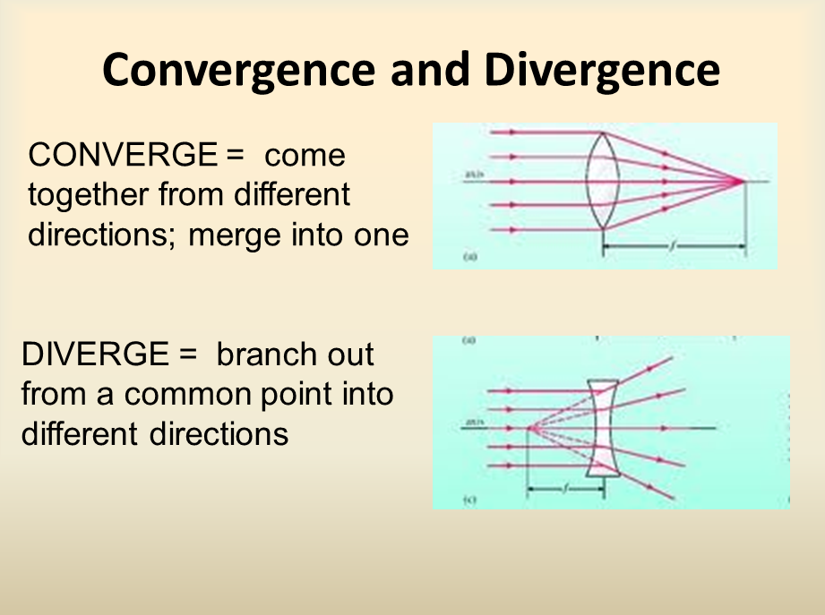

## Table of Contents

## What is divergence in simple terms?

Divergence is a way to measure how much a bunch of things are spreading out from a certain point. Imagine you're standing in the middle of a room and you throw a handful of marbles in all directions. The divergence would tell you how much those marbles are spreading out as they move away from you. If the marbles are spreading out a lot, the divergence is high. If they're staying close together, the divergence is low.

In math and science, divergence is often used to describe how a field, like a magnetic or electric field, is behaving at different points. Think of it like water flowing in a river. If the water is spreading out and getting wider, that's like a high divergence. If the water is coming together and getting narrower, that's like a negative divergence. Scientists use divergence to understand and predict how things will move and change in different situations.

## What is convergence in simple terms?

Convergence is the opposite of divergence. It's like watching a bunch of things come together instead of spreading out. Imagine you're at the center of a room again, but this time, instead of throwing marbles away from you, you're pulling them towards you with a magnet. The marbles would start moving closer and closer to you, and that's what convergence looks like. If the marbles are coming together quickly, the convergence is high. If they're moving slowly, the convergence is low.

In science and math, convergence is used to describe how things like fields or data points are coming together. Think of it like streams of water that start far apart but eventually meet and join into one big river. The more the streams come together, the higher the convergence. Scientists use convergence to understand how different elements or forces might combine or focus on a single point, helping them predict and control various processes.

## How do divergence and convergence apply in mathematics?

In math, divergence and convergence are important ideas, especially when we're dealing with things like sequences, series, and vector fields. Divergence in math is often used with vector fields, which are like arrows pointing in different directions all over a space. Imagine you have a bunch of arrows. If these arrows are spreading out more as you move away from a point, that's high divergence. In math, we use a special formula to figure out how much the arrows are spreading. This helps us understand how things like fluids or electric fields behave. If the divergence is zero, it means the arrows are neither spreading out nor coming together at that point.

Convergence in math is often about sequences or series. A sequence is just a list of numbers, like 1, 1/2, 1/3, and so on. If these numbers get closer and closer to a single number, we say the sequence converges to that number. For example, the sequence 1, 1/2, 1/3 gets closer and closer to 0, so it converges to 0. A series is when you add up the numbers in a sequence. If the total of these numbers gets closer and closer to a single number, the series converges. For example, if you add up 1 + 1/2 + 1/3 + 1/4 and so on, the total gets closer and closer to a number around 1.79, so the series converges to that number. Convergence helps mathematicians understand if and how a sequence or series settles down to a specific value.

## Can you explain divergence and convergence in the context of calculus?

In calculus, divergence is a concept used to describe how a vector field spreads out from a point. Imagine a vector field as a bunch of arrows all over a space. If these arrows are spreading out more as you move away from a point, the divergence at that point is high. We use a special formula in calculus to calculate this, which involves taking partial derivatives of the components of the vector field. The divergence tells us if there's a source or sink at a point. If the divergence is positive, it means there's a source, like water flowing out of a faucet. If it's negative, it means there's a sink, like water going down a drain. If the divergence is zero, the arrows are neither spreading out nor coming together at that point, which means there's no source or sink.

Convergence in calculus is often about sequences and series. A sequence is just a list of numbers, like 1, 1/2, 1/3, and so on. If these numbers get closer and closer to a single number, we say the sequence converges to that number. For example, the sequence 1, 1/2, 1/3 gets closer and closer to 0, so it converges to 0. A series is when you add up the numbers in a sequence. If the total of these numbers gets closer and closer to a single number, the series converges. For example, if you add up 1 + 1/2 + 1/3 + 1/4 and so on, the total gets closer and closer to a number around 1.79, so the series converges to that number. Convergence helps mathematicians understand if and how a sequence or series settles down to a specific value, which is crucial for many applications in calculus and beyond.

## What are some real-world examples of divergence?

Imagine you are standing in the middle of a field, and you blow up a bunch of balloons. As the balloons fly away from you in all directions, that's a bit like divergence. In the real world, think about how water flows out of a hose. If you turn on the hose and the water spreads out into a wide spray, that's showing high divergence. The water is spreading out from the nozzle, just like the balloons spreading out from you in the field. This happens because the water is being pushed out in many directions at once.

Another example of divergence is how heat spreads out from a hot object. If you put a hot pan on a cold stove, the heat from the pan will spread out into the air and the stove around it. This spreading out of heat is a kind of divergence. The heat is moving away from the pan in all directions, trying to even out the temperature. Just like the water from the hose, the heat is spreading out more and more as it moves away from its source.

## What are some real-world examples of convergence?

Imagine you're watching a river. Up in the mountains, there are lots of small streams. As you follow these streams down the mountain, you see them coming together, joining into bigger and bigger streams until they all flow into one big river. This coming together of the streams is like convergence. The streams start far apart but move closer and closer until they meet and become one.

Another example of convergence is how people gather at a concert. Before the concert starts, everyone is spread out all over the city. But as the time gets closer, more and more people start heading to the concert venue. They all come together in one place, just like the streams coming together to form a river. This gathering of people is a kind of convergence.

## How do divergence and convergence relate to vector fields?

In a vector field, divergence tells us how much the vectors are spreading out from a point. Imagine you have a bunch of arrows sticking out of every point in a space. If these arrows are getting farther apart as they move away from a certain spot, that spot has high divergence. It's like blowing up a balloon and watching the air spread out. In math, we use a special formula to figure out the divergence at any point. If the divergence is positive, it means there's a source, like water coming out of a hose. If it's negative, there's a sink, like water going down a drain. If the divergence is zero, the arrows are neither spreading out nor coming together at that point.

Convergence in a vector field is the opposite. It tells us how much the vectors are coming together at a point. Imagine those arrows again, but this time, they're moving closer and closer to a certain spot. That's like watching streams of water join together to form a river. In math, we can also use formulas to find out if and how much the vectors are converging. If the vectors are coming together a lot, the convergence is high. If they're barely moving closer, the convergence is low. Understanding divergence and convergence helps us see how things like fluids or electric fields behave in different situations.

## What role do divergence and convergence play in fluid dynamics?

In fluid dynamics, divergence helps us understand how a fluid spreads out or comes together. Imagine you're looking at a river. If the water is spreading out and getting wider, that's like high divergence. It means the fluid is moving away from a certain point. Scientists use a special math formula to figure out how much the fluid is spreading. This helps them predict things like how fast the fluid will move or where it will go. If the divergence is positive, it's like water coming out of a hose. If it's negative, it's like water going down a drain. If it's zero, the fluid is neither spreading out nor coming together at that point.

Convergence in fluid dynamics is the opposite. It shows how a fluid comes together at a point. Think of those small streams in the mountains that join to form a big river. The streams start far apart but move closer and closer until they meet. This coming together is like high convergence. Scientists use math to see how much the fluid is converging. This helps them understand things like where the fluid will be most concentrated or how it will flow. In simple terms, divergence and convergence help scientists predict and control how fluids move and behave in different situations.

## How can divergence and convergence be used to analyze series in mathematics?

In math, when we talk about series, we're looking at adding up a list of numbers. Divergence helps us know if the total of those numbers keeps getting bigger and bigger without stopping. Imagine adding up 1 + 2 + 3 + 4 and so on. The total just keeps growing, so we say the series diverges. If we see that the numbers in the series are getting smaller and smaller but still adding up to a big number, that's another sign of divergence. Scientists use special tests, like the divergence test, to figure out if a series is going to keep growing without end.

Convergence is when the total of the numbers in a series gets closer and closer to a single number. Think about adding up 1 + 1/2 + 1/4 + 1/8 and so on. The numbers get smaller and smaller, and the total gets closer and closer to 2. We say the series converges to 2. Scientists use different tests, like the ratio test or the integral test, to check if a series is going to settle down to a specific number. Understanding whether a series converges or diverges helps mathematicians solve problems in many areas, like physics or engineering.

## What advanced mathematical tools are used to study divergence and convergence in complex systems?

In complex systems, scientists use advanced math tools like differential equations to study divergence and convergence. Differential equations help us understand how things change over time or space. Imagine you're watching a river flow. Differential equations can tell you how the water spreads out or comes together at different points along the river. These equations are really good at showing how small changes in one part of the system can affect the whole thing. Scientists use computers to solve these equations because they can be very hard to figure out by hand.

Another tool is Fourier analysis, which helps break down complex patterns into simpler parts. Think of it like taking a big puzzle and sorting out all the pieces by color and shape. Fourier analysis can show us how different parts of a system, like sound waves or heat flow, are spreading out or coming together. This helps scientists see if the system is getting more spread out (diverging) or coming together (converging). By using these tools, scientists can predict how complex systems will behave and make better decisions about how to control them.

## How do divergence and convergence impact the study of differential equations?

In the study of differential equations, divergence helps us understand how things are spreading out in a system. Imagine you're watching smoke rise from a fire. Differential equations can tell you how the smoke is spreading out into the air. If the smoke is spreading out a lot, that's like high divergence. Scientists use these equations to predict how things like heat, fluid, or electric fields will move and change. By looking at the divergence, they can see if there's a source, like a fire giving off smoke, or a sink, like a drain pulling water in. This helps them figure out where the system might be getting more spread out or less spread out.

Convergence in differential equations is about things coming together. Think of streams of water coming together to form a river. Differential equations can show how these streams are moving closer and closer until they meet. If the streams are coming together a lot, that's like high convergence. Scientists use these equations to see where things might be getting more concentrated or focused. By studying convergence, they can predict how the system will behave over time and make better decisions about how to control it. Understanding both divergence and convergence helps scientists solve complex problems in fields like physics, engineering, and biology.

## What are the latest research developments concerning divergence and convergence in applied mathematics?

In recent years, researchers have been using divergence and convergence to better understand complex systems like weather patterns and traffic flow. They use advanced computer models to see how things like air or cars spread out or come together. These models help predict things like where a storm might go or how traffic jams form. Scientists are also using these ideas to study how diseases spread through a population. By looking at how people move and interact, they can see if the disease is spreading out more or coming together in certain areas. This helps them figure out the best ways to stop the spread.

Another big area of research is in [machine learning](/wiki/machine-learning) and data analysis. Scientists are using divergence and convergence to make better algorithms that can learn from data. For example, they might use these ideas to see how different pieces of data are spreading out or coming together. This helps the algorithms find patterns and make better predictions. Researchers are also looking at how these concepts can help with things like image recognition and natural language processing. By understanding how different parts of an image or a sentence are related, they can make computers better at understanding and working with them.

## What is Understanding Convergence in Trading?

Convergence in trading is a fundamental concept that involves the alignment of an asset's price with its indicator or a related asset over time. This phenomenon is rooted in the principle of market efficiency, which posits that arbitrage opportunities cannot last indefinitely due to corrective actions by market forces that eliminate price discrepancies.

The notion of convergence is particularly significant in the context of futures trading, where traders seek to exploit price differences between futures and the underlying spot markets. In an efficient market, the futures price and the spot price of an asset should converge as the contract reaches its expiration date. This is due to the cost-of-[carry](/wiki/carry-trading) model, where the futures price $F$ is related to the spot price $S$ by the formula:

$$
F = S(1 + r)^t
$$

where $r$ represents the risk-free rate, and $t$ denotes the time until expiration.

Traders employing convergence strategies often engage in [arbitrage](/wiki/arbitrage) activities. By identifying misalignments between the futures and spot prices, traders can enter positions that benefit as these prices move towards equilibrium. For instance, if the futures price of an asset is significantly higher than the spot price due to temporary market inefficiencies or sentiment factors, traders may short the futures contract and go long on the spot market, anticipating a convergence as maturity nears.

Convergence is also observable in fixed-income markets, particularly in bond trading. Here, traders utilize strategies such as yield curve arbitrage, capitalizing on expected shifts in the yield curve to align with historical or anticipated levels. The prices of bonds with different maturities could converge, influenced by changes in interest rates and expectations of economic conditions.

In equity markets, convergence strategies involve relative value trading, where traders recognize price discrepancies between similar securities, such as dual-listed stocks or sectors with correlated performance. By capitalizing on the expected convergence of these related assets, traders can generate profits while managing risk exposure.

Overall, convergence strategies are employed by traders across various markets to take advantage of inefficiencies and predictability in price movements. However, these strategies rely heavily on the assumption of market efficiency and demand precise timing and execution to successfully capitalize on the alignment of asset prices and their indicators.

## What are Practical Examples of Convergence and Divergence Strategies?

Convergence and divergence strategies play pivotal roles in trading, offering traders the opportunity to exploit mispricings and predict market reversals. Convergence strategies primarily focus on arbitrage opportunities that arise when futures prices deviate from spot prices. Typically, a convergence trade will aim to short the overpriced future and long the underpriced spot, anticipating that prices will realign. This form of market efficiency suggests that arbitrage opportunities are transient due to competitive trading. 

For instance, consider the futures contract on a commodity like [crude oil](/wiki/crude-oil). If the futures price $F$ is significantly higher than the expected spot price $S$ at maturity, an arbitrage opportunity exists. Traders can simultaneously sell the overpriced futures contract and purchase the commodity at the spot price, profiting from the eventual convergence:

$$
\text{Profit} = F - S - \text{Cost of Carry}
$$

where the cost of carry includes storage costs and interest expenses associated with holding the commodity. 

Python code can be used to simulate such convergence strategies using historical data:

```python
import pandas as pd

# Sample data: futures_price.csv and spot_price.csv contain historical price data
futures_data = pd.read_csv('futures_price.csv', index_col='Date')
spot_data = pd.read_csv('spot_price.csv', index_col='Date')

# Calculate the price difference between futures and spot
price_difference = futures_data['Price'] - spot_data['Price']

# Plot or analyze price_difference to identify potential arbitrage opportunities
price_difference.plot(title='Futures vs. Spot Price Difference')
```

Divergence strategies, conversely, are employed to anticipate potential market reversals, often using oscillators like the Relative Strength Index (RSI) or the Moving Average Convergence Divergence (MACD). When an asset's price moves inversely to an indicator, divergence occurs, signaling a possible trend change.

For instance, positive divergence arises when the price records lower lows, but the oscillator shows higher lows, indicating a weakening downward trend. Conversely, negative divergence is observed when the price sets higher highs while the oscillator registers lower highs, suggesting a potential bearish reversal.

A practical application of divergence detection can be implemented using an RSI indicator:

```python
import pandas as pd
import numpy as np

# Calculate RSI
def calculate_rsi(data, window=14):
    delta = data['Close'].diff()
    gain = (delta.where(delta > 0, 0)).rolling(window=window).mean()
    loss = (-delta.where(delta < 0, 0)).rolling(window=window).mean()
    rs = gain / loss
    rsi = 100 - (100 / (1 + rs))
    return rsi

# Detect divergence
def detect_divergence(data, rsi):
    # Simple logic to detect divergence (for demonstration purposes)
    # Buy signal: price lower lows, RSI higher lows
    # Sell signal: price higher highs, RSI lower highs
    # Implement logic to find specific points of divergence

    buy_signals = []  # placeholder for buy signals
    sell_signals = []  # placeholder for sell signals

    # Assume you have a method to determine these signals
    return buy_signals, sell_signals

# Read historical data
price_data = pd.read_csv('market_data.csv', index_col='Date')
rsi = calculate_rsi(price_data)
buy_signals, sell_signals = detect_divergence(price_data, rsi)

# Visualization and further analysis can follow
```

By using historical market data, traders can backtest these strategies to assess their effectiveness under various market conditions. While convergence strategies rely on price equilibrium, divergence approaches use [momentum](/wiki/momentum) shifts to anticipate new market trends. Understanding and applying these strategies through both manual and [algorithmic trading](/wiki/algorithmic-trading) methods offer enhanced opportunities for profit generation.

## What are the challenges and risks?

Convergence and divergence strategies, though powerful tools in a trader's arsenal, are not without their challenges and risks. These strategies require precision, a deep understanding of market dynamics, and, importantly, a robust risk management plan to prevent substantial losses.

One significant challenge with convergence strategies is the failure of prices to align as anticipated. This can occur in volatile markets, where external factors or sudden economic events create disruptions that hinder the expected path of convergence. When market forces are unpredictable or when sentiment shifts rapidly, convergence can be delayed or completely inverted, leading to unanticipated losses. This situation can be exacerbated in illiquid markets where price corrections are sluggish, making it difficult to capitalize on anticipated price movements.

Similarly, prolonged divergence represents another risk in trading. Divergence signals a potential reversal, but if such reversals do not materialize as expected, traders can be left in a precarious position. The market may continue along its existing trend for longer than anticipated, which can compound losses, especially if traders have acted prematurely based on divergence signals.

To mitigate these risks, traders must implement smart risk management techniques. Key strategies include:

1. **Stop-Loss Orders**: Placing stop-loss orders at strategic levels can protect traders from excessive losses. By automatically executing sell orders once a particular price point is reached, traders can establish a safety net that prevents them from remaining in deteriorating positions.

2. **Diversification**: Diversifying a trading portfolio reduces the reliance on any single convergence or divergence scenario. By spreading investments across various assets or strategies, traders can buffer their portfolios against unexpected market movements in any single asset class.

3. **Position Sizing**: Determining the correct position size is crucial. By limiting the amount of capital exposed to any one trade, traders mitigate the impact of adverse price movements. This can be calculated using the formula:
$$
   \text{Position Size} = \frac{\text{Risk Capital} \times \text{Risk per Trade}}{\text{Trade Risk (Entry Price - Stop Loss Price)}}

$$

4. **Frequent Evaluation**: Regularly reassessing market conditions and the viability of active trades ensures that strategies remain aligned with current market dynamics. Market conditions can evolve quickly, and maintaining flexibility allows traders to adapt strategies as necessary.

5. **Algorithmic Adjustments**: In algorithmic trading, constantly refining algorithms to account for market anomalies or incorporating machine learning models to recognize and adapt to new patterns can improve resilience against prolonged periods of divergence or failed convergence.

By conscientiously applying these risk management strategies, traders can better navigate the uncertainties inherent in convergence and divergence techniques, potentially safeguarding their investments against the unpredictability of volatile markets.

## References & Further Reading

[1]: Taleb, N. N. (2005). ["Dynamic Hedging: Managing Vanilla and Exotic Options"](https://www.amazon.com/Dynamic-Hedging-Managing-Vanilla-Options/dp/0471152803). John Wiley & Sons.

[2]: Murphy, J. J. (1999). ["Technical Analysis of the Financial Markets: A Comprehensive Guide to Trading Methods and Applications"](https://archive.org/details/technicalanalysi0000murp). New York Institute of Finance.

[3]: Lopez de Prado, M. (2018). ["Advances in Financial Machine Learning"](https://www.amazon.com/Advances-Financial-Machine-Learning-Marcos/dp/1119482089). Wiley.

[4]: Aronson, D. R. (2007). ["Evidence-Based Technical Analysis: Applying the Scientific Method and Statistical Inference to Trading Signals"](https://onlinelibrary.wiley.com/doi/book/10.1002/9781118268315). Wiley.

[5]: Chan, E. (2008). ["Quantitative Trading: How to Build Your Own Algorithmic Trading Business"](https://github.com/ftvision/quant_trading_echan_book). Wiley.

[6]: Wilmott, P. (2006). ["Paul Wilmott Introduces Quantitative Finance"](https://www.amazon.com/Paul-Wilmott-Introduces-Quantitative-Finance/dp/0470319585). John Wiley & Sons.

