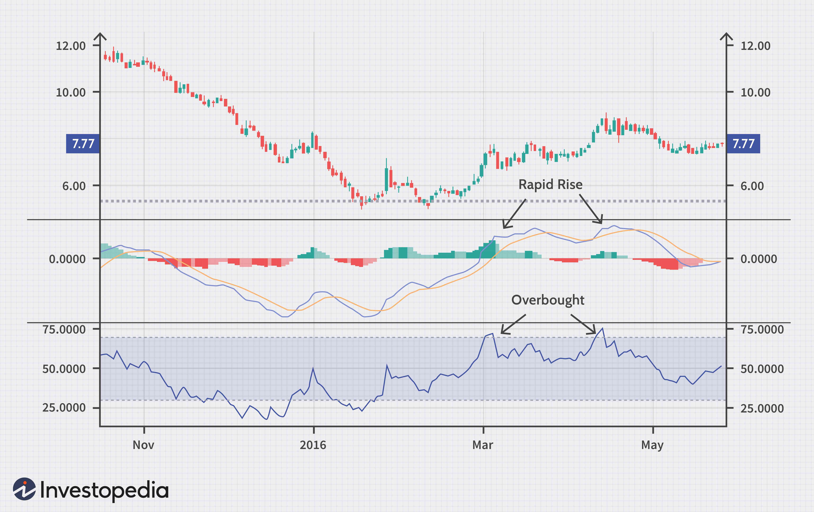

In the ever-evolving world of trading, understanding key concepts such as convergence, divergence, and algorithmic trading is essential for traders seeking to optimize their strategies. Convergence and divergence are fundamental analytical tools that help traders predict market behavior and guide informed decision-making. Convergence typically describes a situation where an asset's price moves towards alignment with an indicator or another related asset, while divergence indicates a disconnect between these values which may signal a change in the market's direction.

Algorithmic trading, which employs computer algorithms to execute and manage trades, significantly enhances the ability to apply convergence and divergence strategies. Algorithms process large volumes of market data swiftly and execute trades based on predefined criteria, such as when convergence or divergence patterns are detected. This not only increases the speed and accuracy of trades but also the potential for profit by identifying market inefficiencies that may not be visible through manual analysis alone.



Understanding how these concepts work individually and in tandem allows traders to develop more robust trading strategies that are responsive to market changes. The article will clarify the intricacies and differences between convergence and divergence, particularly in the context of algorithmic trading, improve predictions of market behavior, and support strategic trading decisions. It will also explain how algorithmic trading harnesses these principles to enhance decision-making and profit potentials, thereby offering traders a refined edge in the competitive trading environment.

## Table of Contents

## Understanding Convergence in Trading

Convergence in trading is a fundamental concept that involves the alignment of an asset's price with its indicator or a related asset over time. This phenomenon is rooted in the principle of market efficiency, which posits that arbitrage opportunities cannot last indefinitely due to corrective actions by market forces that eliminate price discrepancies.

The notion of convergence is particularly significant in the context of futures trading, where traders seek to exploit price differences between futures and the underlying spot markets. In an efficient market, the futures price and the spot price of an asset should converge as the contract reaches its expiration date. This is due to the cost-of-[carry](/wiki/carry-trading) model, where the futures price $F$ is related to the spot price $S$ by the formula:

$$
F = S(1 + r)^t
$$

where $r$ represents the risk-free rate, and $t$ denotes the time until expiration.

Traders employing convergence strategies often engage in [arbitrage](/wiki/arbitrage) activities. By identifying misalignments between the futures and spot prices, traders can enter positions that benefit as these prices move towards equilibrium. For instance, if the futures price of an asset is significantly higher than the spot price due to temporary market inefficiencies or sentiment factors, traders may short the futures contract and go long on the spot market, anticipating a convergence as maturity nears.

Convergence is also observable in fixed-income markets, particularly in bond trading. Here, traders utilize strategies such as yield curve arbitrage, capitalizing on expected shifts in the yield curve to align with historical or anticipated levels. The prices of bonds with different maturities could converge, influenced by changes in interest rates and expectations of economic conditions.

In equity markets, convergence strategies involve relative value trading, where traders recognize price discrepancies between similar securities, such as dual-listed stocks or sectors with correlated performance. By capitalizing on the expected convergence of these related assets, traders can generate profits while managing risk exposure.

Overall, convergence strategies are employed by traders across various markets to take advantage of inefficiencies and predictability in price movements. However, these strategies rely heavily on the assumption of market efficiency and demand precise timing and execution to successfully capitalize on the alignment of asset prices and their indicators.

## Divergence and its Role in Trading

Divergence plays a critical role in trading by indicating potential changes in market [momentum](/wiki/momentum). It occurs when an asset's price moves in the opposite direction to an indicator or another related asset. This discrepancy often serves as a warning that the current price trend might be losing strength, signaling the possibility of a market reversal. Traders, particularly those employing technical analysis, closely monitor divergence as it can provide early signs of shifts in market sentiment.

There are primarily two types of divergence that traders look for: positive divergence and negative divergence. Positive divergence occurs when the price of an asset is falling, but an indicator, such as the Relative Strength Index (RSI) or Moving Average Convergence Divergence (MACD), starts to rise. This implies that, despite a downward price trend, market momentum is strengthening, suggesting a possible uptrend or reversal in the future. 

Conversely, negative divergence happens when an asset's price is rising while the indicator is declining. This indicates that although the price is increasing, the underlying momentum is weakening, potentially signaling a downturn or reversal.

Incorporating divergence into trading strategies involves identifying these divergences early to optimize entry and [exit](/wiki/exit-strategy) points in trades. For instance, traders may use divergence signals to adjust their positions by selling when negative divergence is observed in an uptrend or buying during positive divergence in a downtrend. This approach relies on various technical indicators to confirm signals, thus increasing the reliability of predictions about future price actions.

Moreover, the utility of divergence extends beyond individual asset analysis. It can also be applied to compare related assets, providing insights into broader market trends. For example, if a sector index shows positive divergence relative to individual stocks, it might indicate an impending sector-wide recovery.

Understanding the implications of divergence in trading strategies requires careful analysis and timing. While divergence can offer valuable foresight into market movements, it is not infallible and should ideally be used alongside other technical and fundamental analyses to mitigate risks.

## Algorithmic Trading: Harnessing Convergence and Divergence

Algorithmic trading has revolutionized financial markets by using complex computer algorithms to execute trades with accuracy and efficiency, often leveraging the principles of convergence and divergence. These algorithms help traders automate decision-making processes, massively increasing the speed at which they can respond to market changes. 

Convergence in [algorithmic trading](/wiki/algorithmic-trading) involves analyzing and predicting when the price of an asset and its indicator or related asset will align. Traders use sophisticated models to identify these opportunities, capitalizing on discrepancies before market forces correct them. For example, in [pair trading](/wiki/pair-trading), algorithms can detect price convergence between two historically correlated securities, allowing traders to buy the underperforming asset while short selling the outperforming one, expecting their prices will converge over time.

Divergence, on the other hand, occurs when there is a deviation between the price of an asset and its indicator or related asset. Algorithms can signal potential reversals when they detect divergence, offering traders a chance to take advantage of impending trend changes. For instance, algorithms might use technical indicators such as the Relative Strength Index (RSI) to identify moments when the price moves contrary to expectations, thus suggesting a weakening trend.

The primary advantage of algorithmic trading is its ability to process large volumes of data rapidly and act on predefined criteria. Algorithms can be programmed to execute trades when specific convergence or divergence conditions are met, based on historical and real-time data analysis. This rapid processing is crucial in fast-moving markets where opportunities may exist for mere seconds.

For practical implementation, consider a Python algorithm designed to capture divergence signals using the RSI:

```python
import pandas as pd

def rsi_convergence(prices, periods=14):
    delta = prices.diff(1)
    gain = (delta.where(delta > 0, 0)).rolling(window=periods).mean()
    loss = (-delta.where(delta < 0, 0)).rolling(window=periods).mean()
    rs = gain / loss
    rsi = 100 - (100 / (1 + rs))

    convergence_signals = (rsi < 30) & (prices.shift() > prices)
    return convergence_signals

# Example usage:
# Assuming 'prices' is a pandas Series of stock prices
signals = rsi_convergence(prices)
```

In this code snippet, the RSI is calculated for a given stock's prices. Divergence is detected when RSI values drop below 30, indicating potential bullish convergence opportunities.

Algorithmic strategies utilizing convergence and divergence require continuous tuning and monitoring to remain effective, especially as market conditions change. Despite their inherent risks, these strategies offer traders the potential to uncover market inefficiencies that human traders might not detect, further enhanced by algorithmic precision and speed.

## Practical Examples of Convergence and Divergence Strategies

Convergence and divergence strategies play pivotal roles in trading, offering traders the opportunity to exploit mispricings and predict market reversals. Convergence strategies primarily focus on arbitrage opportunities that arise when futures prices deviate from spot prices. Typically, a convergence trade will aim to short the overpriced future and long the underpriced spot, anticipating that prices will realign. This form of market efficiency suggests that arbitrage opportunities are transient due to competitive trading. 

For instance, consider the futures contract on a commodity like [crude oil](/wiki/crude-oil). If the futures price $F$ is significantly higher than the expected spot price $S$ at maturity, an arbitrage opportunity exists. Traders can simultaneously sell the overpriced futures contract and purchase the commodity at the spot price, profiting from the eventual convergence:

$$
\text{Profit} = F - S - \text{Cost of Carry}
$$

where the cost of carry includes storage costs and interest expenses associated with holding the commodity. 

Python code can be used to simulate such convergence strategies using historical data:

```python
import pandas as pd

# Sample data: futures_price.csv and spot_price.csv contain historical price data
futures_data = pd.read_csv('futures_price.csv', index_col='Date')
spot_data = pd.read_csv('spot_price.csv', index_col='Date')

# Calculate the price difference between futures and spot
price_difference = futures_data['Price'] - spot_data['Price']

# Plot or analyze price_difference to identify potential arbitrage opportunities
price_difference.plot(title='Futures vs. Spot Price Difference')
```

Divergence strategies, conversely, are employed to anticipate potential market reversals, often using oscillators like the Relative Strength Index (RSI) or the Moving Average Convergence Divergence (MACD). When an asset's price moves inversely to an indicator, divergence occurs, signaling a possible trend change.

For instance, positive divergence arises when the price records lower lows, but the oscillator shows higher lows, indicating a weakening downward trend. Conversely, negative divergence is observed when the price sets higher highs while the oscillator registers lower highs, suggesting a potential bearish reversal.

A practical application of divergence detection can be implemented using an RSI indicator:

```python
import pandas as pd
import numpy as np

# Calculate RSI
def calculate_rsi(data, window=14):
    delta = data['Close'].diff()
    gain = (delta.where(delta > 0, 0)).rolling(window=window).mean()
    loss = (-delta.where(delta < 0, 0)).rolling(window=window).mean()
    rs = gain / loss
    rsi = 100 - (100 / (1 + rs))
    return rsi

# Detect divergence
def detect_divergence(data, rsi):
    # Simple logic to detect divergence (for demonstration purposes)
    # Buy signal: price lower lows, RSI higher lows
    # Sell signal: price higher highs, RSI lower highs
    # Implement logic to find specific points of divergence

    buy_signals = []  # placeholder for buy signals
    sell_signals = []  # placeholder for sell signals

    # Assume you have a method to determine these signals
    return buy_signals, sell_signals

# Read historical data
price_data = pd.read_csv('market_data.csv', index_col='Date')
rsi = calculate_rsi(price_data)
buy_signals, sell_signals = detect_divergence(price_data, rsi)

# Visualization and further analysis can follow
```

By using historical market data, traders can backtest these strategies to assess their effectiveness under various market conditions. While convergence strategies rely on price equilibrium, divergence approaches use momentum shifts to anticipate new market trends. Understanding and applying these strategies through both manual and algorithmic trading methods offer enhanced opportunities for profit generation.

## Challenges and Risks

Convergence and divergence strategies, though powerful tools in a trader's arsenal, are not without their challenges and risks. These strategies require precision, a deep understanding of market dynamics, and, importantly, a robust risk management plan to prevent substantial losses.

One significant challenge with convergence strategies is the failure of prices to align as anticipated. This can occur in volatile markets, where external factors or sudden economic events create disruptions that hinder the expected path of convergence. When market forces are unpredictable or when sentiment shifts rapidly, convergence can be delayed or completely inverted, leading to unanticipated losses. This situation can be exacerbated in illiquid markets where price corrections are sluggish, making it difficult to capitalize on anticipated price movements.

Similarly, prolonged divergence represents another risk in trading. Divergence signals a potential reversal, but if such reversals do not materialize as expected, traders can be left in a precarious position. The market may continue along its existing trend for longer than anticipated, which can compound losses, especially if traders have acted prematurely based on divergence signals.

To mitigate these risks, traders must implement smart risk management techniques. Key strategies include:

1. **Stop-Loss Orders**: Placing stop-loss orders at strategic levels can protect traders from excessive losses. By automatically executing sell orders once a particular price point is reached, traders can establish a safety net that prevents them from remaining in deteriorating positions.

2. **Diversification**: Diversifying a trading portfolio reduces the reliance on any single convergence or divergence scenario. By spreading investments across various assets or strategies, traders can buffer their portfolios against unexpected market movements in any single asset class.

3. **Position Sizing**: Determining the correct position size is crucial. By limiting the amount of capital exposed to any one trade, traders mitigate the impact of adverse price movements. This can be calculated using the formula:
$$
   \text{Position Size} = \frac{\text{Risk Capital} \times \text{Risk per Trade}}{\text{Trade Risk (Entry Price - Stop Loss Price)}}

$$

4. **Frequent Evaluation**: Regularly reassessing market conditions and the viability of active trades ensures that strategies remain aligned with current market dynamics. Market conditions can evolve quickly, and maintaining flexibility allows traders to adapt strategies as necessary.

5. **Algorithmic Adjustments**: In algorithmic trading, constantly refining algorithms to account for market anomalies or incorporating machine learning models to recognize and adapt to new patterns can improve resilience against prolonged periods of divergence or failed convergence.

By conscientiously applying these risk management strategies, traders can better navigate the uncertainties inherent in convergence and divergence techniques, potentially safeguarding their investments against the unpredictability of volatile markets.

## Conclusion

Convergence and divergence are essential concepts in trading, providing traders with critical insights to make informed decisions. By understanding how price movements relate to market indicators or related assets, traders can anticipate potential market behaviors, adjusting their strategies accordingly. Convergence often signals an impending alignment of an asset's price with its intrinsic value, while divergence might indicate a weakening trend or potential reversal, prompting timely actions.

Algorithmic trading enhances the ability to exploit these phenomena, offering the precision and speed necessary in today's fast-paced markets. Algorithms can swiftly identify convergence and divergence signals, executing trades based on predefined criteria without the delay inherent in manual trading. This automation not only increases efficiency but also allows traders to manage more complex strategies with improved accuracy.

The continuous study and application of convergence and divergence strategies can significantly benefit traders. By refining these approaches and integrating algorithmic trading, traders can harness market inefficiencies to optimize their returns. Consequently, mastery of these concepts and their application through advanced trading technology forms a cornerstone of a successful trading ecosystem, providing a competitive edge in various market conditions.

## References & Further Reading

[1]: Taleb, N. N. (2005). ["Dynamic Hedging: Managing Vanilla and Exotic Options"](https://www.amazon.com/Dynamic-Hedging-Managing-Vanilla-Options/dp/0471152803). John Wiley & Sons.

[2]: Murphy, J. J. (1999). ["Technical Analysis of the Financial Markets: A Comprehensive Guide to Trading Methods and Applications"](https://archive.org/details/technicalanalysi0000murp). New York Institute of Finance.

[3]: Lopez de Prado, M. (2018). ["Advances in Financial Machine Learning"](https://www.amazon.com/Advances-Financial-Machine-Learning-Marcos/dp/1119482089). Wiley.

[4]: Aronson, D. R. (2007). ["Evidence-Based Technical Analysis: Applying the Scientific Method and Statistical Inference to Trading Signals"](https://onlinelibrary.wiley.com/doi/book/10.1002/9781118268315). Wiley.

[5]: Chan, E. (2008). ["Quantitative Trading: How to Build Your Own Algorithmic Trading Business"](https://github.com/ftvision/quant_trading_echan_book). Wiley.

[6]: Wilmott, P. (2006). ["Paul Wilmott Introduces Quantitative Finance"](https://www.amazon.com/Paul-Wilmott-Introduces-Quantitative-Finance/dp/0470319585). John Wiley & Sons.

