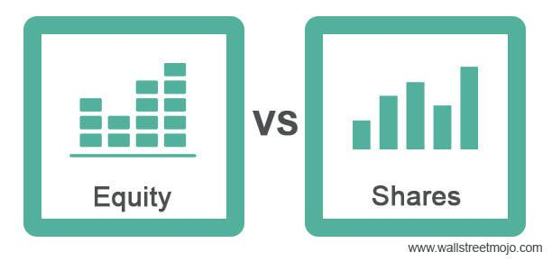

## Table of Contents

## What is equity in simple terms?

Equity is a way to measure the value of something you own after you subtract any money you owe on it. Imagine you have a house worth $200,000, but you still owe $150,000 on your mortgage. The equity in your house would be $50,000 because that's the part of the house you truly own.

In the world of business, equity means the ownership interest in a company. If you own shares in a company, you have equity in that business. The more shares you own, the more of the company you control. This is different from debt, where you borrow money and have to pay it back with interest. With equity, you're betting on the company's success, hoping its value will grow over time.

## What is shareholders' equity and how is it defined?

Shareholders' equity is the part of a company's total value that belongs to the people who own its shares, also known as shareholders. It's like the net worth of the company that shareholders can claim. You can find shareholders' equity by taking everything the company owns (its assets) and subtracting everything it owes (its liabilities). If a company has $1 million in assets and $600,000 in liabilities, the shareholders' equity would be $400,000.

This number is important because it shows how much money would be left for shareholders if the company sold all its assets and paid off all its debts. Shareholders' equity can change over time because of profits or losses, issuing new shares, or buying back old ones. It's a key piece of information that helps investors understand the financial health of a company and how much of it they really own.

## How are equity and shareholders' equity related?

Equity and shareholders' equity are closely related but have slightly different meanings. Equity is a general term that means the value of something after you subtract any money owed on it. It can apply to things like houses or businesses. In the context of a business, equity refers to the ownership interest in that business. If you own shares in a company, you have equity in it, which means you have a claim on part of the company's value.

Shareholders' equity is a specific type of equity that focuses on the part of a company's value that belongs to its shareholders. It's calculated by taking the company's total assets and subtracting its total liabilities. This number represents what would be left for shareholders if the company sold all its assets and paid off all its debts. So, shareholders' equity is a subset of the broader concept of equity, specifically relating to the ownership value that shareholders have in a company.

## What are the main components of shareholders' equity?

Shareholders' equity is made up of several key parts that together show how much of a company really belongs to its owners. The first part is the money that shareholders put into the company when they buy its shares. This is called "contributed capital" or "paid-in capital." It's the cash that comes in from selling stock, and it shows how much shareholders have directly invested in the company.

The second part is the company's earnings that it hasn't paid out to shareholders as dividends. This is called "retained earnings." It's the profit that the company keeps to use for growing the business or paying off debts. Retained earnings can go up or down depending on how well the company is doing and what it decides to do with its profits.

Sometimes, there's a third part called "other comprehensive income." This includes gains or losses that don't show up in the regular profit and loss statement, like changes in the value of certain investments or foreign currency translations. These items can affect the total shareholders' equity but aren't part of the day-to-day earnings. Together, these components give a full picture of what shareholders own in the company.

## Can you explain the difference between equity and shareholders' equity with an example?

Imagine you own a small bakery. The bakery is worth $100,000, but you still owe $40,000 on a loan you took to start the business. The equity in your bakery is $60,000 because that's the value of the bakery after subtracting what you owe. This is the general idea of equity - it's the value of something after you take away any debts.

Now, let's say you decided to turn your bakery into a company and sell shares to raise more money. You sell shares worth $20,000 to some friends, and they become shareholders. The bakery's total assets are still $100,000, and the loan is still $40,000. But now, the shareholders' equity is the part of the bakery that belongs to the shareholders. It's calculated as the total assets ($100,000) minus the total liabilities ($40,000), which comes out to $60,000. This $60,000 is the shareholders' equity because it represents what the shareholders own in the company after all debts are paid.

So, in this example, the equity of the bakery and the shareholders' equity are the same number, $60,000. But they mean slightly different things. Equity is the general value of the bakery after debts, while shareholders' equity is specifically the part of that value that belongs to the shareholders.

## How does equity appear on a company's balance sheet?

On a company's balance sheet, equity is shown as the difference between what the company owns and what it owes. The balance sheet lists all the company's assets on one side, like cash, buildings, and equipment. On the other side, it lists all the liabilities, which are the debts the company needs to pay, like loans or bills. The equity part of the balance sheet is what's left when you subtract the total liabilities from the total assets. This shows how much of the company's value belongs to the owners or shareholders.

Equity on the balance sheet can be broken down into a few parts. One part is the money that shareholders have put into the company by buying shares, which is called "contributed capital" or "paid-in capital." Another part is the company's earnings that it hasn't given back to shareholders as dividends, known as "retained earnings." Sometimes, there might be other items like "other comprehensive income," which includes gains or losses that don't show up in the regular profit and loss statement. All these parts together make up the total equity, showing how much of the company is owned by its shareholders.

## What role does retained earnings play in shareholders' equity?

Retained earnings are a big part of shareholders' equity. They are the profits that a company makes but doesn't give back to shareholders as dividends. Instead, the company keeps this money to use for things like growing the business, buying new equipment, or paying off debts. When a company has high retained earnings, it means it's been making good profits and choosing to reinvest them into the business. This can make the company stronger and more valuable over time, which is good for shareholders.

The amount of retained earnings affects the total shareholders' equity because it's added to the money that shareholders have already put into the company. If a company starts with $50,000 from shareholders and then makes $30,000 in profit and keeps it all as retained earnings, the shareholders' equity would go up to $80,000. Retained earnings can change from year to year, going up with profits or down if the company has losses or decides to pay out dividends. This makes retained earnings a key part of understanding how much the company is really worth to its owners.

## How do stock issuances and buybacks affect shareholders' equity?

When a company issues new stocks, it's like selling pieces of the company to new or existing shareholders. The money they get from selling these stocks adds to the company's cash, which is an asset. This cash then becomes part of the shareholders' equity, specifically under "contributed capital" or "paid-in capital." So, issuing new stocks increases shareholders' equity because it brings in more money that belongs to the shareholders.

On the other hand, when a company buys back its own stocks, it's like taking pieces of the company back from shareholders. The company uses its cash, which is an asset, to buy these stocks. This cash goes out of the company, reducing its assets. Since the cash used to buy back the stocks was part of the shareholders' equity, buying back stocks reduces shareholders' equity. This happens because the company is using money that belongs to shareholders to buy the stocks, which means less money is left for the shareholders overall.

## What are the implications of negative shareholders' equity?

Negative shareholders' equity means that a company owes more money than it owns. It's like if you had a house worth $100,000 but owed $120,000 on your mortgage - you'd be "underwater" because you owe more than your house is worth. For a company, this can be a warning sign. It might mean the company is struggling to make money or has taken on too much debt. Investors might worry that the company could go bankrupt if it can't fix its financial problems.

However, negative shareholders' equity isn't always bad news. Sometimes, it can happen because a company is investing a lot in its future growth. For example, a startup might spend a lot of money on new projects and end up with negative equity, but if those projects succeed, the company could become very valuable. So, while negative shareholders' equity can be a red flag, it's important to look at the whole picture of the company's finances and plans before deciding if it's a problem.

## How do accounting standards affect the calculation of equity and shareholders' equity?

Accounting standards are rules that tell companies how to keep track of their money and report it to others. These rules affect how a company calculates its equity and shareholders' equity. For example, different standards might have different ways of deciding when to count something as an asset or a liability. This can change the total value of what the company owns and what it owes, which then changes the equity. If one standard says a company should count a certain cost as an expense right away, and another says to spread it out over time, the equity numbers can be different under each standard.

Also, accounting standards can affect how a company reports its profits and losses, which directly impacts retained earnings, a big part of shareholders' equity. For instance, if a standard allows a company to use a certain method to value its inventory, it might show higher profits one year and lower profits the next compared to using a different method. This can make the retained earnings, and thus the shareholders' equity, go up or down depending on the standard used. So, understanding which accounting standards a company follows is important for figuring out its true financial health and how much equity it really has.

## What advanced financial ratios use equity and shareholders' equity, and how are they interpreted?

Two important financial ratios that use equity and shareholders' equity are the Return on Equity (ROE) and the Debt to Equity Ratio. ROE measures how well a company is using the money that shareholders have put into it to make profits. You find it by taking the company's net income and dividing it by the shareholders' equity. A high ROE means the company is good at turning shareholder money into profits. For example, if a company has a net income of $10 million and shareholders' equity of $50 million, the ROE would be 20% ($10 million divided by $50 million). This tells investors that for every dollar of equity, the company is making 20 cents in profit.

The Debt to Equity Ratio looks at how much a company is borrowing compared to what the shareholders own. You calculate it by dividing the company's total liabilities by its shareholders' equity. A high ratio means the company is using a lot of debt to grow, which can be risky if it can't pay back the loans. A low ratio means the company is relying more on money from shareholders. For instance, if a company has $30 million in liabilities and $60 million in shareholders' equity, the Debt to Equity Ratio would be 0.5 ($30 million divided by $60 million). This shows that the company has half as much debt as equity, which might be seen as a safer financial position.

## How do changes in market conditions impact the valuation of equity versus shareholders' equity?

Changes in market conditions can affect the value of equity and shareholders' equity in different ways. Equity is the total value of a company after subtracting its debts. If the market goes up, the value of the company's assets might go up too, making the equity worth more. But if the market goes down, the value of the assets could drop, and the equity might be worth less. For example, if a company owns a building and the real estate market crashes, the building might be worth less, which would lower the company's equity.

Shareholders' equity is the part of the company's equity that belongs to the shareholders. It's calculated by taking the total assets and subtracting the total liabilities. Market changes can affect shareholders' equity in a similar way to equity, but there's another layer to consider. If the market changes make the company's stock price go up or down, that can also change the value of shareholders' equity. For example, if investors think the company will do well because of good market conditions, they might buy more shares, pushing up the stock price and increasing the value of shareholders' equity. But if the market turns bad and the stock price falls, the value of shareholders' equity could go down too.

## What is Understanding Shareholders' Equity?

Shareholders' equity represents the ownership interest held by shareholders in a company. It is essentially the residual interest in the company's assets after all liabilities have been deducted. The formula for calculating shareholders' equity is:

$$
\text{Shareholders' Equity} = \text{Total Assets} - \text{Total Liabilities}
$$

This financial metric is a key component of a company's balance sheet and consists of several elements, including common stock, preferred stock, additional paid-in capital, retained earnings, and treasury stock. Each component plays a specific role: common and preferred stock represent the initial and ongoing equity investments; additional paid-in capital is the excess amount paid by investors over the par value of the stock; retained earnings are the cumulative profits that have been reinvested in the business rather than distributed as dividends; and treasury stock refers to shares repurchased by the company.

The significance of shareholders' equity on a company's balance sheet lies in its ability to gauge the company's financial health. It provides insight into how effectively a company is managing its assets relative to its liabilities. A positive shareholders' equity indicates that a company has more assets than liabilities, which is often viewed as a sign of financial stability. Conversely, negative shareholders' equity might suggest financial distress, as it indicates liabilities exceeding assets.

Investors and analysts commonly use shareholders' equity to assess a company's financial stability and operational efficiency. For instance, the return on equity (ROE) ratio, which is calculated by dividing net income by shareholders' equity, helps measure how effectively a company is using its equity base to generate profits. A higher ROE indicates efficient use of equity to produce earnings. Furthermore, comparisons of shareholders' equity over time can reveal trends in a company's financial performance.

Despite its importance, there are misconceptions about shareholders' equity. One common misconception is equating all forms of equity capital as equivalent. For example, retained earnings are distinct from newly issued equity since they represent past profits retained within the company rather than new capital. Another misunderstanding is assuming that high shareholders' equity always indicates strong financial health; while it can suggest a solid foundation, it does not necessarily reflect factors like cash flow sufficiency or operational efficiency.

Understanding these components and their implications is crucial for investors and analysts when evaluating a company's financial condition and making informed investment decisions.

## What are the key financial terms related to equity?

Shareholders' equity represents an essential aspect of financial analysis, encapsulated through several key financial terms integral to investors and traders. These terms provide insights into a company's financial health and are crucial for making informed investment decisions.

**Stocks, Dividends, and Retained Earnings**

Stocks are fundamental units of ownership in a company, granting shareholders a claim on part of the corporation's assets and earnings. They are categorized mainly into common stocks, which offer voting rights, and preferred stocks, which prioritize dividends and claims during liquidation. Dividends are distributions of a company's earnings to shareholders, often reflecting the firm's profitability and financial stability.

Retained earnings signify the portion of net income not distributed as dividends but instead reinvested into the business. This reinvestment can fund growth initiatives, reduce debt, or improve operations, ultimately aiming to increase shareholder value.

**The Role of Equity in Assessing Value and Performance**

Equity plays a vital role in assessing a company's value and performance. It indicates the net worth attributable to shareholders and is a key component of the balance sheet. A robust equity position often signifies financial health, suggesting the company can meet its obligations and invest in growth opportunities without excessive reliance on debt.

**Common Ratios: Return on Equity and Equity Multiplier**

Two crucial ratios used to evaluate shareholders' equity are Return on Equity (ROE) and the Equity Multiplier. ROE is calculated as:

$$
\text{ROE} = \frac{\text{Net Income}}{\text{Average Shareholders' Equity}}
$$

This ratio measures a company's profitability relative to each dollar of equity, indicating how effectively management uses shareholders' funds to generate profits.

The Equity Multiplier is another useful indicator of a company's financial leverage:

$$
\text{Equity Multiplier} = \frac{\text{Total Assets}}{\text{Total Equity}}
$$

A higher equity multiplier suggests greater leverage, indicating a higher proportion of assets funded by debt, which may entail increased financial risk.

**Impact on Investment Decisions**

Understanding these financial terms can significantly impact investment decisions. Investors evaluate stocks and assess dividend records to gauge potential returns, while retained earnings indicate a company's growth potential. Ratios like ROE and the Equity Multiplier provide insights into operational efficiency and financial risk, guiding buy, hold, or sell decisions for stocks.

**Benefits for Investors and Traders**

A thorough grasp of these key financial terms benefits investors and traders by enhancing their ability to analyze and interpret financial statements, predict future performance, and identify undervalued or overvalued stocks. This knowledge aids in developing investment strategies that align with individual risk tolerance and financial goals, ultimately leading to more informed and potentially successful trading decisions.

## How can equity financial terms be integrated with algo trading?

Understanding equity financial terms is crucial for enhancing algorithmic trading strategies. These financial terms provide traders with a framework to assess a company's value, performance, and potential risk, thereby enabling more precise and informed algorithmic decisions.

**Equity Analysis in Developing Trading Algorithms**

Equity analysis is fundamental in creating effective trading algorithms. By analyzing key financial metrics and ratios such as Return on Equity (ROE) and earnings per share (EPS), traders can identify the financial health and potential growth of companies. ROE, calculated as:

$$
ROE = \frac{\text{Net Income}}{\text{Shareholders' Equity}}
$$

indicates how efficiently a company is using its equity to generate profits. High ROE values are attractive as they suggest effective management and profitable use of equity.

**Use of Shareholders' Equity Data in Algo-Trading Strategies**

Traditionally, traders rely on [fundamental analysis](/wiki/fundamental-analysis) to make strategic decisions. However, in algorithmic trading, this data is fed into algorithms for automated decision-making processes. For example, algorithms may be designed to buy stocks when the book-to-market ratio is above a certain threshold or when a company's equity increases by a defined percentage compared to the previous quarter. These data-driven strategies rely extensively on shareholders' equity data to identify undervalued stocks and anticipate future price movements.

**Role of Financial Software and Platforms**

Financial software and platforms play an essential role in integrating equity financial terms with algorithmic trading. They offer tools for data analysis, [backtesting](/wiki/backtesting), and simulation of trading strategies to optimize performance. Platforms like Bloomberg Terminal and MetaTrader provide real-time financial data, analytics, and scripting capabilities for traders to develop and refine their algorithms. By using these tools, traders can access vast datasets, perform complex calculations, and execute trades at high speeds.

**Staying Updated with Financial Terms**

Equity markets are dynamic and constantly evolving, making it imperative for traders to stay informed about financial terms and market trends. Continuous learning and adaptation are key to maintaining a competitive edge in algorithmic trading. Engaging with financial news, participating in webinars, and using educational resources are effective methods for traders to enhance their understanding of evolving financial concepts. This ongoing education allows traders to refine their algorithms to accommodate new data or market conditions, ultimately leading to better trading outcomes and risk management.

## References & Further Reading

[1]: ["Financial Reporting and Analysis"](https://analystprep.com/blog/financial-reporting-analysis-cfa-level-1-essential-review-summary/) by Charles H. Gibson

[2]: ["Equity Asset Valuation"](https://www.amazon.com/Equity-Asset-Valuation-Institute-Investment/dp/1119628105) by Jerald E. Pinto, Elaine Henry, Thomas R. Robinson, and John D. Stowe

[3]: Bodie, Z., Kane, A., & Marcus, A. J. (2014). ["Investments"](https://www.mheducation.com/highered/product/Investments-Bodie.html). McGraw-Hill Education.

[4]: Pardo, R. (2011). ["The Evaluation and Optimization of Trading Strategies"](https://onlinelibrary.wiley.com/doi/book/10.1002/9781119196969). John Wiley & Sons.

[5]: Hasbrouck, J. (2007). ["Empirical Market Microstructure: The Institutions, Economics, and Econometrics of Securities Trading"](https://archive.org/details/empiricalmarketm0000hasb). Oxford University Press.