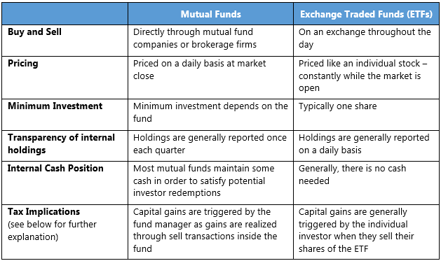

## Table of Contents

## What is an Exchange-Traded Product (ETP)?

An Exchange-Traded Product (ETP) is a type of investment that trades on a stock exchange, just like stocks. It's designed to track the performance of an underlying asset, which could be anything from a commodity like gold, to a stock index like the S&P 500, or even a currency. This means that when you buy an ETP, you're essentially buying a piece of that asset without actually owning it directly.

ETPs are popular because they offer investors an easy way to diversify their portfolios. Instead of buying many different stocks or commodities, you can buy one ETP that represents a whole basket of them. They are also flexible; you can buy and sell them throughout the trading day at market prices, unlike mutual funds which are only priced at the end of the day. This makes ETPs a convenient and efficient tool for both new and experienced investors.

## What is an Exchange-Traded Fund (ETF)?

An Exchange-Traded Fund (ETF) is a type of investment that you can buy and sell on a stock exchange, just like a stock. It's a basket of different investments, like stocks, bonds, or commodities, all wrapped up into one product. When you buy an ETF, you're buying a small piece of all the things inside it. This makes it easier to invest in a lot of different things at once without having to buy each one separately.

ETFs are popular because they let you spread your money across many investments, which can lower your risk. They also have lower fees than many other types of investments, which means you get to keep more of your money. Plus, you can trade ETFs anytime during the trading day, just like stocks, so you have more control over when you buy and sell.

## How do ETPs and ETFs differ in their basic structure?

ETPs and ETFs are both investment products that you can trade on a stock exchange, but they have some differences in how they are set up. An ETP, or Exchange-Traded Product, is a broad term that includes many types of exchange-traded investments. This means ETPs can include not just ETFs, but also Exchange-Traded Notes (ETNs) and other types of products. ETPs are designed to track the performance of an underlying asset, which could be anything from stocks and bonds to commodities or currencies.

On the other hand, an [ETF](/wiki/etf-trading-strategies), or Exchange-Traded Fund, is a specific type of ETP. ETFs are funds that hold a collection of assets, like stocks or bonds, and they track the performance of an index, like the S&P 500. The key difference is that ETFs are always funds, meaning they hold actual assets, while ETPs can include products that don't hold assets directly, like ETNs which are debt instruments issued by banks. So, all ETFs are ETPs, but not all ETPs are ETFs.

## What types of assets can be included in ETPs compared to ETFs?

ETPs can include a wide variety of assets. They can track the performance of stocks, bonds, commodities like gold or oil, currencies, and even more complex things like real estate or specific market sectors. This makes ETPs very flexible because they can cover almost anything you might want to invest in. They are like a big umbrella that includes many different types of investment products, not just funds.

ETFs, on the other hand, are a specific kind of ETP that usually focus on more traditional assets. They mostly hold stocks or bonds and track the performance of well-known indexes, like the S&P 500 or the Dow Jones. While ETFs can also include commodities or real estate, they are more limited in what they can hold compared to the broader category of ETPs. So, if you're looking for something simple and straightforward, ETFs might be the way to go.

## Can you explain the regulatory differences between ETPs and ETFs?

ETPs and ETFs are both regulated, but in slightly different ways. ETPs include a lot of different types of products, so the rules can be different depending on what kind of ETP it is. For example, if it's an Exchange-Traded Note (ETN), it's treated more like a bond and has to follow rules set by the Securities and Exchange Commission (SEC) for debt securities. This means they have to make sure they're telling investors everything they need to know about the risks and how the ETN works.

ETFs, on the other hand, are a specific type of ETP that holds actual assets like stocks or bonds. They have to follow rules set by the SEC for investment companies. This means they have to be clear about what they're investing in, how they're managing the fund, and they have to report their holdings regularly. ETFs also have to follow rules from stock exchanges about how they trade and how they're created and redeemed. So, while both ETPs and ETFs are regulated, the specific rules they follow can be different because of what they are and how they work.

## How does the creation and redemption process vary between ETPs and ETFs?

The creation and redemption process for ETFs is a bit like a factory. When someone wants to create new ETF shares, they give the ETF provider a bunch of the assets that the ETF tracks, like stocks or bonds. The provider then gives them back new ETF shares. It's kind of like trading apples for apple pies. When someone wants to get rid of their ETF shares, they give the shares back to the provider and get the underlying assets in return. This process helps keep the price of the ETF close to the value of the assets it holds, making sure it stays fair for everyone.

ETPs, on the other hand, include a wider variety of products, so their creation and redemption processes can be different. For example, Exchange-Traded Notes (ETNs) don't hold actual assets. Instead, they are like IOUs from a bank. When you want to create an ETN, you buy it from the bank, and when you want to redeem it, you give it back to the bank and get your money back based on how the ETN performed. This process is simpler but depends more on the bank's ability to pay, which adds a bit more risk compared to ETFs.

## What are the typical costs associated with investing in ETPs versus ETFs?

When you invest in ETPs, the costs can vary depending on the type of ETP you choose. For example, ETFs, which are a type of ETP, usually have lower costs because they're funds that hold actual assets. They have something called an expense ratio, which is a small percentage of your investment that goes towards managing the fund. This can be as low as 0.03% for some ETFs, but it can go up to around 1% or more for others. Besides the expense ratio, you might also have to pay trading fees when you buy or sell the ETP, just like you would with stocks.

ETNs, another type of ETP, can have different costs. Since they're more like bonds issued by banks, they don't have an expense ratio in the same way ETFs do. Instead, they might have a fee that the bank charges, which is usually built into the price of the ETN. This fee can be around 0.5% to 1% of the ETN's value each year. Like ETFs, you'll also pay trading fees when you buy or sell ETNs. So, while both types of ETPs have costs, the way they charge you can be a bit different.

## How does liquidity and trading volume compare between ETPs and ETFs?

Liquidity and trading [volume](/wiki/volume-trading-strategy) are important for investors because they show how easy it is to buy or sell an investment. ETFs usually have good [liquidity](/wiki/liquidity-risk-premium) because they hold actual assets like stocks or bonds, and a lot of people trade them. This means you can buy or sell ETFs pretty quickly without worrying too much about the price changing a lot. The trading volume for ETFs can be very high, especially for popular ones that track big indexes like the S&P 500. High trading volume means more people are buying and selling, which helps keep the price stable and makes it easier to trade.

ETPs, on the other hand, include a wider range of products, so their liquidity and trading volume can be different. For example, ETNs, which are a type of ETP, might not be as liquid as ETFs because fewer people trade them. This can make it harder to buy or sell them quickly without affecting the price. The trading volume for ETNs can be lower compared to ETFs, which means you might have to wait longer or accept a different price when you want to trade. So, while ETFs generally have better liquidity and higher trading volume, the specific type of ETP you choose can make a big difference in how easy it is to trade.

## What are the tax implications of investing in ETPs as opposed to ETFs?

The tax implications of investing in ETPs and ETFs can be different because of how they are set up. ETFs are usually more tax-efficient because they hold actual assets like stocks or bonds. When you sell an ETF, you might have to pay capital gains tax on any profit you made. But ETFs often have lower capital gains distributions because of how they manage their holdings. This means you might not have to pay as much in taxes each year, which can be a big advantage if you're trying to keep your tax bill low.

ETPs, on the other hand, include a wider range of products, and their tax treatment can vary. For example, ETNs don't hold actual assets, so you don't have to worry about capital gains distributions like you do with ETFs. Instead, you only pay taxes when you sell the ETN, and then it's based on how much you made or lost. However, ETNs can be riskier because they depend on the bank's ability to pay, and if the bank goes under, you might lose your investment. So, while ETNs might offer some tax benefits, they come with their own set of risks that you need to think about.

## How do ETPs and ETFs perform during market volatility?

ETPs and ETFs can behave differently during times when the market is going up and down a lot. ETFs, which hold actual assets like stocks or bonds, tend to follow the market closely. If the market goes up, ETFs usually go up too, and if the market goes down, ETFs can go down as well. But because ETFs are made up of many different investments, they can be less risky than owning just one stock. During market ups and downs, ETFs can be a good choice because they let you spread your money across many things, which can help smooth out the bumps.

ETPs, on the other hand, include a wider range of products, so how they do during market [volatility](/wiki/volatility-trading-strategies) can vary. For example, ETNs, which are a type of ETP, don't hold actual assets. Instead, they're like IOUs from a bank that promise to pay you based on how a certain thing, like a stock index, performs. During wild market swings, ETNs can be riskier because they depend on the bank's ability to pay. If the market goes crazy and the bank gets into trouble, you might lose your money. So, while ETPs can offer different ways to invest, you need to be careful about the risks, especially when the market is moving a lot.

## What are the potential risks unique to ETPs that are not typically associated with ETFs?

ETPs include a wider range of products than just ETFs, so they can come with some special risks that you don't usually see with ETFs. One big risk is with Exchange-Traded Notes (ETNs), which are a type of ETP. ETNs don't hold actual assets like stocks or bonds. Instead, they're like promises from a bank to pay you based on how something else, like a stock index, does. If the bank gets into trouble, you might not get your money back, even if the thing the ETN tracks is doing well. This is called credit risk, and it's something you don't have to worry about with ETFs because they hold real assets.

Another risk with some ETPs is called tracking error. This happens when an ETP doesn't follow the thing it's supposed to track as closely as it should. For example, if an ETP is supposed to follow the price of gold but doesn't do it exactly right, that's a tracking error. This can happen more often with certain types of ETPs, like those that use complex strategies or try to track things that are hard to pin down. ETFs can have tracking errors too, but they're usually smaller because ETFs hold the actual assets they're tracking. So, while both ETPs and ETFs can have risks, some ETPs come with extra ones you need to think about.

## How do advanced investors use ETPs and ETFs differently in their investment strategies?

Advanced investors often use ETPs and ETFs in different ways to fit their strategies. They might use ETFs to build a core part of their portfolio because ETFs are usually easy to understand and have lower costs. ETFs that track big indexes like the S&P 500 are popular because they give a broad exposure to the market. Advanced investors might also use ETFs to quickly change their investments without having to buy and sell many different stocks or bonds. This can be helpful when they want to move money around based on what's happening in the market.

On the other hand, advanced investors might use ETPs, like ETNs, to take bigger risks or try to make more money. Because ETPs include a wider range of products, they can be used to bet on things that are harder to invest in directly, like certain commodities or even trends in the market. Advanced investors might use ETPs to add some excitement to their portfolio or to try to beat the market. But they know that ETPs can be riskier, so they use them carefully, making sure they understand the risks and how they fit into their overall plan.

## References & Further Reading

[1]: ["Advances in Financial Machine Learning"](https://www.amazon.com/Advances-Financial-Machine-Learning-Marcos/dp/1119482089) by Marcos Lopez de Prado

[2]: ["Machine Learning for Algorithmic Trading"](https://github.com/stefan-jansen/machine-learning-for-trading) by Stefan Jansen

[3]: ["Quantitative Trading: How to Build Your Own Algorithmic Trading Business"](https://www.amazon.com/Quantitative-Trading-Build-Algorithmic-Business/dp/1119800064) by Ernest P. Chan

[4]: ["Evidence-Based Technical Analysis: Applying the Scientific Method and Statistical Inference to Trading Signals"](https://www.amazon.com/Evidence-Based-Technical-Analysis-Scientific-Statistical/dp/0470008741) by David Aronson

[5]: Bergstra, J., Bardenet, R., Bengio, Y., & Kégl, B. (2011). ["Algorithms for Hyper-Parameter Optimization."](https://dl.acm.org/doi/10.5555/2986459.2986743) Advances in Neural Information Processing Systems 24.