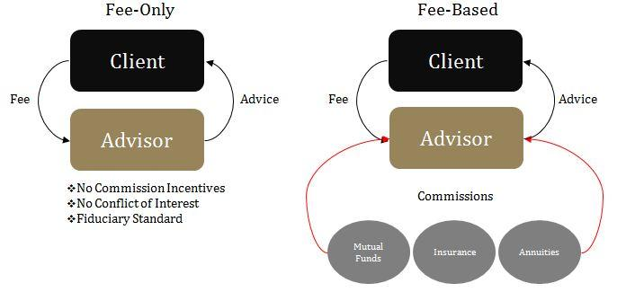

## Table of Contents

## What is a fee-based financial advisor?

A fee-based financial advisor is someone who gets paid for giving financial advice. They charge a fee for their services, which can be a flat rate, a percentage of the assets they manage, or an hourly rate. This fee structure is different from commission-based advisors, who earn money from selling financial products.

People like fee-based advisors because they think the advisor will give honest advice, not just try to sell products for a commission. However, it's important to know that fee-based advisors might still earn commissions from some products they recommend. So, it's a good idea to ask them how they get paid and what fees you might have to pay.

## What is a commission-based financial advisor?

A commission-based financial advisor is someone who earns money by selling financial products like insurance or investments. When they sell these products, they get a commission, which is a percentage of the sale price. This means their income depends on how much they sell, not on how much time they spend advising you.

Some people worry that commission-based advisors might suggest products that pay them more, even if those products aren't the best for you. It's important to ask them about any commissions they earn and how those might affect their advice. Knowing this can help you decide if their recommendations are really in your best interest.

## How do fee-based advisors charge for their services?

Fee-based advisors charge for their services in different ways. One common way is by charging a percentage of the assets they manage for you. For example, if they manage $100,000 of your money, they might charge 1% of that, which would be $1,000 a year. Another way is by charging a flat fee, which is the same amount no matter how much money you have them manage. This could be a yearly fee, like $5,000, or a one-time fee for a specific service.

Some fee-based advisors also charge by the hour. This means you pay them for the time they spend helping you, usually between $100 and $300 per hour. It's important to know how your advisor charges because it can affect how much you end up paying for their advice. Always ask them about their fee structure so you understand what you're paying for.

## How do commission-based advisors earn their income?

Commission-based advisors earn their income by selling financial products like insurance policies, mutual funds, or annuities. When they sell these products to you, they get a commission, which is a part of the money you pay for the product. The more products they sell, the more money they make. This means their income depends on how good they are at selling, not on how much time they spend advising you.

Some people worry that because commission-based advisors make money from selling, they might suggest products that pay them more, even if those products aren't the best for you. It's important to ask them about any commissions they earn and how those might affect their advice. Knowing this can help you decide if their recommendations are really in your best interest.

## What are the potential conflicts of interest for commission-based advisors?

Commission-based advisors might have conflicts of interest because they earn money from selling financial products. If they get paid more for selling one product over another, they might suggest the one that pays them more, even if it's not the best choice for you. This means their advice might be influenced by their own financial gain instead of what's best for you.

This conflict can make it hard to trust their advice. You might wonder if they are recommending something because it's good for you or because it's good for their wallet. It's important to ask them about any commissions they might earn and how those could affect their advice. Knowing this can help you make better decisions about whether to follow their recommendations.

## Can fee-based advisors also earn commissions?

Yes, fee-based advisors can also earn commissions. This means they might get paid a fee for their advice and also earn money from selling you certain financial products. It's important to know this because it can affect their advice. If they can make money from selling you something, they might suggest products that pay them more, even if those aren't the best for you.

This mix of fees and commissions can make things confusing. You might wonder if the advice you're getting is really in your best interest or if the advisor is thinking about their own earnings. To be sure, always ask your fee-based advisor how they get paid and what commissions they might earn from the products they recommend. This way, you can make better choices about your money.

## How might the advice from fee-based and commission-based advisors differ?

The advice from fee-based advisors and commission-based advisors can be different because of how they get paid. Fee-based advisors charge you a fee for their advice, which could be a percentage of your money, a flat fee, or an hourly rate. Because they get paid this way, they might focus more on giving you the best advice for your situation. They might look at all your options and suggest the ones that help you the most, without worrying about [earning](/wiki/earning-announcement) money from selling you something.

On the other hand, commission-based advisors earn money by selling you financial products. They get a commission when you buy something like insurance or an investment. This means they might suggest products that pay them more, even if those aren't the best for you. Their advice could be influenced by how much money they can make from selling, so you might need to think about whether their recommendations are really in your best interest.

Both types of advisors can help you with your money, but it's important to know how they get paid. Fee-based advisors might give more neutral advice, but they can still earn commissions from some products. Commission-based advisors might push products that pay them well, but they can still offer good advice if you know about their commissions. Always ask about how they earn money to make sure their advice fits your needs.

## What are the advantages of choosing a fee-based financial advisor?

Choosing a fee-based financial advisor can be good because they might give you advice that's more focused on what's best for you. Since they get paid a fee for their advice, they don't have to worry about earning money from selling you something. This means they can look at all your options and suggest the ones that help you the most. It's like having a guide who's there to help you reach your financial goals without trying to sell you anything.

Another advantage is that fee-based advisors often give you a clear idea of what you're paying for. They might charge you a percentage of your money, a flat fee, or by the hour. This can make it easier for you to understand their costs and plan your budget. Knowing how much you'll pay can help you feel more in control of your money and trust that their advice is honest and in your best interest.

## What are the benefits of working with a commission-based financial advisor?

One benefit of working with a commission-based financial advisor is that you might not have to pay any upfront fees for their advice. Since they earn money from selling financial products, you can get their help without worrying about paying them directly. This can be helpful if you want to start managing your money but don't have extra cash to pay for advice right away.

Another benefit is that commission-based advisors might have a lot of experience with certain financial products. They often work with specific types of insurance or investments, so they can give you detailed information about those options. This can make it easier for you to understand and choose products that fit your needs, even if the advisor is getting paid a commission for selling them.

## How can the cost of services compare between fee-based and commission-based advisors?

The cost of services from fee-based advisors can be clear and easy to understand. They might charge you a percentage of the money they manage for you, like 1% of $100,000, which would be $1,000 a year. Or they might charge a flat fee, like $5,000 a year, or an hourly rate, like $200 an hour. This means you know exactly how much you're paying for their advice. But, some fee-based advisors can also earn commissions from selling you certain products, which might add to your costs if you buy those products.

Commission-based advisors, on the other hand, don't charge you a fee for their advice. Instead, they earn money by selling you financial products, like insurance or investments. When you buy something, they get a part of the money you pay, called a commission. This means you might not pay anything upfront for their advice, but the cost comes from the products you buy. The more you buy, the more they earn, so the total cost can be harder to predict because it depends on what you end up buying.

## In what scenarios might a commission-based advisor be more suitable than a fee-based advisor?

A commission-based advisor might be more suitable if you don't have extra money to pay for advice upfront. Since they earn money from selling financial products, you can get their help without paying any fees right away. This can be helpful if you're just starting to manage your money and want to keep your costs low at the beginning.

Also, if you're interested in specific financial products like certain types of insurance or investments, a commission-based advisor might be a good choice. They often have a lot of experience with these products and can give you detailed information about them. This can make it easier for you to understand and choose the right products for your needs, even if the advisor earns a commission from selling them to you.

## What regulatory considerations should be taken into account when choosing between fee-based and commission-based advisors?

When choosing between fee-based and commission-based advisors, it's important to think about the rules that govern them. Both types of advisors have to follow certain laws and rules set by groups like the Securities and Exchange Commission (SEC) and the Financial Industry Regulatory Authority (FINRA). These rules are there to make sure advisors act in your best interest and don't do anything wrong. For fee-based advisors, the rules might focus on how they charge you and how they disclose their fees. For commission-based advisors, the rules might look at how they earn their commissions and make sure they're not pushing products just to make more money.

Another thing to consider is the fiduciary standard, which says that advisors have to put your interests ahead of their own. Fee-based advisors often have to follow this standard, which can give you more peace of mind that they're giving you the best advice. Commission-based advisors might not always have to follow this standard, but they still have to follow other rules that aim to protect you. Always ask your advisor about the rules they follow and how those rules affect the advice they give you. This can help you feel more confident that you're making a good choice for your money.

## References & Further Reading

[1]: Bergstra, J., Bardenet, R., Bengio, Y., & Kégl, B. (2011). ["Algorithms for Hyper-Parameter Optimization."](https://proceedings.neurips.cc/paper/2011/file/86e8f7ab32cfd12577bc2619bc635690-Paper.pdf) Advances in Neural Information Processing Systems 24.

[2]: ["Advances in Financial Machine Learning"](https://www.amazon.com/Advances-Financial-Machine-Learning-Marcos/dp/1119482089) by Marcos Lopez de Prado

[3]: ["Evidence-Based Technical Analysis: Applying the Scientific Method and Statistical Inference to Trading Signals"](https://www.amazon.com/Evidence-Based-Technical-Analysis-Scientific-Statistical/dp/0470008741) by David Aronson

[4]: ["Machine Learning for Algorithmic Trading"](https://github.com/PacktPublishing/Machine-Learning-for-Algorithmic-Trading-Second-Edition) by Stefan Jansen

[5]: ["Quantitative Trading: How to Build Your Own Algorithmic Trading Business"](https://www.amazon.com/Quantitative-Trading-Build-Algorithmic-Business/dp/1119800064) by Ernest P. Chan