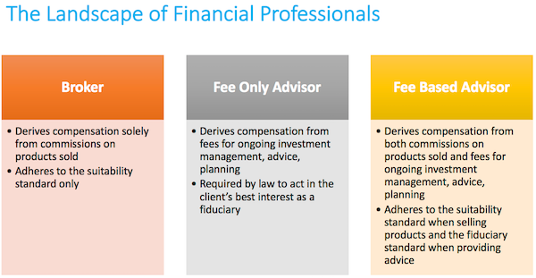

In today's rapidly shifting financial landscape, it is vital for investors to acquaint themselves with various investment strategies and compensation schemes. Navigating these complexities is essential to making informed decisions that align with one's financial goals. This article focuses on two predominant financial advisory models: commission-based financial advisors and fee-based algorithmic trading. Each of these models offers distinct advantages and presents unique challenges.

Commission-based financial advisors have traditionally played a significant role, providing personalized guidance and fostering strong client-advisor relationships. However, their compensation model, which is reliant on commissions from the products they sell, can sometimes create conflicts of interest. On the other hand, fee-based algorithmic trading leverages advanced technologies to offer transparency in fee structures and aims to eliminate human biases. This approach utilizes computer algorithms to make data-driven investment decisions, offering a systematic strategy that many find attractive in an era emphasizing precision and efficiency.



As technology increasingly influences finance, understanding the interaction between human advisors and algorithmic systems becomes crucial. Human advisors bring the benefits of empathy and personalized advice, factors that many investors still value. Conversely, algorithmic trading provides speed and data processing capabilities that far surpass human potential, a necessity in today's fast-paced markets.

By highlighting the distinctions and intersections between these models, this article intends to guide investors towards more informed, strategic choices. Balancing the old with the new, understanding both models can position investors to capitalize on the evolving opportunities in financial advisory services.

## Table of Contents

## Understanding Commission-Based Financial Advisors

Commission-based financial advisors are professionals whose remuneration is derived from the commissions they earn by selling financial products. This model, widely utilized in the financial services industry, operates on the premise that advisors receive a percentage of the sales as their primary source of income. This percentage can fluctuate based on the type of product and the financial institution involved.

One noteworthy aspect of this compensation model is the potential conflict of interest it engenders. Advisors may be incentivized to recommend products that yield higher commissions rather than those that perfectly align with a client's needs. This intrinsic bias necessitates that investors remain vigilant and well-informed when engaging commission-based advisors, ensuring the advisory recommendations genuinely serve their financial goals.

Despite these potential conflicts, commission-based advisors possess distinct advantages, particularly their ability to provide personalized financial guidance. Many clients value the bespoke nature of the advice offered, as it often includes tailored investment plans designed to accommodate an individual’s specific financial situation and objectives. This personalized interaction is a significant draw for investors who prioritize building a trusting and sustained relationship with their financial advisor.

For clients choosing commission-based advisors, a thorough understanding of the fee structure is paramount. Being aware of the nuances and potential biases inherent in this model aids clients in evaluating the alignment of their financial advisor's recommendations with their investment goals. By carefully considering these factors, investors can effectively navigate the dynamics of commission-based advisories, optimizing their financial decision-making process.

## Exploring Fee-Based Algorithmic Trading

Fee-based [algorithmic trading](/wiki/algorithmic-trading) is a method of investment management that employs computer algorithms to conduct trades and manage portfolios. This model typically charges fixed fees based on the size of the portfolio being managed. The use of algorithms in trading is designed to enhance transparency and reduce potential conflicts of interest that may arise when human advisors have personal incentives tied to specific investment products.

One of the primary advantages of algorithmic trading is the ability to execute trades at speeds much faster than any human can achieve, and the capability to analyze vast data sets that are beyond human processing capacity. Algorithms can be programmed to follow predetermined criteria, such as timing, price, quantity, or any mathematical model, to make trading decisions. This allows for investment strategies that are both systematic and disciplined, potentially leading to more optimal investment outcomes.

For example, consider the use of simple moving averages to determine buy or sell signals. An algorithm can instantly calculate moving averages over different time periods, enabling quick decision-making:

```python
import pandas as pd
# Assuming 'data' is a pandas DataFrame with a 'Close' column containing closing prices
data['SMA_20'] = data['Close'].rolling(window=20).mean()
data['SMA_50'] = data['Close'].rolling(window=50).mean()
data['Signal'] = 0
data['Signal'][data['SMA_20'] > data['SMA_50']] = 1  # Buy signal
data['Signal'][data['SMA_20'] < data['SMA_50']] = -1 # Sell signal
```

The use of technology in this way enables more informed decision-making by leveraging data analysis and eliminating emotional biases that often accompany human trading.

However, engagement with algorithmic trading requires a comprehensive understanding of its technical aspects and the associated market risks. Market conditions can rapidly change, and algorithms might not always adapt as expected, potentially leading to significant losses. Furthermore, algorithms rely extensively on accurate and timely data; any disruptions in data feeds can affect performance. It is crucial for investors to understand these nuances and assess the robustness of the algorithms being employed.

In summary, while fee-based algorithmic trading provides a structured, data-driven approach to investing, it demands a solid grasp of the technicalities involved and a keen awareness of its potential risks in order to fully leverage its benefits.

## Comparing Commission-Based and Fee-Based Models

Commission-based and fee-based models represent two fundamentally different approaches to financial advisory services, each with distinct characteristics that cater to diverse investor needs.

Commission-based financial advisors primarily generate income through commissions on the financial products they sell, such as mutual funds, insurance policies, or annuities. This model emphasizes personal relationships and trust, as advisors work closely with clients to understand their financial situations, goals, and risk tolerances. However, the commission structure can sometimes create conflicts of interest, as advisors might be incentivized to recommend products that offer higher commissions rather than those that best fit the client’s needs. Despite these potential conflicts, the personalized service and relationship-focused approach appeal to many investors seeking tailored investment advice.

In contrast, fee-based algorithmic trading relies on charging fixed fees based on the size of the portfolio rather than commissions on transactions. This approach underscores objectivity and transparency, reducing the potential for conflicts of interest since the compensation is not tied to specific product sales. Algorithmic trading systems can execute trades rapidly and analyze large datasets, potentially leading to optimal investment decisions. The systematic and disciplined approach, supported by technology, provides investors with a robust framework for strategic planning. However, the technical nature of algorithmic trading requires a solid understanding of the underlying systems and market risks.

When comparing these models, several factors become crucial for investors in aligning their financial goals with the appropriate advisory service. Key considerations include:

- **Investment Goals**: Long-term growth, income generation, or capital preservation may influence the choice between personalized advice and data-driven strategies.
- **Risk Tolerance**: Investors with varying risk appetites may gravitate towards the model that best matches their comfort with uncertainty and volatility.
- **Personal Preferences**: The desire for human interaction versus a preference for automated, objective trading strategies can sway decisions.

Both the commission-based and fee-based models offer unique advantages. Commission-based services provide investors with personalized advice and a trusted advisor relationship. In contrast, fee-based algorithmic trading offers transparency and objectivity, leveraging technology to potentially achieve superior investment outcomes. Understanding these dynamics is essential for strategic financial planning, enabling investors to make informed decisions that align with their specific objectives and preferences.

## The Role of Technology in Modern Financial Advisory

Technology has significantly reshaped the financial advisory landscape by making advanced investment strategies more accessible to a broader audience. Traditionally, sophisticated financial approaches were exclusive to institutional investors due to high costs and the need for specialized knowledge. However, technological advancements have democratized these strategies, enabling individual investors to tap into them effectively.

Algorithmic trading platforms and digital financial advisors are at the forefront of this transformation, offering automated solutions that reduce both costs and the margin for error in investment strategies. These platforms utilize algorithms to execute trades based on predefined criteria, which helps ensure consistency and efficiency. By minimizing the human element, these systems can operate faster, execute trades at optimal prices, and maintain discipline in volatile markets.

The integration of big data and [machine learning](/wiki/machine-learning) further augments the decision-making capabilities within finance. These technologies allow systems to process and analyze vast datasets far beyond human capabilities, identifying patterns and trends that inform investment decisions. For instance, machine learning algorithms can predict market movements by analyzing historical data, sentiment from news articles, and trading volumes, among other indicators.

Investors now have the capability to leverage these tools for insights and strategies that were once inaccessible. The use of advanced data analytics helps individual investors make better-informed decisions by providing a comprehensive view of market conditions and potential investment opportunities. Insights derived from big data can reveal hidden correlations and anomalies in the market, leading to more strategic investment choices.

Understanding the implications of technological integration in finance is essential for investors aiming to make well-informed decisions about their advisory needs. As [artificial intelligence](/wiki/ai-artificial-intelligence) and machine learning become increasingly sophisticated, their applications extend beyond trading algorithms to include risk management, portfolio optimization, and even personalized financial advice. These advancements offer investors the potential for improved returns while managing risk more effectively.

In conclusion, technology has irrevocably altered the structure and functionality of financial advisory services. By enabling automated, data-driven decision-making, it has opened up new possibilities for investors seeking to optimize their investment strategies. As the financial landscape continues to evolve, staying informed about these technological advancements is crucial for maximizing investment success and ensuring alignment with personal financial goals.

## Making an Informed Decision: Factors to Consider

Investors face a complex decision-making process when choosing between commission-based and fee-based financial advisory models. Key considerations include cost, transparency, and potential conflicts of interest. Commission-based advisors might have incentives to recommend products with higher commissions, which could affect the objectivity of their advice. In contrast, fee-based algorithmic trading models typically charge based on portfolio size, offering a more predictable cost structure and reducing the potential for biases related to transaction commissions.

Understanding your personal investment goals and risk tolerance is crucial in selecting the appropriate advisory model. Commission-based advisors often offer a personal touch and can tailor advice to individual needs, which may appeal to those who value human interaction in managing their investments. Conversely, fee-based algorithmic solutions offer a systematic approach, leveraging technology to manage investments, potentially appealing to those comfortable with a more automated process and who prefer data-driven strategies.

Evaluating the past performance, reputation, and regulatory compliance of advisors and platforms is another critical step. Historical performance can provide insights into the reliability and effectiveness of an advisor or trading algorithm. Investors should also verify whether advisors adhere to regulatory standards, which can help ensure the ethical management of investments. Regulatory bodies such as the Financial Industry Regulatory Authority (FINRA) and the U.S. Securities and Exchange Commission (SEC) provide resources to check an advisor's credentials and track record.

The regulatory landscape is dynamic, and understanding these changes is essential for adapting advisory services to future developments. Recent regulatory trends focus on increasing transparency and protecting investors from potential conflicts of interest. Staying informed about these changes helps investors choose services aligned with compliance requirements and best practices in the industry.

Ultimately, making an informed decision relies on aligning personal financial goals with the advisory model that best fits those objectives. Whether valuing personal interaction and customized advice or appreciating the data-driven efficiencies of algorithmic models, investors must weigh these factors carefully to optimize their investment strategies for future success.

## Conclusion

As the financial landscape continues to evolve, understanding different advisory models is integral to achieving investment success. Investors encounter a diverse array of advisory options, each offering unique advantages tailored to specific needs. On one hand, commission-based financial advisors provide personalized and relationship-focused services, appealing to those seeking tailored guidance and human interaction. This model, however, necessitates careful consideration of potential conflicts of interest due to the commission structures that may influence product recommendations.

On the other hand, fee-based algorithmic trading represents a technological advancement in financial advisory services. By leveraging algorithms, these models offer transparency and efficiency, with decisions driven by data analysis and systematic processes. They are especially advantageous for investors seeking a disciplined investment approach and those comfortable with minimal human interaction.

Making an informed decision ultimately requires a thorough assessment of personal financial goals and preferences. Investors should weigh the importance of personalization against the benefits of technology-driven objectivity. Staying informed about technological advancements and regulatory changes further enhances the potential for optimal investment outcomes. The integration of technology, such as big data analytics and machine learning, continues to reshape the financial advisory space, offering sophisticated strategies previously reserved for institutional investors.

Understanding regulatory shifts is crucial to adapting to future changes in advisory services. As regulations evolve to ensure transparency and protect investors, staying abreast of these developments can aid investors in aligning their strategy with contemporary standards.

In conclusion, navigating the complexities of financial advisory services equips investors to make strategic and beneficial investment decisions. By aligning their personal financial goals with the most suitable advisory model, be it commission-based or fee-based algorithmic trading, investors can enhance their potential for successful outcomes in an ever-evolving financial world.

## References & Further Reading

[1]: Bergstra, J., Bardenet, R., Bengio, Y., & Kégl, B. (2011). ["Algorithms for Hyper-Parameter Optimization."](https://proceedings.neurips.cc/paper/2011/file/86e8f7ab32cfd12577bc2619bc635690-Paper.pdf) Advances in Neural Information Processing Systems 24.

[2]: ["Advances in Financial Machine Learning"](https://www.amazon.com/Advances-Financial-Machine-Learning-Marcos/dp/1119482089) by Marcos Lopez de Prado

[3]: ["Evidence-Based Technical Analysis: Applying the Scientific Method and Statistical Inference to Trading Signals"](https://www.amazon.com/Evidence-Based-Technical-Analysis-Scientific-Statistical/dp/0470008741) by David Aronson

[4]: ["Machine Learning for Algorithmic Trading"](https://github.com/PacktPublishing/Machine-Learning-for-Algorithmic-Trading-Second-Edition) by Stefan Jansen

[5]: ["Quantitative Trading: How to Build Your Own Algorithmic Trading Business"](https://www.amazon.com/Quantitative-Trading-Build-Algorithmic-Business/dp/1119800064) by Ernest P. Chan