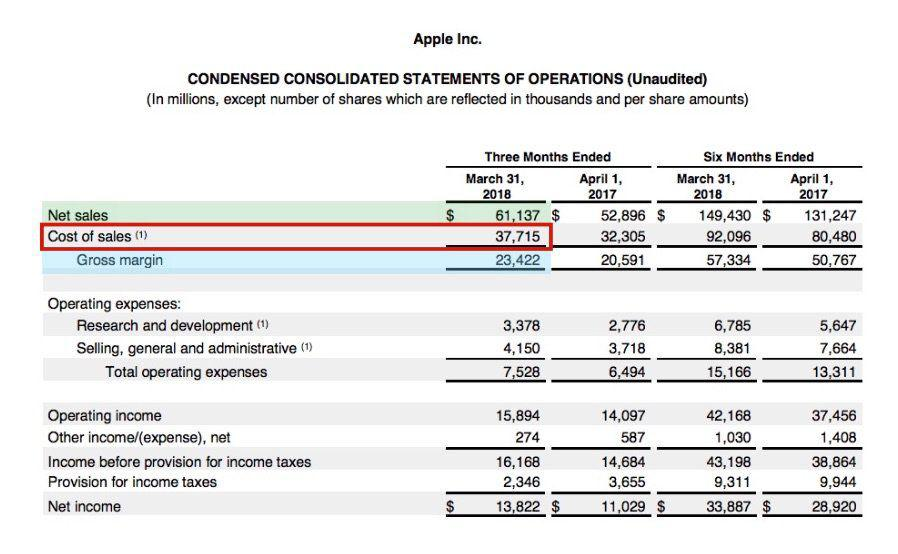

## Table of Contents

## What is gross margin?

Gross margin is the difference between how much money a business makes from selling its products or services and the cost of making those products or services. It's usually shown as a percentage. This percentage shows how much of each dollar of revenue is left after paying for the things needed to make the product or service.

Knowing the gross margin helps a business see if it's making enough money from its sales to cover other costs like rent, salaries, and marketing. If the gross margin is high, it means the business is doing well at keeping the costs of making its products low compared to what it sells them for. If it's low, the business might need to find ways to reduce costs or increase prices to stay profitable.

## What is net margin?

Net margin is the money a business has left after paying for everything it needs to run. It's different from gross margin because it includes all costs, not just the cost of making the product. So, after a business pays for the things it sells, it also pays for rent, salaries, and other bills. The net margin shows how much profit is left from each dollar of sales after all these costs.

A high net margin means a business is good at controlling all its costs and making a good profit. A low net margin might mean the business needs to find ways to spend less money or make more money from sales. Knowing the net margin helps business owners see if they are making enough money to keep the business going and growing.

## How is gross margin calculated?

Gross margin is calculated by taking the money a business makes from selling its products or services and subtracting the cost of making those products or services. This difference is called the gross profit. To turn this into a percentage, you divide the gross profit by the total revenue and then multiply by 100. This percentage is the gross margin.

For example, if a business sells a product for $100 and it costs $60 to make, the gross profit is $40. To find the gross margin, you divide $40 by $100, which gives you 0.4. Multiply 0.4 by 100 to get a gross margin of 40%. This means for every dollar of sales, the business keeps 40 cents after paying for the cost of the product.

## How is net margin calculated?

Net margin is figured out by taking the money a business makes from sales and then subtracting all the costs it has to pay. This includes not just the cost to make the product, but also other expenses like rent, salaries, and utilities. The money left after all these costs is called net profit. To find the net margin, you divide the net profit by the total revenue and then multiply by 100 to get a percentage.

For example, if a business makes $100 from selling a product and it costs $60 to make it, that leaves $40. But if the business also has to pay $20 for rent, salaries, and other costs, the net profit is $20. To find the net margin, you divide $20 by $100, which gives you 0.2. Multiply 0.2 by 100 to get a net margin of 20%. This means for every dollar of sales, the business keeps 20 cents after paying for all costs.

## What expenses are included in gross margin?

Gross margin only includes the costs that are directly related to making the product or service that a business sells. These costs are called the cost of goods sold (COGS). For example, if a business makes t-shirts, the cost of the fabric, the labor to sew the shirts, and any other materials needed to make the t-shirts would be part of the gross margin.

These direct costs do not include other expenses like rent for the store, salaries for office workers, or money spent on advertising. Those other costs are taken into account when calculating the net margin, not the gross margin. So, gross margin focuses only on the money spent to create what the business sells.

## What expenses are included in net margin?

Net margin includes all the costs a business has to pay, not just the costs to make the product or service. This means it includes the cost of goods sold, which is what it takes to make what the business sells, like materials and direct labor. But it also includes other costs like rent for the store or office, salaries for all employees, utilities like electricity and water, and money spent on advertising and marketing.

These other costs are called operating expenses. They are important because they keep the business running every day. When you subtract all these costs from the money the business makes from sales, you get the net profit. The net margin is then the net profit divided by the total sales, showing how much profit the business makes after paying for everything.

## Why is gross margin important for a business?

Gross margin is important for a business because it shows how much money is left after paying for the cost of making the product or service. This number helps business owners see if they are pricing their products right and if they are keeping the costs of making them low enough. If the gross margin is high, it means the business is doing well at making money from what it sells. But if it's low, it might mean the business needs to find ways to make things cheaper or sell them for more money.

Understanding the gross margin also helps a business plan for the future. It tells them how much money they have left to pay for other things like rent, salaries, and marketing. If the gross margin isn't enough to cover these other costs, the business might need to change its plans. By keeping an eye on the gross margin, a business can make smart choices to stay healthy and grow.

## Why is net margin important for a business?

Net margin is important for a business because it shows how much money the business keeps after paying for everything it needs to run. This includes not just the cost of making the product or service, but also things like rent, salaries, and advertising. Knowing the net margin helps business owners see if they are making enough money to keep the business going and growing. If the net margin is high, it means the business is good at controlling all its costs and making a good profit. But if it's low, it might mean the business needs to find ways to spend less money or make more money from sales.

Understanding the net margin also helps a business make smart decisions. It tells them if they can afford to invest in new projects, expand their business, or pay for other big expenses. If the net margin is not enough to cover these things, the business might need to change its plans. By keeping an eye on the net margin, a business can plan better for the future and make sure it stays healthy and profitable.

## How do gross margin and net margin differ in terms of what they measure?

Gross margin and net margin both help a business understand how much money it makes, but they measure different things. Gross margin looks at the money left after paying for the cost of making the product or service. This is called the cost of goods sold. It shows how well a business is doing at keeping the costs of making things low compared to what it sells them for. If the gross margin is high, it means the business is good at making money from what it sells.

Net margin, on the other hand, looks at the money left after paying for everything the business needs to run. This includes the cost of goods sold, but also other costs like rent, salaries, and advertising. These are called operating expenses. Net margin shows how much profit the business makes after paying for all these costs. If the net margin is high, it means the business is good at controlling all its costs and making a good profit. Both margins are important, but they give different information about the business's financial health.

## Can a company have a high gross margin but a low net margin? Why?

Yes, a company can have a high gross margin but a low net margin. Gross margin only looks at the money left after paying for the things needed to make the product or service. If a company can keep these costs low and sell for a good price, its gross margin will be high. But this doesn't tell the whole story.

Net margin looks at all the money the company spends, not just the cost of making things. This includes things like rent, salaries, and advertising. If these other costs are very high, even if the company makes a lot of money from selling its products, there might not be much left after paying for everything. So, a company could have a high gross margin because it's good at making things cheaply, but a low net margin because it spends a lot on other things.

## How do industry standards affect the interpretation of gross and net margins?

Industry standards are really important when you want to understand how good a company's gross and net margins are. Every industry is different, and what might be a good margin in one industry might not be good in another. For example, in the tech industry, it's common to have high gross margins because the cost to make software is low. But in the grocery business, gross margins are usually lower because the cost of goods sold is high. So, when you look at a company's margins, you need to compare them to what's normal in their industry to see if they're doing well.

Net margins can also be affected by industry standards. Some industries have a lot of extra costs like research and development or marketing, which can make net margins lower. For example, in the pharmaceutical industry, companies might spend a lot on research, so their net margins might be lower than in other industries. But if a company in that industry has a net margin that's higher than the industry average, it might mean they're doing a good job at controlling their costs. So, knowing what's normal in an industry helps you understand if a company's net margin is good or not.

## What advanced financial strategies can improve both gross and net margins?

One way to improve both gross and net margins is by finding ways to make things cheaper. This could mean buying materials in bulk to get a better price, using new technology to make things faster and with less waste, or finding cheaper suppliers. If a business can make its products for less money, its gross margin goes up because the difference between the cost to make the product and the price it sells for gets bigger. This extra money can then help pay for other costs like rent and salaries, which can make the net margin go up too.

Another strategy is to look at all the other costs the business has and see if any can be cut down. This might mean moving to a cheaper office, using less expensive ways to advertise, or finding ways to save on electricity and other bills. By reducing these costs, more money is left over after paying for everything, which can make the net margin higher. At the same time, if the business can keep its prices the same or even raise them a little, the gross margin can stay strong or get even better. Both of these strategies together can help a business improve its financial health.

## What is Understanding Profit Margins?

Profit margins are critical indicators of a company's ability to convert revenue into actual profits, reflecting its overall efficiency and financial health. There are two primary types of profit margins: gross profit margin and net profit margin, each providing different insights into a company’s operations.

The gross profit margin focuses on a company's production efficiency by examining how well it can generate profit from its core business activities, excluding indirect costs. It is calculated using the formula:

$$
\text{Gross Profit Margin} = \left( \frac{\text{Net Sales} - \text{Cost of Goods Sold (COGS)}}{\text{Net Sales}} \right) \times 100
$$

Here, net sales represent the gross revenue from sales minus returns, allowances, and discounts, while COGS includes the direct costs attributable to the production of the goods sold by the company. This margin highlights how effectively a firm is managing its production processes and materials, and it is crucial for assessing the core profitability of a company before accounting for operational expenses. A higher gross profit margin indicates greater efficiency in turning sales into profits, relative to the cost of production.

On the other hand, the net profit margin offers a more comprehensive analysis of a company's profitability by considering all aspects of a firm’s financial operations. It accounts for COGS as well as other expenses such as operational costs, interest, and taxes. The net profit margin is determined by the following equation:

$$
\text{Net Profit Margin} = \left( \frac{\text{Net Income}}{\text{Net Sales}} \right) \times 100
$$

Net income, also known as net profit or the bottom line, is what remains after all expenses, including operating expenses, interest, and taxes, have been subtracted from total revenue. This margin serves as a critical measure of overall profitability, reflecting the percentage of revenue that turns into profit after all costs are accounted for. A higher net profit margin signifies stronger financial health and efficiency in managing both core and operational expenses, providing a clear picture of how profitably a company is being run.

Both profit margins are important for investors, analysts, and company management, as they help in understanding different facets of a company's financial performance. While gross profit margin is useful for assessing production and sales efficiency, net profit margin provides insight into the company's overall capacity to generate profit from its total revenue.

## What are the key differences between Gross Margin and Net Margin?

Profit margins serve as crucial benchmarks for assessing the financial performance of a company, but distinguishing between gross margin and net margin is essential for their effective utilization in financial analysis. Gross margin focuses on production efficiency by examining the relationship between revenue and the cost of goods sold (COGS). It is a measure that helps in determining how well a company controls its direct production costs relative to its sales. The formula for calculating gross margin is:

$$
\text{Gross Margin} = \left( \frac{\text{Net Sales} - \text{COGS}}{\text{Net Sales}} \right) \times 100
$$

This metric indicates the percentage of revenue that exceeds the costs of production, providing insights into the operational efficiency of a company. A higher gross margin suggests that a company retains more revenue per unit of sales, which can be reinvested into the business for growth or absorbed as profit.

On the other hand, net margin provides a more comprehensive view of a company's overall profitability by accounting for all operational expenses, not just the COGS. This includes administrative expenses, interest payments, taxes, and other costs. The net profit margin is calculated as follows:

$$
\text{Net Margin} = \left( \frac{\text{Net Profit}}{\text{Net Sales}} \right) \times 100
$$

Net profit, in this formula, takes into account the total revenue minus all expenses incurred during the period. This metric gives stakeholders a holistic view of a company’s ability to convert revenue into actual profit, after all expenses have been paid. 

Both gross and net margins are important for different reasons. Gross margin is critical for understanding cost structure efficiency and is particularly useful in manufacturing and retail sectors where managing production costs is vital. Meanwhile, net margin is indispensable for assessing the overall financial health and profitability potential, providing a broader understanding of a company’s financial standing after accounting for all obligatory outflows.

By comparing these two metrics, analysts can gain valuable insights into how effectively a company manages its production costs relative to its total expenses. For instance, a company may exhibit a high gross margin while simultaneously facing a low net margin, indicating effective product cost management but potential issues with other expenses. Conversely, a strong net margin, along with a consistent gross margin, would highlight robust overall operational efficiency and financial health.

## What are the profit margins in algorithmic trading?

Algorithmic trading utilizes profit margins to guide and optimize trading decisions. These financial metrics play a crucial role in determining the efficiency and success of trading strategies formulated by sophisticated algorithms.

Gross profit margin is integral in evaluating the effectiveness of an algorithm in executing trades. It is calculated by subtracting the cost of goods sold (COGS) from net sales and dividing the result by net sales, expressed as a percentage:

$$
\text{Gross Profit Margin} = \left(\frac{\text{Net Sales} - \text{COGS}}{\text{Net Sales}}\right) \times 100
$$

This metric provides insights into how well a trading algorithm can manage and execute trades relative to the cost incurred. A robust gross profit margin indicates that an algorithm is adept at conducting trades that effectively cover associated transaction costs while generating revenue.

Net profit margin extends this analysis by considering the entire spectrum of expenses a company faces, including operational costs, taxes, and interest, alongside COGS. The formula for net profit margin is more comprehensive:

$$
\text{Net Profit Margin} = \left(\frac{\text{Net Profit}}{\text{Net Sales}}\right) \times 100
$$

This margin offers a holistic view of the profitability of trading strategies. In the context of [algorithmic trading](/wiki/algorithmic-trading), a strong net profit margin suggests that the algorithm not only covers its operational costs but also secures a satisfactory return on investment, signifying overall efficiency and strategic success.

Integrating these profit margins allows algorithms to discern which trading strategies are most effective and efficient. Real-time analysis of these metrics can also inform the algorithm when to adjust parameters to maintain profitability amidst fluctuating market conditions. Understanding these underpinnings empowers traders and algorithms to make calculated, informed decisions that align with financial objectives and market dynamics.

## References & Further Reading

1. **"Financial Intelligence, Revised Edition: A Manager's Guide to Knowing What the Numbers Really Mean" by Karen Berman and Joe Knight**  
   This book provides a comprehensive guide to understanding financial statements, including profit margins, and how they impact business decisions.

2. **"Quantitative Trading: How to Build Your Own Algorithmic Trading Business" by Ernie Chan**  
   Ernie Chan offers an exceptional look into the world of algorithmic trading, explaining how mathematical models and metrics like profit margins are used to optimize trading strategies.

3. **Investopedia - "Profit Margin"**  
   The Investopedia entry on profit margins details the calculations and importance of both gross and net profit margins. An essential online resource that offers definitions, examples, and context: [Investopedia: Profit Margin](https://www.investopedia.com/terms/p/profitmargin.asp)

4. **"Algorithmic Trading and DMA: An introduction to direct access trading strategies" by Barry Johnson**  
   Barry Johnson’s book is a seminal work on algorithmic trading, detailing how metrics, including profit margins, play a role in strategy formation and execution.

5. **"Financial Modeling" by Simon Benninga**  
   This book provides hands-on techniques for financial modeling, including the use of profit margins to forecast and analyze financial scenarios critical for investors and traders.

6. **Khan Academy - Finance & Capital Markets**  
   This free online resource offers videos and articles explaining critical financial concepts, including profit margins, and how they relate to assessing a company's financial health: [Khan Academy: Finance & Capital Markets](https://www.khanacademy.org/economics-finance-domain/core-finance)

7. **"Algorithmic and High-Frequency Trading" by Álvaro Cartea, Sebastian Jaimungal, and José Penalva**  
   This book explores the complexities of algorithmic trading, including how profit margins impact trading decisions in a high-frequency environment.

8. **"Essentials of Corporate Finance" by Stephen A. Ross, Randolph W. Westerfield, and Bradford D. Jordan**  
   This textbook covers fundamental principles of corporate finance, including key metrics like gross and net profit margins, offering insights into the financial health of businesses.

9. **GitHub - Algorithmic Trading Strategies**  
   GitHub offers open-source code and resources for building algorithmic trading strategies, many of which [factor](/wiki/factor-investing) in profit margins as part of their decision-making processes: [GitHub: Algorithmic Trading Strategies](https://github.com/topics/algorithmic-trading) 

Readers seeking to deepen their understanding of profit margins and algorithmic trading are encouraged to explore these resources for further information.

