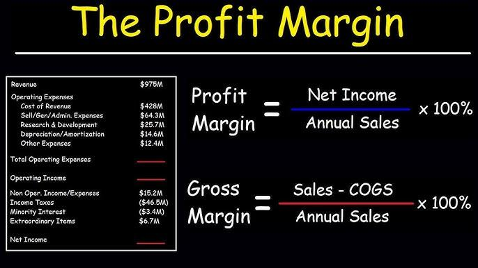

Financial metrics are indispensable tools for evaluating business performance, offering insights into a company’s economic health and guiding strategic decision-making. In the realm of algorithmic trading, these metrics provide a foundation for developing and optimizing trading strategies that generate consistent returns. Understanding how fundamental financial metrics like gross profit and gross margin impact algo trading performance can significantly enhance the effectiveness of these automated systems.

Gross profit, the revenue remaining after subtracting the cost of goods sold (COGS), serves as a critical indicator of a company's operational efficiency. It is calculated using the formula:



$$
\text{Gross Profit} = \text{Revenue} - \text{COGS}
$$

Gross margin, on the other hand, expresses gross profit as a percentage of total revenue, calculated as:

$$
\text{Gross Margin} = \left( \frac{\text{Gross Profit}}{\text{Revenue}} \right) \times 100
$$

These metrics not only reveal the profitability of a company but also highlight how efficiently it manages production costs relative to its sales. In the context of algorithmic trading, integrating these financial metrics into trading models can provide insights into cost efficiency, influence stock selection, and refine trading algorithms by aligning trade strategies with financial health indicators.

The rise of algorithmic trading in modern financial markets is transforming the landscape of investment. Characterized by rapid execution, the ability to process vast amounts of data, and the elimination of human error, algorithmic strategies are increasingly dominant. According to a report by Allied Market Research, the global algorithmic trading market was valued at $10.3 billion in 2018 and is projected to reach $18.8 billion by 2026, demonstrating its growing relevance.

As technology advances, the integration of financial metrics with algorithmic models becomes more sophisticated, enabling traders to navigate market complexities with greater precision. This integration not only enhances risk management but also aligns trading strategies with profitability goals, making it a crucial consideration for both traders and investors aiming to maximize returns in an increasingly competitive environment.

## Table of Contents

## Understanding Gross Profit

Gross profit is a fundamental financial metric, crucial for evaluating a company's operational efficiency. It is defined as the revenue remaining after deducting the cost of goods sold (COGS) from total sales. The formula for calculating gross profit is as follows:

$$
\text{Gross Profit} = \text{Revenue} - \text{COGS}
$$

This metric provides insight into how efficiently a company is producing and selling its goods. By analyzing gross profit, businesses can assess whether their production and cost management strategies are effective and sustainable in generating profits.

The significance of gross profit lies in its ability to act as an indicator of a company's core operational performance. A higher gross profit suggests efficient control over production costs relative to sales, whereas a low gross profit could indicate rising costs or a drop in sales efficiency. This makes gross profit a valuable measure for stakeholders who are interested in understanding the basic financial health and operational robustness of a company.

Direct costs that are included in COGS significantly impact gross profit. These costs typically encompass all expenses directly tied to the production of goods. Examples of direct costs include:

1. **Raw Materials**: The cost of raw materials is a primary component of COGS, directly affecting gross profit. Efficient procurement and use of materials can enhance gross profit margins.

2. **Labor Costs**: Wages paid to workers directly involved in the production process are included in COGS. Companies that automate processes or improve labor efficiency can potentially increase their gross profit.

3. **Manufacturing Overhead**: This includes expenses associated with operating manufacturing facilities such as utilities, maintenance costs, and factory supplies. Managing these overheads effectively can optimize gross profit.

4. **Shipping and Handling**: For manufacturers, the cost of shipping raw materials to the production site and handling the final product also falls under COGS. Streamlined logistics processes can contribute to a higher gross profit.

By carefully managing these direct costs, companies can improve their gross profit, which in turn provides a clearer picture of their ability to generate profit from primary operations, independent of ancillary cost or revenue streams. Understanding and optimizing gross profit is essential for businesses aiming to enhance operational efficiency and compete successfully in their markets.

## The Concept of Gross Margin

Gross margin is a financial metric expressed as a percentage that indicates the portion of each revenue dollar retained as gross profit after accounting for the cost of goods sold (COGS). The gross margin provides crucial insights into a company's profitability, reflecting its ability to manage production costs and efficiently convert sales into profit. 

### Formula for Calculating Gross Margin

The gross margin can be calculated using the following formula:

$$

\text{Gross Margin (\%)} = \left( \frac{\text{Revenue} - \text{COGS}}{\text{Revenue}} \right) \times 100 
$$

This formula highlights the relationship between revenue and the costs directly associated with the production of goods or services. Revenue represents total net sales, while COGS includes expenses directly tied to production, such as raw materials and labor. 

Python code can be used to automate the computation of gross margin. Here is a simple example:

```python
def calculate_gross_margin(revenue, cogs):
    gross_margin = ((revenue - cogs) / revenue) * 100
    return gross_margin

# Example usage
revenue = 100000
cogs = 70000
gross_margin = calculate_gross_margin(revenue, cogs)
print(f"Gross Margin: {gross_margin:.2f}%")
```

### Importance of Gross Margin

Gross margin is a critical indicator of financial health, efficiency, and competitiveness. A high gross margin signifies effective cost control compared to revenue generation, which enables a company to allocate funds towards non-production expenses like marketing, administrative expenses, and R&D. Conversely, a low gross margin might signal challenges in cost management or weak pricing strategies, necessitating a reevaluation of business practices or market positioning.

### Variability Across Industries

Gross margin percentages vary significantly across industries due to differences in production processes, cost structures, and pricing power. For example, industries with low fixed production costs and high scalability, such as software, typically enjoy higher gross margins. In contrast, sectors like manufacturing or retail, which involve substantial material and labor expenses, often exhibit lower gross margins. 

Understanding the typical gross margin range for a particular industry helps businesses set realistic financial goals and benchmarks against which performance can be gauged. Firms are better positioned to adapt strategically within their markets when they assess their gross margins in the context of industry norms.

In conclusion, gross margin is a pivotal metric for measuring a company's profitability and operational efficiency. By analyzing gross margin, businesses can make informed decisions to enhance profitability and foster long-term growth.

## The Role of Gross Profit and Gross Margin in Algo Trading

Understanding gross profit and gross margin is crucial for optimizing [algorithmic trading](/wiki/algorithmic-trading) strategies. These financial metrics provide insights into a company's core financial health, which can be leveraged to enhance algorithmic models by assessing cost efficiency and potential returns.

Gross profit is the revenue remaining after subtracting the cost of goods sold (COGS). It acts as a direct indicator of a company's operational efficiency and pricing strategies. By incorporating gross profit into algorithmic trading models, traders can evaluate companies' ability to manage production costs and generate profit from their core operations. This insight helps in selecting stocks with strong fundamentals, thus aligning trading strategies with profitability potential. 

Gross margin, expressed as a percentage, reflects the portion of revenue retained as gross profit. It allows traders to compare profitability across different companies and industries. The formula to calculate gross margin is:

$$
\text{Gross Margin} = \left( \frac{\text{Gross Profit}}{\text{Revenue}} \right) \times 100
$$

Algorithmic trading models can integrate these metrics by evaluating how different levels of gross profit and margin influence stock prices and their growth potential. For example, a firm with a consistently high gross margin might invest more in innovation or marketing, indicating robust long-term growth prospects. By simulating various scenarios and adjusting algorithm parameters based on estimated gross profit and margin data, traders can optimize strategy performance to enhance returns while controlling for costs.

Moreover, analyzing these metrics ensures alignment with profitability goals, such as targeting companies with improving operational efficiencies or resilient margins even under varying economic conditions. The application of gross profit and margin serves not only in stock selection but also in timing trades to capitalize on industry cycles or economic shifts that impact these financial metrics.

In the context of algorithmic trading, where precision and data-driven decisions are vital, integrating gross profit and margin provides a comprehensive approach to evaluating potential trades. These metrics offer a nuanced perspective, allowing traders to align their strategies with broader financial objectives, thereby optimizing overall trading performance.

## Key Metrics for Algo Trading Performance Evaluation

Algorithmic trading involves the systematic organizing, trading, and executing of trades using computer programs and algorithms. Analyzing and enhancing trading strategies in this domain requires a deep understanding of various performance metrics. These metrics include the Sharpe Ratio, Maximum Drawdown, Win Rate, Profit Factor, and Average Trade. Each of these plays a vital role in the evaluation and optimization of trading strategies, complementing traditional financial metrics like gross profit and gross margin.

The **Sharpe Ratio** is a measure of risk-adjusted return, indicating the average return earned in excess of the risk-free rate per unit of [volatility](/wiki/volatility-trading-strategies) or total risk. It is calculated as:

$$
\text{Sharpe Ratio} = \frac{R_p - R_f}{\sigma_p}
$$

where $R_p$ is the average return of the portfolio, $R_f$ is the risk-free rate, and $\sigma_p$ is the standard deviation of the portfolio's excess return. A higher Sharpe Ratio indicates a more favorable risk-adjusted return, and it is instrumental for traders seeking to optimize their portfolio's risk-return balance.

**Maximum Drawdown** represents the largest peak-to-trough decline in an investment portfolio. It is crucial for understanding the worst-case scenario's potential impact on a trading strategy. Knowing the Maximum Drawdown helps traders understand their strategy's risk profile and resilience during unfavorable market conditions.

The **Win Rate** is the ratio of successful trades to total trades, usually expressed as a percentage. This metric helps traders assess the frequency of success in their trading strategies. While a high win rate may appear attractive, it does not provide the complete picture. It is essential to consider the impact of losing trades on overall returns, hence its complementary role to metrics like profit [factor](/wiki/factor-investing).

The **Profit Factor** is defined as the ratio of gross profits to gross losses. A profit factor greater than one indicates that a strategy is generating more profits than losses. It is useful for gauging the overall effectiveness of a trading strategy, taking into account both successful and unsuccessful trades.

**Average Trade** evaluates the average profit or loss per trade over a specific period. This metric provides insights into the expected return for each executed trade and is an essential component of evaluating trading performance relative to transactional costs and other associated expenses.

By incorporating these metrics alongside traditional financial metrics such as gross profit and gross margin, traders can adopt a comprehensive approach to strategy evaluation. Traditional financial metrics help in assessing business profitability and operational efficiency, providing context and baseline data that can inform algorithmic models. When combined with algorithmic performance metrics, traders can achieve better alignment with profitability goals and make more informed decisions. For example, understanding the average trade size in relation to gross margin can help traders set realistic targets and optimize trade execution to minimize costs.

## Integrating Financial Metrics for Improved Trading Performance

Integrating financial metrics with algorithmic trading performance metrics involves a methodical approach, leveraging advanced analytical tools and methodologies to enhance decision-making processes. Understanding how traditional financial indicators, such as gross profit and gross margin, interact with algorithmic trading metrics is crucial for optimizing strategy performance and achieving superior trading outcomes.

One effective strategy is to employ data analytics platforms that allow for the simultaneous analysis of financial and trading metrics. By utilizing tools such as Python, traders can write scripts that extract and process data from multiple sources. For instance, Python libraries like Pandas and NumPy facilitate the handling of large data sets, enabling traders to calculate gross profit and margin alongside trading performance metrics such as the Sharpe Ratio and Maximum Drawdown. Here's a simple Python example calculating gross margin for trades:

```python
import pandas as pd

# Sample DataFrame for trades
trades = pd.DataFrame({
    'revenue': [10000, 12000, 15000],
    'cogs': [7000, 8000, 9000]
})

# Calculating Gross Profit
trades['gross_profit'] = trades['revenue'] - trades['cogs']

# Calculating Gross Margin
trades['gross_margin'] = trades['gross_profit'] / trades['revenue']

print(trades)
```

Integrating these calculations with trading metrics can be done through data visualization tools such as Matplotlib and Seaborn, which provide graphical interpretations of how gross profit impacts trading profitability.

Case studies highlight the successful application of such integrative approaches. For example, a trading firm that incorporated financial metrics into its algorithmic strategy found a significant improvement in identifying profitable trading opportunities by aligning financial health indicators with market signals. The firm used [machine learning](/wiki/machine-learning) models to analyze historical data, determining patterns where gross margin fluctuations coincided with market trends, thus refining their entry and [exit](/wiki/exit-strategy) strategies.

Practical steps to effectively merge these metrics in trading evaluations begin with establishing a robust data infrastructure capable of handling diverse data types. Utilizing cloud-based solutions for data storage and processing can streamline this integration, ensuring that metrics are consistently updated and accessible. Additionally, deploying APIs to connect trading platforms with financial databases allows for real-time analysis and adjustment of trading strategies based on the latest financial insights.

Advanced algorithmic models, such as reinforced learning algorithms, further support this integration by learning from continuous inputs of both financial and trading performance data, adjusting strategies dynamically to enhance returns while mitigating risks associated with market volatility and fluctuating gross margins.

In conclusion, integrating financial metrics with algorithmic trading performance metrics involves the strategic use of data analytics, advanced modeling techniques, and real-time processing tools to develop comprehensive trading strategies. This holistic approach improves decision-making and optimizes trading results, reinforcing the importance of leveraging combined metrics for enhanced trading performance.

## Challenges and Considerations

Algorithmic trading is subject to several challenges that can significantly impact the evaluation of financial metrics such as gross profit and gross margin. Understanding these challenges is crucial for developing robust trading strategies.

### Overfitting

Overfitting occurs when a trading algorithm performs exceptionally well on historical data but fails to generalize to new, unseen data. This can result in misleading interpretations of gross profit and gross margin. An overfitted model might show high profitability in backtests but perform poorly in live trading. To mitigate overfitting, it's essential to use techniques such as cross-validation, where the data is split into training and testing sets to ensure the model's performance is consistent across different datasets. Additionally, implementing regularization methods like L1 or L2 can help prevent excessively complex models.

#### Python Example for Cross-Validation:

```python
from sklearn.model_selection import cross_val_score
from sklearn.linear_model import Ridge

# Example data
X = [[0, 0], [1, 1], [2, 2]]
y = [0, 1, 2]

model = Ridge(alpha=1.0)
scores = cross_val_score(model, X, y, cv=3)
print(f"Cross-validation scores: {scores}")
```

### Transaction Costs

Transaction costs, including brokerage fees, slippage, and taxes, can significantly erode gross profit margins. These costs must be considered when developing and executing trading strategies. A trading strategy that appears profitable on a gross basis might actually be unprofitable after accounting for transaction costs. To better evaluate strategies, incorporate transaction cost modeling into the algorithm by adjusting trade signals to reflect real-world costs.

#### Formula for Adjusted Gross Profit:

$$
\text{Adjusted Gross Profit} = \text{Gross Profit} - \text{Transaction Costs}
$$

### Market Volatility

Market volatility can lead to unpredictable price movements, affecting both the gross profit and gross margin. High volatility might result in drastic price swings that can disrupt trading algorithms, leading to losses. To account for volatility, adapt trading strategies by incorporating volatility measures such as the Average True Range (ATR) or the Volatility Index (VIX). These measures help determine optimal entry and exit points, adjusting positions according to market conditions.

### Best Practices to Mitigate Challenges

1. **Risk Management**: Implement stop-loss and take-profit levels to control potential losses and lock in gains. Risk management ensures that excessive market swings do not disproportionately impact gross profit and margin.

2. **Diversification**: Spread investments across different asset classes, sectors, or geographies to minimize risk exposure. Diversification can help stabilize gross margins by reducing dependency on the performance of a single asset.

3. **Algorithm Updates**: Regularly update trading models to reflect current market dynamics. This includes re-evaluating the assumptions behind gross profit projections and adjusting strategies accordingly.

By addressing these challenges, traders can improve the reliability of gross profit and gross margin interpretations in algorithmic trading, leading to more effective decision-making and operational performance.

## The Future of Algorithmic Trading with Financial Metrics

As technology advances, the integration of financial metrics, such as gross profit and gross margin, into algorithmic trading is poised for significant transformation. The role of these metrics is expected to expand, driven by enhanced computational capabilities, improved data analytics, and the proliferation of machine learning techniques. 

Future developments in algorithmic trading are likely to see financial metrics being seamlessly integrated with algorithmic models to provide a more holistic evaluation of trading strategies. This integration involves combining real-time financial data with trading performance metrics to enhance decision-making capabilities. As a potential trend, algorithms could dynamically adjust trading strategies based on fluctuations in gross profit or margin, offering real-time adaptability to market changes and improving the resilience of trading systems.

With the ongoing evolution of [artificial intelligence](/wiki/ai-artificial-intelligence) and machine learning, algorithmic systems can potentially learn and predict patterns in gross margins and profits, providing insights that were previously inaccessible. Machine learning models could assess historical data to uncover complex relationships between financial metrics and market indicators, thereby refining trading algorithms for better accuracy and profitability.

Continuous adaptation and learning are essential for effectively utilizing financial metrics in algorithmic trading. Traders and developers must remain vigilant about changes in market conditions and the emerging capabilities of technology. They should adopt a mindset of persistent learning and experimentation, applying cutting-edge statistical models and algorithms to keep pace with the dynamic financial landscape.

Moreover, advancements in cloud computing and data storage solutions facilitate the handling of large datasets efficiently. This capability allows traders to analyze historical and real-time data simultaneously, providing a comprehensive view that can inform trading strategies. As a result, trading systems can be more robust and optimized for both profitability and risk management.

In conclusion, as computational technologies continue to evolve, the future of algorithmic trading with financial metrics looks promising. Embracing continuous learning and integrating advanced technologies with traditional financial metrics will likely lead to more sophisticated and successful trading strategies. Traders who harness these advancements effectively will benefit from enhanced decision-making capabilities and improved trading outcomes.

## Conclusion

The examination of gross profit and gross margin reveals their pivotal roles in the framework of algorithmic trading. Gross profit, defined as the revenue remaining after deducting the cost of goods sold (COGS), is crucial in evaluating a company's operational efficiency. Gross margin, expressed as a percentage, illustrates how much of each dollar of revenue is retained as gross profit, providing a lens into profitability and cost-effectiveness. Together, these financial metrics offer significant insights into an entity's economic strength, which can be strategically aligned with algorithmic trading models to evaluate cost efficiency and optimize returns.

Integrating traditional financial metrics like gross profit and gross margin with algorithmic performance metrics enhances the evaluation and optimization of trading strategies. This alignment can facilitate more sophisticated assessments of trading strategies—allowing for a more comprehensive view that includes both cost efficiency and potential returns. By incorporating these metrics into algorithmic models, traders can better align their strategies with profitability goals, leading to more informed decision-making.

Traders are encouraged to leverage this dual approach of financial and algorithmic metrics to gain a competitive edge. By synthesizing these insights, investors can refine their strategies and navigate the complexities of market dynamics more effectively. This holistic approach presents a robust mechanism for enhancing overall trading performance and fostering more strategic financial decision-making.

## References & Further Reading

[1]: Bergstra, J., Bardenet, R., Bengio, Y., & Kégl, B. (2011). ["Algorithms for Hyper-Parameter Optimization."](https://dl.acm.org/doi/10.5555/2986459.2986743) Advances in Neural Information Processing Systems 24.

[2]: ["Advances in Financial Machine Learning"](https://github.com/FIONA-Youkyung/Financial_Engineering/blob/master/Advances_in_Financial_Machine_Learning_Marcos_Lopez_de_Prado.pdf) by Marcos Lopez de Prado

[3]: ["Evidence-Based Technical Analysis: Applying the Scientific Method and Statistical Inference to Trading Signals"](https://www.amazon.com/Evidence-Based-Technical-Analysis-Scientific-Statistical/dp/0470008741) by David Aronson

[4]: ["Machine Learning for Algorithmic Trading"](https://github.com/stefan-jansen/machine-learning-for-trading) by Stefan Jansen

[5]: ["Quantitative Trading: How to Build Your Own Algorithmic Trading Business"](https://www.amazon.com/Quantitative-Trading-Build-Algorithmic-Business/dp/1119800064) by Ernest P. Chan