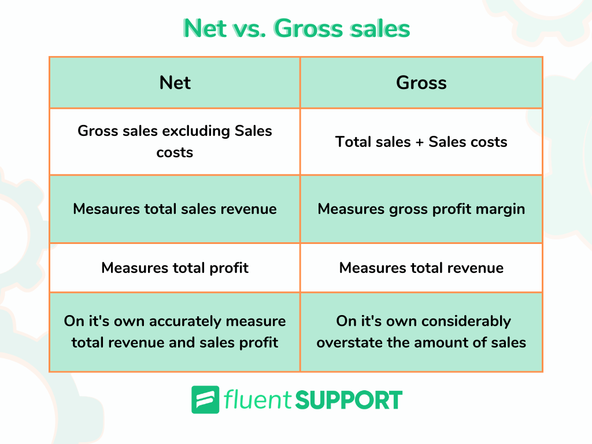

## Table of Contents

## What is the basic definition of gross sales?

Gross sales is the total amount of money a business makes from selling its products or services before any costs or expenses are taken out. It's like the starting point for figuring out how much money a business has earned. When a company sells something, it adds up all the money it gets from those sales to find its gross sales.

This number is important because it shows the total revenue before any deductions like discounts, returns, or costs of goods sold. Businesses use gross sales to understand their overall sales performance and to help plan for the future. It's a key figure that helps them see how well they are doing in terms of selling their products or services.

## What is the basic definition of taxable sales?

Taxable sales are the sales on which a business has to pay taxes. This includes the money made from selling products or services that the government says should be taxed. Not all sales are taxable. For example, some things like groceries or medicine might not have taxes on them, depending on where you live.

To figure out taxable sales, a business looks at its total sales and then takes away any sales that don't need to be taxed. What's left is the amount of money that the business needs to report to the government and pay taxes on. This helps the government know how much tax money they should get from the business.

## How are gross sales calculated?

Gross sales are calculated by adding up all the money a business makes from selling its products or services. This means you take the total amount of money from every sale, no matter if it's a big sale or a small one, and add it all together. If a business sells 100 items at $10 each, the gross sales would be $1,000.

This total does not take away any money for things like discounts, returns, or the cost of making the product. So, if some customers got a discount or returned something, you still count the full price they paid before the discount or return in the gross sales. It's like looking at the very top line of how much money came in before any other calculations are done.

## How are taxable sales calculated?

To calculate taxable sales, a business starts with its total gross sales. Then, it subtracts any sales that don't have to be taxed. These could be things like certain groceries, medicine, or other items that the government says don't need taxes. What's left after taking away these non-taxable sales is the amount of money that the business needs to pay taxes on.

This number is important because it tells the business how much money it needs to report to the government for tax purposes. Different places have different rules about what is taxable, so a business needs to know the rules where it is located. By figuring out the taxable sales correctly, a business makes sure it is following the law and paying the right amount of taxes.

## What types of transactions are included in gross sales?

Gross sales include all the money a business gets from selling its products or services. This means every single sale counts, no matter if it's a big sale or a small one. If a business sells something for $10, that $10 goes into the gross sales. It doesn't matter if the customer paid with cash, a credit card, or any other way. All the money from all the sales gets added up to find the gross sales.

This total also includes sales that might later be discounted or returned. For example, if a customer buys something for $50 but then returns it, the $50 still counts in the gross sales. The same goes for discounts. If a customer buys something for $20 but gets a $5 discount, the full $20 is still part of the gross sales. Gross sales is just about adding up all the money from all the sales before taking anything away.

## What types of transactions are included in taxable sales?

Taxable sales include the money a business gets from selling things that the government says need to be taxed. This means if a business sells a product or service that has a tax on it, the money from that sale is part of the taxable sales. For example, if a store sells a shirt that has a sales tax, the money from selling the shirt counts as taxable sales.

Not all sales are taxable though. Some things like certain groceries, medicine, or other items might not have to be taxed, depending on where the business is located. So, to find out the taxable sales, a business takes its total sales and subtracts any sales that don't need to be taxed. What's left is the amount of money that the business has to report to the government and pay taxes on.

## Can you provide an example of how gross sales and taxable sales might differ in a retail setting?

Imagine a small retail store that sells clothes, snacks, and medicine. Over the [course](/wiki/best-algorithmic-trading-courses) of a day, the store makes $1,000 from selling clothes, $200 from selling snacks, and $100 from selling medicine. The total amount of money the store made that day is $1,300. This $1,300 is the store's gross sales because it includes all the money from every sale, no matter what was sold.

However, not all of these sales are taxable. In this store's location, clothes and snacks are taxable, but medicine is not. So, to find the taxable sales, the store takes the gross sales of $1,300 and subtracts the $100 from medicine sales, which are not taxed. This leaves $1,200 as the taxable sales. The store will need to report this $1,200 to the government and pay taxes on it, while the $100 from medicine sales does not need to be taxed.

## What are the common exemptions that affect taxable sales?

Common exemptions that affect taxable sales are things that the government says don't need to be taxed. These can include certain groceries like fruits, vegetables, and basic food items. Medicine, both prescription and sometimes over-the-counter, can also be exempt from taxes. In some places, clothing and footwear might be exempt up to a certain price. Services provided by the government or non-profit organizations, like public transportation or charity events, might not be taxed either.

Another type of exemption is for sales to certain groups of people. For example, sales to other businesses for resale, or to organizations that are tax-exempt like schools and churches, might not be taxed. Some states also have special tax holidays where certain items are not taxed for a short period of time, like back-to-school supplies or energy-efficient appliances. Knowing these exemptions is important for businesses because it helps them figure out how much of their sales are taxable and how much they need to report to the government.

## How do state and local tax laws impact the difference between gross sales and taxable sales?

State and local tax laws decide which things need to be taxed and which don't. This makes a big difference between gross sales and taxable sales. Gross sales are all the money a business makes from selling things, no matter what. But taxable sales are only the money from selling things that the government says need to be taxed. So, if a state says that groceries don't need to be taxed, then the money from selling groceries won't be part of the taxable sales, even though it's part of the gross sales.

Different states and even different cities can have different rules about what is taxable. For example, one state might say that clothes are taxable, but another state might say they're not. This means that a store in one place might have a bigger difference between its gross sales and taxable sales than a store in another place. Businesses need to know these rules to figure out how much of their money they need to report to the government and pay taxes on.

## What are the implications of gross sales versus taxable sales for business financial reporting?

Gross sales and taxable sales are important numbers for a business when it comes to financial reporting. Gross sales show all the money a business makes from selling things, no matter what. This helps the business see how much money is coming in before any costs or taxes are taken out. It's like the starting point for understanding the business's total sales. When a business reports its gross sales, it gives a clear picture of its overall sales performance, which can help with planning and making decisions about the future.

Taxable sales, on the other hand, are the sales that the business has to pay taxes on. This number is smaller than gross sales because it doesn't include sales that are exempt from taxes, like certain groceries or medicine. Knowing the taxable sales is crucial for a business because it needs to report this number to the government and pay the right amount of taxes. If a business gets this wrong, it could end up paying too much or too little in taxes, which can lead to problems. So, understanding the difference between gross sales and taxable sales helps a business keep its financial reports accurate and stay in line with tax laws.

## How can businesses optimize their strategies based on the difference between gross sales and taxable sales?

Businesses can use the difference between gross sales and taxable sales to make smart decisions about what they sell and how they sell it. If a business knows that certain products or services don't have to be taxed, they might decide to sell more of those things. This can help lower the amount of money they have to pay in taxes. For example, if a store knows that groceries are not taxed in their area, they might choose to have a bigger grocery section to attract more customers and keep more of their money.

Also, understanding this difference can help a business plan better. They can look at their gross sales to see how well they are doing overall, and then look at their taxable sales to figure out how much they need to set aside for taxes. This helps them manage their money better. If they see that their taxable sales are high, they might look for ways to offer more tax-exempt items or find other ways to reduce their tax burden. By keeping an eye on both gross and taxable sales, a business can make choices that help them grow and save money.

## What advanced accounting practices should be considered when managing gross sales and taxable sales in multinational corporations?

Multinational corporations need to be careful about how they handle gross sales and taxable sales because they do business in many different countries. Each country has its own rules about what is taxable and what is not. So, a company has to keep track of these rules for each place it operates. This means they need a good system to manage their sales data and make sure they are reporting the right numbers to each country's government. They also need to think about how to move money between different parts of the company without causing tax problems. This can be tricky because what is allowed in one country might not be allowed in another.

To make things easier, multinational corporations often use special accounting software that can handle different tax laws and currencies. This software helps them keep everything organized and makes sure they are following the rules everywhere they do business. They also might hire experts who know a lot about international tax laws to help them. These experts can give advice on how to set up the company's finances to pay less in taxes while still following the law. By using these advanced practices, multinational corporations can manage their gross sales and taxable sales better and avoid any trouble with tax authorities.

## What is Understanding Gross Sales?

Gross sales represent the total revenue generated by a business from the sale of goods or services before any deductions are applied. It serves as a fundamental metric in business accounting, providing a raw indication of a company's sales performance over a specific period. For instance, if a retail store sells 1,000 units of a product at $50 each, the gross sales would amount to $50,000.

Understanding the distinction between gross sales and net sales is essential for accurate financial analysis. While gross sales capture the total revenue, net sales present a more refined view by accounting for various deductions. Net sales are calculated by subtracting returns, allowances, and discounts from gross sales. The formula can be expressed as:

$$
\text{Net Sales} = \text{Gross Sales} - (\text{Returns} + \text{Allowances} + \text{Discounts})
$$

Common expenses deducted from gross sales include:

1. **Returns:** These occur when customers return purchased items. In financial accounting, returns are deducted from gross sales to reflect the actual revenue.

2. **Allowances:** These are price reductions granted to customers, usually due to product defects or shipping errors. For example, if a customer receives a damaged item and is given a price reduction, this amount is deducted from gross sales.

3. **Discounts:** Discounts are reductions in the selling price granted to customers, either as a sales incentive or as part of promotional activities. Both trade discounts (offered on bulk purchases) and cash discounts (offered for prompt payment) diminish gross sales.

By understanding these elements, businesses can gain insights into their true revenue streams and assess the effectiveness of their sales strategies. Accurately calculating gross and net sales is critical for financial reporting, ensuring transparency and facilitating strategic decision-making.

## What are Taxable Sales and Sales Tax?

Taxable sales are a critical component of business accounting, representing the total sales revenue of goods and services that are subject to sales tax within a given jurisdiction. Unlike gross sales, which encompass the total sales revenue without deductions, taxable sales exclude any exempt sales or non-taxable items, such as certain services or goods that fall under state-specific exemptions. Understanding the distinction between these two figures is crucial for accurate financial reporting and compliance.

Gross sales provide a broad view of the business's performance before considering factors that affect the tax liability. In contrast, taxable sales narrow down the revenue to transactions that are subjected to state or local sales taxes. This differentiation is essential for accurate sales tax calculation, ensuring that businesses only remit taxes on applicable sales. 

Sales tax, typically a percentage of the taxable sales, is imposed by government entities on the sale of goods and services. It directly affects a business's pricing strategy and can influence consumer behavior. The sales tax collected from customers must be remitted to the appropriate tax authorities within specified deadlines, making accurate calculation and timely reporting imperative for businesses to avoid penalties.

To calculate sales tax accurately, businesses first need to determine their taxable sales by subtracting non-taxable sales from Gross Sales:

$$
\text{Taxable Sales} = \text{Gross Sales} - \text{Non-taxable Sales}
$$

The sales tax is then calculated by applying the sales tax rate to the taxable sales:

$$
\text{Sales Tax} = \text{Taxable Sales} \times \text{Sales Tax Rate}
$$

For automated and precise computations, businesses can employ software tools or write code scripts. Below is an example of a Python function that calculates sales tax:

```python
def calculate_sales_tax(gross_sales, non_taxable_sales, tax_rate):
    taxable_sales = gross_sales - non_taxable_sales
    sales_tax = taxable_sales * tax_rate
    return sales_tax

# Example usage
gross_sales = 10000
non_taxable_sales = 2000
tax_rate = 0.07  # 7% sales tax rate

sales_tax = calculate_sales_tax(gross_sales, non_taxable_sales, tax_rate)
print("Sales Tax:", sales_tax)
```

Accurate reporting of sales tax involves recording all taxable sales and corresponding tax amounts in a structured format, which can vary depending on the jurisdiction's requirements. This helps ensure that businesses adhere to legal obligations by accurately collecting and remitting taxes.

Overall, understanding and distinguishing taxable sales from gross sales are fundamental for businesses to manage their tax responsibilities efficiently, impacting both operational practices and strategic planning.

## References & Further Reading

[1]: ["Advances in Financial Machine Learning"](https://www.amazon.com/Advances-Financial-Machine-Learning-Marcos/dp/1119482089) by Marcos Lopez de Prado

[2]: ["Evidence-Based Technical Analysis: Applying the Scientific Method and Statistical Inference to Trading Signals"](https://www.amazon.com/Evidence-Based-Technical-Analysis-Scientific-Statistical/dp/0470008741) by David Aronson

[3]: ["Machine Learning for Algorithmic Trading"](https://github.com/stefan-jansen/machine-learning-for-trading) by Stefan Jansen

[4]: ["Quantitative Trading: How to Build Your Own Algorithmic Trading Business"](https://www.amazon.com/Quantitative-Trading-Build-Algorithmic-Business/dp/1119800064) by Ernest P. Chan

[5]: ["The Impact of Algorithmic Trading on the Market"](https://wjaets.com/sites/default/files/WJAETS-2024-0136.pdf) by Algorithmic Trading and Market Dynamics Research Paper

[6]: Internal Revenue Service (IRS). ["Sales and Use Tax: Exemptions and Exclusions."](https://www.irs.gov/credits-deductions/individuals/use-the-sales-tax-deduction-calculator)

[7]: Sec.gov. ["Report of the Advisory Committee on Improvements to Financial Reporting to the United States Securities and Exchange Commission"](https://www.sec.gov/about/offices/oca/acifr/acifr-finalreport.pdf) by Committee of Improvements to Financial Reporting