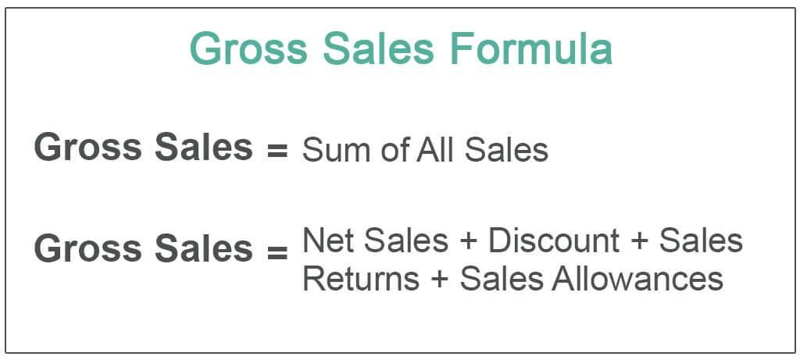

Understanding the concepts of taxable sales, sales tax, and gross sales is foundational for businesses aiming to achieve accurate financial reporting and compliance with tax regulations. Taxable sales refer to the portion of sales subject to sales tax, a levy imposed by a government on the sale of goods and services. This is distinct from gross sales, which represent the total unadjusted sales revenue a company generates before any deductions, such as returns, allowances, or discounts. Gross sales serve as a critical metric, reflecting a company's ability to generate revenue and providing a baseline for tracking business performance.

Algorithmic trading, characterized by the use of complex algorithms and high-speed data analysis to execute trades, has gained significant momentum in financial markets. Its increasing prominence introduces unique considerations for taxable transactions. Traders engaging in algorithmic trading must navigate the complexities of tax obligations arising from numerous and rapid trades executed in various financial instruments. Key considerations include the classification of short-term versus long-term capital gains, the tax treatment of realized and unrealized gains, and the strategic use of tax-efficient trading practices.



This article examines how businesses can effectively manage tax liabilities in the context of sales-related financial metrics and algorithmic trading. By understanding the intersection of these financial activities, companies and traders can implement effective strategies to optimize tax outcomes while maintaining compliance. Through exploring strategies such as tax-loss harvesting, adhering to wash sale rules, and leveraging tax-advantaged accounts, traders can enhance post-tax profitability. This article aims to provide insights into managing these complex financial interactions and underscores the importance of professional guidance in navigating the labyrinth of tax laws.

## Table of Contents

## Understanding Gross Sales

Gross sales represent the total revenue generated by a business from the sale of goods or services before any deductions are applied. It serves as a fundamental metric in business accounting, providing a raw indication of a company's sales performance over a specific period. For instance, if a retail store sells 1,000 units of a product at $50 each, the gross sales would amount to $50,000.

Understanding the distinction between gross sales and net sales is essential for accurate financial analysis. While gross sales capture the total revenue, net sales present a more refined view by accounting for various deductions. Net sales are calculated by subtracting returns, allowances, and discounts from gross sales. The formula can be expressed as:

$$
\text{Net Sales} = \text{Gross Sales} - (\text{Returns} + \text{Allowances} + \text{Discounts})
$$

Common expenses deducted from gross sales include:

1. **Returns:** These occur when customers return purchased items. In financial accounting, returns are deducted from gross sales to reflect the actual revenue.

2. **Allowances:** These are price reductions granted to customers, usually due to product defects or shipping errors. For example, if a customer receives a damaged item and is given a price reduction, this amount is deducted from gross sales.

3. **Discounts:** Discounts are reductions in the selling price granted to customers, either as a sales incentive or as part of promotional activities. Both trade discounts (offered on bulk purchases) and cash discounts (offered for prompt payment) diminish gross sales.

By understanding these elements, businesses can gain insights into their true revenue streams and assess the effectiveness of their sales strategies. Accurately calculating gross and net sales is critical for financial reporting, ensuring transparency and facilitating strategic decision-making.

## Taxable Sales and Sales Tax

Taxable sales are a critical component of business accounting, representing the total sales revenue of goods and services that are subject to sales tax within a given jurisdiction. Unlike gross sales, which encompass the total sales revenue without deductions, taxable sales exclude any exempt sales or non-taxable items, such as certain services or goods that fall under state-specific exemptions. Understanding the distinction between these two figures is crucial for accurate financial reporting and compliance.

Gross sales provide a broad view of the business's performance before considering factors that affect the tax liability. In contrast, taxable sales narrow down the revenue to transactions that are subjected to state or local sales taxes. This differentiation is essential for accurate sales tax calculation, ensuring that businesses only remit taxes on applicable sales. 

Sales tax, typically a percentage of the taxable sales, is imposed by government entities on the sale of goods and services. It directly affects a business's pricing strategy and can influence consumer behavior. The sales tax collected from customers must be remitted to the appropriate tax authorities within specified deadlines, making accurate calculation and timely reporting imperative for businesses to avoid penalties.

To calculate sales tax accurately, businesses first need to determine their taxable sales by subtracting non-taxable sales from Gross Sales:

$$
\text{Taxable Sales} = \text{Gross Sales} - \text{Non-taxable Sales}
$$

The sales tax is then calculated by applying the sales tax rate to the taxable sales:

$$
\text{Sales Tax} = \text{Taxable Sales} \times \text{Sales Tax Rate}
$$

For automated and precise computations, businesses can employ software tools or write code scripts. Below is an example of a Python function that calculates sales tax:

```python
def calculate_sales_tax(gross_sales, non_taxable_sales, tax_rate):
    taxable_sales = gross_sales - non_taxable_sales
    sales_tax = taxable_sales * tax_rate
    return sales_tax

# Example usage
gross_sales = 10000
non_taxable_sales = 2000
tax_rate = 0.07  # 7% sales tax rate

sales_tax = calculate_sales_tax(gross_sales, non_taxable_sales, tax_rate)
print("Sales Tax:", sales_tax)
```

Accurate reporting of sales tax involves recording all taxable sales and corresponding tax amounts in a structured format, which can vary depending on the jurisdiction's requirements. This helps ensure that businesses adhere to legal obligations by accurately collecting and remitting taxes.

Overall, understanding and distinguishing taxable sales from gross sales are fundamental for businesses to manage their tax responsibilities efficiently, impacting both operational practices and strategic planning.

## Algorithmic Trading and Taxes

Algorithmic trading, often referred to as algo trading, leverages computer algorithms to execute trades at speeds and frequencies that are beyond human capability. These sophisticated systems rely on pre-defined criteria to make trading decisions, offering efficiency and precision. However, the tax implications of such rapid trading activities are complex and require careful consideration.

### Short-term vs Long-term Capital Gains

Capital gains from [algorithmic trading](/wiki/algorithmic-trading) are classified based on the holding period of the securities involved. In the United States, assets held for more than a year before being sold are subject to long-term capital gains tax, which typically has lower tax rates. In contrast, assets held for a year or less are taxed as short-term capital gains, at ordinary income tax rates. Given the nature of algorithmic trading, which often involves frequent buying and selling, many transactions result in short-term capital gains. This has significant tax implications, potentially leading to a higher tax liability compared to a strategy favoring long-term holdings.

### Realized vs Unrealized Gains

In algorithmic trading, the distinction between realized and unrealized gains is crucial. Realized gains occur when an asset is sold or exchanged and must be reported for taxation in the year the transaction occurs. Conversely, unrealized gains represent the increase in value of an unsold asset. These are not subject to taxation until the gain is realized. Algorithmic traders need to be aware that consistent rebalancing and short-term selling will lead to frequent realized gains, each of which will potentially increase their tax burden.

To better manage these tax implications, algorithmic traders can utilize strategies such as tax-loss harvesting. This involves selling securities at a loss to offset gains, thereby reducing taxable income. Understanding IRS regulations, such as the wash sale rule, is essential in employing these strategies without unforeseen tax consequences. The wash sale rule prevents traders from claiming a loss on a security sold in a wash sale, or repurchase of the same security within 30 days. Thus, a keen awareness of these rules, combined with tax-efficient strategies, can minimize tax-related liabilities arising from algorithmic trading practices.

Algorithmic trading presents unique challenges and opportunities in terms of taxation. Adopting informed strategies can significantly alter a trader's tax position, impacting overall profitability.

## Strategies for Tax Efficiency in Trading

### Strategies for Tax Efficiency in Trading

Tax efficiency in trading is crucial for maximizing net returns, particularly in algorithmic trading where transactions are frequent. Key strategies such as tax-loss harvesting, understanding the wash sale rule, and utilizing tax-advantaged accounts can significantly impact a trader's after-tax profits.

#### Utilizing Tax-Loss Harvesting to Offset Gains

Tax-loss harvesting is a technique where traders sell securities at a loss to offset taxable gains from other investments. This strategy can be instrumental in reducing one's overall tax burden, allowing investors to use realized losses to offset up to $3,000 of other income annually (for individual filers). Additionally, any excess loss beyond this limit can be carried forward to offset gains in future years. 

For instance, consider a trader who made a $10,000 gain from selling stock A but incurred a $4,000 loss from stock B. Tax-loss harvesting allows the trader to subtract the $4,000 loss from the $10,000 gain, thus reducing the taxable gain to $6,000. This method can be part of an effective year-end strategy to manage capital gains liabilities.

#### Understanding the Wash Sale Rule

The wash sale rule is a regulation from the Internal Revenue Service (IRS) that prevents traders from claiming a tax deduction for a security sold at a loss and repurchased within 30 days before or after the sale. This rule is designed to discourage the superficial manipulation of taxable gains and losses.

For example, if a trader sells a stock at a loss on December 15th and repurchases the same stock on January 5th, the wash sale rule disallows using the loss to offset any gains. Instead, the disallowed loss is added to the basis of the repurchased stock, potentially deferring tax benefits to a later date. Traders should align their trading activities to avoid unintentional wash sales, thereby optimizing tax outcomes.

#### Considering Tax-Advantaged Accounts for Trading Activities

Utilizing tax-advantaged accounts like Roth IRAs, traditional IRAs, and 401(k) plans can offer substantial tax benefits for traders. These accounts provide mechanisms to defer taxes on earnings or enjoy tax-free growth, depending on the account type.

For example, in a Roth IRA, contributions are made with after-tax dollars, but qualified withdrawals, including earnings, are tax-free. Conversely, traditional IRAs and 401(k) plans allow for pre-tax contributions, deferring taxes until withdrawal during retirement. Traders focusing on long-term growth may benefit from the tax shelter these accounts provide, thus making tax-efficient investment strategies.

Integrating these strategies into trading activities ensures that traders manage their tax liabilities effectively. By leveraging tax-loss harvesting, understanding the wash sale rule, and utilizing tax-advantaged accounts, traders can optimize their tax outcomes and enhance net returns. For more details on these topics, professional advice from a tax advisor can be greatly beneficial.

## Reporting and Compliance

Schedule K-1 is a crucial document for income reporting within partnerships and trusts. It is an integral part of form 1065 for partnerships and form 1041 for estates and trusts in the United States. Schedule K-1 provides detailed information about each partner's or beneficiary's share of the entity's income, deductions, and credits. This document is essential for ensuring accurate reporting of individual tax obligations resulting from one's involvement in a partnership or trust. Accurate K-1 reporting helps avoid discrepancies between the entity's tax filings and the personal tax returns of partners or beneficiaries.

When managing tax filings, businesses and individuals often face the choice between outsourced tax filing and do-it-yourself (DIY) approaches. The complexity of one's financial activities, including transactions and investments, significantly influences this decision. For entities and individuals with straightforward financial scenarios, DIY filing might be a cost-effective option. There are numerous software solutions available providing guidance and electronic filing capabilities, simplifying the DIY process. However, for those with more intricate financial activities, such as businesses involved in partnerships, trading, or with international transactions, outsourcing to professional tax preparers might be advisable.

Consulting tax professionals is crucial for navigating the complexities of tax laws. Tax professionals possess up-to-date knowledge of tax regulations, which can be intricate and subject to frequent changes. They can help businesses and individuals identify potential deductions or credits, comply with federal and state tax obligations, and strategize for tax efficiency. Furthermore, tax professionals are adept at handling audits and resolving tax disputes, providing peace of mind and potentially saving significant time and resources. As tax laws become ever more complex, particularly with considerations like algorithmic trading gains and multiple income sources, professional advice is invaluable in ensuring compliance and optimizing tax outcomes.

## Conclusion

Effective tax management is essential for maximizing post-tax profits in both business operations and trading ventures. Proper attention to tax obligations ensures that businesses and traders can retain more of their earnings, leading to increased capital for reinvestment and growth.

In the context of algorithmic trading, integrating tax efficiency is particularly crucial. Traders can achieve this by applying strategies such as tax-loss harvesting to offset gains and understanding the implications of the wash sale rule. Additionally, employing tax-advantaged accounts can enhance [liquidity](/wiki/liquidity-risk-premium) and provide further tax benefits.

Maintaining compliance with complex tax regulations necessitates a strategic approach. Businesses and traders must remain informed about changing tax laws and consider tailored strategies that align with their specific circumstances. Consulting tax professionals can provide the expertise needed to navigate these complexities effectively. These professionals offer insights into optimizing tax positions and ensuring adherence to regulation, ultimately securing the financial health of the business or trading portfolio.

In summary, integrating tax-efficient practices and seeking professional guidance are pivotal steps toward achieving optimal financial outcomes and sustainable growth in both traditional business settings and algorithmic trading.

## References & Further Reading

[1]: ["Advances in Financial Machine Learning"](https://www.amazon.com/Advances-Financial-Machine-Learning-Marcos/dp/1119482089) by Marcos Lopez de Prado

[2]: ["Evidence-Based Technical Analysis: Applying the Scientific Method and Statistical Inference to Trading Signals"](https://www.amazon.com/Evidence-Based-Technical-Analysis-Scientific-Statistical/dp/0470008741) by David Aronson

[3]: ["Machine Learning for Algorithmic Trading"](https://github.com/stefan-jansen/machine-learning-for-trading) by Stefan Jansen

[4]: ["Quantitative Trading: How to Build Your Own Algorithmic Trading Business"](https://www.amazon.com/Quantitative-Trading-Build-Algorithmic-Business/dp/1119800064) by Ernest P. Chan

[5]: ["The Impact of Algorithmic Trading on the Market"](https://wjaets.com/sites/default/files/WJAETS-2024-0136.pdf) by Algorithmic Trading and Market Dynamics Research Paper

[6]: Internal Revenue Service (IRS). ["Sales and Use Tax: Exemptions and Exclusions."](https://www.irs.gov/credits-deductions/individuals/use-the-sales-tax-deduction-calculator)

[7]: Sec.gov. ["Report of the Advisory Committee on Improvements to Financial Reporting to the United States Securities and Exchange Commission"](https://www.sec.gov/about/offices/oca/acifr/acifr-finalreport.pdf) by Committee of Improvements to Financial Reporting