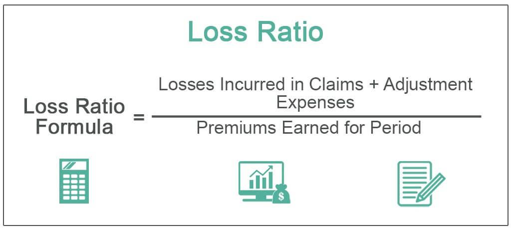

In today's competitive insurance market, understanding key financial metrics is crucial for both insurers and investors. As the industry evolves, two metrics stand out as particularly vital: the loss ratio and the combined ratio. These metrics not only offer insights into an insurer's financial health but also play a pivotal role in shaping strategic decisions. The pressure to remain profitable and efficient underscores the importance of these metrics in assessing the performance of underwriting and claims processes.

Beyond evaluating profitability, the interplay between traditional insurance metrics and modern algorithmic trading mechanisms holds significant potential in revolutionizing decision-making processes. Algorithmic trading, characterized by the use of complex algorithms to automate trading decisions, is gaining momentum in the insurance sector. By integrating with traditional metrics, it brings enhanced analytical capabilities and the promise of improved operational efficiency.

Understanding both insurance metrics and algorithmic trading can guide strategic planning and improve profitability. This article will explore how these elements intersect to influence decision-making, ensuring insurers and investors alike can navigate the evolving landscape with informed strategies and competitive foresight.

## Table of Contents

## Understanding Insurance Metrics

To evaluate the financial health of an insurance company, certain metrics are indispensable. Among these, the loss ratio and combined ratio stand out as critical indicators of profitability. The loss ratio is a measure of the total incurred losses as a percentage of the collected insurance premiums. Mathematically, it is expressed as:

$$
\text{Loss Ratio} = \frac{\text{Incurred Losses}}{\text{Earned Premiums}} \times 100\%
$$

A lower loss ratio suggests a more profitable insurance company, as it indicates that a smaller proportion of premiums is being used to cover claims. Conversely, a loss ratio over 100% reveals unprofitability, signifying that the insurer is paying more in claims than it earns from premiums. 

Similarly, the combined ratio provides a comprehensive view of profitability by adding expenses to the loss ratio. It is outlined as:

$$
\text{Combined Ratio} = \left( \frac{\text{Incurred Losses} + \text{Expenses}}{\text{Earned Premiums}} \right) \times 100\%
$$

A combined ratio below 100% indicates underwriting profitability, signifying that the company is efficiently managing its underwriting and operating expenses relative to its earned premiums. These ratios are essential, as they offer insights into the efficiency of underwriting and claims processes, enabling insurers to monitor performance effectively and make informed strategic decisions.

Understanding these metrics also helps insurers anticipate market trends and adjust their strategies accordingly, ensuring they maintain competitiveness in a dynamic insurance market. By consistently evaluating these financial indicators, insurers can ensure sustainable growth and enhance operational efficiency.

## What is a Loss Ratio?

The loss ratio is a critical financial metric utilized by insurance companies to measure the proportion of losses they incur relative to the premiums they collect. This ratio is expressed as a percentage and primarily evaluates the effectiveness of an insurer's underwriting policies and claims management practices.

Mathematically, the loss ratio can be defined as:

$$
\text{Loss Ratio} = \left(\frac{\text{Incurred Losses}}{\text{Earned Premiums}}\right) \times 100\%
$$

Where:
- **Incurred Losses** refers to the total amount paid by the insurer for claims, including both settled claims and provisions for future claims.
- **Earned Premiums** are the total premiums an insurer has received for the policies they have issued, adjusted for the period the insurance coverage is in effect.

A low loss ratio indicates that a company is effectively managing its risk and keeping claim costs low relative to its revenue from premiums. This scenario is desirable as it signifies a higher profitability margin for the insurer, allowing for more funds to be allocated towards development, marketing, and other operational needs.

Conversely, a loss ratio exceeding 100% suggests that an insurance company is operating at a loss, spending more on claims than it collects in premiums. This situation can jeopardize the financial stability of the company if not rectified promptly, as it may signal inefficiencies in underwriting processes or inadequacies in pricing strategies.

Understanding the implications of the loss ratio is pivotal for insurance companies as it provides insights into their financial health and assists in strategic planning and operational adjustments. A well-managed loss ratio not only enhances profitability but also assures stakeholders of the company's capability to meet its financial commitments.

## Demystifying Combined Ratio

The combined ratio is a critical metric used in the insurance industry to evaluate an insurer's operational profitability. It is obtained by adding the loss ratio to the expense ratio. The formula for the combined ratio is:

$$
\text{Combined Ratio} = \text{Loss Ratio} + \text{Expense Ratio}
$$

This ratio is expressed as a percentage, and a value below 100% indicates that the insurer is operating at an underwriting profit. A combined ratio greater than 100% implies an underwriting loss, meaning the company is paying out more money in claims and operational expenses than it is receiving in premiums.

The loss ratio represents the proportion of claims paid out to policyholders relative to the premiums earned. The expense ratio, on the other hand, accounts for the insurer's costs associated with acquiring, underwriting, and servicing policies, such as commissions and administrative expenses.

Both components of the combined ratio provide a more detailed view of an insurer's financial performance. While the loss ratio focuses on claims alone, the inclusion of expenses through the combined ratio offers deeper insights into the company's cost management and overall efficiency.

Even when the combined ratio exceeds 100%, insurers can still maintain overall profitability through investment income. Insurance companies often invest premiums collected in various financial instruments. The returns on these investments can offset underwriting losses, highlighting the importance of effective investment strategies in complementing core insurance operations.

In summary, the combined ratio is a comprehensive measure that includes both claim expenses and operating costs, offering critical insights into an insurer's profitability and financial stability. Understanding this metric is essential for insurance professionals as it influences strategic decisions and indicates the need for adjustments in pricing, underwriting, or expense management.

## Algorithmic Trading in Insurance

Algorithmic trading, often referred to as algo-trading, is increasingly integral to the insurance sector as companies aim to harness technology to optimize their financial strategies. At its core, [algorithmic trading](/wiki/algorithmic-trading) employs complex algorithms to automate trading decisions, thereby significantly enhancing efficiency and execution speed. This method reduces human intervention, which not only minimizes errors but also capitalizes on market opportunities much faster than traditional manual processes. 

The use of algorithmic trading within insurance impacts key financial metrics such as the loss ratio and combined ratio. By automating many of the trading-related operations, insurers can achieve lower transaction costs and gain timely insights into market conditions. This timeliness allows insurers to make swift, informed adjustments to their underwriting practices and investment portfolios. For example, algorithms can rapidly analyze vast datasets to predict market trends, enabling insurers to hedge against potential risks effectively.

Moreover, the integration of algorithmic trading allows for more refined risk management and investment strategies. By processing real-time data, these algorithms enable insurers to dynamically adjust their positions in response to market fluctuations, thus potentially lowering the combined ratio. Essentially, algorithmic trading equips insurers with the tools to adapt to volatile market conditions, improving their ability to maintain profitability even when faced with fluctuating claims and premium incomes.

In the context of strategic alignment with market dynamics, algorithmic trading can provide a significant competitive advantage. Insurers incorporating these technologies can respond more agilely to market shifts, aligning their investment and risk strategies closer with real-time financial models and forecasts. Consequently, understanding the role of algorithmic trading is critical for insurers aiming to optimize their financial performance and stay competitive in the fast-evolving insurance landscape.

## Relation Between Metrics and Algorithmic Trading

The integration of algorithmic trading with traditional insurance metrics significantly enhances data analysis capabilities, enabling insurers to make more informed and timely decisions. This combination allows for the real-time monitoring of critical insurance metrics, such as loss and combined ratios, which can directly impact an insurer's financial performance and strategic direction.

Algorithmic trading leverages complex algorithms and high-frequency trading strategies to automate decision-making processes in financial markets. By applying these techniques to insurance metrics, insurers can streamline operations, reduce transaction costs, and improve the overall efficiency of their financial activities. This automation facilitates a quicker response to market fluctuations and internal performance indicators, potentially lowering the combined ratio—a key metric that considers both loss ratio and expense ratio. A lower combined ratio generally implies a more profitable insurance operation.

Aligning trading strategies with metric-driven insights allows for optimization of underwriting practices and enhancement of profitability. For instance, if the algorithms identify patterns that suggest a forthcoming increase in claims in a particular insurance segment, insurers can adjust their underwriting strategies proactively, such as revising premium rates or modifying risk selection criteria. This proactive approach aids in maintaining a favorable loss ratio and, consequently, a healthier financial standing.

Moreover, the continuous feedback loop provided by algorithmic trading systems can guide insurers in refining their strategies based on comprehensive data analysis. This capability is especially crucial in a competitive market, where maintaining an edge requires rapid adaptation and efficient resource management. By integrating algorithmic trading with traditional insurance metrics, insurers can set a dynamic foundation for achieving strategic goals and sustaining long-term growth in a constantly evolving industry landscape.

## Strategic Implications for Insurers

In the competitive landscape of insurance, maintaining a keen focus on critical metrics such as the loss ratio and combined ratio is essential for insurers striving to sustain a competitive advantage. These metrics serve as indicators of an insurer's financial health and operational efficiency. Regular evaluation helps identify performance gaps and areas for improvement, facilitating strategic decision-making to enhance operational efficiency and profitability.

Incorporating algorithmic trading into the strategic framework offers substantial benefits for insurers. This technology leverages computer algorithms to automate trading processes, providing strategic insights that can significantly enhance efficiency. By reducing human error and transaction costs, algorithmic trading ensures faster, more accurate decision-making. The integration of algorithmic trading allows insurers to respond swiftly to market dynamics, optimizing their trading strategies and aligning them with shifting insurance metrics.

Data-driven strategies supported by insurance metrics empower companies to anticipate market trends with greater precision. The extensive data analysis capabilities of algorithmic systems enable insurers to detect patterns and trends that might otherwise go unnoticed. By aligning their strategic initiatives with these insights, insurers can tailor their offerings to meet evolving customer needs and adapt their strategies to the demands of a dynamic market environment.

Integrating insurance metrics into strategic planning is fundamental for sustainable growth and improved operational efficiency. This integration ensures that decision-makers have real-time access to critical data, enabling them to make informed choices that drive the company forward. By utilizing advanced analytics and algorithmic trading, insurers can streamline their processes, optimize their expense management, and ultimately enhance profitability. The synthesis of these strategic tools not only bolsters current performance but also positions insurers for long-term success in an ever-evolving industry landscape.

## Conclusion

Insurance metrics, such as loss and combined ratios, play a critical role in evaluating the financial health of a company and shaping strategic decision-making processes. These metrics provide vital insights into the profitability and operational efficiency of insurance firms, assisting them in identifying areas requiring improvement and adjustment. The incorporation of algorithmic trading into the analysis of these metrics offers a transformative approach for insurers. By automating trading decisions and optimizing transaction speeds and costs, algorithmic trading delivers timely insights and enhances the analytical capabilities of insurers.

Leveraging the combination of these traditional metrics with advanced algorithmic tools, insurers can significantly boost their profitability, effectively manage risks, and maintain a competitive position in the market. The ability to analyze data in real-time and respond promptly to emerging trends and fluctuations is increasingly important in today's rapidly changing insurance landscape. Therefore, staying informed about technological advancements and being adaptable to new methodologies is critical to ensuring the continuous growth and sustainable efficiency of insurance companies.

## References & Further Reading

[1]: ["Guide to Understanding Insurance Metrics: Loss Ratios and Combined Ratios"](https://www.verisk.com/blog/insurance-fundamentals-interpret-combined-ratios-related-metrics/) by the Insurance Information Institute.

[2]: ["Quantitative Finance and Risk Management: A Physicist's Approach"](https://www.amazon.com/QUANTITATIVE-FINANCE-RISK-MANAGEMENT-PHYSICISTS/dp/9814571237) by Jan W. Dash

[3]: ["Algorithmic Trading and DMA: An introduction to direct access trading strategies"](https://www.amazon.com/Algorithmic-Trading-DMA-introduction-strategies/dp/0956399207) by Barry Johnson

[4]: ["Algorithmic and High-Frequency Trading"](https://www.cambridge.org/us/universitypress/subjects/mathematics/mathematical-finance/algorithmic-and-high-frequency-trading) by Álvaro Cartea, Sebastian Jaimungal, and José Penalva

[5]: ["Financial Trading and Investing"](https://www.investopedia.com/ask/answers/12/difference-investing-trading.asp) by John L. Teall