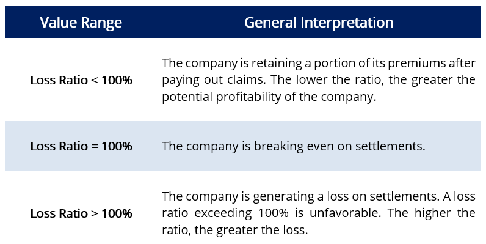

## Table of Contents

## What is a loss ratio?

A loss ratio is a simple way to see how much money an insurance company pays out in claims compared to how much money it gets from premiums. It's like a score that tells the company if they are making or losing money. If the loss ratio is high, it means the company is paying out a lot of money in claims, which might not be good for their business. If it's low, it means they are keeping more of the money they collect from premiums.

For example, if an insurance company collects $100 in premiums and pays out $60 in claims, the loss ratio would be 60%. This number helps the company decide if they need to change their prices or be more careful about who they insure. It's an important tool for insurance companies to stay healthy and make sure they can keep paying claims in the future.

## What is a combined ratio?

A combined ratio is another way insurance companies check their financial health. It's like a bigger score that includes the loss ratio but also adds in the costs of running the business, like paying employees and office expenses. If the combined ratio is more than 100%, it means the company is spending more money than it's making from premiums. If it's less than 100%, the company is doing well because it's making more money than it's spending.

For example, if an insurance company has a loss ratio of 60% and its expenses are 30% of the premiums it collects, the combined ratio would be 90%. This means the company is doing well because it's only spending 90 cents for every dollar it gets in premiums. The combined ratio helps insurance companies see if they are making enough money to cover all their costs and still have some left over.

## How is the loss ratio calculated?

The loss ratio is calculated by dividing the total amount of money an insurance company pays out in claims by the total amount of money it collects in premiums. This gives a percentage that shows how much of the premium money is used to pay claims. For example, if an insurance company collects $100 in premiums and pays out $60 in claims, the loss ratio would be 60%.

This simple calculation helps insurance companies understand if they are making or losing money on their policies. A high loss ratio means the company is paying out a lot of money in claims, which might not be good for their business. A low loss ratio means they are keeping more of the money they collect from premiums. By keeping an eye on the loss ratio, insurance companies can make smart decisions about their prices and who they choose to insure.

## How is the combined ratio calculated?

The combined ratio is figured out by adding the loss ratio and the expense ratio together. The loss ratio is the money paid out in claims divided by the money collected in premiums. The expense ratio is the money spent on running the business, like paying employees and office costs, divided by the money collected in premiums. So, if an insurance company has a loss ratio of 60% and an expense ratio of 30%, the combined ratio would be 90%.

This number is important because it shows if the insurance company is making or losing money. If the combined ratio is over 100%, it means the company is spending more money than it's bringing in from premiums. If it's under 100%, the company is doing well because it's making more money than it's spending. By keeping an eye on the combined ratio, insurance companies can make smart choices about their prices and how they run their business.

## What does a loss ratio indicate about an insurance company's performance?

A loss ratio tells us how well an insurance company is doing by showing how much money it pays out in claims compared to how much it gets from premiums. If the loss ratio is high, it means the company is paying out a lot of money in claims. This might not be good because it could mean the company is losing money. On the other hand, if the loss ratio is low, it means the company is keeping more of the money it collects from premiums, which is good for their business.

Insurance companies use the loss ratio to make smart decisions. If the loss ratio is too high, they might need to raise their prices or be more careful about who they insure. A low loss ratio can mean the company is doing well, but they also need to make sure they are still providing good service to their customers. By keeping an eye on the loss ratio, insurance companies can make sure they stay healthy and keep paying claims in the future.

## What does a combined ratio indicate about an insurance company's performance?

A combined ratio shows how well an insurance company is doing by adding up the money it pays out in claims and the money it spends on running the business, then comparing that to the money it gets from premiums. If the combined ratio is over 100%, it means the company is spending more money than it's making, which is not good. But if the combined ratio is under 100%, it means the company is doing well because it's making more money than it's spending.

Insurance companies use the combined ratio to make smart choices about their prices and how they run their business. If the combined ratio is too high, they might need to raise their prices or find ways to cut costs. A low combined ratio is good, but the company also needs to make sure they're still taking care of their customers. By watching the combined ratio, insurance companies can keep their business healthy and keep paying claims in the future.

## Can you provide an example of how to calculate the loss ratio?

Let's say an insurance company collected $100,000 in premiums from its customers last year. During that same year, the company paid out $70,000 in claims to those customers. To find the loss ratio, you divide the amount paid in claims by the amount collected in premiums. So, you take $70,000 and divide it by $100,000. That gives you a loss ratio of 0.70, or 70%.

This means that for every dollar the insurance company collected in premiums, it paid out 70 cents in claims. A loss ratio of 70% tells the insurance company that they are using a big part of their premium money to pay claims. If the loss ratio is too high, the company might need to raise their prices or be more careful about who they insure to make sure they don't lose money.

## Can you provide an example of how to calculate the combined ratio?

Let's say an insurance company collected $100,000 in premiums last year. They paid out $70,000 in claims, which gives them a loss ratio of 70%. They also spent $20,000 on running the business, like paying employees and office costs. To find the expense ratio, you divide the $20,000 by the $100,000 in premiums, which gives an expense ratio of 20%.

To find the combined ratio, you add the loss ratio and the expense ratio together. So, you take the 70% loss ratio and add the 20% expense ratio, which gives a combined ratio of 90%. This means that for every dollar the insurance company collected in premiums, they spent 90 cents on claims and running the business. A combined ratio of 90% is good because it's under 100%, meaning the company is making more money than it's spending.

## How do loss ratios and combined ratios differ in terms of what they measure?

Loss ratios and combined ratios both help insurance companies understand how they are doing financially, but they measure different things. A loss ratio looks at how much money an insurance company pays out in claims compared to how much money it gets from premiums. For example, if an insurance company collects $100 in premiums and pays out $60 in claims, the loss ratio is 60%. This tells the company if they are paying out too much money in claims and might need to change their prices or be more careful about who they insure.

A combined ratio goes a step further by adding the loss ratio and the expense ratio together. The expense ratio is how much money the company spends on running the business, like paying employees and office costs, compared to the money collected in premiums. If an insurance company has a loss ratio of 60% and an expense ratio of 30%, the combined ratio would be 90%. This number shows if the company is making or losing money overall. If the combined ratio is over 100%, the company is spending more money than it's making, which is not good. If it's under 100%, the company is doing well because it's making more money than it's spending.

## What are the industry benchmarks for loss ratios and combined ratios?

In the insurance world, a good loss ratio is usually between 50% and 70%. This means that for every dollar an insurance company gets from premiums, they pay out between 50 and 70 cents in claims. If the loss ratio is too high, like over 70%, it might mean the company is paying out too much money and could lose money. If it's too low, like under 50%, it might mean the company is being too careful and not helping enough people. Insurance companies try to keep their loss ratio in the middle to make sure they can pay claims and still make money.

The combined ratio is a bit different because it looks at both claims and the costs of running the business. A good combined ratio for insurance companies is usually under 100%. This means the company is making more money from premiums than it's spending on claims and running the business. If the combined ratio goes over 100%, it means the company is spending more money than it's making, which is not good. Insurance companies aim to keep their combined ratio as low as possible, but still high enough to cover all their costs and make a little profit.

## How can an insurance company improve its loss ratio?

An insurance company can improve its loss ratio by being more careful about who they insure. This means they might choose to only offer policies to people who are less likely to have accidents or need to make claims. For example, they might look at a person's driving record or health history before deciding to insure them. By choosing customers who are less likely to need help, the company can pay out less money in claims and keep more of the money they get from premiums.

Another way to improve the loss ratio is by raising the prices of their policies. If the company charges more for premiums, they can still pay out the same amount in claims but keep a bigger part of the money they collect. This can help them make more money and lower their loss ratio. But they have to be careful not to raise prices too much, or people might choose to go to a different insurance company. By finding the right balance, the insurance company can keep their loss ratio in a good spot and make sure they stay healthy and can keep paying claims in the future.

## How can an insurance company improve its combined ratio?

An insurance company can improve its combined ratio by being careful about who they insure and by raising their prices. If they choose to only offer policies to people who are less likely to need help, they can pay out less money in claims. This can help lower their loss ratio, which is part of the combined ratio. They can also charge more for premiums. By doing this, they can still pay out the same amount in claims but keep more of the money they collect. This can help them make more money and lower their combined ratio. But they need to be careful not to raise prices too much, or people might choose a different insurance company.

Another way to improve the combined ratio is by cutting down on the costs of running the business. This means finding ways to spend less money on things like paying employees, renting office space, and other expenses. If they can lower these costs, their expense ratio will go down, which will help lower their combined ratio. By finding the right balance between choosing the right customers, setting the right prices, and keeping costs low, an insurance company can keep their combined ratio in a good spot. This helps them stay healthy and keep paying claims in the future.

## What are the key aspects of understanding insurance metrics?

To evaluate the financial health of an insurance company, certain metrics are indispensable. Among these, the loss ratio and combined ratio stand out as critical indicators of profitability. The loss ratio is a measure of the total incurred losses as a percentage of the collected insurance premiums. Mathematically, it is expressed as:

$$
\text{Loss Ratio} = \frac{\text{Incurred Losses}}{\text{Earned Premiums}} \times 100\%
$$

A lower loss ratio suggests a more profitable insurance company, as it indicates that a smaller proportion of premiums is being used to cover claims. Conversely, a loss ratio over 100% reveals unprofitability, signifying that the insurer is paying more in claims than it earns from premiums. 

Similarly, the combined ratio provides a comprehensive view of profitability by adding expenses to the loss ratio. It is outlined as:

$$
\text{Combined Ratio} = \left( \frac{\text{Incurred Losses} + \text{Expenses}}{\text{Earned Premiums}} \right) \times 100\%
$$

A combined ratio below 100% indicates underwriting profitability, signifying that the company is efficiently managing its underwriting and operating expenses relative to its earned premiums. These ratios are essential, as they offer insights into the efficiency of underwriting and claims processes, enabling insurers to monitor performance effectively and make informed strategic decisions.

Understanding these metrics also helps insurers anticipate market trends and adjust their strategies accordingly, ensuring they maintain competitiveness in a dynamic insurance market. By consistently evaluating these financial indicators, insurers can ensure sustainable growth and enhance operational efficiency.

## What is a Loss Ratio?

The loss ratio is a critical financial metric utilized by insurance companies to measure the proportion of losses they incur relative to the premiums they collect. This ratio is expressed as a percentage and primarily evaluates the effectiveness of an insurer's underwriting policies and claims management practices.

Mathematically, the loss ratio can be defined as:

$$
\text{Loss Ratio} = \left(\frac{\text{Incurred Losses}}{\text{Earned Premiums}}\right) \times 100\%
$$

Where:
- **Incurred Losses** refers to the total amount paid by the insurer for claims, including both settled claims and provisions for future claims.
- **Earned Premiums** are the total premiums an insurer has received for the policies they have issued, adjusted for the period the insurance coverage is in effect.

A low loss ratio indicates that a company is effectively managing its risk and keeping claim costs low relative to its revenue from premiums. This scenario is desirable as it signifies a higher profitability margin for the insurer, allowing for more funds to be allocated towards development, marketing, and other operational needs.

Conversely, a loss ratio exceeding 100% suggests that an insurance company is operating at a loss, spending more on claims than it collects in premiums. This situation can jeopardize the financial stability of the company if not rectified promptly, as it may signal inefficiencies in underwriting processes or inadequacies in pricing strategies.

Understanding the implications of the loss ratio is pivotal for insurance companies as it provides insights into their financial health and assists in strategic planning and operational adjustments. A well-managed loss ratio not only enhances profitability but also assures stakeholders of the company's capability to meet its financial commitments.

## What is the meaning of Combined Ratio and how can it be demystified?

The combined ratio is a critical metric used in the insurance industry to evaluate an insurer's operational profitability. It is obtained by adding the loss ratio to the expense ratio. The formula for the combined ratio is:

$$
\text{Combined Ratio} = \text{Loss Ratio} + \text{Expense Ratio}
$$

This ratio is expressed as a percentage, and a value below 100% indicates that the insurer is operating at an underwriting profit. A combined ratio greater than 100% implies an underwriting loss, meaning the company is paying out more money in claims and operational expenses than it is receiving in premiums.

The loss ratio represents the proportion of claims paid out to policyholders relative to the premiums earned. The expense ratio, on the other hand, accounts for the insurer's costs associated with acquiring, underwriting, and servicing policies, such as commissions and administrative expenses.

Both components of the combined ratio provide a more detailed view of an insurer's financial performance. While the loss ratio focuses on claims alone, the inclusion of expenses through the combined ratio offers deeper insights into the company's cost management and overall efficiency.

Even when the combined ratio exceeds 100%, insurers can still maintain overall profitability through investment income. Insurance companies often invest premiums collected in various financial instruments. The returns on these investments can offset underwriting losses, highlighting the importance of effective investment strategies in complementing core insurance operations.

In summary, the combined ratio is a comprehensive measure that includes both claim expenses and operating costs, offering critical insights into an insurer's profitability and financial stability. Understanding this metric is essential for insurance professionals as it influences strategic decisions and indicates the need for adjustments in pricing, underwriting, or expense management.

## References & Further Reading

[1]: ["Guide to Understanding Insurance Metrics: Loss Ratios and Combined Ratios"](https://www.verisk.com/blog/insurance-fundamentals-interpret-combined-ratios-related-metrics/) by the Insurance Information Institute.

[2]: ["Quantitative Finance and Risk Management: A Physicist's Approach"](https://www.amazon.com/QUANTITATIVE-FINANCE-RISK-MANAGEMENT-PHYSICISTS/dp/9814571237) by Jan W. Dash

[3]: ["Algorithmic Trading and DMA: An introduction to direct access trading strategies"](https://www.amazon.com/Algorithmic-Trading-DMA-introduction-strategies/dp/0956399207) by Barry Johnson

[4]: ["Algorithmic and High-Frequency Trading"](https://www.cambridge.org/us/universitypress/subjects/mathematics/mathematical-finance/algorithmic-and-high-frequency-trading) by Álvaro Cartea, Sebastian Jaimungal, and José Penalva

[5]: ["Financial Trading and Investing"](https://www.investopedia.com/ask/answers/12/difference-investing-trading.asp) by John L. Teall