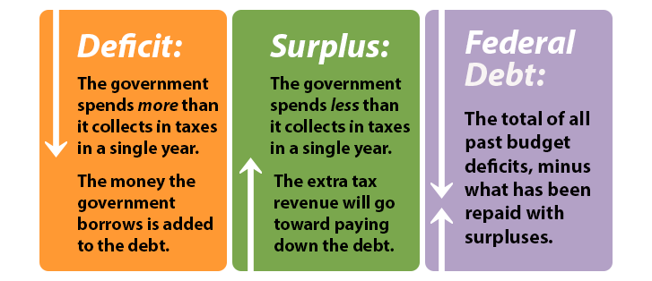

## Table of Contents

## What is national debt?

National debt is the total amount of money that a country's government owes. This debt comes from borrowing money to pay for things like roads, schools, and defense. When the government spends more money than it collects in taxes, it has to borrow the difference. This borrowing often happens by selling bonds to investors, which are promises to pay back the money with interest.

Over time, the national debt can grow very large. If it gets too big, it can cause problems. The government might have to pay a lot of money just to cover the interest on the debt, which means less money for other important things. Also, if people think the debt is too high, they might not want to lend more money to the government, or they might ask for higher interest rates. This can make it harder for the government to borrow in the future.

## What is a budget deficit?

A budget deficit happens when a government spends more money than it gets from taxes and other income in a year. It's like when you spend more money than you earn, and you have to borrow to cover the difference. Governments borrow money by selling bonds to people and organizations that want to invest.

When a government has a budget deficit, it adds to the national debt. The national debt is the total amount of money the government owes from all the years it had deficits. If a government keeps having budget deficits year after year, the national debt can grow very big. This can be a problem because the government has to pay interest on the debt, which means less money for important things like schools and hospitals.

## How are national debt and budget deficit related?

National debt and budget deficit are closely connected. A budget deficit happens when a government spends more money than it earns in a year. To cover this shortfall, the government borrows money, usually by selling bonds. This borrowing adds to the national debt, which is the total amount of money the government owes over time.

Every year the government has a budget deficit, it increases the national debt. If the government keeps having deficits year after year, the national debt can grow very large. A big national debt can cause problems because the government has to pay interest on it, which means less money for important things like schools, roads, and healthcare.

## Can a country have a budget deficit without increasing its national debt?

A country can have a budget deficit without increasing its national debt, but it's not common. A budget deficit happens when a government spends more money than it earns in a year. Usually, to cover this deficit, the government borrows money, which adds to the national debt. But if the government has some extra money saved up, it can use that to cover the deficit instead of borrowing. This way, the national debt doesn't go up.

For example, imagine a country has a rainy day fund or some other savings. If it has a budget deficit one year, it can use the money from this fund to pay for the extra spending. As long as the money used from the savings is less than or equal to the deficit, the national debt won't increase. But most countries don't have big enough savings to do this often, so usually, a budget deficit does lead to an increase in the national debt.

## What causes a budget deficit?

A budget deficit happens when a government spends more money than it gets from taxes and other income in a year. One big reason for this is when the economy is not doing well. When people are out of work or businesses are struggling, they pay less in taxes. But the government still needs to spend money on things like helping people who lost their jobs or supporting businesses. So, the government's spending goes up while its income goes down, causing a deficit.

Another reason for a budget deficit is when the government decides to spend more on new projects or programs. For example, they might want to build new roads, schools, or hospitals, or they might start new social programs to help people. If they don't raise taxes to pay for these new things, they have to borrow money, which leads to a deficit. Sometimes, governments also cut taxes to help people and businesses, but if they don't cut spending at the same time, this can also cause a deficit.

## How is national debt accumulated?

National debt grows when a country's government spends more money than it earns. This happens when the government has a budget deficit. To cover the extra spending, the government borrows money by selling bonds to people and organizations. These bonds are like IOUs that promise to pay back the money with interest later. Every time the government has a budget deficit and borrows money, it adds to the total national debt.

Over time, if the government keeps having budget deficits, the national debt can get very big. Imagine if you borrowed a little money every year and never paid it back, the total amount you owe would keep growing. The same thing happens with national debt. The government has to pay interest on the debt, which can be a lot of money. If the debt gets too big, it can cause problems for the country because there's less money for important things like schools and hospitals.

## What are the economic implications of a high national debt?

A high national debt can make it harder for a country to grow and take care of its people. When a country has a lot of debt, it has to pay a lot of money just to cover the interest on that debt. This means there's less money for important things like schools, hospitals, and fixing roads. If the government has to keep borrowing more money to pay for these things, it can make the debt even bigger. This can slow down the economy because businesses might not want to invest in a country that has a lot of debt.

Also, if people think a country's debt is too high, they might not want to lend money to that country anymore, or they might ask for higher interest rates. This can make it even harder for the government to borrow money in the future. If the government can't borrow money easily, it might have to cut spending on important programs or raise taxes, which can make life harder for people. In the worst cases, a very high national debt can lead to a financial crisis, where the country can't pay its bills and the economy suffers a lot.

## How does a budget deficit affect the economy?

A budget deficit happens when a government spends more money than it gets from taxes and other income in a year. This can affect the economy in different ways. When the government has a deficit, it usually borrows money to cover the extra spending. This can help the economy grow because the government can spend money on things like building roads, schools, and helping people who need it. This spending can create jobs and make businesses do better. But if the deficit is too big, it can cause problems. The government might have to borrow a lot of money, which can make the national debt grow very big.

A big national debt can make it harder for the government to spend money on important things. The government has to pay interest on the debt, which can be a lot of money. If the government has to pay a lot of interest, there might be less money for schools, hospitals, and other important things. Also, if people think the debt is too high, they might not want to lend money to the government, or they might ask for higher interest rates. This can make it harder for the government to borrow money in the future. If the government can't borrow easily, it might have to cut spending or raise taxes, which can make life harder for people.

## What measures can a government take to reduce a budget deficit?

A government can reduce a budget deficit by cutting spending. This means they might have to spend less money on things like building new roads, running schools, or helping people who need it. When they cut spending, they have less money going out, so the deficit gets smaller. But cutting spending can be hard because people might not like it if their favorite programs get less money. The government has to be careful about what they cut so they don't hurt important things too much.

Another way to reduce a budget deficit is by raising taxes. When the government raises taxes, they get more money coming in. This can help cover the extra spending and make the deficit smaller. But raising taxes can also be hard because people and businesses might not like paying more money. If taxes go up too much, it can make the economy slower because people have less money to spend on things they need and want.

Sometimes, a government can do both things at the same time: cut spending and raise taxes. This can help reduce the deficit even more. But it's a tricky balance because they have to make sure they don't hurt the economy too much while trying to fix the deficit.

## How can national debt be managed or reduced?

A government can manage or reduce national debt by cutting spending. This means they might spend less on things like building new roads, running schools, or helping people who need it. When they spend less, they don't have to borrow as much money, so the national debt doesn't grow as fast. But cutting spending can be hard because people might not like it if their favorite programs get less money. The government has to be careful about what they cut so they don't hurt important things too much.

Another way to manage or reduce national debt is by raising taxes. When the government raises taxes, they get more money coming in. This can help them pay back some of the debt or at least borrow less money in the future. But raising taxes can also be hard because people and businesses might not like paying more money. If taxes go up too much, it can make the economy slower because people have less money to spend on things they need and want.

Sometimes, a government can do both things at the same time: cut spending and raise taxes. This can help reduce the national debt even more. But it's a tricky balance because they have to make sure they don't hurt the economy too much while trying to fix the debt. If the economy is doing well, it might be easier to manage the debt because the government can get more money from taxes without raising them too much.

## What are the differences in how national debt and budget deficits are reported and measured?

National debt and budget deficits are reported and measured in different ways. The national debt is the total amount of money a government owes. It's like adding up all the money the government has borrowed over many years and hasn't paid back yet. This number is usually reported as a total sum, and sometimes it's shown as a percentage of the country's economy, called the GDP. This helps people understand how big the debt is compared to how much money the country makes.

A budget deficit, on the other hand, is how much more money the government spends than it gets in a single year. It's reported as a yearly number, and like the national debt, it can also be shown as a percentage of GDP. This helps show how big the deficit is compared to the size of the economy. When a government has a budget deficit, it adds to the national debt because the government usually borrows money to cover the difference between what it spends and what it earns. So, while the national debt is a running total of all past deficits, the budget deficit is a snapshot of the financial situation for just one year.

## How do international perspectives and policies affect national debt and budget deficits?

International perspectives and policies can have a big impact on a country's national debt and budget deficits. When other countries and international groups like the World Bank or the International Monetary Fund (IMF) look at a country's debt, they might decide to lend money or help out if they think the country is doing a good job managing its money. But if they think the debt is too high or the country isn't managing it well, they might not want to lend money or might ask for higher interest rates. This can make it harder for the country to borrow money and can make the national debt grow even faster.

Also, international trade and economic policies can affect a country's budget deficits. If a country sells a lot of things to other countries, it can earn more money, which can help lower its budget deficit. But if other countries put up trade barriers or if there's a global economic downturn, it can be harder for a country to earn money from trade. This can make the budget deficit bigger because the country might have to spend more money to help its people and businesses while [earning](/wiki/earning-announcement) less from taxes. So, what happens in the rest of the world can really change how a country manages its debt and deficits.

## What is the understanding of budget deficits?

A budget deficit occurs when a government's expenditures exceed its revenues within a given fiscal period. This situation necessitates borrowing to cover the shortfall, thereby impacting the nation's overall fiscal balance. Mathematically, a budget deficit can be expressed as:

$$
\text{Budget Deficit} = \text{Expenditures} - \text{Revenues}
$$

where expenditures encompass all government spending on goods, services, and obligations, and revenues largely derive from taxation and other government income sources.

The implications of budget deficits are multifaceted, affecting both government policy and economic health. Governments facing persistent deficits may need to reassess fiscal policies, potentially increasing taxes or reducing public spending to bridge the gap. These measures can influence overall economic growth, as austerity can lead to reduced consumer spending and increased unemployment. Conversely, investment in infrastructure and education—despite contributing to deficits—might stimulate long-term economic growth by enhancing productivity.

Historically, various countries have faced significant budget deficits, each with unique socio-economic contexts and outcomes. For instance, the United States has experienced budget deficits intermittently since the 1980s, influenced by different administrations' fiscal policies. The financial crisis of 2008 led to substantial deficits as the government undertook stimulus spending to revive the economy. Similarly, Greece's severe budget deficits in the late 2000s, exacerbated by tax evasion and structural inefficiencies, contributed to a sovereign debt crisis that had ramifications across the Eurozone. These historical examples emphasize the critical role that effective budget management and transparent fiscal policies play in maintaining economic stability and mitigating long-term debt escalation.

## What is the Role of Government Finance?

Governments manage finances through several key mechanisms, including taxation, borrowing, and the implementation of monetary policies. These tools allow governments to influence economic conditions, respond to fiscal challenges, and shape the overall economic landscape.

### Taxation

Taxation serves as a primary source of revenue for governments, allowing them to fund essential services such as healthcare, education, and infrastructure. Through various forms of taxation, including income tax, corporate tax, and value-added tax, governments collect funds to distribute across different sectors. Tax policy decisions can significantly impact economic behavior, influencing factors like consumer spending, investment, and saving. For instance, reducing income tax may increase disposable income, potentially boosting consumption and economic growth.

### Borrowing

When expenditures exceed revenues, governments resort to borrowing to finance their activities. This borrowing often occurs through the issuance of government bonds, which are debt securities that promise to pay back the principal amount with interest at a future date. Borrowing enables governments to undertake significant projects or respond to economic crises without immediately increasing taxes. However, excessive borrowing can lead to higher national debt levels, prompting concerns about fiscal sustainability and the possibility of increased future tax burdens.

### Monetary Policies

Monetary policies, administered typically by a central bank, play a crucial role in managing economic stability. By controlling interest rates and the money supply, central banks influence inflation and economic growth rates. For instance, lowering interest rates can stimulate borrowing and investment, potentially accelerating economic activity during a downturn. Conversely, raising rates can help tamp down excessive inflation.

### Influence on Macroeconomic Stability

Government finance strategies, notably fiscal policies involving taxation and spending, significantly impact macroeconomic stability. Expansionary fiscal policies, characterized by increased government spending and tax cuts, aim to stimulate economic growth during downturns. Conversely, contractionary policies, marked by reduced spending and higher taxes, work to cool an overheated economy.

The multiplier effect, a crucial economic concept, illustrates how government spending can spur additional economic activity. The formula for the fiscal multiplier is: 

$$
\text{Multiplier} = \frac{1}{1-MPC}
$$

where MPC (marginal propensity to consume) is the fraction of additional income that a household consumes rather than saves. A higher MPC results in a larger multiplier, indicating that government spending can have a substantial impact on economic output.

### Impact on Economy and Financial Markets

Fiscal policy decisions have immediate and long-term effects on the economy and financial markets. Government spending influences aggregate demand, leading to changes in GDP, employment, and inflation rates. Furthermore, tax policy alterations can shift investor behavior, stock market valuations, and interest rates.

For instance, an unexpected fiscal stimulus package may result in short-term economic growth and increased market optimism. Conversely, high levels of government borrowing might lead investors to demand higher yields on bonds, potentially increasing borrowing costs and influencing stock market fluctuations.

In conclusion, government finance management through a combination of taxation, borrowing, and monetary policies directly shapes economic conditions and market dynamics. These elements are pivotal in maintaining macroeconomic stability and fostering a healthy financial environment.

## What are the causes and effects of national debt?

National debt refers to the total amount of money that a government owes to its creditors, which includes both domestic and foreign entities. It accumulates when governments finance expenditures beyond their revenue by borrowing, leading to an increase in the total debt over time. Various factors contribute to the accumulation of national debt, including fiscal policy decisions, economic conditions and demographic trends.

### Factors Leading to the Accumulation of National Debt

1. **Budget Deficits**: When government spending consistently exceeds revenues, deficits occur, leading to increased borrowing. A persistent pattern of budget deficits significantly contributes to national debt accumulation.

2. **Economic Recessions**: During economic downturns, tax revenues often decline due to reduced economic activity, while government expenditures may increase due to stimulus measures and welfare programs, resulting in higher debt levels.

3. **Interest Rates**: Low interest rates can encourage borrowing due to cheaper debt servicing costs, potentially increasing a government's willingness to accumulate debt.

4. **Demographic Changes**: An aging population can increase spending requirements on healthcare and pensions, intensifying the pressure on public finances and contributing to debt growth.

### Potential Consequences of High National Debt

1. **Inflation**: Excessive national debt can lead to inflation if funded by money creation. Increased money supply without corresponding output growth can diminish currency value. However, this is more pertinent to countries that finance debt internally through monetization.

2. **Reduced Fiscal Flexibility**: High levels of debt constrain a government's ability to implement fiscal policies, as a significant portion of revenues is allocated to debt servicing. This may limit resources available for infrastructure, education and other vital areas.

3. **Higher Borrowing Costs**: As debt levels rise, creditors may demand higher interest rates to compensate for increased risk, resulting in costlier borrowing for the government.

### Relationship Between National Debt and GDP

The ratio of national debt to GDP is a critical indicator of a country's economic health. It measures the size of a country's debt relative to its economy. A higher debt-to-GDP ratio suggests a greater burden of debt relative to economic output, which can influence investor confidence and affect a country's credit rating. The dynamics can be expressed with the formula:

$$
\text{Debt-to-GDP Ratio} = \frac{\text{National Debt}}{\text{Gross Domestic Product}} \times 100
$$

### Example Python Code for Calculating Debt-to-GDP Ratio

Below is an example Python code snippet to calculate the Debt-to-GDP ratio:

```python
def calculate_debt_to_gdp(national_debt, gdp):
    return (national_debt / gdp) * 100

national_debt = 2100000000000  # Example national debt in currency units
gdp = 1800000000000  # Example GDP in currency units

debt_to_gdp_ratio = calculate_debt_to_gdp(national_debt, gdp)
print(f"Debt-to-GDP Ratio: {debt_to_gdp_ratio:.2f}%")
```

Such calculations help policymakers and economists assess the sustainability of debt levels over time. Understanding these relationships is critical to formulating sound economic policies that maintain fiscal health and avoid potential negative impacts associated with high national debt.

## References & Further Reading

[1]: Auerbach, A. J., Gale, W. G., & Harris, B. H. (2010). ["Activist Fiscal Policy."](https://www.aeaweb.org/articles?id=10.1257/jep.24.4.141) Journal of Economic Perspectives, 24(4), 141-164.

[2]: Reinhart, C. M., & Rogoff, K. S. (2010). ["Growth in a Time of Debt."](https://www.nber.org/papers/w15639) American Economic Review, 100(2), 573-578.

[3]: Chodorow-Reich, G. (2014). ["The Employment Effects of Credit Market Disruptions: Firm-level Evidence from the 2008-9 Financial Crisis."](https://academic.oup.com/qje/article/129/1/1/1899226) The Quarterly Journal of Economics, 129(1), 1-59.

[4]: Carney, M. (2009). ["Some Considerations on Using Government Spending to Stimulate Economic Activity."](https://www.bis.org/review/r090826a.pdf) Bank of Canada.

[5]: Alden, C., & Arner, D. W. (2019). ["Financial Stability, Resolution of Systemic Banking Crises and Globalization."](https://papers.ssrn.com/sol3/papers.cfm?abstract_id=3664523) Journal of Financial Regulation, 5(2), 143-171.