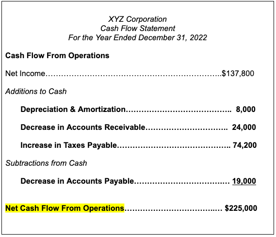

Operating cash flow and net income are fundamental financial metrics that provide key insights into a company's financial health. Operating cash flow (OCF) measures the cash a company generates from its regular business operations, distinct from net income, which represents the total profit after expenses, taxes, and the cost of goods sold have been deducted. While OCF directly relates to a company's liquidity by indicating how well it can sustain its operations through internal funding, net income offers a broad perspective on profitability.

With the advent of algorithmic trading, these metrics have gained substantial importance. Algorithmic trading employs algorithms to automate trading processes, making it critical to integrate reliable financial metrics into these models to execute strategies effectively. By leveraging data on operating cash flow and net income, traders can develop algorithms that consider both liquidity and profitability, which are essential factors in anticipating market movements.



This article investigates how these financial indicators—OCF and net income—can be vital components in optimizing trading strategies. As financial markets grow more complex, these metrics help traders build comprehensive models that improve portfolio outcomes by providing a balanced view of a company’s financial position. Understanding the interplay between OCF, net income, and algorithmic trading not only aids in crafting precise investment strategies but also in enhancing the predictive capabilities of trading algorithms. Through this exploration, we aim to enrich the reader's comprehension of these crucial financial performance metrics and their strategic application in the increasingly sophisticated landscape of trading.

## Table of Contents

## Understanding Operating Cash Flow

Operating cash flow (OCF) is a crucial measure that evaluates the cash generated from a company's primary business activities. Unlike net income, which includes non-cash items, OCF provides a clearer picture of a company's cash availability, focusing exclusively on cash transactions. This distinction is vital for assessing a company's ability to sustain and expand operations without relying on external funding sources.

At its core, operating cash flow is calculated using the cash flow from operations portion of the cash flow statement, and it typically involves adjustments to net income for non-cash charges such as depreciation and changes in working capital components.

Mathematically, OCF can be represented as:

$$
\text{OCF} = \text{Net Income} + \text{Depreciation and Amortization} + \Delta \text{Working Capital}
$$

Where $\Delta \text{Working Capital}$ accounts for changes in the current assets and liabilities, excluding cash and short-term debt, reflecting the cash impact of company operations on short-term financing needs.

The relevance of OCF is underscored by its role in evaluating a company's financial health. It is frequently used in calculating important financial metrics such as the operating cash flow ratio and free cash flow. The operating cash flow ratio, for example, is a [liquidity](/wiki/liquidity-risk-premium) ratio that measures how well current liabilities are covered by the cash flow generated from operations:

$$
\text{Operating Cash Flow Ratio} = \frac{\text{OCF}}{\text{Current Liabilities}}
$$

This ratio helps analysts and investors determine whether a company can cover its short-term obligations with cash generated from its core operations. A higher ratio indicates better coverage, suggesting a solid operational foundation.

Additionally, free cash flow (FCF), another critical financial metric, derives from operating cash flow by accounting for capital expenditures:

$$
\text{Free Cash Flow} = \text{OCF} - \text{Capital Expenditures}
$$

FCF indicates the cash available after maintaining or expanding asset bases and is a fundamental measure for evaluating the sustainability of dividends, share repurchases, and reducing debt levels.

Operating cash flow's transparent view into a company's cash generation capabilities makes it an essential tool for assessing financial health and sustaining business operations. Proper analysis of OCF, along with related metrics, provides valuable insights for investors and financial analysts in determining the long-term viability and operational efficiency of a company.

## Net Income: An Essential Financial Metric

Net income, commonly referred to as the bottom line, is a pivotal metric in evaluating a company's financial performance. It represents the total earnings or profit after accounting for all expenses, taxes, and costs of goods sold. This figure provides a clear snapshot of a business's profitability over a specific period, serving as a critical indicator for investors, financial analysts, and stakeholders.

### Components and Calculation

Net income is calculated using the following formula:

$$
\text{Net Income} = \text{Total Revenue} - \text{Total Expenses}
$$

Where total expenses include operating expenses, interest, taxes, depreciation, and amortization. This equation summarizes the profitability after every financial obligation has been met.

### Impact of Accounting Practices

Net income is significant for evaluating a company's profitability; however, it can be affected by various accounting practices. These practices may involve decisions around depreciation methods, inventory valuation, and provisions for doubtful debts. For instance, a company may choose different depreciation methods (straight-line vs. declining balance) that significantly influence the reported net income. These variations highlight the importance of understanding the underlying accounting principles when making assessments based solely on net income.

### Comparative Analysis with Operating Cash Flow

While net income is an indispensable measure of profitability, combining it with operating cash flow (OCF) offers a more comprehensive picture of a company's financial health. OCF measures the actual cash generated from a company’s core operations, providing insights into cash availability without influences from non-operating activities or accounting adjustments.

Comparing net income with operating cash flow can reveal discrepancies that may indicate financial anomalies. For example, a company might report a high net income alongside a low operating cash flow, raising red flags about its liquidity and ability to sustain operations without external financing. These inconsistencies often emerge from non-cash revenues or aggressive revenue recognition practices, underscoring the importance of examining both metrics in tandem.

### Conclusion

Net income remains a fundamental metric for assessing profitability, yet its true value is realized when analyzed alongside operating cash flow. Understanding both metrics' interplay provides a more nuanced understanding of a company's financial condition, offering a balanced view that aids in making informed investment decisions.

## Algorithmic Trading and Financial Performance

Algorithmic trading utilizes computer algorithms to automate and optimize trading decisions, executing trades with enhanced efficiency and precision. This approach leverages sophisticated mathematical models and vast datasets to mitigate human errors and capitalize on fleeting market opportunities. One critical dataset comprises financial statements, where operating cash flow (OCF) and net income serve as pivotal inputs.

Incorporating operating cash flow and net income into algorithmic models can significantly enhance decision-making. OCF provides insights into the liquidity of a company, while net income reflects its profitability. By analyzing these metrics, trading algorithms discern trends that inform buy or sell decisions. For example, an algorithm might prioritize companies with a consistently positive OCF, assessing their ability to sustain operations and manage debt, thereby classifying them as potentially lower risk.

To achieve these insights, historical financial data is examined through predictive analytics, which models future financial performance based on past trends. Utilizing techniques such as time-series analysis, [machine learning](/wiki/machine-learning), and neural networks, algorithms can predict potential stock price movements or financial anomalies. A Python-based example could involve using the `numpy` and `pandas` libraries to analyze financial data:

```python
import pandas as pd
import numpy as np

# Load financial data
data = pd.read_csv('company_financials.csv')

# Calculate OCF and identify trends
data['OCF_Trend'] = data['OCF'].rolling(window=4).mean()

# Machine Learning model to predict net income
from sklearn.linear_model import LinearRegression

X = data[['OCF', 'Revenue']]
y = data['Net_Income']

model = LinearRegression()
model.fit(X, y)

# Predict future net income
future_ocf = np.array([[500, 1200]])  # Example future values
predicted_net_income = model.predict(future_ocf)
```

Case studies often highlight the transformation of raw financial data into actionable trading strategies, showcasing the effectiveness of these models. For instance, enhancing trading strategies using OCF can be particularly beneficial during periods of economic recession, where liquidity becomes a pivotal concern.

Despite these advantages, integrating financial metrics into [algorithmic trading](/wiki/algorithmic-trading) also poses challenges. These include the potential for data inaccuracies and the risk of overfitting models to historical data, resulting in poor predictive performance. Furthermore, market conditions change rapidly, necessitating continuous model refinement to maintain effectiveness.

Overall, algorithmic trading systems that successfully employ operating cash flow and net income data improve trading strategies by leveraging financial transparency and performance metrics, optimizing investment decision-making and portfolio management in dynamic markets.

## Interconnections between Operating Cash Flow, Net Income, and Algo Trading

Integrating operating cash flow (OCF) and net income into algorithmic trading frameworks enables more comprehensive analyses of a company’s financial health, improving the decision-making process for investors. These metrics offer distinct and valuable insights: while net income reflects profitability after accounting for various expenses, OCF provides a transparent view of the cash generated by business operations, essential for assessing liquidity and operational efficiency.

### Quantitative Analysis Models

Incorporating OCF and net income into quantitative models enhances financial scoring systems used in trading algorithms. A common approach is to develop multi-[factor](/wiki/factor-investing) models that weigh these metrics alongside other financial indicators. For instance, a scoring system might assign a higher weight to OCF in industries where liquidity is crucial, such as manufacturing, while emphasizing net income in sectors where profitability margins are key, such as software development.

An example of a simple scoring algorithm in Python might look like this:

```python
def financial_score(ocf, net_income, weights={'ocf': 0.6, 'net_income': 0.4}):
    """
    Calculate a company's financial health score based on weighted OCF and net income.
    """
    if ocf is None or net_income is None:
        raise ValueError('OCF and Net Income must be provided.')
    return weights['ocf'] * ocf + weights['net_income'] * net_income

# Example usage
ocf = 500000  # example operating cash flow
net_income = 300000  # example net income

score = financial_score(ocf, net_income)
```

This score can be incorporated into trading algorithms to assess the relative health of various companies, guiding buy or sell decisions.

### Future Trends: Big Data and Machine Learning

The future of algorithmic trading will likely see an increased reliance on big data and machine learning (ML) techniques. These technologies can enhance the predictive accuracy of trading algorithms by analyzing vast datasets that include historical OCF and net income metrics. Machine learning models, such as random forests or gradient boosting machines, can uncover complex patterns and interactions between financial indicators that might be invisible to traditional methods.

Consider the integration of ML for predicting stock returns based on OCF and net income:

```python
from sklearn.ensemble import RandomForestRegressor
import numpy as np

# Sample data
X = np.array([[400000, 250000], [550000, 300000], [600000, 350000]])  # OCF and Net Income
y = np.array([15.0, 20.0, 18.0])  # Corresponding stock return percentages

model = RandomForestRegressor(n_estimators=100)
model.fit(X, y)

# Predict stock return for a new company
new_data = np.array([[500000, 320000]])
predicted_return = model.predict(new_data)
```

Such approaches allow traders to develop more robust algorithms that can adapt to changing market conditions by continuously learning from new data. The use of ML not only improves the accuracy of predictions but also aids in uncovering subtle trends and correlations that traditional models might miss.

As data availability and computational power continue to grow, the integration of OCF and net income in algorithmic trading will evolve, incorporating more complex datasets and sophisticated analytical tools. This progression underscores the critical role these financial metrics play in enhancing the understanding of company health, ultimately refining trading strategies and improving portfolio outcomes.

## Conclusion

Operating cash flow and net income are essential metrics that offer detailed insights into a company's financial health. These indicators serve not only to assess liquidity and profitability but also to provide integral data that can be effectively integrated into algorithmic trading strategies. When these financial metrics are utilized within algorithmic models, they enhance the precision of predicting market movements, thus empowering traders to make more informed decisions.

Algorithmic trading leverages the power of automated systems to execute trades based on pre-determined criteria. By integrating operating cash flow and net income into these systems, traders can better interpret liquidity and profitability trends, enabling the development of more sophisticated trading strategies. This integration helps to manage risk and optimize the return on investment, particularly in rapidly changing markets.

Investors must possess a robust understanding of these financial indicators to fully exploit their potential within complex trading environments. Comprehending the nuanced implications of operating cash flow and net income allows traders to identify discrepancies between cash flow and reported earnings, which can indicate potential red flags or opportunities for investment.

Looking forward, the burgeoning fields of data analytics and advanced trading algorithms present promising avenues for further enhancement of trading strategies. By harnessing big data and machine learning, the financial industry can refine algorithmic models to anticipate market trends more accurately. The continuous development of these technologies suggests that the future of trading will increasingly rely on data-driven insights, underscoring the importance of operating cash flow and net income within this evolving landscape.

## References & Further Reading

García, R., & Tsafack, G. (2011). "Dependence Structure and Risk Measurement in Algorithmic Trading." This work emphasizes the importance of understanding the dependence structures in financial time series and the implications for risk management in algorithmic trading. The study provides insights into how dependence modeling can improve the accuracy of risk assessments in automated trading systems.

Schroff, G., & Eydeland, A. (2010). "Algorithmic and High-Frequency Trading." This book offers a comprehensive overview of the strategies and technologies behind algorithmic and high-frequency trading. It covers various trading algorithms, execution strategies, and the role of technology in enhancing trading performance.

Penman, S. (2013). "Financial Statement Analysis and Security Valuation." Penman provides a detailed approach to analyzing financial statements with the goal of estimating the intrinsic value of securities. The book is crucial for understanding the relationship between accounting figures such as operating cash flow and net income, and their valuation implications.

Johnson, B. "Algorithmic Trading and DMA: An Introduction to Direct Access Trading Strategies." This resource introduces the basics of direct access trading systems and how they are applied in algorithmic trading. It covers the practical aspects of implementing direct market access for algorithmic strategies, focusing on execution efficiency and market impact.

These readings provide foundational and advanced perspectives on the integration of financial metrics like operating cash flow and net income in algorithmic trading strategies, highlighting both theoretical concepts and practical applications. They offer a robust framework for understanding how these financial metrics can enhance trading decisions in complex market environments.