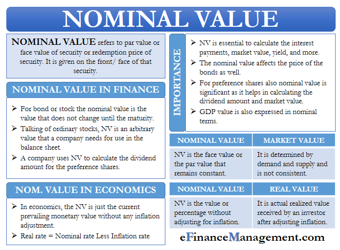

## Table of Contents

## What is the nominal value of a stock?

The nominal value of a stock, also known as its par value, is a fixed amount assigned to a share of stock by the company when it is issued. This value is usually a small, arbitrary number set by the company and does not reflect the actual market value of the stock. For example, a company might set the nominal value of its stock at $0.01 per share, even if the stock is trading at $50 per share on the market.

The nominal value is important for accounting and legal purposes. It is used to calculate the company's legal capital, which is the minimum amount of capital that must be maintained to protect creditors. When a company issues stock, the nominal value is recorded in the company's financial statements as part of its equity. However, the nominal value does not change over time, unlike the market value, which can fluctuate based on supply and demand and other market factors.

## What is the real value of a stock?

The real value of a stock, often called its intrinsic value, is what the stock is actually worth based on the company's fundamentals. This includes things like the company's earnings, growth potential, and overall financial health. Investors try to figure out the real value by looking at these factors and using different methods to calculate it. The real value helps investors decide if a stock is a good buy or if it's overpriced.

The real value is different from the stock's market price, which is what people are willing to pay for it at any given time. The market price can go up and down a lot because of things like news, trends, and what other investors are doing. Sometimes, the market price can be higher or lower than the real value. When the market price is lower than the real value, some investors see it as a chance to buy the stock at a discount. But figuring out the real value is tricky and different people might come up with different numbers.

## How is the nominal value of a stock determined?

The nominal value of a stock, also called par value, is decided by the company when they first issue the stock. It's a small number that the company picks, and it doesn't really show how much the stock is worth in the market. For example, a company might say the nominal value of its stock is $0.01 per share, even if people are buying and selling it for $50 per share.

This nominal value is important for the company's legal and accounting records. It helps figure out the company's legal capital, which is the minimum amount of money the company has to keep to protect people who lend them money. When the company sells the stock, they write down the nominal value in their financial books as part of their equity. But remember, the nominal value stays the same and doesn't change, even if the price people pay for the stock goes up or down.

## How is the real value of a stock calculated?

The real value of a stock, or its intrinsic value, is what the stock is really worth based on the company's actual performance and future potential. To find this value, investors look at things like the company's earnings, how fast it's growing, and how healthy its finances are. They use different ways to calculate this, like looking at the price-to-earnings ratio, discounted cash flow analysis, and other financial models. These methods help investors figure out if the stock is a good deal or if it's too expensive.

The real value is different from the stock's market price, which is what people are actually paying for it at any moment. The market price can change a lot because of news, trends, and what other investors are doing. Sometimes, the market price might be higher or lower than the real value. If the market price is lower than the real value, some investors think it's a good time to buy because they believe the price will go up to match the real value. But figuring out the real value isn't easy, and different people might come up with different answers.

## Why is it important to understand the difference between nominal and real value of stocks?

Understanding the difference between the nominal value and the real value of stocks is important because they tell you different things about the stock. The nominal value is just a small number that the company decides when it first sells the stock. It doesn't change and doesn't show what the stock is really worth. On the other hand, the real value is what the stock is actually worth based on how well the company is doing and how much money it might make in the future. Knowing this helps you see if the stock is a good buy or if it's too expensive.

If you only look at the nominal value, you might miss out on understanding if the stock is a good investment. For example, if a stock has a nominal value of $0.01 but is selling for $50 on the market, the nominal value doesn't tell you anything about whether $50 is a fair price. By figuring out the real value, you can compare it to the market price and decide if the stock is undervalued or overvalued. This can help you make smarter choices about buying or selling stocks.

## Can the nominal value of a stock change over time?

The nominal value of a stock, also called par value, is set by the company when it first issues the stock. This value is usually a small number that doesn't change over time. It's mainly used for legal and accounting purposes and doesn't reflect how much the stock is actually worth in the market. For example, a company might set the nominal value at $0.01 per share, and that number stays the same even if the stock's price goes up to $50 per share.

While the nominal value itself doesn't change, a company can issue new stocks with a different nominal value. This means that if a company decides to issue more stock in the future, they could choose a different nominal value for those new shares. But the nominal value of the existing shares will still stay the same. So, while the nominal value of any particular share remains fixed, the company's overall approach to setting nominal values for new stock can change.

## How does inflation affect the real value of a stock?

Inflation can change the real value of a stock because it affects the buying power of money. When inflation goes up, the money you have can buy less stuff. If a company's earnings don't grow as fast as inflation, the real value of its stock might go down. That's because the money the company makes is worth less in real terms. So, investors need to think about inflation when they figure out if a stock is a good buy or not.

But, if a company can raise its prices to keep up with inflation, it might be able to keep or even increase its real value. Companies that can do this well are often seen as good investments during times of high inflation. So, when you're looking at the real value of a stock, you need to think about how the company deals with inflation. This helps you understand if the stock's price is fair when you consider the changing value of money.

## What role do market conditions play in the real value of stocks?

Market conditions can really change the real value of stocks. Things like how the economy is doing, what's happening in the world, and what other investors are thinking can all make a difference. If the economy is doing well, people might feel more confident and be willing to pay more for stocks, which can push up their real value. But if there's bad news or people are worried about the future, they might not want to buy stocks, and the real value could go down.

Also, things like interest rates and inflation can affect the real value of stocks. If interest rates go up, borrowing money becomes more expensive, and that can slow down the economy. This might make people think that companies won't make as much money, so they might not want to pay as much for their stocks. On the other hand, if inflation is high, companies that can raise their prices might do better, and their stocks could be worth more. So, understanding market conditions helps investors figure out what a stock is really worth.

## How do investors use the difference between nominal and real value to make investment decisions?

Investors use the difference between nominal and real value to figure out if a stock is a good buy. The nominal value, or par value, is just a small number that the company sets when they first sell the stock. It doesn't change and doesn't tell you much about what the stock is really worth. The real value, or intrinsic value, is what the stock is actually worth based on how well the company is doing and how much money it might make in the future. By comparing the real value to the price people are paying for the stock in the market, investors can see if the stock is a good deal or if it's too expensive.

If the market price of a stock is lower than its real value, investors might think it's a good time to buy. They believe that the price will eventually go up to match the real value, and they can make money from the difference. But if the market price is higher than the real value, investors might decide to sell or avoid buying the stock because they think it's overpriced. Understanding the difference between nominal and real value helps investors make smarter choices about when to buy or sell stocks, based on what the company is really worth.

## What are the limitations of using nominal value as a measure of a stock's worth?

The nominal value of a stock, also called par value, is not a good way to measure how much a stock is really worth. This is because the nominal value is just a small number that the company decides when it first sells the stock. It doesn't change over time, even if the stock's price goes up or down a lot. So, if you only look at the nominal value, you won't know if the stock is a good buy or if it's too expensive.

For example, a stock might have a nominal value of $0.01 per share, but people might be buying and selling it for $50 per share. The nominal value doesn't tell you anything about whether $50 is a fair price. To figure out if a stock is a good investment, you need to look at the real value, which is based on how well the company is doing and how much money it might make in the future. So, using the nominal value to decide if a stock is worth buying can lead to bad investment choices.

## How do accounting standards impact the reporting of nominal and real values of stocks?

Accounting standards make sure that companies report their financial information in a clear and consistent way. When it comes to stocks, these standards say how the nominal value should be shown in the company's financial statements. The nominal value, or par value, is the fixed amount that the company sets when it first sells the stock. This number is written down in the company's books as part of its equity. But the nominal value doesn't change, even if the stock's price in the market goes up or down. So, accounting standards help keep this part of the financial reporting straightforward and easy to understand.

But accounting standards don't really talk about the real value, or intrinsic value, of stocks. The real value is what the stock is actually worth based on how well the company is doing and how much money it might make in the future. Investors have to figure this out on their own using different ways to look at the company's earnings, growth, and other financial details. So, while the nominal value is clearly shown in financial statements because of accounting rules, the real value is more of a guess that investors make. This means that the real value can be different for different people, and it's not something you'll find in the company's official financial reports.

## What advanced financial models can be used to more accurately assess the real value of a stock?

To figure out the real value of a stock, investors use some advanced financial models. One popular model is the Discounted Cash Flow (DCF) analysis. This model looks at how much money the company might make in the future and then figures out what that money is worth today. It does this by "discounting" future cash flows back to the present using a discount rate, which is based on how risky the investment is. If the value you get from the DCF is higher than the stock's current market price, the stock might be a good buy because it's undervalued.

Another model is the Dividend Discount Model (DDM). This model is used for companies that pay dividends. It adds up all the future dividends the company might pay and then figures out what those dividends are worth today. Like the DCF, it uses a discount rate to bring future dividends back to their present value. If the present value of all future dividends is more than the stock's current price, the stock could be a good investment. Both of these models help investors make better guesses about a stock's real value by looking at what the company might do in the future.

## What is Understanding Stock Valuation?

Stock valuation is a critical process that seeks to ascertain the intrinsic value of a company's stock. The intrinsic value represents what the stock is truly worth, independent of its current market price, allowing investors to make informed decisions. The valuation process involves assessing this theoretical value and comparing it with the stock's market price. When discrepancies exist, analysts can categorize the stock as undervalued, overvalued, or fairly valued. Variations between the intrinsic and market values can guide investment decisions, such as buying undervalued stocks or selling overvalued ones.

To evaluate a stock's worth effectively, two primary valuation methods are employed: absolute valuation and relative valuation.

### Absolute Valuation

Absolute valuation focuses on determining a stock's intrinsic value through [fundamental analysis](/wiki/fundamental-analysis), utilizing financial metrics such as dividends, cash flows, and growth rates. This method involves models like the Discounted Cash Flow (DCF) analysis, which discounts expected future cash flows to their present value using a specific discount rate. The formula applied in DCF is:

$$
\text{PV} = \frac{CF_1}{(1 + r)^1} + \frac{CF_2}{(1 + r)^2} + \ldots + \frac{CF_n}{(1 + r)^n}
$$

where $PV$ is the present value of the expected cash flows $CF$, $r$ is the discount rate, and $n$ is the number of periods.

### Relative Valuation

Relative valuation, on the other hand, estimates a stock's worth by comparing it to the valuation of similar companies. It involves the use of valuation multiples, such as the Price-to-Earnings (P/E) ratio, Price-to-Book (P/B) ratio, or Enterprise Value to EBITDA (EV/EBITDA) ratio. By comparing these ratios across companies in the same industry, investors can determine whether a stock is over or undervalued relative to its peers.

For example, if a company has a lower P/E ratio compared to the industry average, it may be considered undervalued, indicating a potential buying opportunity. Conversely, a higher P/E ratio might suggest the stock is overvalued relative to its peers.

Both absolute and relative valuation methods are integral to stock analysis, each offering unique insights into a company's financial health and market position. By employing these valuation techniques, investors can gain a comprehensive understanding of a stock's potential, facilitating more strategic investment decisions.

## What is Real Value: A Comprehensive Measure?

Real value is a critical concept in stock valuation as it accounts for inflation, providing a more accurate representation of a stock's purchasing power over time. Unlike nominal value, which remains constant, real value reflects changes in the economic environment, offering investors a clearer assessment of a stock's intrinsic worth.

To determine the real value of a stock, it's essential to adjust the nominal value based on the inflation rate. This adjustment accounts for the eroding effect of inflation on money's purchasing power, ensuring that the stock's value is not overstated. The formula to calculate real value is:

$$
\text{Real Value} = \frac{\text{Nominal Value}}{(1 + \text{Inflation Rate})^n}
$$

where the inflation rate is expressed as a decimal, and $n$ represents the number of years over which inflation is measured.

Several factors impact the calculation of real values, including inflation, interest rates, and economic growth. Inflation is the primary [factor](/wiki/factor-investing) influencing real value. When inflation rates are high, the real value of a stock can significantly differ from its nominal value, necessitating adjustments for accurate financial analysis. Interest rates also play a crucial role; they often move inversely with inflation, affecting an investor's real returns. Furthermore, economic growth can impact real values by influencing both inflation and the general demand for securities in the market.

Understanding real value is vital for investors aiming to grasp the true economic worth of their investments. This comprehension allows for more informed decision-making, as real value presents a stock's worth after accounting for external economic pressures.

## How do you calculate the difference between nominal and real value?

To transition from nominal to real value, adjusting for inflation is essential. The process requires the use of an inflation index, which reflects changes in purchasing power over time. Here's how to complete this calculation:

The real value calculation hinges on the formula:

$$
\text{Real Value} = \frac{\text{Nominal Value}}{(1 + \text{Inflation Rate})^n}
$$

Where:

- **Nominal Value** is the initial value of an asset, not adjusted for inflation.
- **Inflation Rate** is the rate at which the general level of prices for goods and services rises, eroding purchasing power.
- **n** denotes the number of time periods for which inflation is applied.

This formula allows investors to discern whether the returns they experience are authentic increases in value or simply adjustments for inflation. For instance, if an asset possesses a nominal value of $1,000 and has experienced a cumulative inflation rate of 10% over two years, its real value can be computed as follows:

$$
\text{Real Value} = \frac{1000}{(1 + 0.10)^2} \approx 826.45
$$

This indicates that, in terms of purchasing power, the asset's value is approximately $826.45 today — signaling that some perceived gains are due to inflation.

From a practical standpoint, implementing such calculations can be automated using Python, making it easier for financial analysts to evaluate large datasets. Here’s a simple Python code snippet to automate this calculation:

```python
def calculate_real_value(nominal_value, inflation_rate, periods):
    return nominal_value / ((1 + inflation_rate) ** periods)

nominal_value = 1000
inflation_rate = 0.10
periods = 2

real_value = calculate_real_value(nominal_value, inflation_rate, periods)
print(f"The real value is: {real_value:.2f}")
```

This process is essential for making informed investment decisions, as it provides insights into whether returns are inflationary or genuine, enabling a clearer assessment of economic gain.

## What is an Example Application in Stock Valuation?

Consider a stock initially issued with a nominal value of $1. Over time, due to market factors such as increased demand and positive company performance, the stock's market value escalates to $4. This increase in market value may reflect favorable company prospects, investor sentiment, and overall market conditions. However, to understand the real purchasing power and true economic gain of this investment, one must adjust for inflation.

Assume the cumulative inflation rate over the period is 50%. To calculate the real value of this stock, we must adjust the nominal market value ($4) for inflation. The formula for calculating real value is as follows:

$$
\text{Real Value} = \frac{\text{Nominal Value}}{(1 + \text{Inflation Rate})^n}
$$

In this case:

$$
\text{Real Value} = \frac{4}{(1 + 0.50)} = \frac{4}{1.50} \approx 2.67
$$

This result indicates that while the market value has increased to $4 nominally, the real value or true purchasing power of the stock is approximately $2.67 when inflation is accounted for. The inflation adjustment reveals how inflation has eroded some of the perceived gains, offering a more accurate depiction of the stock's economic value over time. 

Such calculations are invaluable to investors as they provide insights into the authentic worth of a stock, going beyond mere nominal price increments. When evaluating investment returns, it is crucial to distinguish between genuine growth and inflationary illusions, allowing for more informed and strategic financial decisions. By focusing on real values, investors are better equipped to assess the long-term viability and potential profitability of their stock investments.

## References & Further Reading

[1]: Arnold, G. (2010). ["Corporate Financial Management"](https://books.google.com/books/about/Corporate_Financial_Management.html?id=LvSMDwAAQBAJ). Financial Times/Prentice Hall.

[2]: Bodie, Z., Kane, A., & Marcus, A. J. (2014). ["Investments"](https://www.mheducation.com/highered/product/Investments-Bodie.html). McGraw-Hill Education.

[3]: Damodaran, A. (2012). ["Investment Valuation: Tools and Techniques for Determining the Value of Any Asset"](https://books.google.com/books/about/Investment_Valuation.html?id=5SRHAAAAQBAJ). Wiley Finance.

[4]: Piotroski, J. D., & So, E. C. (2012). ["Identifying Expectation Errors in Value/Glamour Strategies: A Fundamental Analysis Approach"](https://www.jstor.org/stable/23263573). The Review of Financial Studies, 25(9), 2841–2875.

[5]: Rosenberg, B., Reid, K., & Lanstein, R. (1985). ["Persuasive evidence of market inefficiency"](https://www.degruyter.com/document/doi/10.1515/9781400829408-007/html). The Journal of Portfolio Management, 11(3), 9-16.

[6]: Sharpe, W. F., & Keim, D. B. (1999). ["Investments"](https://archive.org/details/investments0000shar). Prentice Hall.