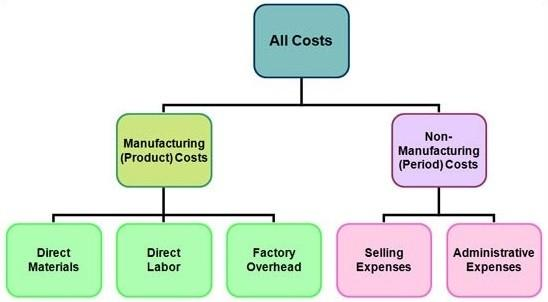

In the complex world of production, understanding costs is crucial. This article explores the intricacies of manufacturing costs, production costs, and cost analysis, particularly in the context of algorithmic trading. Cost analysis is a critical process that helps businesses evaluate and manage their expenses effectively, ensuring profitability and efficiency. By systematically examining and interpreting cost data, companies gain insights into their financial performance and can identify areas for improvement. 

Manufacturing and production costs are core components of any business involved in creating goods, and understanding these costs is essential for financial success. Manufacturing costs refer to the expenses directly associated with creating a product, such as raw materials, labor, and manufacturing overhead. On the other hand, production costs encompass a broader range of expenses, including not only manufacturing costs but also costs related to the entire business operation. Distinguishing between these costs allows businesses to allocate resources more efficiently and set competitive pricing strategies.



Algorithmic trading, known for its fast-paced environment, requires precise cost analysis to optimize operations and ensure profitable outcomes. Relying on automated trading systems, this form of trading requires the swift execution of trades based on algorithms analyzing numerous financial markets. Accurate cost analysis is crucial in algorithmic trading, as it involves assessing both financial expenses and broader operational costs such as time and resource allocation. By doing so, traders can enhance their strategies, identify cost-saving opportunities, and ensure that trades are executed with maximum efficiency.

This article will demystify the various types of costs involved in manufacturing and production and detail the importance of cost analysis in the field of algorithmic trading. By breaking down the elements of cost structures, businesses can obtain a clearer understanding of where money is being spent and identify potential areas for cost reduction, leading to increased profitability. 

We will also provide insights into how businesses can leverage these understandings to optimize their operations and improve their bottom line. Through proper cost analysis and management, companies can make informed strategic decisions that foster growth, competitiveness, and long-term financial stability.

## Table of Contents

## Manufacturing Costs vs. Production Costs

Manufacturing costs and production costs are often conflated, yet they fulfill distinct roles in cost analysis. Clarifying these roles is essential for businesses aiming to optimize operations and maintain financial health. Manufacturing costs are strictly associated with the creation of a product, whereas production costs cover the broader scope of the entire business operation.

Manufacturing costs primarily include three components: raw materials, direct labor, and manufacturing overhead. Raw materials refer to the basic inputs used directly in the production process. For instance, in the automobile industry, steel, plastic, and glass are raw materials essential for building a car. Direct labor involves the wages paid to employees who are physically engaged in the production of goods. This includes assembly line workers whose labor transforms raw materials into final products. Manufacturing overhead encompasses all indirect manufacturing costs, such as maintenance of equipment, utilities, and quality control measures.

Productive use of these resources ensures that manufacturing operations remain economically viable. By accurately categorizing these costs, businesses can implement effective cost-management strategies, leading to significant reductions in waste and inefficiencies. 

On the other hand, production costs encompass all expenses incurred by a business, extending beyond those directly tied to manufacturing. They include costs associated with administration, research and development, marketing, and distribution. For example, if a company produces electronic devices, the salaries of the research team innovating new features and the marketing team promoting these products would fall under production costs.

Understanding the distinction between manufacturing and production costs is pivotal for sound financial planning. Accurate categorization aids in the strategic allocation of resources, ensuring that funds are directed to the most impactful areas. This can materially affect pricing strategies, as it allows companies to set prices that cover all incurred costs while remaining competitive in the market.

A comprehensive analysis of manufacturing and production costs can reveal potential areas for cost reduction and efficiency improvements. Incorporating these insights into business strategies can enhance profitability and operational effectiveness. In today's competitive landscape, mastering the nuances of cost allocation is crucial for sustaining growth and achieving long-term success. 

In summary, manufacturing costs are dedicated to the transformative phase of production, whereas production costs span the enterprise's operational expanse. Clear understanding and precise analysis of both cost types enable businesses to enhance their financial strategies and optimize their overall economic performance.

## Components of Manufacturing Costs

Manufacturing costs are integral to the production process and are categorized into three main components: direct materials, direct labor, and manufacturing overhead. These components need to be effectively managed and analyzed to ensure operational efficiency and control costs, contributing to a company's financial success.

Direct materials represent the raw inputs that are used in crafting a final product. These are the tangible materials directly involved in the manufacturing process. For example, in the production of a wooden chair, the lumber would be considered a direct material. The appropriate costing of direct materials requires accounting for purchase price, handling, and any cost variances due to changes in material prices or supplier terms.

Direct labor consists of wages paid to employees who are directly involved in manufacturing the products. This includes not only salaries but also any associated costs such as taxes and benefits. An effective way to calculate direct labor costs is by using the formula:

$$
\text{Direct Labor Cost} = \text{Number of hours worked} \times \text{Hourly wage rate}
$$

Monitoring direct labor efficiency is crucial; inefficiencies can be identified by comparing actual labor hours to standard labor hours required to produce a certain output.

Manufacturing overhead covers all indirect costs that are incurred during the production process but cannot be directly attributed to specific products. This category includes expenses like machinery maintenance, factory utilities, depreciation, and quality control initiatives. Manufacturing overhead can be allocated to products using a predetermined overhead rate, calculated as:

$$
\text{Predetermined Overhead Rate} = \frac{\text{Estimated Total Manufacturing Overhead Costs}}{\text{Estimated Total Units of Allocation Base}}
$$

Proper classification and management of these manufacturing cost components enable companies to execute a precise cost analysis. This results in insightful data that informs pricing strategies and resource allocation, ultimately enhancing the organization's financial performance. Through effective cost categorization and monitoring, businesses can identify potential areas for cost reduction and efficiency improvements, supporting long-term profitability and competitive advantage.

## Importance of Cost Analysis in Manufacturing

Cost analysis serves as a cornerstone for effective decision-making within the manufacturing sector, enabling businesses to enhance their pricing strategies, optimize budgeting, and refine resource allocation processes. By systematically scrutinizing the various cost components, manufacturers can achieve a clearer understanding of their financial landscape, which translates into improved operational efficiency and heightened profitability.

A fundamental aspect of cost analysis in manufacturing is its role in identifying and controlling both fixed and variable costs. Fixed costs, such as rent and salaries, remain constant regardless of production [volume](/wiki/volume-trading-strategy), while variable costs fluctuate with the level of output. By analyzing these costs, businesses can determine their cost-per-unit and adjust pricing strategies accordingly. A common formula used in this context is:

$$
\text{Cost Per Unit} = \frac{\text{Total Costs}}{\text{Units Produced}}
$$

Accurate cost analysis facilitates strategic planning by highlighting potential cost-saving opportunities. For instance, through the use of data analytics, manufacturers can pinpoint inefficiencies in their production processes and identify areas where technological investments might lead to substantial future savings. This strategic focus not only engenders a more streamlined operation but also ensures long-term viability and competitiveness.

In the highly competitive manufacturing landscape, detailed cost data is indispensable for maintaining a competitive edge. Businesses that excel in cost analysis can better anticipate shifts in production costs and respond accordingly, while those neglecting this critical process risk falling behind. They are able to evaluate scenarios such as the implementation of automation technologies or changes in supply chain logistics, allowing them to adapt swiftly to market demands.

In conclusion, effective cost analysis is integral to the success of any manufacturing enterprise. By equipping decision-makers with precise financial insights, this process enables improved control over operations, ultimately driving profitability and competitive success in an ever-evolving industry landscape.

## Cost Analysis and Algorithmic Trading

Algorithmic trading is highly dependent on cost analysis to refine decision-making processes and maximize profitability. This involves a thorough understanding of cost structures, which is essential for anticipating market trends and implementing trades at optimal times. In manufacturing, cost structures encompass materials, labor, and overhead costs, all of which offer insights into supply chain efficiencies and price dynamics that can be critical for traders.

Automated systems in [algorithmic trading](/wiki/algorithmic-trading) utilize sophisticated data analysis techniques to identify trends and opportunities in vast datasets. These systems employ algorithms that can dissect past market behaviors to forecast future movements. By integrating a robust cost analysis framework, traders can develop strategies that effectively minimize unnecessary expenditures while capitalizing on profitable trades. This can be achieved using advanced modeling and simulation techniques, often under the umbrella of [machine learning](/wiki/machine-learning) and statistical analysis. For example, using Python libraries like Pandas and NumPy, traders can perform detailed datasets analysis to ascertain cost-impact correlations.

Cost analysis within algorithmic trading extends beyond mere financial implications—it also considers the allocation of time and resources. Every trade incurs transaction costs, latency costs, and the opportunity costs associated with time delays and resource demands. Therefore, it is crucial to ensure that the execution of each trade aligns with efficiency and profitability metrics. An example of a Python snippet for calculating the financial cost of trades and optimizing resource allocation could be: 

```python
import pandas as pd

# Assume df is a pandas DataFrame containing trade data with columns for cost and time.
df['total_cost'] = df['transaction_cost'] + df['latency_cost'] + df['opportunity_cost']

# Calculate efficiency metric
df['efficiency'] = 1 / df['total_cost']

# Sort trades by efficiency
sorted_trades = df.sort_values(by='efficiency', ascending=False)

# Select the most efficient trades
top_trades = sorted_trades.head(10)
```

By systematically accounting for these multifaceted costs, algorithmic trading can achieve greater throughput and lower expenses, thereby enhancing profit margins. Cost analysis thus becomes a pivotal tool, aligning technological execution with economic efficiency to ensure that each trading strategy is both proactive and cost-effective.

## Case Studies and Practical Examples

Real-world examples demonstrate the transformative power of effective cost analysis in both manufacturing and algorithmic trading, amplifying outcomes and driving profitability.

In the manufacturing sector, consider the case of a mid-sized electronics company that conducted a comprehensive cost analysis to streamline its operations. By closely examining its overhead costs, the company identified inefficiencies in energy consumption and maintenance procedures. Implementing energy-saving technologies and optimizing maintenance schedules resulted in a reduction of overhead costs by 15%. Consequently, this led to an increase in profit margins by 10%, underscoring how strategic cost control can directly enhance financial outcomes.

In algorithmic trading, cost analysis plays a pivotal role in refining trading strategies. A leading trading firm, specializing in high-frequency trading ([HFT](/wiki/high-frequency-trading-strategies)), applied advanced cost analysis techniques to assess transaction fees, latency costs, and infrastructure expenses. By utilizing these insights, the firm successfully restructured its algorithms to minimize transaction costs. Here's a simplified Python snippet modeling this optimization process:

```python
def optimize_trading_strategy(transaction_costs, latency, infrastructure_costs):
    # Hypothetical function to calculate cost efficiency
    def cost_efficiency(transaction_costs, latency, infrastructure_costs):
        return (1 / (transaction_costs + latency + infrastructure_costs))

    # Initial parameters
    initial_costs = cost_efficiency(transaction_costs, latency, infrastructure_costs)

    # Optimization - Adjusting parameters to achieve better performance
    optimized_costs = min(transaction_costs * 0.9, latency * 0.95, infrastructure_costs * 0.85)

    return optimized_costs

# Example use
transaction_costs = 1000
latency = 5
infrastructure_costs = 500
optimized_costs = optimize_trading_strategy(transaction_costs, latency, infrastructure_costs)
print("Optimized trading costs:", optimized_costs)
```

Through such refinements, the firm increased its trading performance by 20%, demonstrating how detailed cost analysis can elevate trading efficiency and profitability.

These examples illustrate the critical role of ongoing cost analysis in both industries. By continuously identifying inefficiencies and implementing targeted changes, businesses can not only optimize their operations but also achieve sustainable financial growth. The success stories highlight how mastering cost analysis allows companies to maintain competitive advantages and foster growth, regardless of industry.

## Conclusion

Understanding manufacturing and production costs is essential for businesses involved in creating goods and algorithmic trading. These costs form the foundation of financial planning and operational efficiency. Through meticulous cost analysis, companies can pinpoint inefficiencies, streamline operations, and ultimately enhance their financial performance.

Cost analysis serves as a critical component of strategic planning. It provides businesses with the insights needed to identify areas where expenses can be minimized and resources can be allocated more effectively. This process not only helps in optimizing current operations but also positions companies for future growth by enabling data-driven decision-making.

Moreover, leveraging cost insights allows businesses to improve their bottom line, ensuring long-term financial stability and resilience in competitive environments. By understanding the financial impact of each operational decision, companies can make more informed choices that contribute to their overall financial health.

In manufacturing and algorithmic trading, mastering cost analysis is fundamental. It equips businesses with the tools to maintain a competitive advantage, adapt to market changes, and drive sustainable growth. Whether it's refining production processes or executing trades with precision, cost analysis helps foster an agile and proactive business strategy. As businesses continue to embrace market complexities, the ability to analyze and act on cost data will remain a vital asset in achieving lasting success.

## References & Further Reading

[1]: Bergstra, J., Bardenet, R., Bengio, Y., & Kégl, B. (2011). ["Algorithms for Hyper-Parameter Optimization."](https://papers.nips.cc/paper/4443-algorithms-for-hyper-parameter-optimization) Advances in Neural Information Processing Systems 24.

[2]: ["Advances in Financial Machine Learning"](https://www.amazon.com/Advances-Financial-Machine-Learning-Marcos/dp/1119482089) by Marcos Lopez de Prado

[3]: ["Evidence-Based Technical Analysis: Applying the Scientific Method and Statistical Inference to Trading Signals"](https://www.amazon.com/Evidence-Based-Technical-Analysis-Scientific-Statistical/dp/0470008741) by David Aronson

[4]: ["Machine Learning for Algorithmic Trading"](https://github.com/stefan-jansen/machine-learning-for-trading) by Stefan Jansen

[5]: ["Quantitative Trading: How to Build Your Own Algorithmic Trading Business"](https://www.amazon.com/Quantitative-Trading-Build-Algorithmic-Business/dp/1119800064) by Ernest P. Chan