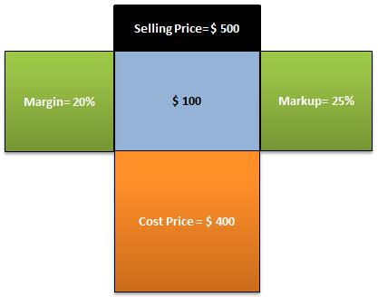

Understanding financial terms is crucial for businesses that aim to optimize their pricing strategies. Fundamental concepts such as profit margin and markup often lead to confusion, even among seasoned professionals. These concepts, while similar, provide distinct insights into the profitability and cost structure of a business, making them essential for informed decision-making in various economic sectors, including trading.

Profit margin is a measure that reflects the percentage of revenue that exceeds the cost of goods sold (COGS). It provides a direct indication of how much profit a company generates from its sales volume, relative to its revenue. Conversely, markup is the percentage added to the cost price of a product to determine its selling price. While both metrics use similar financial inputs, they serve different purposes; profit margin assesses profitability, whereas markup is more focused on pricing strategy.



Another significant aspect of contemporary trading is algorithmic trading, commonly referred to as algo trading. This practice involves using computer algorithms to execute trading strategies at speeds and frequencies that are impossible for human traders. As algorithmic trading gains traction, understanding the roles of profit margins and markups becomes increasingly relevant. These financial metrics are pivotal in developing algorithms that prioritize profitability while effectively managing costs.

This article aims to clearly differentiate between profit margin and markup, discuss their implications in algorithmic trading, and provide insights on their roles within the trading sector. By providing a detailed examination of these concepts, traders and business professionals can enhance their pricing strategies and leverage algorithmic trading for sustained success and profitability.

## Table of Contents

## Defining Profit Margin and Markup

Profit margin and markup are two fundamental concepts in financial management, crucial for understanding and optimizing pricing strategies. Though often used interchangeably, they provide different perspectives on profitability and pricing.

Profit margin is a financial metric representing the portion of revenue that exceeds the cost of goods sold (COGS). It is expressed as a percentage and is calculated using the formula:

$$
\text{Profit Margin} = \left( \frac{\text{Revenue} - \text{COGS}}{\text{Revenue}} \right) \times 100
$$

This metric indicates how much profit a business makes for every dollar of sales. A higher profit margin suggests efficient cost management and strong profitability, making this an essential consideration for financial analysis and strategic planning.

Markup, on the other hand, refers to the percentage added to the cost price of a product to determine its selling price. It is calculated as:

$$
\text{Markup} = \left( \frac{\text{Selling Price} - \text{COGS}}{\text{COGS}} \right) \times 100
$$

Markup reflects the amount added to the cost price to cover overheads and generate profit. It is a crucial component in pricing strategies, allowing businesses to set prices that can maximize revenue while ensuring competitiveness in the market.

Although both metrics involve similar financial inputs, they serve different purposes. Profit margin focuses on the proportion of profit relative to sales, while markup is concerned with the added amount over cost to achieve the selling price. Understanding both metrics is essential for businesses aiming to evaluate their pricing policies' effectiveness and overall financial health. By effectively managing profit margins and markups, companies can optimize their pricing strategies and unlock potential profit opportunities.

## Key Differences Between Profit Margin and Markup

Profit margin and markup are two essential financial metrics that assist businesses in setting effective pricing strategies, yet they often create confusion due to their similar nature. Understanding the difference between the two can provide greater insights and assist in making more informed decisions, particularly in trading environments.

Profit margin expresses profitability as a percentage of the selling price. It is calculated by subtracting the cost of goods sold (COGS) from the revenue, dividing the result by the revenue, and then multiplying by 100. The formula is:

$$

\text{Profit Margin (\%)} = \left(\frac{\text{Revenue} - \text{COGS}}{\text{Revenue}}\right) \times 100 
$$

Markup, on the other hand, represents the percentage added to the cost price to determine the selling price. It highlights the profit over the cost price rather than over the selling price, providing insights into the business's gross profit from its cost base. The formula for markup is:

$$

\text{Markup (\%)} = \left(\frac{\text{Revenue} - \text{COGS}}{\text{COGS}}\right) \times 100 
$$

To illustrate the key differences, consider a product that is sold for $100 with a COGS of $70. Using the profit margin formula:

$$

\text{Profit Margin} = \left(\frac{100 - 70}{100}\right) \times 100 = 30\% 
$$

Conversely, applying the markup formula:

$$

\text{Markup} = \left(\frac{100 - 70}{70}\right) \times 100 \approx 42.86\% 
$$

These calculations reveal that while the profit margin on the product is 30%, the markup is approximately 42.86%. Each metric provides distinct perspectives: the profit margin gives the ratio of net income relative to the selling price, while the markup shows how much above the cost price the product is sold for.

In both traditional and [algorithmic trading](/wiki/algorithmic-trading), these metrics are crucial for defining pricing strategies. A thorough grasp of these concepts can aid traders in determining optimal entry and [exit](/wiki/exit-strategy) points by understanding how various pricing strategies affect profitability. Decisions regarding whether to prioritize markup or margin can be adjusted based on the specific financial goals and conditions of the market.

In summary, acknowledging the contrast between profit margin and markup allows businesses and traders to apply the appropriate pricing strategies, which is particularly valuable in the rapidly evolving landscape of algo trading. This understanding not only enhances the financial acumen but also supports strategic decision-making essential for sustained business growth and competitiveness.

## Role of Profit Margin and Markup in Algorithmic Trading

Algorithmic trading leverages automated systems to execute predefined trading strategies with speed and efficiency. Crucial to the success of these systems is the capability to discern detailed financial metrics such as profit margin and markup. These metrics can aid the development of advanced trading algorithms designed to enhance profitability while keeping costs in check.

Profit margin, defined as the percentage of revenue remaining after deducting the cost of goods sold (COGS), provides insight into the overall profitability of trading activities. It is calculated as:

$$
\text{Profit Margin} = \left( \frac{\text{Selling Price} - \text{COGS}}{\text{Selling Price}} \right) \times 100
$$

In contrast, markup represents the percentage added to the cost price to determine the selling price. It is calculated using the formula:

$$
\text{Markup} = \left( \frac{\text{Selling Price} - \text{COGS}}{\text{COGS}} \right) \times 100
$$

In algorithmic trading, both metrics inform distinct yet complementary aspects of trade profitability. Understanding these dynamics allows traders to program algorithms that make optimal buying and selling decisions. Profit margins offer a holistic view of the profitability landscape, indicating the efficiency of the trading strategy relative to revenue generated. Markup, on the other hand, provides insight into pricing strategy relative to costs, essential for setting competitive and profitable price points in automated trading systems.

For instance, an algorithm could be programmed in Python to calculate profit margins and markups for a trading portfolio, using NumPy for handling large datasets efficiently. An example of such a code snippet might look like this:

```python
import numpy as np

def calculate_profit_metrics(selling_prices, cogs):
    # Ensure inputs are numpy arrays for efficient computation
    selling_prices = np.array(selling_prices)
    cogs = np.array(cogs)

    # Calculate profit margins and markups
    profit_margins = ((selling_prices - cogs) / selling_prices) * 100
    markups = ((selling_prices - cogs) / cogs) * 100

    return profit_margins, markups

# Example data
selling_prices = [150, 200, 250]
cogs = [120, 160, 200]

profit_margins, markups = calculate_profit_metrics(selling_prices, cogs)
print("Profit Margins:", profit_margins)
print("Markups:", markups)
```

This automated calculation ensures that trading algorithms can dynamically adjust their strategies in response to changing market conditions. By incorporating both profit margin and markup into trading algorithms, traders can exploit opportunities to maximize returns, assess the cost efficiency of trades, and optimize the execution of buying and selling points.

In summary, integrating profit margins and markup metrics into algorithmic trading frameworks equips traders with valuable insights to refine their strategies. As algorithmic systems continue to evolve, they are expected to increasingly incorporate these financial metrics, thereby enhancing their efficacy and precision in the trading sector.

## Implementing Markup and Margin Strategies in Trading

Implementing effective markup and margin strategies in trading requires a comprehensive understanding of market dynamics and cost structures. Traders must strategically determine when to apply markup or margin to their offerings to optimize profitability.

Analyzing the market involves identifying trends, assessing competition, and understanding consumer demand. This evaluation allows traders to set appropriate markup rates, which can maximize revenue without deterring customers. A higher markup might be feasible in a market with less competition, while a competitive market might require more modest markups to attract price-sensitive consumers.

Understanding the cost structure is essential for determining profit margins. This includes evaluating the cost of goods sold (COGS), fixed and variable costs, and potential external factors impacting costs, such as tariffs or supply chain disruptions. By accurately calculating these elements, traders can set realistic profit margins to ensure that revenue exceeds total costs.

Incorporating these strategies into algorithmic trading provides an opportunity for enhanced profitability and sustainability. Algorithmic trading systems can be programmed to adjust pricing based on predefined conditions, such as changes in market demand or input costs. For example, an algorithm may automatically increase markup during periods of high demand to capitalize on consumers' willingness to pay more, or it might reduce prices when demand wanes, aiming to maintain sales [volume](/wiki/volume-trading-strategy).

Traders might use Python to develop algorithms for this purpose. For instance, the following Python code snippet demonstrates a simple model for adjusting markup based on demand fluctuations:

```python
def adjust_markup(base_markup, demand_factor):
    if demand_factor > 1.2:
        return base_markup * 1.1  # Increase markup by 10%
    elif demand_factor < 0.8:
        return base_markup * 0.9  # Decrease markup by 10%
    else:
        return base_markup

current_markup = 0.30  # 30% markup
demand_factor = 1.3  # Example demand factor
new_markup = adjust_markup(current_markup, demand_factor)
```

This approach ensures that traders remain agile and responsive to market changes, using computational efficiency and real-time data to make informed pricing decisions. Consequently, implementing well-devised markup and margin strategies in trading, particularly through algorithmic methods, is central to achieving sustained profitability and competitive advantage.

## Conclusion

A clear understanding of both profit margin and markup is essential for any successful trading strategy, including algorithmic trading. Profit margin and markup are fundamental concepts that provide insights into pricing strategies, profit potential, and business sustainability.

Profit margin, calculated as $\text{Profit Margin} = \left(\frac{\text{Selling Price} - \text{Cost of Goods Sold (COGS)}}{\text{Selling Price}}\right) \times 100\%$, offers a measure of profitability relative to sales. This metric helps businesses assess how much of each dollar earned is retained as profit after covering costs.

On the other hand, markup, defined as $\text{Markup} = \left(\frac{\text{Selling Price} - \text{COGS}}{\text{COGS}}\right) \times 100\%$, assists in determining the percentage increase over the cost price necessary to achieve the desired selling price. Understanding both metrics allows traders to set competitive prices that cover costs and generate desired profit levels.

In algorithmic trading, where automated systems execute pre-defined strategies, integrating these financial concepts can lead to enhanced decision-making and trading performance. Algorithm developers must incorporate profit margin and markup considerations into trading algorithms to optimize buying and selling points, ensuring strategic pricing alignment with market conditions.

As trading technology advances, algorithms are expected to become increasingly sophisticated, further embedding these financial principles. By employing strategic pricing based on profit margins and markups, traders can foster a competitive advantage, achieve greater market penetration, and realize sustained profitability. These metrics will remain integral to the evolution of trading algorithms, continually informing price-setting mechanisms for improved trading results.

## References & Further Reading

[1]: ["Advances in Financial Machine Learning"](https://www.amazon.com/Advances-Financial-Machine-Learning-Marcos/dp/1119482089) by Marcos Lopez de Prado

[2]: ["Evidence-Based Technical Analysis: Applying the Scientific Method and Statistical Inference to Trading Signals"](https://www.amazon.com/Evidence-Based-Technical-Analysis-Scientific-Statistical/dp/0470008741) by David Aronson

[3]: ["Machine Learning for Algorithmic Trading"](https://github.com/stefan-jansen/machine-learning-for-trading) by Stefan Jansen

[4]: ["Quantitative Trading: How to Build Your Own Algorithmic Trading Business"](https://www.amazon.com/Quantitative-Trading-Build-Algorithmic-Business/dp/1119800064) by Ernest P. Chan

[5]: ["Pricing and Profitability Management: A Practical Guide for Business Leaders"](https://books.google.com/books/about/Pricing_and_Profitability_Management.html?id=Q5fMZOtlwJMC) by Julie Meehan, et al.

[6]: ["Financial Management: Theory & Practice"](https://faculty.cengage.com/titles/9781305632295) by Eugene F. Brigham and Michael C. Ehrhardt