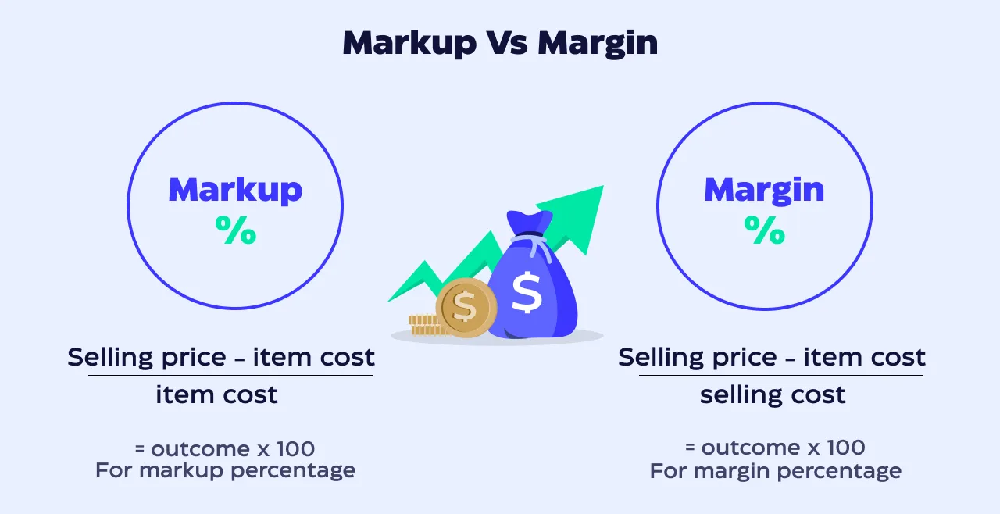

## Table of Contents

## What is profit margin?

Profit margin is a way to measure how much money a business makes after paying for the costs of making and selling its products or services. It is usually shown as a percentage. To find the profit margin, you subtract the cost of goods sold from the revenue, then divide that number by the revenue, and finally multiply by 100 to get a percentage. This percentage tells you what part of each dollar of sales is profit.

Different businesses have different profit margins because their costs and prices can be very different. For example, a grocery store might have a low profit margin because food items are usually sold at low prices. On the other hand, a jewelry store might have a high profit margin because jewelry can be sold at much higher prices. Knowing the profit margin helps business owners see if they are making enough money and if they need to change their prices or costs.

## What is markup?

Markup is the difference between how much it costs to make or buy something and how much you sell it for. It is usually shown as a percentage. To find the markup, you subtract the cost of the item from the selling price, then divide that number by the cost of the item, and finally multiply by 100 to get a percentage. This percentage shows how much more you are charging compared to what you paid.

Businesses use markup to make sure they can cover their costs and make a profit. For example, if a store buys a toy for $10 and sells it for $15, the markup is 50%. This means the store is charging 50% more than what they paid for the toy. Markup helps businesses decide on their selling prices and see if they are making enough money on each item they sell.

## How is profit margin calculated?

Profit margin is a way to see how much money a business makes after paying for the costs of making and selling its products or services. To calculate it, you start by taking the total revenue, which is all the money the business makes from sales. Then, you subtract the cost of goods sold, which is how much it costs to make or buy the products. After that, you divide the result by the total revenue. Finally, you multiply by 100 to turn the number into a percentage. This percentage is the profit margin.

For example, if a business makes $100,000 in sales and it costs them $60,000 to make those products, the profit is $40,000. To find the profit margin, you divide $40,000 by $100,000, which gives you 0.4. When you multiply 0.4 by 100, you get a profit margin of 40%. This means for every dollar the business makes in sales, they keep 40 cents as profit.

## How is markup calculated?

Markup is the extra money a business adds to the cost of an item to set its selling price. To find the markup, you take the selling price of the item and subtract the cost of the item. Then, you divide this difference by the cost of the item. Finally, you multiply the result by 100 to turn it into a percentage. This percentage is the markup.

For example, if a store buys a toy for $10 and sells it for $15, the markup calculation is simple. You subtract $10 from $15, which gives you $5. Then, you divide $5 by $10, which gives you 0.5. When you multiply 0.5 by 100, you get a markup of 50%. This means the store is selling the toy for 50% more than what they paid for it.

## Can you provide an example of how to calculate profit margin?

Let's say a business sells T-shirts. They make $10,000 from selling the T-shirts. It costs them $6,000 to make those T-shirts. To find out their profit margin, they first need to figure out their profit. They do this by subtracting the cost to make the T-shirts from the money they made selling them. So, $10,000 minus $6,000 equals $4,000. That's their profit.

Next, they need to find the profit margin as a percentage. They do this by dividing the profit by the total money they made from sales. So, $4,000 divided by $10,000 equals 0.4. Then, they multiply 0.4 by 100 to get the percentage. This gives them a profit margin of 40%. This means for every dollar they make from selling T-shirts, they keep 40 cents as profit.

## Can you provide an example of how to calculate markup?

Let's say a store buys a toy for $10 and decides to sell it for $15. To find out the markup, they first need to see how much extra they are adding to the price. They do this by subtracting the cost of the toy from the selling price. So, $15 minus $10 equals $5. That's the extra money they are adding.

Next, they need to figure out the markup as a percentage. They do this by dividing the extra money by the cost of the toy. So, $5 divided by $10 equals 0.5. Then, they multiply 0.5 by 100 to get the percentage. This gives them a markup of 50%. This means the store is selling the toy for 50% more than what they paid for it.

## What is the key difference between profit margin and markup?

Profit margin and markup are both ways to see how much money a business makes, but they look at it differently. Profit margin is the percentage of the selling price that is profit. You find it by taking the money made from sales, subtracting the cost to make or buy the product, then dividing that by the total sales and multiplying by 100. It tells you how much profit you make from each dollar of sales.

Markup, on the other hand, is the extra money added to the cost of the product to set the selling price. You calculate it by taking the selling price, subtracting the cost, then dividing that by the cost and multiplying by 100. Markup shows how much more you are charging compared to what you paid for the product. So, while profit margin focuses on the profit part of the selling price, markup focuses on the extra amount added to the cost.

## How do profit margin and markup affect pricing strategies?

Profit margin and markup are important when a business decides how much to charge for their products. Profit margin tells a business how much money they keep from each sale after paying for the cost of the product. If a business wants to make more profit, they might raise their prices or find ways to lower their costs. For example, if a business sees their profit margin is low, they might decide to increase their prices to make more money from each sale. This helps them know if their prices are too low or if they need to cut costs to make more profit.

Markup is the extra money a business adds to the cost of a product to set its selling price. A business might use markup to make sure they cover all their costs and make some profit. If the cost to make a product goes up, the business might need to increase the markup to keep making the same amount of profit. Or, if they want to attract more customers, they might lower the markup to offer lower prices. Both profit margin and markup help businesses decide on the best prices to charge, making sure they can cover costs and make enough profit.

## In what scenarios would a business focus more on profit margin than markup?

A business might focus more on profit margin than markup when they want to see how well they are doing overall. Profit margin shows them what percentage of their sales is profit after all costs. If a business is trying to grow and make more money, they will look at profit margin to see if they are on the right track. For example, if they see their profit margin is going down, they might need to find ways to cut costs or raise prices to keep making enough profit.

Another scenario where a business might focus on profit margin is when they are comparing themselves to other businesses in the same industry. Profit margin is a good way to see how they are doing compared to others. If their profit margin is lower than their competitors, they might need to change their strategy. This could mean finding cheaper ways to make their products or figuring out how to sell more at a higher price. By focusing on profit margin, they can make sure they are staying competitive and making enough money.

## In what scenarios would a business focus more on markup than profit margin?

A business might focus more on markup when they are deciding how much to charge for their products. Markup is how much more they add to the cost of making or buying something to set the price. If a business wants to make sure they cover all their costs and still make some profit, they will look at the markup. For example, if the cost of making a product goes up, they might need to increase the markup to keep making the same amount of profit. This helps them set prices that work for their business.

Another time a business might focus on markup is when they are trying to attract more customers. If they want to offer lower prices to bring in more people, they might lower the markup. This can help them sell more products, even if they make less profit on each one. By paying attention to markup, a business can adjust their prices to meet their goals, whether it's covering costs or attracting more customers.

## How do changes in cost of goods sold impact profit margin and markup?

When the cost of goods sold goes up, it can make the profit margin smaller. Profit margin is how much money a business keeps after paying for the things they sell. If it costs more to make or buy those things, the business makes less profit from each sale. For example, if a store buys T-shirts for $5 each and sells them for $10, their profit margin is 50%. But if the cost of the T-shirts goes up to $7, and they still sell them for $10, their profit margin drops to 30%. To keep the same profit margin, the store would need to raise the price of the T-shirts.

Changes in the cost of goods sold also affect markup. Markup is the extra money a business adds to the cost of something to set the price. If the cost goes up, the business might need to increase the markup to cover the higher cost and still make a profit. Using the T-shirt example again, if the store buys T-shirts for $5 and sells them for $10, the markup is 100%. But if the cost goes up to $7 and they still want to keep the same markup, they would need to sell the T-shirts for $14. If they don't want to raise the price that much, they might have to accept a lower markup, which means less profit per T-shirt.

## What advanced strategies can businesses use to optimize both profit margin and markup?

Businesses can use smart pricing to make both their profit margin and markup better. They can use something called dynamic pricing, where they change prices based on what customers want and how much they are willing to pay. For example, if a lot of people want a product, the business might raise the price a bit to make more money. They can also use data to see what prices work best. By looking at what they sell and how much they make, they can find the best price that keeps their profit margin high and their markup fair.

Another good strategy is to find ways to lower the cost of making things. If it costs less to make a product, a business can keep the same selling price but make more profit. This means their profit margin goes up. They can also lower their markup a little to offer better prices and sell more, without losing too much profit. For example, if a business finds a cheaper way to make their T-shirts, they can keep selling them for the same price but make more money on each one. By keeping an eye on costs and prices, a business can make sure they are doing well and making enough profit.

## What is the definition of Profit Margin and Markup?

Profit margin and markup are two fundamental concepts in financial management, crucial for understanding and optimizing pricing strategies. Though often used interchangeably, they provide different perspectives on profitability and pricing.

Profit margin is a financial metric representing the portion of revenue that exceeds the cost of goods sold (COGS). It is expressed as a percentage and is calculated using the formula:

$$
\text{Profit Margin} = \left( \frac{\text{Revenue} - \text{COGS}}{\text{Revenue}} \right) \times 100
$$

This metric indicates how much profit a business makes for every dollar of sales. A higher profit margin suggests efficient cost management and strong profitability, making this an essential consideration for financial analysis and strategic planning.

Markup, on the other hand, refers to the percentage added to the cost price of a product to determine its selling price. It is calculated as:

$$
\text{Markup} = \left( \frac{\text{Selling Price} - \text{COGS}}{\text{COGS}} \right) \times 100
$$

Markup reflects the amount added to the cost price to cover overheads and generate profit. It is a crucial component in pricing strategies, allowing businesses to set prices that can maximize revenue while ensuring competitiveness in the market.

Although both metrics involve similar financial inputs, they serve different purposes. Profit margin focuses on the proportion of profit relative to sales, while markup is concerned with the added amount over cost to achieve the selling price. Understanding both metrics is essential for businesses aiming to evaluate their pricing policies' effectiveness and overall financial health. By effectively managing profit margins and markups, companies can optimize their pricing strategies and unlock potential profit opportunities.

## What are the key differences between profit margin and markup?

Profit margin and markup are two essential financial metrics that assist businesses in setting effective pricing strategies, yet they often create confusion due to their similar nature. Understanding the difference between the two can provide greater insights and assist in making more informed decisions, particularly in trading environments.

Profit margin expresses profitability as a percentage of the selling price. It is calculated by subtracting the cost of goods sold (COGS) from the revenue, dividing the result by the revenue, and then multiplying by 100. The formula is:

$$

\text{Profit Margin (\%)} = \left(\frac{\text{Revenue} - \text{COGS}}{\text{Revenue}}\right) \times 100 
$$

Markup, on the other hand, represents the percentage added to the cost price to determine the selling price. It highlights the profit over the cost price rather than over the selling price, providing insights into the business's gross profit from its cost base. The formula for markup is:

$$

\text{Markup (\%)} = \left(\frac{\text{Revenue} - \text{COGS}}{\text{COGS}}\right) \times 100 
$$

To illustrate the key differences, consider a product that is sold for $100 with a COGS of $70. Using the profit margin formula:

$$

\text{Profit Margin} = \left(\frac{100 - 70}{100}\right) \times 100 = 30\% 
$$

Conversely, applying the markup formula:

$$

\text{Markup} = \left(\frac{100 - 70}{70}\right) \times 100 \approx 42.86\% 
$$

These calculations reveal that while the profit margin on the product is 30%, the markup is approximately 42.86%. Each metric provides distinct perspectives: the profit margin gives the ratio of net income relative to the selling price, while the markup shows how much above the cost price the product is sold for.

In both traditional and [algorithmic trading](/wiki/algorithmic-trading), these metrics are crucial for defining pricing strategies. A thorough grasp of these concepts can aid traders in determining optimal entry and [exit](/wiki/exit-strategy) points by understanding how various pricing strategies affect profitability. Decisions regarding whether to prioritize markup or margin can be adjusted based on the specific financial goals and conditions of the market.

In summary, acknowledging the contrast between profit margin and markup allows businesses and traders to apply the appropriate pricing strategies, which is particularly valuable in the rapidly evolving landscape of algo trading. This understanding not only enhances the financial acumen but also supports strategic decision-making essential for sustained business growth and competitiveness.

## What is the Role of Profit Margin and Markup in Algorithmic Trading?

Algorithmic trading leverages automated systems to execute predefined trading strategies with speed and efficiency. Crucial to the success of these systems is the capability to discern detailed financial metrics such as profit margin and markup. These metrics can aid the development of advanced trading algorithms designed to enhance profitability while keeping costs in check.

Profit margin, defined as the percentage of revenue remaining after deducting the cost of goods sold (COGS), provides insight into the overall profitability of trading activities. It is calculated as:

$$
\text{Profit Margin} = \left( \frac{\text{Selling Price} - \text{COGS}}{\text{Selling Price}} \right) \times 100
$$

In contrast, markup represents the percentage added to the cost price to determine the selling price. It is calculated using the formula:

$$
\text{Markup} = \left( \frac{\text{Selling Price} - \text{COGS}}{\text{COGS}} \right) \times 100
$$

In algorithmic trading, both metrics inform distinct yet complementary aspects of trade profitability. Understanding these dynamics allows traders to program algorithms that make optimal buying and selling decisions. Profit margins offer a holistic view of the profitability landscape, indicating the efficiency of the trading strategy relative to revenue generated. Markup, on the other hand, provides insight into pricing strategy relative to costs, essential for setting competitive and profitable price points in automated trading systems.

For instance, an algorithm could be programmed in Python to calculate profit margins and markups for a trading portfolio, using NumPy for handling large datasets efficiently. An example of such a code snippet might look like this:

```python
import numpy as np

def calculate_profit_metrics(selling_prices, cogs):
    # Ensure inputs are numpy arrays for efficient computation
    selling_prices = np.array(selling_prices)
    cogs = np.array(cogs)

    # Calculate profit margins and markups
    profit_margins = ((selling_prices - cogs) / selling_prices) * 100
    markups = ((selling_prices - cogs) / cogs) * 100

    return profit_margins, markups

# Example data
selling_prices = [150, 200, 250]
cogs = [120, 160, 200]

profit_margins, markups = calculate_profit_metrics(selling_prices, cogs)
print("Profit Margins:", profit_margins)
print("Markups:", markups)
```

This automated calculation ensures that trading algorithms can dynamically adjust their strategies in response to changing market conditions. By incorporating both profit margin and markup into trading algorithms, traders can exploit opportunities to maximize returns, assess the cost efficiency of trades, and optimize the execution of buying and selling points.

In summary, integrating profit margins and markup metrics into algorithmic trading frameworks equips traders with valuable insights to refine their strategies. As algorithmic systems continue to evolve, they are expected to increasingly incorporate these financial metrics, thereby enhancing their efficacy and precision in the trading sector.

## References & Further Reading

[1]: ["Advances in Financial Machine Learning"](https://www.amazon.com/Advances-Financial-Machine-Learning-Marcos/dp/1119482089) by Marcos Lopez de Prado

[2]: ["Evidence-Based Technical Analysis: Applying the Scientific Method and Statistical Inference to Trading Signals"](https://www.amazon.com/Evidence-Based-Technical-Analysis-Scientific-Statistical/dp/0470008741) by David Aronson

[3]: ["Machine Learning for Algorithmic Trading"](https://github.com/stefan-jansen/machine-learning-for-trading) by Stefan Jansen

[4]: ["Quantitative Trading: How to Build Your Own Algorithmic Trading Business"](https://www.amazon.com/Quantitative-Trading-Build-Algorithmic-Business/dp/1119800064) by Ernest P. Chan

[5]: ["Pricing and Profitability Management: A Practical Guide for Business Leaders"](https://books.google.com/books/about/Pricing_and_Profitability_Management.html?id=Q5fMZOtlwJMC) by Julie Meehan, et al.

[6]: ["Financial Management: Theory & Practice"](https://faculty.cengage.com/titles/9781305632295) by Eugene F. Brigham and Michael C. Ehrhardt