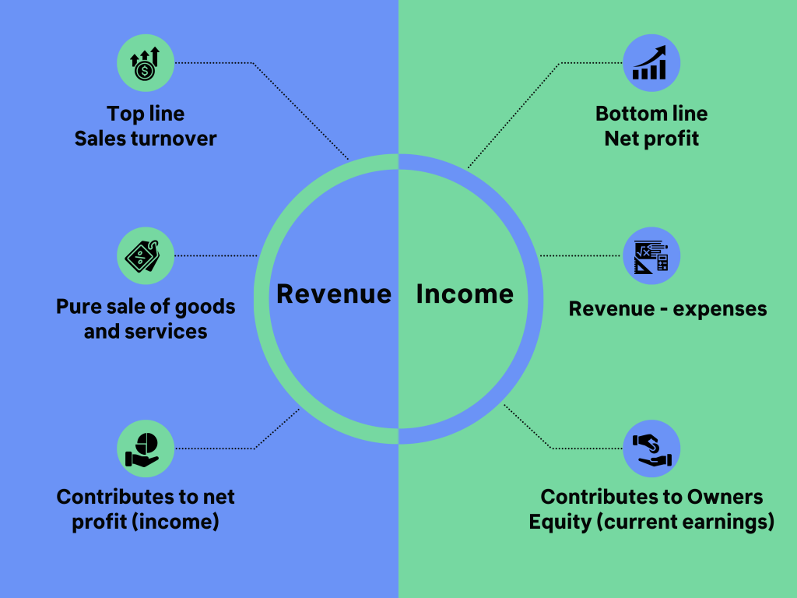

## Table of Contents

## What is profit?

Profit is the money a business makes after paying for all its costs. When a company sells its products or services, it earns money. This money is called revenue. To find out the profit, the company subtracts all the costs, like the cost of making the product, paying employees, and other expenses, from the revenue. If the revenue is more than the costs, the company has a profit.

Profit is important because it shows if a business is doing well. If a company keeps making a profit, it can grow and do more things, like hiring more people or making new products. If a company does not make a profit, it might have to change how it does things or it could even have to close. So, profit is a key part of running a successful business.

## What are earnings?

Earnings are the money a company makes from its business activities. It's what's left after the company pays for things like making products, paying workers, and other costs. When people talk about earnings, they usually mean the profit a company makes in a certain time, like a quarter or a year.

Earnings are important because they show how well a company is doing. If a company has high earnings, it means the business is making more money than it spends. This is good because it can use that money to grow, pay its owners, or save for the future. If earnings are low or negative, it means the company is not making enough money to cover its costs, which can be a problem.

## How is profit calculated?

Profit is calculated by taking the total money a business makes, which is called revenue, and subtracting all the costs of running the business. These costs can include things like the price of making the product, paying employees, rent, and other expenses. If the revenue is more than the costs, the difference is the profit.

For example, if a business makes $100,000 from selling its products and it costs $80,000 to make those products and run the business, the profit would be $20,000. This simple calculation helps business owners see if they are making money or losing money. If the costs are more than the revenue, the business would have a loss instead of a profit.

## How are earnings calculated?

Earnings are what's left after a company pays for everything it needs to run its business. To find out the earnings, you start with the total money the company makes from selling its products or services. This total money is called revenue. Then, you subtract all the costs the company has, like the money spent on making the products, paying the workers, rent, and other expenses. If the revenue is more than these costs, the difference is the earnings.

Earnings are important because they show how well a company is doing. If a company has high earnings, it means the business is making more money than it spends. This is good because the company can use that money to grow, pay its owners, or save for the future. If the earnings are low or if there are no earnings at all, it means the company is not making enough money to cover its costs, which can be a problem.

## What is the difference between gross profit and net profit?

Gross profit and net profit are two ways to measure how much money a business is making, but they look at different things. Gross profit is what's left after a business subtracts the cost of making or buying the products it sells from the money it makes from selling those products. This is called the cost of goods sold. So, if a business sells a product for $100 and it cost $60 to make, the gross profit is $40. Gross profit helps show how well a business is doing at making or buying things to sell.

Net profit, on the other hand, looks at all the money a business makes and subtracts all the costs of running the business. This includes the cost of goods sold, but also other costs like paying employees, rent, and other expenses. Using the same example, if the business made $100 from selling the product, it cost $60 to make it, and other costs were $20, the net profit would be $20. Net profit shows the true amount of money a business is making after paying for everything, and it's a better measure of the overall health of the business.

## How do profits and earnings affect a company's financial statements?

Profits and earnings are important numbers that show up on a company's financial statements. They help people see how well the company is doing. Profits are what's left after a company pays for everything it needs to run its business. This number goes on the income statement, which is a report that shows how much money the company made and spent over a certain time. If a company has a big profit, it means the business is doing well and making more money than it spends. This can make the company look good to people who might want to invest in it or lend it money.

Earnings are similar to profits but can be used in different ways on financial statements. Earnings are also shown on the income statement and can be used to figure out how much money the company can pay to its owners or shareholders. If a company has high earnings, it might decide to give some of that money back to the people who own part of the company, like through dividends. Earnings also help people understand if the company is growing and making more money over time. Both profits and earnings are key parts of financial statements because they show if the company is healthy and doing well.

## Can a company have earnings but no profit?

Yes, a company can have earnings but no profit. Earnings are the money a company makes from its business activities before paying for all its costs. If a company has earnings, it means it made some money from selling its products or services. But if the costs of running the business, like paying employees, rent, and other expenses, are more than the earnings, the company will not have a profit. So, even though the company made some money, it spent more than it earned, leading to no profit.

This situation can happen if a company has high costs that eat up all the money it makes. For example, a company might have a lot of debt and have to pay a lot of interest on that debt. Or it might have to spend a lot on new equipment or other big expenses. Even though the company is making money from its sales, these high costs can mean it doesn't have any profit left at the end of the day.

## How do investors use profit and earnings to evaluate a company?

Investors use profit and earnings to see how well a company is doing. They look at profit to see if the company is making more money than it spends. If a company has a big profit, it means the business is healthy and doing well. Investors like to see profits because it shows the company can grow and maybe give money back to them, like through dividends. If a company keeps making profits, it can also mean the company is good at managing its money and making smart choices.

Earnings are also important for investors. Earnings show how much money the company makes from its business before paying all its costs. Investors use earnings to guess how much money the company might make in the future. They look at the earnings to see if the company is growing and making more money over time. If a company has high earnings, it can be a good sign that the business is strong and might keep doing well. But if earnings are low or going down, it might mean the company is having problems and investors might not want to put their money into it.

## What role do non-operating incomes and expenses play in the distinction between profits and earnings?

Non-operating incomes and expenses are things that a company earns or spends that are not part of its main business. For example, if a company makes money from selling some old equipment or loses money because it has to pay interest on a loan, these are non-operating incomes and expenses. When we talk about earnings, we usually mean the money a company makes from its main business activities before taking away these non-operating costs. So, earnings do not include money from selling old equipment or the cost of loan interest.

Profits, on the other hand, are what's left after a company subtracts all its costs, including non-operating incomes and expenses, from its total earnings. So, if a company made money from its main business but also had to pay a lot of interest on a loan, that interest would be taken away when calculating the profit. This means that profits give a full picture of how much money the company has left after paying for everything, while earnings show how well the company is doing just from its main business activities.

## How do accounting standards impact the reporting of profits and earnings?

Accounting standards are rules that companies must follow when they write down their financial information. These rules make sure that everyone reports their profits and earnings in the same way. This is important because it helps investors and others understand a company's financial health easily. For example, some accounting standards say how a company should count its revenue or what costs it should include when figuring out its profits. If companies follow these rules, it makes it easier to compare one company to another.

Different countries might have different accounting standards, but many companies use a set of rules called International Financial Reporting Standards (IFRS) or Generally Accepted Accounting Principles (GAAP) in the United States. These standards can affect how profits and earnings are shown on a company's financial statements. For instance, IFRS might allow a company to count some costs differently than GAAP does. This can make the reported profits and earnings look different, even if the company is doing the same thing. So, knowing which accounting standards a company uses can help people understand its financial reports better.

## What are the tax implications of profits versus earnings?

Profits and earnings can affect how much tax a company has to pay. Earnings are the money a company makes from its main business before paying all its costs. When a company calculates its taxes, it usually starts with its earnings. But the tax it has to pay is based on its profits, which is what's left after subtracting all costs, including non-operating expenses like interest on loans. So, if a company has high earnings but also high costs, it might end up paying less tax because its profits are lower.

Different countries have different rules about how to calculate taxes on profits. In some places, companies can take away certain costs from their earnings to lower their taxable profits. For example, a company might be able to take away the cost of buying new equipment or paying for research. This can make the company's taxable profit smaller, so it pays less tax. But if a company has a lot of non-operating income, like money from selling old equipment, this might increase its taxable profit and lead to more tax to pay.

## How do profits and earnings influence a company's stock price and market valuation?

Profits and earnings are really important for a company's stock price and how much the market thinks the company is worth. When a company makes a lot of profit, it usually means the business is doing well. Investors like to see profits because it shows the company can grow and maybe give money back to them, like through dividends. If a company keeps making profits, it can also mean the company is good at managing its money and making smart choices. This makes investors feel good about the company, so they might want to buy its stock, which can make the stock price go up. A higher stock price means the market thinks the company is worth more.

Earnings are also important for a company's stock price and market valuation. Earnings show how much money the company makes from its main business before paying all its costs. Investors use earnings to guess how much money the company might make in the future. They look at the earnings to see if the company is growing and making more money over time. If a company has high earnings, it can be a good sign that the business is strong and might keep doing well. This can make investors want to buy the company's stock, which can push the stock price up and increase the company's market valuation. But if earnings are low or going down, it might mean the company is having problems, and investors might not want to put their money into it, which can lower the stock price and the company's market value.

## What is the key to understanding financial terminology?

Financial terminology encompasses a broad spectrum of terms pivotal to navigating the financial industry, as they provide the foundational language for interpreting market data and financial statements. These terms, such as 'assets,' 'liabilities,' 'equity,' and 'dividends,' are crucial for understanding a company's performance and financial health.

1. **Assets** are resources owned by a company, which hold economic value and are expected to provide future benefits. Assets can be classified into current assets, such as cash and inventory, and non-current assets, like property and equipment. A balance sheet offers a snapshot of these assets at a specific point in time.

2. **Liabilities** represent the obligations a company owes to external parties and are the opposite of assets. Liabilities are categorized into current liabilities, due within one year, and long-term liabilities, which are due beyond a year. They encompass debts like loans, accounts payable, and mortgages, reflected on the company's balance sheet.

3. **Equity** refers to the residual interest in the assets of a company after deducting liabilities. It represents the ownership value held by shareholders and includes elements like retained earnings and share capital. Equity can be calculated as: 
$$
   \text{Equity} = \text{Total Assets} - \text{Total Liabilities}

$$

   This equation underlines the fundamental accounting equation, showing the relationship between assets, liabilities, and equity.

4. **Dividends** are distributions of a portion of a company's earnings to shareholders and can be issued in various forms, including cash payments or additional shares. While dividends indicate a company's profitability, the decision to pay them and the amount are determined by the company's board of directors.

Understanding these fundamental terms aids not only in personal financial management but also in grasping broader market trends and dynamics. These elements are frequently used to analyze companies' financial outcomes and strategic positions within the market. Mastery of financial terminology enables individuals and businesses to make informed decisions, ultimately impacting their financial success.

## What is the process of decoding earnings and profits?

Earnings represent the net profit of a company after accounting for all expenses, which include costs of goods sold (COGS), operating expenses, interest, taxes, and other miscellaneous expenses. Mathematically, earnings can be represented as:

$$
\text{Earnings} = \text{Total Revenue} - (\text{COGS} + \text{Operating Expenses} + \text{Interest} + \text{Taxes} + \text{Other Expenses})
$$

This metric serves as a crucial indicator of a company's profitability and operational success over a specified period. The terms 'earnings' and 'profits' are often used interchangeably, though 'profits' typically denote the financial gain realized when a company's revenue surpasses its expenses.

A nuanced understanding of various profit metrics, such as gross profit, operating profit, and net income, provides diverse insights into a company’s financial health:

1. **Gross Profit**: This is calculated as total revenue minus the cost of goods sold. It reflects the efficiency of production and the core profitability of a company's primary business activities.

   \[ \text{Gross Profit} = \text{Total Revenue} - \text{COGS}
$$

2. **Operating Profit**: Also known as operating income, this measures profits from core business operations, excluding deductions of interest and taxes. It reflects a company’s ability to manage its operational expenses.

   \[ \text{Operating Profit} = \text{Gross Profit} - \text{Operating Expenses}
$$

3. **Net Income**: Often referred to simply as earnings, net income is the amount of profit remaining after all expenses, including taxes and interest, have been deducted from total revenue. It represents the actual profit attributable to shareholders.

   \[ \text{Net Income} = \text{Operating Profit} - (\text{Interest} + \text{Taxes})
$$

These financial metrics are vital for investors as they provide insights into a company’s ability to generate cash flow and yields on investment. Earnings are particularly critical as they underpin the calculation of earnings per share (EPS), a widely used metric:

$$
\text{EPS} = \frac{\text{Net Income}}{\text{Average Outstanding Shares}}
$$

Publicly listed companies publish earnings reports quarterly, offering comprehensive details about their financial performance. Investors scrutinize these reports to discern patterns in earnings growth, stability, or decline and to inform their investment decisions, assessing whether a company can consistently deliver shareholder value. Such informed assessments can significantly impact portfolio management and investment strategies. Investors look for trends such as positive earnings growth over consecutive quarters, highlighting a company's robust performance, or analyze the reasons behind any negative deviations to make strategic financial decisions.

## References & Further Reading

[1]: Bergstra, J., Bardenet, R., Bengio, Y., & Kégl, B. (2011). ["Algorithms for Hyper-Parameter Optimization."](https://papers.nips.cc/paper/4443-algorithms-for-hyper-parameter-optimization) Advances in Neural Information Processing Systems 24.

[2]: ["Advances in Financial Machine Learning"](https://www.amazon.com/Advances-Financial-Machine-Learning-Marcos/dp/1119482089) by Marcos Lopez de Prado

[3]: ["Evidence-Based Technical Analysis: Applying the Scientific Method and Statistical Inference to Trading Signals"](https://www.amazon.com/Evidence-Based-Technical-Analysis-Scientific-Statistical/dp/0470008741) by David Aronson

[4]: ["Machine Learning for Algorithmic Trading"](https://github.com/stefan-jansen/machine-learning-for-trading) by Stefan Jansen

[5]: ["Quantitative Trading: How to Build Your Own Algorithmic Trading Business"](https://www.amazon.com/Quantitative-Trading-Build-Algorithmic-Business/dp/1119800064) by Ernest P. Chan