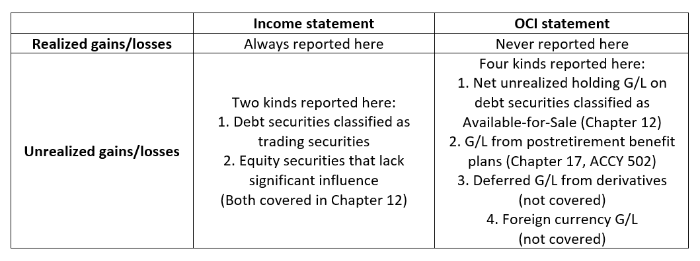

## Table of Contents

## What is a realized profit?

A realized profit is the money you actually gain from selling something for more than you paid for it. For example, if you bought a stock for $50 and sold it later for $70, your realized profit would be $20. This is different from an unrealized profit, which is just the increase in value of something you still own but haven't sold yet.

Realized profits are important because they show the actual cash you have made. Until you sell an asset, any increase in its value is just on paper and can change. Once you sell and realize the profit, you can use that money for other things or reinvest it. This is why people often talk about realized profits when discussing their financial gains.

## What is an unrealized profit?

An unrealized profit is the increase in value of something you own, but you haven't sold it yet. For example, if you bought a stock for $50 and it's now worth $70, you have an unrealized profit of $20. This profit is "unrealized" because you haven't actually sold the stock to get that extra $20 in cash.

This kind of profit is important to keep track of because it shows how much your investments have grown in value. However, it's not money you can spend until you sell the asset. If the value of the stock drops back to $50 or below before you sell, your unrealized profit could disappear. That's why it's different from a realized profit, which is the actual cash you get when you sell something for more than you paid for it.

## How is a realized profit calculated?

To calculate a realized profit, you need to know how much you paid for something and how much you sold it for. Take the selling price and subtract the buying price. The result is your realized profit. For example, if you bought a bike for $100 and sold it for $150, your realized profit would be $150 minus $100, which equals $50.

It's important to remember that realized profit only counts when you actually sell the item. Until then, any increase in value is just an unrealized profit. Realized profit is the actual money you can use because you've turned your asset into cash.

## How is an unrealized profit calculated?

To calculate an unrealized profit, you look at how much the value of something you own has gone up since you bought it. For example, if you bought a painting for $1,000 and now it's worth $1,500, your unrealized profit is $500. You find this by taking the current value of the painting ($1,500) and subtracting what you paid for it ($1,000).

The key thing about unrealized profit is that it's not real money yet. You only have this profit on paper because you haven't sold the painting. If you decide to sell it for $1,500, then the $500 becomes a realized profit, and you can actually use that money. Until you sell, the value of the painting could go up or down, so the unrealized profit can change.

## Can you provide an example of a realized profit?

Let's say you bought a bicycle for $100. You used it for a while and then decided to sell it. You found someone who was willing to pay $150 for the bike. When you sold the bike for $150, you made a realized profit of $50. That's because you sold the bike for more than what you paid for it.

The $50 is a realized profit because it's actual money you can use. You didn't just think the bike was worth more; you actually sold it and got the extra money. This is different from if the bike's value just went up to $150 but you didn't sell it. In that case, you would have an unrealized profit, which is just the idea of making more money, not the real money in your pocket.

## Can you provide an example of an unrealized profit?

Imagine you bought a comic book for $20. Over time, the comic book becomes more popular and people are now willing to pay $50 for it. You still have the comic book and haven't sold it yet. The difference between what you paid for it ($20) and what it's worth now ($50) is your unrealized profit. In this case, your unrealized profit is $30.

This profit is called "unrealized" because it's not real money in your pocket yet. You can see that the comic book is worth more, but you haven't sold it to get the extra $30. If you decide to sell the comic book for $50, then the $30 becomes a realized profit. Until then, the value of the comic book could go up or down, so your unrealized profit can change.

## When does a profit become realized?

A profit becomes realized when you sell something for more money than you paid for it. For example, if you bought a toy for $10 and then sold it for $15, the extra $5 you made is your realized profit. This is because you turned the toy into actual money that you can use.

Until you sell the item, any increase in its value is just an unrealized profit. That means you might see that the toy is now worth $15, but you won't have the extra $5 until you actually sell it. Once you sell it, the profit becomes real and you can spend it or save it.

## Why might an investor choose to keep a profit unrealized?

An investor might choose to keep a profit unrealized because they believe the value of their investment could go up even more in the future. If they think the stock or asset they own will keep increasing in value, they might wait to sell it later for a bigger profit. This way, they can potentially make more money than if they sold it right away.

Another reason is to avoid paying taxes on the profit right away. When an investor sells an asset and realizes a profit, they usually have to pay taxes on that profit. By keeping the profit unrealized, they can delay paying those taxes until they actually sell the asset. This can be a smart move if they expect their tax situation to be better in the future or if they want to use the money for other investments first.

## What are the tax implications of realized versus unrealized profits?

When you sell something and make a profit, that's called a realized profit. You have to pay taxes on this money. In the United States, for example, if you sell a stock and make a profit, you'll need to pay capital gains tax on that profit. The tax rate depends on how long you held the asset. If you held it for less than a year, it's a short-term capital gain and you pay your regular income tax rate. If you held it for more than a year, it's a long-term capital gain and the tax rate is usually lower.

Unrealized profits, on the other hand, are not taxed because they're not real money yet. If you own a stock that has gone up in value but you haven't sold it, you don't owe any taxes on that increase. You only pay taxes when you sell the stock and turn that unrealized profit into a realized profit. This is why some investors choose to hold onto their investments and keep their profits unrealized, to delay paying taxes until they're ready to sell.

## How do realized and unrealized profits affect investment strategies?

Realized and unrealized profits play a big role in how investors plan their strategies. When you have an unrealized profit, it means the value of your investment has gone up but you haven't sold it yet. Some investors might decide to wait and keep the profit unrealized because they think the value will keep going up. This way, they could make even more money if they sell later. But it's a bit risky because if the value goes down, they could lose that unrealized profit.

On the other hand, when you sell your investment and make a realized profit, you get actual money that you can use. This can be good because you can then use that money to buy other things or invest in something else. But you also have to think about taxes. When you realize a profit, you usually have to pay taxes on it right away. So, some investors might choose to keep their profits unrealized for a while to delay paying taxes until they sell. Balancing the potential for more growth with the need for cash and the tax implications is a key part of making investment decisions.

## What are the psychological impacts of realizing or not realizing profits on investors?

Realizing a profit can make an investor feel really good. It's like getting a reward for making a smart choice. When you see the actual money in your account, it can boost your confidence and make you feel successful. But sometimes, it can also make you feel like you should have waited longer if the value keeps going up after you sell. This can lead to second-guessing your decisions and feeling unsure about when to sell in the future.

Not realizing a profit can be stressful because it's like having money that you can't use yet. You see the value of your investment go up, but you don't have the cash in hand. This can make you feel anxious about whether to sell now or wait for more growth. It's a bit like waiting for a prize that might get bigger, but you're not sure if it will. This uncertainty can keep investors up at night, worrying about the best time to turn their unrealized profits into real money.

## How do accounting standards treat realized and unrealized profits differently?

Accounting standards treat realized and unrealized profits differently because they want to show a clear picture of a company's financial health. Realized profits are recorded on the income statement when an asset is sold for more than its cost. For example, if a company sells a piece of equipment for more than it paid, that extra money is shown as a realized profit. This is important because it shows the actual money the company made from its operations.

Unrealized profits, on the other hand, are not shown on the income statement because they are not real money yet. These profits are recorded in the balance sheet, often under "other comprehensive income" or as part of the asset's value. For example, if a company owns stocks that have gone up in value but hasn't sold them, the increase is an unrealized profit. This helps investors see the potential value of the company's assets, but it's not counted as income until the stocks are sold.

## References & Further Reading

[1]: Bergstra, J., Bardenet, R., Bengio, Y., & Kégl, B. (2011). ["Algorithms for Hyper-Parameter Optimization."](https://papers.nips.cc/paper/4443-algorithms-for-hyper-parameter-optimization) Advances in Neural Information Processing Systems 24.

[2]: ["Advances in Financial Machine Learning"](https://www.amazon.com/Advances-Financial-Machine-Learning-Marcos/dp/1119482089) by Marcos Lopez de Prado

[3]: ["Evidence-Based Technical Analysis: Applying the Scientific Method and Statistical Inference to Trading Signals"](https://www.amazon.com/Evidence-Based-Technical-Analysis-Scientific-Statistical/dp/0470008741) by David Aronson

[4]: ["Machine Learning for Algorithmic Trading"](https://github.com/stefan-jansen/machine-learning-for-trading) by Stefan Jansen

[5]: ["Quantitative Trading: How to Build Your Own Algorithmic Trading Business"](https://www.amazon.com/Quantitative-Trading-Build-Algorithmic-Business/dp/1119800064) by Ernest P. Chan