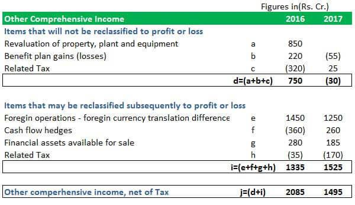

In the ever-evolving world of finance, the concepts of unrealized profits, realized profits, and paper profits are pivotal to understanding a trader's financial standing and decision-making process. These profit types offer insights into both potential and actual financial outcomes, influencing how financial strategies are formulated and executed. 

Unrealized profits, also referred to as paper profits, arise from an increase in the value of an asset that a trader has not yet sold. While they reflect the potential profit based on current market prices, they remain susceptible to market volatility. Thus, these profits can either grow or diminish without any actual transaction taking place.



On the other hand, realized profits are captured when a transaction is completed; a trader sells an asset, solidifying the financial gain. This crystallization of profits directly impacts cash flow and financial statements, marking a tangible financial advantage for the trader.

Algorithmic trading, or algo trading, plays a significant role in how traders manage and account for these types of profits. By employing computer programs that follow predefined trading strategies, algo trading helps minimize human error and emotional biases, leading to more efficient execution of trades. This technology enables not just the optimization of profit realization but also aids in strategic decision-making to maintain or liquidate positions based on real-time data analysis.

Understanding the nuances of these profit types and the influence of algorithmic trading is crucial for both novice and experienced traders. Algo trading significantly impacts the realization and management of profits through automation and strategic planning. Before examining these connections further, a foundational understanding of unrealized profits, realized profits, and their implications is essential. This groundwork will later connect these concepts to algorithmic trading strategies, offering a comprehensive view of modern financial trading landscapes.

## Table of Contents

## Understanding Unrealized Profits

Unrealized profits, often referred to as paper profits, are gains that exist on paper due to open positions in financial markets. These profits emerge when the market value of an asset exceeds its initial purchase price, resulting in a hypothetical increase in wealth. However, because the profit is tied to fluctuating market conditions, it remains theoretical until the position is closed, and the asset is sold.

For traders, understanding the dynamics of unrealized profits is critical. Market fluctuations can rapidly alter these profits. For example, if a trader buys a stock at $50 and its market price rises to $75, the unrealized profit is $25 per share. Yet, if the market price subsequently falls to $45, that unrealized gain evaporates, potentially becoming a loss. Thus, vigilant monitoring of market conditions is essential to make informed decisions about when to realize these gains by closing positions.

The influence of unrealized profits on portfolio performance should not be underestimated. They can provide a misleading sense of security regarding one's financial standing, as they do not represent liquid assets. A portfolio might appear robust when, in reality, it depends significantly on the performance of open positions that can fluctuate with market volatilities. Therefore, traders must weigh the benefits and risks of maintaining open positions in their strategies.

Moreover, the tax implications of unrealized profits remain dormant until the profits are realized. In most jurisdictions, taxes are assessed at the time of sale or closure of the position, reflecting a shift from paper profits to actual earnings. This deferred tax obligation can influence a trader's timing decisions when realizing gains, as the realization event triggers potential tax liabilities.

In summary, while unrealized profits have the potential to enhance a trader's financial profile, understanding their transient nature and implications is essential for effective portfolio management and strategic financial planning.

## What Are Realized Profits?

Realized profits are generated when a trader finalizes a transaction by closing their position, thus solidifying the gains earned. Unlike unrealized or paper profits, realized profits signify actual income that can influence a trader's [liquidity](/wiki/liquidity-risk-premium) and financial planning. These profits play a crucial role in determining an individual's or entity's financial status as they are directly translated into cash flow and can be utilized for further investments or consumption.

The taxation of realized profits is a significant consideration for traders, as these earnings are typically subject to capital gains tax. The percentage of tax levied varies by jurisdiction and can be influenced by factors such as the holding period of the asset and the trader's total income bracket. For instance, in the United States, long-term capital gains (assets held for more than a year) are taxed at lower rates compared to short-term capital gains, which are taxed at the regular income tax rate. Understanding these tax implications is essential for traders to ensure optimal financial returns.

To maximize realized profits, traders can employ several strategies, such as:

1. **Market Timing**: Implementing strategies like technical analysis to determine the best times to enter and exit positions can enhance profit margins.

2. **Diversification**: Spreading investments across various asset classes or sectors can reduce risk and increase the chances of earning returns across a portfolio.

3. **Stop-Loss Orders**: Setting automatic sell orders at certain price levels can help limit downside risk, ensuring that profits are preserved by selling positions before significant market downturns.

4. **Reinvestment**: Rather than withdrawing profits, traders may reinvest in other promising assets, thereby compounding their returns over time.

5. **Hedging Strategies**: Using derivatives or other financial instruments to offset potential losses can safeguard realized profits against unfavorable market movements.

By understanding and applying these strategies, traders can more effectively manage their portfolios to achieve favorable financial outcomes through realized profits.

## The Role of Paper Profits

Paper profits, also referred to as unrealized profits, denote the potential gains that arise from holding financial instruments, like stocks or bonds, which have appreciated in value but have not yet been sold. These theoretical gains are calculated based on current market prices and can fluctuate significantly due to market [volatility](/wiki/volatility-trading-strategies). Consequently, while a trader may see a promising increase in portfolio value, these profits are not secured until the positions are closed.

The volatile nature of the market directly impacts paper profits, leading to potential increases or decreases in the value of open positions. For instance, a sudden economic event or an news announcement can cause significant price shifts. Thus, understanding and monitoring market trends is crucial when considering paper profits. Traders must decide whether to hold onto a potentially lucrative position, anticipating further gains, or to sell and secure profits before potential market reversals.

Managing paper profits involves carefully weighing the upside potential against the potential for a downturn. This balancing act requires a risk management strategy that considers the trader's overall financial goals and risk tolerance. Traders might choose to employ techniques like setting stop-loss orders, which automatically sell off assets if they fall below a certain price, to mitigate downside risks. 

When assessing a trader's portfolio performance, paper profits present both an opportunity and a challenge. They offer insight into potential returns, guiding decisions regarding asset allocation and strategy adjustments. However, relying too heavily on paper profits can lead to overestimation of actual portfolio performance, as these profits are not guaranteed. 

Moreover, paper profits can serve as a psychological motivator, encouraging traders to pursue further investment opportunities. Nevertheless, caution is advised, given their impermanent nature. Overconfidence in paper profits may lead traders to overlook other crucial financial indicators and risk factors.

In summary, while paper profits can provide valuable insight into potential financial gains, they require careful management and cautious interpretation. Their volatile nature means traders must continuously evaluate market conditions and adopt risk management strategies to maximize their overall portfolio's performance while mitigating potential losses.

## The Impact of Algorithmic Trading

Algorithmic trading employs advanced computer algorithms to execute tradable orders with speed and precision impossible for human traders. By leveraging pre-set criteria and quantitative models, algo trading aims to optimize trade execution, achieve cost efficiency, and maximize profits. A key feature of [algorithmic trading](/wiki/algorithmic-trading) is its impact on the realization and management of profits, encompassing unrealized and realized profits.

One of the primary advantages of algorithmic trading is its ability to automate the buy and sell processes. This automation facilitates quick reaction to market conditions, granting traders the benefits of capturing short-lived opportunities without delay. By ensuring that trades are executed at optimal times, algorithmic systems help convert unrealized profits into realized gains with strategic precision.

Managing unrealized profits, or paper profits, becomes more efficient with algorithmic trading as these systems monitor market movements continuously, adjusting positions based on real-time data and pre-defined strategies. For example, algorithms can automatically trigger buy or sell decisions to lock in gains when pre-specified thresholds are met, preventing potential losses due to market reversals.

Algorithmic trading also reduces the emotional and operational biases that can impede trading decisions. Human traders often fall prey to emotional swings and biases that lead to inconsistent decision-making. An algorithmic approach minimizes human errors by following a disciplined strategy, void of emotional influence, which is particularly advantageous in volatile markets where prompt, rational decision-making is essential.

Algorithmic trading systems can incorporate sophisticated risk management strategies to ensure balanced real-time trading. For instance, mean-reversion algorithms might buy securities when prices fall too low or sell them when prices rise excessively, based on statistical mean values. Here's a simple Python example using a mean-reversion strategy in `pandas` to illustrate how an algorithm might decide buy/sell actions based on moving averages:

```python
import pandas as pd

# Sample price data for a stock
price_data = pd.Series([101, 102, 99, 98, 100, 102, 105, 107])

# Calculate moving averages
short_window = 3
long_window = 5

signals = pd.DataFrame(index=price_data.index)
signals['price'] = price_data
signals['short_mavg'] = price_data.rolling(window=short_window, min_periods=1).mean()
signals['long_mavg'] = price_data.rolling(window=long_window, min_periods=1).mean()

# Generate signals
signals['signal'] = 0
signals['signal'][short_window:] = np.where(signals['short_mavg'][short_window:] > signals['long_mavg'][short_window:], 1, -1)

print(signals)
```

This Python script calculates short- and long-term moving averages of a stock's price data to generate buy (1) or sell (-1) signals. By executing trades based on these signals, the algorithm efficiently manages portfolio adjustments to maximize realized profits.

Furthermore, by keeping closed positions when conditions align with predetermined criteria, algorithmic trading helps efficiently manage both unrealized and realized profits. The automation of these decisions ensures a timely and disciplined approach not achievable through manual trading alone.

In conclusion, the integration of algorithmic trading in managing trading activities allows for an intricate and decisive means of capitalizing on profit opportunities, both unrealized and realized. The automated nature of these systems enhances the ability to respond swiftly to market changes, mitigate human errors, and optimize profit outcomes.

## Interconnecting Profits and Algo Trading

Algorithmic trading, or algo trading, integrates closely with the concepts of unrealized, realized, and paper profits. It provides traders with sophisticated methods to capitalize on market movements, transforming potential gains into actual earnings efficiently.

Algorithmic trading strategies, such as statistical [arbitrage](/wiki/arbitrage), [momentum](/wiki/momentum) trading, and mean reversion, can leverage unrealized profits effectively. For instance, in [statistical arbitrage](/wiki/statistical-arbitrage), algorithms detect price discrepancies between related financial instruments, allowing traders to open positions that potentially lead to unrealized profits. When these positions are later closed, the unrealized profits transition into realized gains, contributing to actual financial growth.

Momentum trading exploits market trends by identifying and following securities that are showing strong price movement. Algorithms in this strategy continuously assess market conditions and adjust positions to maintain unrealized profits until conditions are optimal for realization. Conversely, mean reversion strategies anticipate that the price of an asset will revert to its average over time. Here, algorithms signal when to close positions based on statistical analysis, timing the conversion of unrealized gains to realized profits.

Risk management is paramount in the algorithmic trading landscape, especially concerning the transformation of unrealized profits into realized ones. Risk management tools such as stop-loss orders and dynamic rebalancing are embedded in algorithms to protect against adverse market movements. These tools ensure that a trader's positions are adjusted automatically to minimize potential losses and safeguard unrealized gains from being eroded by market volatility.

The integration of these profit concepts with algorithmic trading creates a holistic trading strategy. For example, traders can set predefined criteria for both entry and [exit](/wiki/exit-strategy) points using algorithms, ensuring that unrealized profits are systematically converted into realized ones under favorable conditions. Furthermore, algorithms can automate the monitoring of market trends and the execution of trades, reducing the impact of human error and emotional biases.

In conclusion, the interconnection between profits and algorithmic trading forms a comprehensive approach that allows traders to optimize their financial strategies. By leveraging advanced trading algorithms, traders can effectively manage their portfolios, navigating market opportunities and risks with greater precision and control.

## Conclusion

Understanding unrealized, realized, and paper profits, combined with the efficacy of algorithmic trading, is pivotal in modern finance. Automated strategies allow traders to effectively manage market risks, thereby maximizing their profit potential. As technology advances, the integration of varying profit states with algorithmic trading systems becomes increasingly sophisticated, offering traders enhanced tools for success. These insights equip traders with the knowledge required to navigate financial markets more effectively.

Algorithmic trading presents a unique advantage by reducing emotional biases and improving operational efficiency, a crucial element when dealing with volatile markets. This synergy enables traders to optimize their decision-making processes, thereby transforming unrealized profits into realized gains strategically through precise market entry and exit points.

Moreover, the ability to adjust and refine trading strategies is crucial for managing diverse market conditions. By staying informed and agile in strategy adaptation, traders can ensure robust portfolio management, maintaining equilibrium between maximizing returns and mitigating risks. The continuous development in algorithmic systems and financial analytics promises further opportunities for traders to advance their strategies and performance in the financial landscape. 

To sum up, the convergence of profit management concepts with cutting-edge technology positions traders to capitalize on current market dynamics. This comprehensive understanding and strategic application are essential for sustained success in today's rapidly evolving financial environment.

## References & Further Reading

[1]: Bergstra, J., Bardenet, R., Bengio, Y., & Kégl, B. (2011). ["Algorithms for Hyper-Parameter Optimization."](https://papers.nips.cc/paper/4443-algorithms-for-hyper-parameter-optimization) Advances in Neural Information Processing Systems 24.

[2]: ["Advances in Financial Machine Learning"](https://www.amazon.com/Advances-Financial-Machine-Learning-Marcos/dp/1119482089) by Marcos Lopez de Prado

[3]: ["Evidence-Based Technical Analysis: Applying the Scientific Method and Statistical Inference to Trading Signals"](https://www.amazon.com/Evidence-Based-Technical-Analysis-Scientific-Statistical/dp/0470008741) by David Aronson

[4]: ["Machine Learning for Algorithmic Trading"](https://github.com/stefan-jansen/machine-learning-for-trading) by Stefan Jansen

[5]: ["Quantitative Trading: How to Build Your Own Algorithmic Trading Business"](https://www.amazon.com/Quantitative-Trading-Build-Algorithmic-Business/dp/1119800064) by Ernest P. Chan