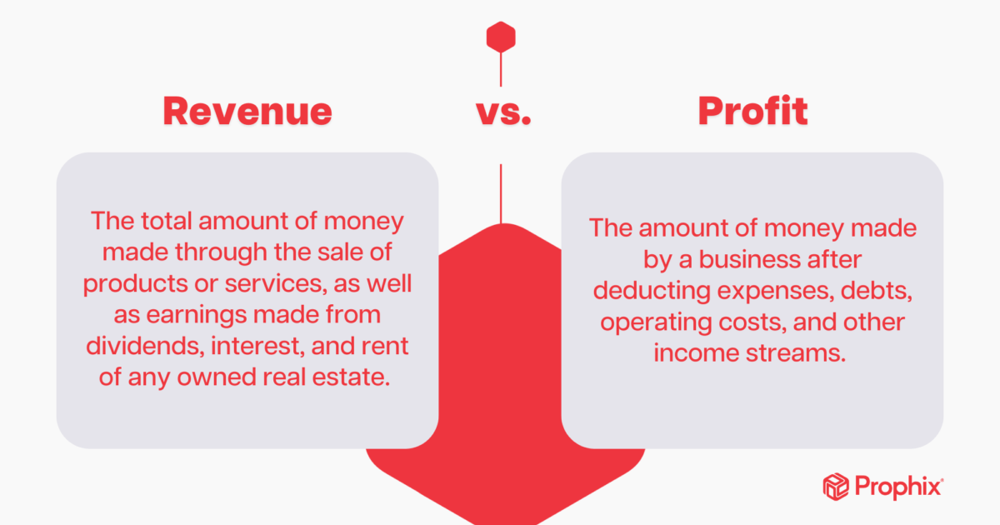

## Table of Contents

## What is revenue?

Revenue is the total amount of money a business earns from its normal activities, like selling products or services. It's the money that comes into the business before any costs or expenses are taken out. Think of it as the starting point for figuring out if a business is doing well financially.

For example, if a bakery sells cakes and earns $1,000 in a day, that $1,000 is its revenue for that day. Revenue is important because it shows how much money a business is bringing in, which helps owners and managers make decisions about how to grow or improve the business.

## What is profit?

Profit is what's left over after a business pays all its costs. It's the money a business makes after taking away expenses like rent, salaries, and the cost of making or buying the things it sells. If a business earns more money than it spends, it has a profit. If it spends more than it earns, it has a loss.

Think of profit like this: Imagine you sell lemonade for $1 each cup. If it costs you $0.50 to make each cup, and you sell 100 cups, you earn $100 in revenue. But after spending $50 to make the lemonade, your profit is $50. Profit is important because it shows if a business is doing well and can keep going or grow.

## How is revenue calculated?

Revenue is calculated by adding up all the money a business gets from selling its products or services. For example, if a store sells 100 shirts at $20 each, the revenue is $2,000. It's the total income before any costs are taken out, so it includes every sale the business makes.

Sometimes, businesses might also earn money from other sources, like interest on savings or rent from property they own. When calculating revenue, all these different sources of income are added together to get the total revenue. This gives a complete picture of how much money is coming into the business from all its activities.

## How is profit calculated?

Profit is what's left after a business pays for everything it needs to run. To find profit, you start with the total revenue, which is all the money the business makes from selling things. Then, you subtract all the costs, like the money spent on making or buying the products, paying employees, rent, and other expenses. If the number you get is positive, that's your profit. If it's negative, the business has a loss.

For example, imagine a small bakery. If the bakery sells cakes and earns $1,000 in a day, that's its revenue. But to make those cakes, the bakery might spend $300 on ingredients, $200 on electricity, and $100 on other costs like rent and salaries. So, the total costs are $600. When you subtract the costs from the revenue ($1,000 - $600), the bakery's profit for the day is $400. This simple calculation helps business owners see if they're making money or if they need to make changes.

## Can a business have revenue but no profit?

Yes, a business can have revenue but no profit. Revenue is all the money a business gets from selling things, but profit is what's left after paying for everything needed to run the business. If a business spends more money than it earns, it won't have any profit, even if it has lots of revenue.

For example, imagine a store that sells $10,000 worth of clothes in a month. That's its revenue. But if it costs the store $12,000 to buy those clothes, pay the workers, and keep the store running, the store will have a loss of $2,000, not a profit. So, even with high revenue, if the costs are higher, there won't be any profit.

## What are the main differences between revenue and profit?

Revenue and profit are two important numbers for a business, but they show different things. Revenue is all the money a business gets from selling its products or services. It's like the total amount of cash coming into the business before anything is taken out. For example, if a store sells 100 shirts at $20 each, its revenue is $2,000. Revenue is important because it shows how much money the business is making from its sales.

Profit, on the other hand, is what's left after the business pays for everything it needs to run. To find profit, you take the revenue and subtract all the costs, like the money spent on making or buying the products, paying employees, rent, and other expenses. If the number you get is positive, that's your profit. If it's negative, the business has a loss. For example, if that same store spent $1,500 to buy the shirts and pay other costs, its profit would be $500. Profit is important because it shows if the business is making money after all its expenses.

## How do revenue and profit impact a company's financial health?

Revenue and profit are key numbers that show how healthy a company is financially. Revenue is all the money a company gets from selling things. It's like the total cash coming into the business before any costs are taken out. If a company has a lot of revenue, it means people are buying its products or services, which is good. But just having high revenue doesn't mean the company is doing well. It's like having a lot of money coming in, but if you spend it all, you won't have anything left.

Profit is what's left after a company pays for everything it needs to run. It's the money a company makes after taking away all its costs, like the money spent on making or buying products, paying employees, and rent. Profit shows if a company is really making money. If a company has a profit, it can use that money to grow, pay its owners, or save for the future. If a company keeps having losses, it might not be able to keep going. So, while revenue is important, profit is what really tells us if a company is financially healthy.

## What role do expenses play in the relationship between revenue and profit?

Expenses are all the costs a business has to pay to keep running. This includes things like buying materials to make products, paying workers, rent for the building, and other bills. Expenses are important because they affect how much profit a business makes. If a business has high expenses, it needs to make more money from sales (revenue) to cover those costs and still have some profit left over.

The relationship between revenue, expenses, and profit is simple but important. Revenue is the total money a business gets from selling things. When you take away the expenses from the revenue, what's left is the profit. If expenses are too high compared to revenue, the business might not make any profit, or it might even lose money. So, managing expenses carefully is key to making sure a business can turn its revenue into profit and stay financially healthy.

## How can a company increase its revenue?

A company can increase its revenue by selling more of its products or services. One way to do this is by reaching more customers. This could mean advertising more, expanding to new areas, or selling online if they didn't before. Another way is by making their products or services better or different, so more people want to buy them. For example, a bakery could start making new kinds of cakes that people love, or a store could offer special deals to attract more shoppers.

Another way to boost revenue is by raising prices, but this has to be done carefully. If the company's products or services are seen as better or more valuable than others, customers might be willing to pay more. But if prices go up too much, customers might go to other companies instead. So, it's important to think about what customers will accept. Also, a company could look for new ways to make money, like renting out space they own or offering new services that fit with what they already do.

## How can a company increase its profit?

A company can increase its profit by either increasing its revenue or reducing its expenses. To boost revenue, the company can sell more of its products or services by reaching more customers. This could mean advertising more, expanding to new areas, or selling online. They could also make their products or services better or different, so more people want to buy them. Another way to increase revenue is by raising prices, but this has to be done carefully so customers don't go to other companies instead.

Reducing expenses is another way to increase profit. A company can look at all the costs it has, like the money spent on materials, paying workers, rent, and other bills. They might find ways to spend less, like buying materials in bulk for a lower price, using less energy, or finding a cheaper place to work from. Sometimes, they might need to make tough choices, like letting some workers go or stopping services that don't make much money. By managing expenses well, a company can keep more of its revenue as profit.

Both increasing revenue and reducing expenses are important for growing profit. A company needs to find the right balance between making more money and spending less. This way, they can make sure they're doing well financially and can keep growing or saving for the future.

## What are some common misconceptions about revenue and profit?

One common misconception is that high revenue always means a company is doing well. People might think that if a company makes a lot of money from sales, it must be successful. But that's not always true. Revenue is just the total money coming in before any costs are taken out. If a company spends more money than it makes, it won't have any profit, even if it has high revenue. So, it's not just about how much money comes in, but also about how much money goes out.

Another misconception is that profit and revenue are the same thing. Some people might use these words interchangeably, but they're different. Revenue is all the money a company gets from selling things. Profit is what's left after the company pays for everything it needs to run, like buying materials, paying workers, and rent. If a company has a lot of revenue but high costs, it might not have any profit. Understanding the difference between these two is important for knowing if a company is really making money.

## How do revenue and profit figures influence business strategy and decision-making?

Revenue and profit figures are very important for a business because they help owners and managers decide what to do next. If a company sees that its revenue is going up, it might decide to spend more on advertising or open new stores to reach even more customers. On the other hand, if revenue is going down, the company might look for new ways to make money, like selling different products or services. Revenue shows how well the company is doing at selling things, so it guides decisions about growing or changing the business.

Profit is also key because it tells the company if it's really making money after paying all its bills. If a company has a good profit, it might choose to invest that money back into the business, like buying new equipment or hiring more workers. If profit is low or if the company is losing money, it might need to cut costs, like finding cheaper suppliers or moving to a smaller office. Profit helps the company know if it's on the right track and what changes it needs to make to keep going strong.

## What is the relationship between revenue and profit?

Revenue and profit are fundamental metrics in evaluating a company's financial health. Revenue, often referred to as the top line, represents the total income generated from normal business operations. It is an aggregate of all sales of goods and services without any deductions. Profit, on the other hand, is the monetary surplus left after all operating expenses, taxes, interest, and costs of goods sold have been subtracted from revenue. This is commonly known as the bottom line or net income.

The relationship between revenue and profit is critical to understanding a company's profitability. While high revenue indicates robust sales performance, it does not necessarily equate to profitability. A company might experience substantial revenue yet incur losses if its expenses exceed its income. Therefore, both revenue and profit must be analyzed together to assess the financial stability of a business effectively.

The formula for calculating profit can be represented mathematically as:

$$
\text{Profit} = \text{Revenue} - \text{Expenses}
$$

In Python, a basic representation of this calculation could be implemented as follows:

```python
def calculate_profit(revenue, expenses):
    return revenue - expenses

# Example usage
revenue = 100000  # example revenue in dollars
expenses = 75000  # example expenses in dollars
profit = calculate_profit(revenue, expenses)
print(f"The profit is: ${profit}")
```

This simple code snippet illustrates how to compute profit by subtracting total expenses from revenue. Understanding these metrics helps in making informed financial decisions. For instance, reducing operational costs or enhancing sales strategies can lead to improved profitability, even if revenue remains constant. Consequently, scrutinizing both revenue and profit is vital for long-term financial success and sustainability.

## What is the Profit Factor in Algorithmic Trading?

Profit Factor is a fundamental metric in algorithmic trading, utilized to evaluate the performance of trading strategies. It is defined as the ratio of gross profits to gross losses over a specific period. Mathematically, the Profit Factor (PF) can be expressed as:

$$
\text{Profit Factor} = \frac{\text{Gross Profits}}{\text{Gross Losses}}
$$

This ratio provides insight into the profitability and efficiency of a trading system. A Profit Factor greater than 1.0 indicates a profitable strategy, since the gross profits exceed the gross losses. Conversely, a Profit Factor less than 1.0 would suggest that the strategy is unprofitable over the evaluated period.

In algorithmic trading, the Profit Factor is indispensable because it accounts for all winning and losing trades, presenting a comprehensive measure of a strategy's effectiveness. For instance, a strategy yielding a Profit Factor of 1.5 signifies that for every dollar lost, 1.5 dollars are gained. Therefore, the higher the Profit Factor, the more profitable the strategy is.

Implementing the calculation of Profit Factor in a programming environment like Python can provide traders with automation and quick assessment capabilities. A simple Python code snippet to calculate the Profit Factor from trade data might look like this:

```python
def calculate_profit_factor(gross_profits, gross_losses):
    if gross_losses == 0:
        return float('inf')  # Handle division by zero if there are no losses
    return gross_profits / gross_losses

# Example usage
gross_profits = 15000
gross_losses = 10000
profit_factor = calculate_profit_factor(gross_profits, gross_losses)
print(f"Profit Factor: {profit_factor:.2f}")
```

In this example, the function `calculate_profit_factor` takes gross profits and gross losses as inputs and computes the Profit Factor. The special case of zero gross losses is handled by returning infinity, implying an extremely successful strategy.

Overall, Profit Factor is an essential metric for refining, comparing, and validating trading strategies, enabling traders to identify and use strategies that consistently outperform expectations over time.

## What are the Key Performance Metrics in Algorithmic Trading?

Cumulative returns, annualized returns, [volatility](/wiki/volatility-trading-strategies), and maximum drawdown are pivotal in assessing algorithmic trading strategies. These metrics provide comprehensive insights into the performance and inherent risks associated with trading strategies, serving as vital tools for traders aiming to optimize their decision-making processes.

### Cumulative Returns

Cumulative returns represent the total return on an investment over a specific period. It is a key metric for evaluating the overall performance of a strategy. To calculate cumulative returns, one must consider the initial and final values of the investment:

$$
\text{Cumulative Return} = \frac{\text{Ending Value} - \text{Beginning Value}}{\text{Beginning Value}} \times 100\%
$$

This metric allows traders to observe the total growth of their capital over time, offering insights into the profitability of their strategies.

### Annualized Returns

Annualized returns provide a way to compare returns over different periods by converting them into a consistent annual format. This metric is critical for assessing performance on a yearly basis and is particularly useful when comparing multiple strategies with different time horizons:

$$
\text{Annualized Return} = \left( (1 + \text{Cumulative Return})^{\frac{1}{n}} - 1 \right) \times 100\%
$$

where $n$ is the number of years. Annualized returns standardize different investment periods, enabling traders to make more informed judgments about strategy performance.

### Volatility

Volatility measures the degree of variation in the returns of a trading strategy and is synonymous with risk. A higher volatility indicates larger swings, meaning the potential for more significant losses or gains. It is typically calculated as the standard deviation of returns:

$$
\text{Volatility} = \sigma = \sqrt{\frac{1}{N-1} \sum_{i=1}^{N} (R_i - \overline{R})^2}
$$

where $R_i$ is the return at time $i$, $\overline{R}$ is the average return, and $N$ is the number of observations.

### Maximum Drawdown

Maximum drawdown assesses the peak-to-trough decline in an investment's value, providing insight into potential losses. It is a crucial metric for understanding the risk of significant capital erosion:

$$
\text{Maximum Drawdown} = \frac{\text{Peak Value} - \text{Trough Value}}{\text{Peak Value}} \times 100\%
$$

This metric highlights the largest potential decline during the investment period and enables traders to gauge the resilience of their strategies.

### Implementation in Python

Analyzing these metrics through programming aids in better strategy development and testing:

```python
import numpy as np

def cumulative_return(values):
    return ((values[-1] - values[0]) / values[0]) * 100

def annualized_return(cum_return, years):
    return (((1 + cum_return / 100) ** (1 / years)) - 1) * 100

def volatility(returns):
    return np.std(returns) * np.sqrt(len(returns))

def max_drawdown(values):
    peak = np.maximum.accumulate(values)
    drawdown = (peak - values) / peak
    return np.max(drawdown) * 100

# Example usage: 
# Suppose `prices` is an array of daily closing prices.
prices = np.array([100, 105, 102, 120, 115])  # Example data
returns = np.diff(prices) / prices[:-1] * 100  # Daily returns

cum_return = cumulative_return(prices)
annual_return = annualized_return(cum_return, len(prices)/252)
vol = volatility(returns)
mdd = max_drawdown(prices)

print(f"Cumulative Return: {cum_return}%")
print(f"Annualized Return: {annual_return}%")
print(f"Volatility: {vol}")
print(f"Maximum Drawdown: {mdd}%")
```

By applying these metrics, traders can achieve a more nuanced understanding of their algorithmic trading strategies, enhancing predictability and success while effectively managing risks.

## References & Further Reading

[1]: Bergstra, J., Bardenet, R., Bengio, Y., & Kégl, B. (2011). ["Algorithms for Hyper-Parameter Optimization."](https://papers.nips.cc/paper/4443-algorithms-for-hyper-parameter-optimization) Advances in Neural Information Processing Systems 24.

[2]: ["Advances in Financial Machine Learning"](https://www.amazon.com/Advances-Financial-Machine-Learning-Marcos/dp/1119482089) by Marcos Lopez de Prado

[3]: ["Evidence-Based Technical Analysis: Applying the Scientific Method and Statistical Inference to Trading Signals"](https://www.amazon.com/Evidence-Based-Technical-Analysis-Scientific-Statistical/dp/0470008741) by David Aronson

[4]: ["Machine Learning for Algorithmic Trading"](https://github.com/stefan-jansen/machine-learning-for-trading) by Stefan Jansen

[5]: ["Quantitative Trading: How to Build Your Own Algorithmic Trading Business"](https://www.amazon.com/Quantitative-Trading-Build-Algorithmic-Business/dp/1119800064) by Ernest P. Chan