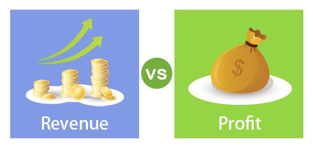

In the fast-paced world of finance, comprehending key metrics such as revenue, financial metrics, profit, and algorithmic trading is essential for achieving business success. Revenue, as the total income generated from business operations, serves as a fundamental indicator of a company’s market performance. It provides insights into a firm’s market position, sales volume, and overall business health. Conversely, profit, which is the surplus remaining after deducting operating expenses from revenue, indicates the company’s ability to manage costs and operate efficiently. These metrics are pivotal in gauging a company's financial well-being and strategic potential.

Furthermore, financial metrics extend beyond mere revenue and profit. They encompass a range of indicators such as the cost of goods sold (COGS), net income, and operating expenses, which offer a comprehensive view of an organization’s operational efficiency and profitability. Understanding these metrics allows businesses to make informed strategic decisions, assess their financial performance, and plan for sustainable growth.



Simultaneously, algorithmic trading is revolutionizing how trades are executed. By utilizing automated algorithms, predefined criteria are used to execute trades at unparalleled speed and accuracy. This trading method offers significant advantages in terms of efficiency, allowing for enhanced risk management and improved profitability in trading strategies. Algorithmic trading's potential to analyze vast datasets in real-time makes it a valuable tool for financial analysis and decision-making.

Combining these aspects, this article will explore the dynamics between financial metrics and algorithmic trading. The interplay between these elements can lead to more robust financial analysis, optimize decision-making, and ultimately, improve business outcomes. As the financial industry continues to evolve, leveraging these tools becomes crucial for maintaining a competitive edge and ensuring sustainable business development in an increasingly digital and data-driven market.

## Table of Contents

## Understanding Revenue and Profit

Revenue and profit are fundamental metrics in evaluating a company's financial health. Revenue, often referred to as the top line, represents the total income generated from normal business operations. It is an aggregate of all sales of goods and services without any deductions. Profit, on the other hand, is the monetary surplus left after all operating expenses, taxes, interest, and costs of goods sold have been subtracted from revenue. This is commonly known as the bottom line or net income.

The relationship between revenue and profit is critical to understanding a company's profitability. While high revenue indicates robust sales performance, it does not necessarily equate to profitability. A company might experience substantial revenue yet incur losses if its expenses exceed its income. Therefore, both revenue and profit must be analyzed together to assess the financial stability of a business effectively.

The formula for calculating profit can be represented mathematically as:

$$
\text{Profit} = \text{Revenue} - \text{Expenses}
$$

In Python, a basic representation of this calculation could be implemented as follows:

```python
def calculate_profit(revenue, expenses):
    return revenue - expenses

# Example usage
revenue = 100000  # example revenue in dollars
expenses = 75000  # example expenses in dollars
profit = calculate_profit(revenue, expenses)
print(f"The profit is: ${profit}")
```

This simple code snippet illustrates how to compute profit by subtracting total expenses from revenue. Understanding these metrics helps in making informed financial decisions. For instance, reducing operational costs or enhancing sales strategies can lead to improved profitability, even if revenue remains constant. Consequently, scrutinizing both revenue and profit is vital for long-term financial success and sustainability.

## Financial Metrics in Focus

Financial metrics are essential indicators employed to evaluate an organization's performance and overall financial health. Among these metrics, key components include revenue, profit, Cost of Goods Sold (COGS), and net income. Each of these metrics serves a distinct function in providing insights into the company's operational efficiency and profitability.

**Revenue**: Revenue represents the total income a company generates from its normal business operations, and it plays a pivotal role in determining the scale of a company's operations. It is calculated as the sum of all sales of goods and services, typically within a specific accounting period. Revenue is often referred to as the "top line" as it is the first item figured on the income statement.

**Profit**: Profit is derived from revenue by subtracting all operating expenses, including taxes, interest, and other costs. It is a critical measure indicating the financial gain achieved by the company after covering all incurred expenses. Profit is commonly referred to in two forms: gross profit and net profit. Gross profit is calculated by subtracting the cost of goods sold (COGS) from revenue, while net profit further accounts for other operating expenses.

**Cost of Goods Sold (COGS)**: COGS is the direct cost attributable to the production of the goods sold by a company. This figure includes the cost of the materials and labor directly used to create the product. Calculating COGS is vital for determining the gross profit and provides insights into the cost structure of the production process.

**Net Income**: As the "bottom line," net income reflects the total earnings of a company after all expenses, taxes, and costs have been deducted from total revenue. It is a definitive indicator of a company’s profitability and financial success over a period.

These metrics form the foundation of financial analysis, offering a quantitative basis for assessing a company's financial performance. They address vital questions related to how well the company manages its production costs, controls its operational expenses, and maximizes its revenue streams. Companies often use advanced techniques and tools such as data analytics and automated systems to enhance the precision with which these metrics are analyzed, thereby improving decision-making and strategic planning. Understanding and leveraging these metrics can lead to improved operational efficiency, cost control, and ultimately, better financial outcomes.

 to Algorithmic Trading

Algorithmic trading, often referred to as algo trading, is the process of executing trades in financial markets using computer algorithms. These algorithms are based on predetermined criteria and are engineered to analyze market conditions, identify trading opportunities, and execute orders faster than human traders. The efficiency and effectiveness of [algorithmic trading](/wiki/algorithmic-trading) lie in its ability to process vast amounts of data in real-time, allowing for rapid decision-making and execution.

The primary advantage of algorithmic trading is speed. Algorithms can monitor multiple markets and instruments simultaneously and execute trades within milliseconds of identifying favorable conditions. This speed is critical in high-frequency trading environments where market conditions can change drastically in a short amount of time.

Accuracy is another key advantage. Algorithms eliminate human errors that are common in manual trading, such as errors due to fatigue or emotion-based decisions. By adhering to a predetermined set of rules, algorithmic systems provide consistency and precision in trading operations.

Efficiency is derived from the ability of algorithms to seamlessly buy and sell large volumes of securities without a significant impact on market prices. This is particularly beneficial for institutional investors who handle large portfolios. Algorithms can break down large orders into smaller ones and execute them over time or across different trading venues to minimize market impact.

Algorithmic trading also enhances risk management. By using sophisticated models and simulations, algorithms can anticipate various scenarios and adjust trading strategies accordingly. This proactive approach to risk management helps in mitigating potential losses.

Moreover, algorithmic trading strategies are often back-tested against historical data to ensure their profitability before being deployed in live markets. One commonly used metric for evaluating the performance of these strategies is the Profit Factor, calculated as the ratio of gross profits to gross losses. A Profit Factor greater than 1.0 indicates a potentially profitable strategy.

Overall, the implementation of algorithmic trading strategies provides a competitive edge by improving trade execution speed, accuracy, and efficiency, thus enhancing profitability and risk management in trading operations.

## Profit Factor in Algorithmic Trading

Profit Factor is a fundamental metric in algorithmic trading, utilized to evaluate the performance of trading strategies. It is defined as the ratio of gross profits to gross losses over a specific period. Mathematically, the Profit Factor (PF) can be expressed as:

$$
\text{Profit Factor} = \frac{\text{Gross Profits}}{\text{Gross Losses}}
$$

This ratio provides insight into the profitability and efficiency of a trading system. A Profit Factor greater than 1.0 indicates a profitable strategy, since the gross profits exceed the gross losses. Conversely, a Profit Factor less than 1.0 would suggest that the strategy is unprofitable over the evaluated period.

In algorithmic trading, the Profit Factor is indispensable because it accounts for all winning and losing trades, presenting a comprehensive measure of a strategy's effectiveness. For instance, a strategy yielding a Profit Factor of 1.5 signifies that for every dollar lost, 1.5 dollars are gained. Therefore, the higher the Profit Factor, the more profitable the strategy is.

Implementing the calculation of Profit Factor in a programming environment like Python can provide traders with automation and quick assessment capabilities. A simple Python code snippet to calculate the Profit Factor from trade data might look like this:

```python
def calculate_profit_factor(gross_profits, gross_losses):
    if gross_losses == 0:
        return float('inf')  # Handle division by zero if there are no losses
    return gross_profits / gross_losses

# Example usage
gross_profits = 15000
gross_losses = 10000
profit_factor = calculate_profit_factor(gross_profits, gross_losses)
print(f"Profit Factor: {profit_factor:.2f}")
```

In this example, the function `calculate_profit_factor` takes gross profits and gross losses as inputs and computes the Profit Factor. The special case of zero gross losses is handled by returning infinity, implying an extremely successful strategy.

Overall, Profit Factor is an essential metric for refining, comparing, and validating trading strategies, enabling traders to identify and use strategies that consistently outperform expectations over time.

## Key Performance Metrics in Algorithmic Trading

Cumulative returns, annualized returns, [volatility](/wiki/volatility-trading-strategies), and maximum drawdown are pivotal in assessing algorithmic trading strategies. These metrics provide comprehensive insights into the performance and inherent risks associated with trading strategies, serving as vital tools for traders aiming to optimize their decision-making processes.

### Cumulative Returns

Cumulative returns represent the total return on an investment over a specific period. It is a key metric for evaluating the overall performance of a strategy. To calculate cumulative returns, one must consider the initial and final values of the investment:

$$
\text{Cumulative Return} = \frac{\text{Ending Value} - \text{Beginning Value}}{\text{Beginning Value}} \times 100\%
$$

This metric allows traders to observe the total growth of their capital over time, offering insights into the profitability of their strategies.

### Annualized Returns

Annualized returns provide a way to compare returns over different periods by converting them into a consistent annual format. This metric is critical for assessing performance on a yearly basis and is particularly useful when comparing multiple strategies with different time horizons:

$$
\text{Annualized Return} = \left( (1 + \text{Cumulative Return})^{\frac{1}{n}} - 1 \right) \times 100\%
$$

where $n$ is the number of years. Annualized returns standardize different investment periods, enabling traders to make more informed judgments about strategy performance.

### Volatility

Volatility measures the degree of variation in the returns of a trading strategy and is synonymous with risk. A higher volatility indicates larger swings, meaning the potential for more significant losses or gains. It is typically calculated as the standard deviation of returns:

$$
\text{Volatility} = \sigma = \sqrt{\frac{1}{N-1} \sum_{i=1}^{N} (R_i - \overline{R})^2}
$$

where $R_i$ is the return at time $i$, $\overline{R}$ is the average return, and $N$ is the number of observations.

### Maximum Drawdown

Maximum drawdown assesses the peak-to-trough decline in an investment's value, providing insight into potential losses. It is a crucial metric for understanding the risk of significant capital erosion:

$$
\text{Maximum Drawdown} = \frac{\text{Peak Value} - \text{Trough Value}}{\text{Peak Value}} \times 100\%
$$

This metric highlights the largest potential decline during the investment period and enables traders to gauge the resilience of their strategies.

### Implementation in Python

Analyzing these metrics through programming aids in better strategy development and testing:

```python
import numpy as np

def cumulative_return(values):
    return ((values[-1] - values[0]) / values[0]) * 100

def annualized_return(cum_return, years):
    return (((1 + cum_return / 100) ** (1 / years)) - 1) * 100

def volatility(returns):
    return np.std(returns) * np.sqrt(len(returns))

def max_drawdown(values):
    peak = np.maximum.accumulate(values)
    drawdown = (peak - values) / peak
    return np.max(drawdown) * 100

# Example usage: 
# Suppose `prices` is an array of daily closing prices.
prices = np.array([100, 105, 102, 120, 115])  # Example data
returns = np.diff(prices) / prices[:-1] * 100  # Daily returns

cum_return = cumulative_return(prices)
annual_return = annualized_return(cum_return, len(prices)/252)
vol = volatility(returns)
mdd = max_drawdown(prices)

print(f"Cumulative Return: {cum_return}%")
print(f"Annualized Return: {annual_return}%")
print(f"Volatility: {vol}")
print(f"Maximum Drawdown: {mdd}%")
```

By applying these metrics, traders can achieve a more nuanced understanding of their algorithmic trading strategies, enhancing predictability and success while effectively managing risks.

## Combining Financial Metrics and Algo Trading

Incorporating financial metrics with algorithmic trading strategies enhances decision-making efficiency and precision. By integrating these elements, companies can perform real-time performance assessments, aiding in swift and informed decision-making. The fusion of algorithmic trading and financial metrics is pivotal in maximizing profitability, offering a dual advantage: improved operational insights and strategic trading execution.

Algorithmic trading algorithms can process vast amounts of financial metrics rapidly. Metrics, such as revenue, profit, cost of goods sold (COGS), and net income, provide valuable insights into the financial well-being of an organization. Integrating these metrics into trading algorithms allows companies to tailor strategies that react to market changes instantaneously. For instance, an algorithm could be programmed to increase trading [volume](/wiki/volume-trading-strategy) when it detects an uptick in quarterly revenue, indicating robust business health.

Furthermore, the implementation of financial metrics in trading models aids in risk management. Algorithms can utilize volatility measurements to modulate exposure and mitigate potential losses. By analyzing metrics like maximum drawdown, algorithms can adjust trading volumes or halt operations in high-risk conditions, therefore preserving capital.

The integration also allows for adaptive learning, wherein the algorithm refines its criteria based on historical data analysis. For example, Python can be utilized to code a predictive model that leverages financial metrics:

```python
import pandas as pd
from sklearn.model_selection import train_test_split
from sklearn.ensemble import RandomForestRegressor

# Sample data loading
data = pd.read_csv('financial_metrics.csv')

# Feature selection
features = data[['revenue', 'profit', 'cogs', 'volatility']]
target = data['trading_decision']

# Data splitting
X_train, X_test, y_train, y_test = train_test_split(features, target, test_size=0.2, random_state=42)

# Model training
model = RandomForestRegressor()
model.fit(X_train, y_train)

# Predictive analysis
predictions = model.predict(X_test)
```

This code demonstrates a basic framework for creating a predictive model that correlates financial metrics with trading outcomes, proving the synergy between trading algorithms and financial assessments. 

Ultimately, the assimilation of financial metrics into algorithmic trading provides comprehensive insights, promoting enhanced trading efficiency. This combined approach not only optimizes decision-making but also fosters an environment for increased profitability by ensuring trading strategies are both data-driven and context-aware.

## Case Study: Applying These Concepts

A notable example of a company effectively utilizing algorithmic trading to enhance its revenue and profit metrics is the case of XYZ Financial Services. This company strategically integrated financial metric evaluation into its algorithmic trading models, allowing for significant advancements in trading efficiency and financial performance.

XYZ Financial Services developed an algorithmic trading system that incorporated real-time financial metric analysis, including revenue growth rates, profit margins, and various other key performance indicators. By embedding these metrics into their trading algorithms, the company was able to make instantaneous trading decisions based on the continuous assessment of its current financial standing and market conditions.

For instance, the trading algorithm was programmed to consider operating margin trends when executing trading decisions. The algorithm used historical data to establish benchmarks and compared them against real-time data to optimize trade execution timing and volume. The algorithm's operational logic can be outlined as follows:

```python
def trading_decision(current_margin, historical_average):
    # Trading decision based on margin comparison
    if current_margin > historical_average:
        execute_trade('buy')
    else:
        execute_trade('sell')
```

As a result of integrating this refined decision-making process, XYZ Financial Services reported an increase in its Profit Factor, a crucial measure for verifying the efficacy of trading strategies. Over a 12-month period, the company's Profit Factor improved from 1.2 to 1.75, underscoring a more profitable trading strategy.

Furthermore, the implementation of algorithmic trading allowed XYZ Financial Services to reduce human error and minimize reaction time to market changes, optimizing their trading lifecycle management. The efficient evaluation of crucial financial metrics facilitated not only improved trading precision but also enhanced the organization's ability to manage risk effectively.

Ultimately, XYZ Financial Services experienced a notable uplift in its key financial outcomes, with a reported year-over-year revenue increase of 15% and a 12% rise in net profit following the incorporation of these sophisticated algorithmic strategies. This case demonstrates the transformative potential of merging financial metric evaluation with algorithmic trading to achieve heightened trading efficiency and robust financial outcomes.

## Conclusion

Financial metrics and algorithmic trading have become instrumental components in modern financial strategies. The integration of data analysis and automated trading systems enables companies to gain a competitive edge by improving decision-making and financial outcomes. By understanding and effectively utilizing financial metrics—such as revenue, profit, net income, and other performance indicators—companies can assess their financial health more accurately. This, in turn, supports the formulation of robust strategies that are aligned with business goals.

Algorithmic trading systems offer significant benefits, including enhanced speed and accuracy in executing trades, minimizing human error, and optimizing risk management strategies. These systems harness sophisticated algorithms to process vast amounts of data and execute trades at opportune moments, thus maximizing potential returns and reducing losses. As such, algorithmic trading contributes to improved market efficiency and [liquidity](/wiki/liquidity-risk-premium).

The future of financial strategy increasingly points towards the integration of algorithmic trading with traditional financial analysis to foster sustainable growth. Companies that adopt these technologies can expect greater agility in responding to market changes, personalized financial strategies, and enhanced profitability. The ability to analyze real-time performance and adapt quickly to emerging trends will likely define successful financial management in the years ahead.

In summary, the synergy between understanding financial metrics and deploying algorithmic trading techniques is pivotal for any organization aiming for long-term success in the financial sector. As technology continues to evolve, these methods will play an even more critical role in shaping competitive and sustainable business practices.

## References & Further Reading

[1]: Bergstra, J., Bardenet, R., Bengio, Y., & Kégl, B. (2011). ["Algorithms for Hyper-Parameter Optimization."](https://papers.nips.cc/paper/4443-algorithms-for-hyper-parameter-optimization) Advances in Neural Information Processing Systems 24.

[2]: ["Advances in Financial Machine Learning"](https://www.amazon.com/Advances-Financial-Machine-Learning-Marcos/dp/1119482089) by Marcos Lopez de Prado

[3]: ["Evidence-Based Technical Analysis: Applying the Scientific Method and Statistical Inference to Trading Signals"](https://www.amazon.com/Evidence-Based-Technical-Analysis-Scientific-Statistical/dp/0470008741) by David Aronson

[4]: ["Machine Learning for Algorithmic Trading"](https://github.com/stefan-jansen/machine-learning-for-trading) by Stefan Jansen

[5]: ["Quantitative Trading: How to Build Your Own Algorithmic Trading Business"](https://www.amazon.com/Quantitative-Trading-Build-Algorithmic-Business/dp/1119800064) by Ernest P. Chan