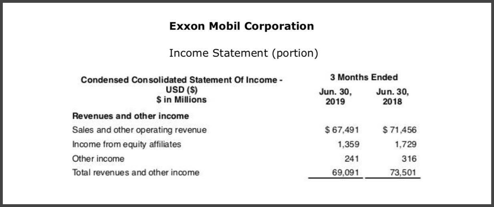

In the ever-evolving landscape of financial markets, knowledge of the distinct aspects of revenue and sales, along with their application in algorithmic trading, is essential for understanding how financial decisions are made and executed. Revenue and sales are pivotal metrics that companies use to gauge their financial health, influencing investor decisions and market perceptions. Understanding these figures enables investors and traders to evaluate a company's performance and to develop strategies grounded in quantitative data.

Algorithmic trading has revolutionized how financial markets operate by automating trading processes using complex algorithms. These algorithms capitalize on diverse financial metrics, including revenue and sales, to make data-driven trading decisions. A clear grasp of these metrics is vital as they serve as inputs in constructing models that predict market behavior and optimize trading strategies. 



Revenue, often cited as the "top line" of a company’s income statement, reflects the total income generated from primary business activities. Sales represent the proceeds from the exchange of goods or services, forming a critical component of this total revenue. By analyzing these metrics collectively, algorithmic trading systems can identify market trends and make real-time decisions based on quantitative analysis.

This article will explore the differences between revenue and sales, their significance in financial assessments, and their strategic implications for algorithmic trading. We will investigate how these metrics influence financial performance and their integration into sophisticated trading algorithms designed to enhance profitability. Understanding this relationship is vital for traders aiming to harness the power of algorithmic strategies in increasingly competitive and rapidly changing markets.

## Table of Contents

## Understanding Revenue vs. Sales

Revenue and sales are often used interchangeably in financial discourse, yet they represent distinct concepts within a company's financial framework. Revenue, frequently termed the 'top line' on an income statement, encapsulates the total income generated from a company's core operations before any expenses are deducted. This metric is crucial as it provides an overview of a company's scale of operations and is used to assess its business efficiency and market position.

Sales, on the other hand, are a subset of revenue and specifically refer to the proceeds derived from goods and services exchanged with customers. Sales numbers give insight into the firm's performance in its primary business activities, providing a gauge of the market demand for its offerings.

It's important to note that not all revenue is derived from sales. Companies often accrue additional income from non-operational activities. Such supplementary income includes interest earned on investments, royalties from intellectual property, or one-time gains from asset sales. This categorization means that a company could report substantial revenue figures while experiencing stagnant or declining core sales. For instance, a considerable increase in interest income could temporarily boost the company's total revenue without reflecting an improvement in its sales health. 

The key difference, thus, lies in the source of income. Revenue includes total income, while sales focus solely on core business operations. Understanding this distinction is integral for analyzing financial statements accurately. A company's revenue might present an inflated perspective due to supplementary income, which, while beneficial in the short term, may not indicate sustainable growth or operational efficiency. 

For investors and analysts, dissecting these figures helps in forming a more nuanced view of a company's financial condition and strategic directions, providing insights into its operational effectiveness and market standing.

## Key Differences Between Revenue and Sales

The primary distinction between revenue and sales is the origin of the income. Sales are derived exclusively from a company's core business operations, specifically the provision and sale of goods and services to customers. On the other hand, revenue represents the total income a company receives, encompassing all sources beyond just sales. This may include interest, dividends, royalties, asset sales, or litigation gains.

For investors and analysts, understanding the differences between these metrics is essential for accurately evaluating a company's business performance. Sales figures provide direct insight into the company's operational success and market demand for its products or services. Conversely, when a company reports revenue, it reflects a broader financial picture, potentially inflated by non-operational income sources.

For example, a company may report a significant increase in revenue due to the liquidation of assets or receiving substantial litigation settlements. While this increase in revenue might superficially suggest financial improvement, it could mask underlying issues with core business sales, thereby distorting perceptions of the company's performance and operational health.

To assess a company's growth potential and financial stability thoroughly, investors must examine detailed financial statements that separate sales from other revenue sources. This comprehensive understanding aids in identifying sustainable income streams, ensuring that growth can be attributed to core operational success rather than one-time or irregular income events. Such a nuanced analysis is crucial for making informed investment decisions and understanding a company's true market position and potential for future success.

## Implications of Revenue and Sales in Algo Trading

Algorithmic trading leverages quantitative data to inform decision-making processes. Revenue and sales figures are vital components of this data, playing a key role in the construction of predictive models that aim to forecast market movements. The precise nature of financial metrics like revenue and sales aids algorithms in identifying patterns and trends, allowing for the anticipation of price changes based on historical and current data. By using these metrics, algorithms can execute trades at optimal times to maximize returns.

The integration of revenue and sales data into trading algorithms enhances the adaptability and robustness of trading strategies. For instance, a significant change in a company's revenue might suggest a shift in its market position, leading to price [volatility](/wiki/volatility-trading-strategies). Algorithms can assess such changes rapidly and adjust trading positions accordingly. This adaptability is particularly valuable in the fast-paced environment of financial markets, where the ability to respond to new information swiftly can be the difference between a profitable trade and a loss.

A typical example is the use of these financial metrics in a Python-based trading algorithm. Consider the following simplified code snippet, which demonstrates how revenue data might be utilized:

```python
import pandas as pd

# Assuming 'data' is a DataFrame with date, revenue, and sales columns
def find_trading_signals(data):
    signals = []
    for index, row in data.iterrows():
        if row['revenue'] > row['sales']:  # simplistic condition for illustrative purposes
            signals.append((row['date'], 'buy'))
        else:
            signals.append((row['date'], 'sell'))
    return signals

data = pd.DataFrame({
    'date': ['2023-01-01', '2023-01-02'],
    'revenue': [100, 80],
    'sales': [90, 85]
})

signals = find_trading_signals(data)
print(signals)
```

This code illustrates how comparing revenue and sales can generate basic buy or sell signals. While this example is rudimentary, sophisticated algorithms employ advanced statistical and [machine learning](/wiki/machine-learning) techniques to analyze revenue and sales data.

Incorporating revenue and sales metrics into [algorithmic trading](/wiki/algorithmic-trading) provides traders with a deeper understanding of market dynamics, ultimately fostering strategies that yield a competitive advantage. As financial markets continue to evolve, the ability to integrate and interpret these financial metrics accurately will remain a cornerstone for successful algorithmic trading.

## Earnings and Algorithmic Trading

Earnings, commonly referred to as profit, can be calculated by subtracting costs, taxes, and expenses from a company's revenue. This metric provides valuable insights into a company's profitability, which is a fundamental aspect of financial analysis and decision-making. 

In algorithmic trading, earnings data play a crucial role in evaluating a company's financial health. Algorithms use this information to influence trading decisions based on market potential. By analyzing earnings data, algorithms can assess whether a company is likely to experience growth, stability, or decline, thus allowing traders to make informed decisions.

Additionally, incorporating earnings data into algorithmic strategies enhances the ability to predict market reactions and identify lucrative trading opportunities. For instance, if earnings reports indicate a significant increase in profitability beyond market expectations, algorithms might signal a potential buy opportunity, anticipating a rise in stock prices. Conversely, disappointing earnings might trigger sell signals.

Earnings reports are vital for investor insights and are crucial in shaping algorithmic trading strategies aimed at optimizing returns. These reports provide a comprehensive overview of a company's financial performance, offering data such as earnings per share (EPS), operating income, and net income, among other metrics. Algorithms leverage this data to forecast future market trends and adjust trading strategies accordingly to maximize profitability. By utilizing robust data analysis techniques, earnings-based algorithms can continuously refine trading models to adapt to evolving market conditions, thereby optimizing trading outcomes and achieving superior financial performance.

## Future Trends in Algorithmic Trading

Advancements in [artificial intelligence](/wiki/ai-artificial-intelligence) (AI) and machine learning are significantly transforming the landscape of algorithmic trading, particularly in the precision of earnings analysis. These technologies enable traders to process and analyze vast amounts of data in real-time, allowing algorithms to dynamically adjust to market conditions. This dynamic adaptation is critical in identifying market trends and executing trades at the most opportune moments.

Real-time processing, when combined with behavioral analytics, provides algorithms with a powerful toolkit to predict market tendencies and movements more accurately. Behavioral analytics focuses on understanding how the aggregate behavior of market participants affects price actions. By incorporating this understanding, trading algorithms can anticipate shifts in market sentiment, reacting swiftly to any changes. For example, machine learning models can be trained to identify patterns in historical trading data, using these patterns to make predictions about future price movements.

The integration of [alternative data](/wiki/best-alternative-data) sources is another frontier in algorithmic trading, offering a wealth of additional insights that go beyond traditional financial metrics. Alternative data includes non-traditional sources such as social media sentiment, satellite imagery, and transaction data, which can provide valuable real-time insights into market conditions. This data can be used to develop predictive models that are more attuned to the subtle shifts in the market, resulting in trading strategies that are both agile and informed.

As algorithmic trading continues to evolve, the focus is expected to shift towards the seamless fusion of traditional financial metrics with advanced analytics. This fusion will enable traders to derive superior market insights. For instance, sentiment analysis algorithms can quantify public sentiment about a particular stock from social media and news outlets, which can then be integrated with financial data to enhance predictive accuracy. 

Furthermore, AI-driven algorithms have the potential to handle complex decision-making processes previously performed by human traders. With improvements in natural language processing (NLP), algorithms can interpret and analyze textual data from earnings reports and financial news, assessing their implications on market performance. This capability allows for a more nuanced understanding of market dynamics and the strategic adaptation of trading models.

In conclusion, the future of algorithmic trading will likely focus on leveraging these advancements to create more sophisticated and responsive trading systems. As technology continues to advance, the fusion of traditional financial metrics with innovative data analytics will provide traders with unparalleled insights, enabling them to maintain a competitive edge in fast-paced financial markets.

## Conclusion

The convergence of revenue, sales, and algorithmic trading represents a significant potential for enhancing financial strategies. These metrics provide a comprehensive view of a company's financial health, which is invaluable for crafting algorithms capable of executing precise trading actions. In the complex world of algorithmic trading, understanding these financial metrics allows for the construction of data-driven models that generate actionable insights.

By incorporating revenue and sales data, traders can develop sophisticated algorithms that account for market movements and trends, thereby optimizing profitability. The evolving nature of financial markets underscores the necessity of integrating these financial insights to maintain competitiveness. As trading environments become more sophisticated, it is crucial for traders to capitalize on this synthesis to stay ahead.

Algorithmic traders who can effectively utilize revenue and sales metrics are in a better position to tackle the challenges of ever-changing market conditions. These traders benefit from predictive models that not only enhance their decision-making but also maximize their return on investment. This approach ensures that they can respond swiftly to market dynamics and capitalize on emerging opportunities.

In conclusion, the strategic blending of revenue, sales, and algorithmic trading principles offers a path to superior market insights and decision-making. This intersection forms the backbone of a robust trading strategy, empowering traders to enhance their performance in the dynamic landscape of financial markets.

## References & Further Reading

[1]: Perry, J. (2009). ["Financial Statements: A Step-by-Step Guide to Understanding and Creating Financial Reports"](https://search.worldcat.org/title/1012040689). Career Press.

[2]: Narang, R. K. (2013). ["Inside the Black Box: A Simple Guide to Quantitative and High-Frequency Trading"](https://onlinelibrary.wiley.com/doi/book/10.1002/9781118662717). Wiley Finance.

[3]: Chan, E. P. (2009). ["Quantitative Trading: How to Build Your Own Algorithmic Trading Business"](https://github.com/ftvision/quant_trading_echan_book). Wiley.

[4]: Lopez de Prado, M. (2018). ["Advances in Financial Machine Learning"](https://www.amazon.com/Advances-Financial-Machine-Learning-Marcos/dp/1119482089). Wiley.

[5]: Jordan, J. (2014). ["Machine Learning: A Probabilistic Perspective"](https://research.google/pubs/machine-learning-a-probabilistic-perspective/). MIT Press.

[6]: Pardo, R. (2011). ["The Evaluation and Optimization of Trading Strategies"](https://onlinelibrary.wiley.com/doi/book/10.1002/9781119196969). Wiley Trading.