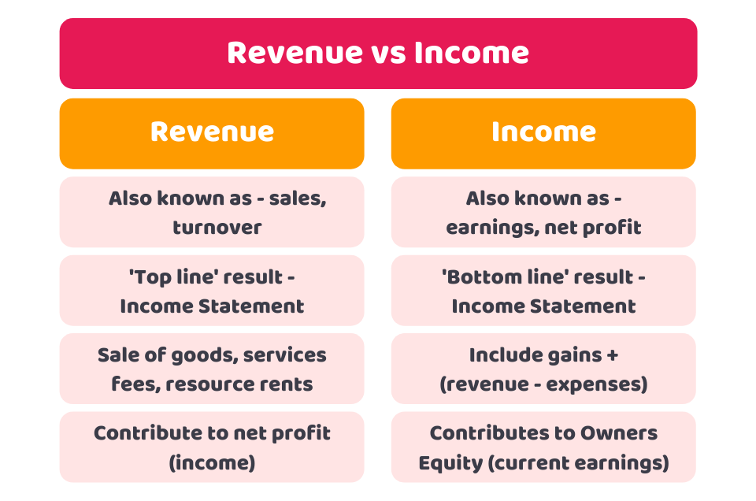

## Table of Contents

## What is revenue?

Revenue is the total amount of money a business earns from its normal business activities, usually from selling goods or services to customers. It's also known as sales or turnover. For example, if a store sells 100 shirts at $10 each, the revenue from those sales would be $1,000.

Revenue is important because it shows how well a business is doing at bringing in money. It's the starting point for figuring out if a business is making a profit or not. To find out the profit, you need to subtract the costs of running the business from the revenue. If the revenue is higher than the costs, the business makes a profit. If it's lower, the business has a loss.

## What is income?

Income is the money you get from different places. It can be from your job, where you earn a salary or wages. It can also come from other sources like renting out a property, investments, or even government benefits like social security. For businesses, income is similar to revenue, which is the money they make from selling their products or services.

For people, income is important because it's what they use to pay for things they need and want, like food, a place to live, and fun activities. If someone's income is more than what they spend, they can save or invest the extra money. For businesses, income helps them know if they are doing well. If their income is more than their costs, they make a profit. If not, they might need to find ways to increase their income or cut costs.

## How is revenue generated?

Revenue is generated when a business sells its products or services to customers. For example, if a bakery sells cakes, the money it gets from those sales is its revenue. The bakery can increase its revenue by selling more cakes, raising the price of the cakes, or offering new types of baked goods that customers want to buy. It's all about finding ways to bring in more money from what the business offers.

Another way to generate revenue is through different business models. Some companies might charge a subscription fee, like a streaming service that customers pay monthly to watch movies and TV shows. Others might earn revenue through advertising, where they get paid by other businesses to show ads to their customers. No matter the method, the key is to make sure that what the business offers is something people are willing to pay for, which helps keep the revenue coming in.

## How is income calculated?

Income is calculated by adding up all the money a person or business gets from different places. For a person, this can include money from a job, like a salary or wages, money from renting out a property, interest from savings accounts, or even money from the government like social security. If someone has more than one job or different sources of money, they just add all these amounts together to find their total income.

For a business, income is usually the same as revenue, which is the money they make from selling their products or services. To calculate this, a business adds up all the money it gets from sales over a certain time, like a month or a year. If a business also gets money from other places, like investments or loans, they would add those amounts to their sales revenue to find their total income.

## Can you provide examples of revenue in a business?

Imagine a small coffee shop. Every time someone buys a cup of coffee or a muffin, the money they pay is part of the coffee shop's revenue. If the shop sells 200 cups of coffee at $3 each in a day, that's $600 in revenue just from coffee. If they also sell 50 muffins at $2 each, that adds another $100. So, the total revenue for that day from coffee and muffins would be $700.

Now think about a software company that sells a program for $100 per license. If they sell 1,000 licenses in a month, their revenue from those sales would be $100,000. But the company also offers a yearly subscription service for $500. If 200 customers sign up for the subscription in the same month, that's another $100,000 in revenue. So, the total revenue for the month from both licenses and subscriptions would be $200,000.

## Can you provide examples of income in a business?

A local bakery makes money by selling bread and cakes to customers. Every time someone buys a loaf of bread for $5, that money goes into the bakery's income. If the bakery sells 100 loaves of bread in a day, their income from bread sales is $500. They also sell cakes for $20 each. If they sell 20 cakes in the same day, that adds another $400 to their income. So, the total income for that day from bread and cakes is $900.

A tech company earns income in different ways. They sell software licenses for $150 each. If they sell 500 licenses in a month, that's $75,000 in income from licenses. They also offer a monthly subscription service for $30. If 1,000 customers subscribe in the same month, that's another $30,000 in income. So, the total income for the month from both licenses and subscriptions is $105,000.

## What are the key differences between revenue and income?

Revenue and income are similar but have some key differences. Revenue is the money a business gets from selling its products or services. For example, if a store sells toys, the money from those sales is the store's revenue. It's like the total sales a business makes. Income, on the other hand, is a broader term that includes revenue but also money from other places. For a business, income can include revenue plus money from investments, loans, or other sources. For a person, income is all the money they get from their job, investments, or benefits.

The main difference is that revenue focuses only on money from sales, while income can include other types of money. Think of revenue as a part of income. Revenue is important because it shows how well a business is selling its products or services. Income is important because it gives a full picture of all the money coming in, which helps in figuring out if a business or person is making a profit or not.

## How do businesses use revenue and income in financial reporting?

Businesses use revenue and income in financial reporting to show how well they are doing. Revenue is the money a business gets from selling its products or services. It's a big part of financial reports because it shows how much money the business is making from its main activities. When a business makes its financial report, it lists the revenue to give a clear picture of its sales. This helps people like investors or managers see if the business is growing or not.

Income is a bit broader than revenue. It includes all the money a business gets, not just from sales but also from other places like investments or loans. In financial reporting, businesses show their income to give a complete picture of all the money coming in. This helps to figure out if the business is making a profit or a loss. By looking at both revenue and income, people can understand the overall financial health of the business and make better decisions.

## What are the common misconceptions about revenue and income?

A common misconception about revenue and income is that they are the same thing. Revenue is only the money a business gets from selling its products or services. It's like the total sales. Income, on the other hand, is broader and includes revenue plus any other money coming in, like from investments or loans. For people, income is all the money they get, not just from a job but also from other sources like renting out a property or receiving benefits.

Another misconception is that high revenue always means a business is doing well. While revenue shows how much money a business is making from sales, it doesn't tell the whole story. A business might have high revenue but still not be profitable if its costs are too high. Income helps to see the bigger picture because it includes all money coming in and can be compared to costs to see if the business is making a profit or a loss. So, it's important to look at both revenue and income to really understand how a business is doing.

## How does taxation affect revenue and income?

Taxation can affect a business's revenue by changing how much money it keeps from its sales. When a business sells something, it might have to pay sales tax on that sale. This means the business collects the tax from the customer but then has to give that money to the government. So, even though the business's revenue might look high because it includes the tax, the actual money the business gets to keep is less after paying the tax. This can make a difference in how much money the business has to use for other things like paying employees or buying supplies.

For income, taxation can affect both businesses and people. When a business or a person makes money, they have to pay income tax on it. This tax is taken out of their total income, so what they get to keep is less than what they made. For a business, this means the money left after paying income tax is what they can use to run the business or reinvest. For a person, after paying income tax, the money left is what they can use to pay for things they need and want. So, taxes can make a big difference in how much money is left for both businesses and people to use.

## How do changes in accounting standards impact the reporting of revenue and income?

Changes in accounting standards can affect how businesses report their revenue and income. These standards are rules that businesses have to follow when they make their financial reports. If the rules change, businesses might have to report their revenue differently. For example, a new rule might say that businesses can only count money as revenue when they are sure they will get it, not just when they make a sale. This could make the reported revenue look different from before, even if the business is doing the same amount of sales.

These changes can also impact how income is reported. Income includes all the money a business gets, so if the rules for counting revenue change, the income numbers can change too. For example, if a new rule says businesses can include money from investments as income sooner than before, the reported income might go up. This can make it harder to compare financial reports from different years because the numbers might not mean the same thing anymore. It's important for businesses to explain these changes clearly so people understand what the numbers really show.

## What advanced strategies can businesses employ to optimize their revenue and income?

Businesses can optimize their revenue by using smart pricing strategies. One way is to use dynamic pricing, where prices change based on how much people want to buy something or what time it is. For example, airlines and hotels often use this to charge more when lots of people want to travel or stay. Another way is to offer different versions of a product at different prices, like basic, standard, and premium options. This can help businesses sell to more people because some might want the cheaper version while others are willing to pay more for extra features. By figuring out what customers value and setting prices that match, businesses can bring in more money from their sales.

To improve their income, businesses can look for other ways to make money besides just selling products or services. One strategy is to invest in other businesses or in the stock market, which can bring in extra money if the investments do well. Another way is to find new markets to sell in, like selling to customers in different countries or online. This can increase both revenue and income by reaching more people. Businesses can also cut costs by finding cheaper ways to make or sell their products, like using new technology or buying supplies in bulk. By making more money from other places and spending less, businesses can keep more of their income and grow faster.

## What is the understanding of revenue and income?

Revenue and income are two fundamental financial metrics that provide insights into a company's financial performance and operational efficiency. Revenue is often referred to as the "top line" of a financial statement, signifying the total income generated from a company's sales of goods or services before any expenses are deducted. It is a measure of the overall scale and scope of a business's operations. Revenue can be expressed mathematically as:

$$

\text{Revenue} = \text{Selling Price per Unit} \times \text{Number of Units Sold} 
$$

This calculation provides a basic understanding of how much money is entering the business from its core operational activities.

Income, particularly net income, represents what remains after the company deducts all expenses, costs, taxes, and other deductions from its total revenue. It is often referred to as the "bottom line" and serves as a primary indicator of profitability. The formula for calculating net income is:

$$
\text{Net Income} = \text{Revenue} - (\text{Expenses} + \text{Costs} + \text{Taxes})
$$

Net income is a critical metric as it reflects a company's ability to generate profit from its operations after accounting for all financial obligations. This makes net income a crucial [factor](/wiki/factor-investing) for investors and stakeholders in assessing the financial health and sustainability of an organization.

Both revenue and net income are essential to understanding a company's performance. Revenue indicates the success of a company's sales and marketing efforts by showing how much business it is generating, while net income offers insights into how well a company is managing its expenses relative to its revenue, hence determining its profitability.

## What are the key differences between revenue and income?

Revenue and income, though often used interchangeably, have distinct roles in financial analysis. Revenue, also known as the "top line," represents the total amount generated from a company’s sales of goods or services. It is calculated by multiplying the price at which goods or services are sold by the number of units sold. Therefore, revenue can be expressed using the formula:

$$
\text{Revenue} = \text{Price} \times \text{Quantity Sold}
$$

Revenue offers insights into the scale and effectiveness of a company’s sales activities. It provides analysts with an understanding of a company’s market reach and consumer demand. However, revenue alone does not indicate a company's profitability. It is possible for a firm to generate high revenue while still operating at a loss if its operational costs are too high.

Income, especially net income, provides a clearer picture of a company's profitability and financial health. It is derived from revenue by accounting for all costs, including operating expenses, taxes, interest, and other deductions. The formula for net income is:

$$
\text{Net Income} = \text{Revenue} - \text{Expenses}
$$

Expenses encompass all costs a company incurs in its operations, from raw materials to employee salaries and administrative costs. Thus, while revenue shows how much a company earns from its primary operations, income reveals what it retains after all financial obligations have been met.

In essence, revenue measures the success of sales endeavors, whereas income indicates the efficiency and profitability of a business. Understanding the difference between these terms is crucial for accurate financial analysis and assessment of a company’s performance.

## References & Further Reading

[1]: Bergstra, J., Bardenet, R., Bengio, Y., & Kégl, B. (2011). ["Algorithms for Hyper-Parameter Optimization."](https://papers.nips.cc/paper/4443-algorithms-for-hyper-parameter-optimization) Advances in Neural Information Processing Systems 24.

[2]: ["Advances in Financial Machine Learning"](https://www.amazon.com/Advances-Financial-Machine-Learning-Marcos/dp/1119482089) by Marcos Lopez de Prado

[3]: ["Evidence-Based Technical Analysis: Applying the Scientific Method and Statistical Inference to Trading Signals"](https://www.amazon.com/Evidence-Based-Technical-Analysis-Scientific-Statistical/dp/0470008741) by David Aronson

[4]: ["Machine Learning for Algorithmic Trading"](https://github.com/stefan-jansen/machine-learning-for-trading) by Stefan Jansen

[5]: ["Quantitative Trading: How to Build Your Own Algorithmic Trading Business"](https://www.amazon.com/Quantitative-Trading-Build-Algorithmic-Business/dp/1119800064) by Ernest P. Chan