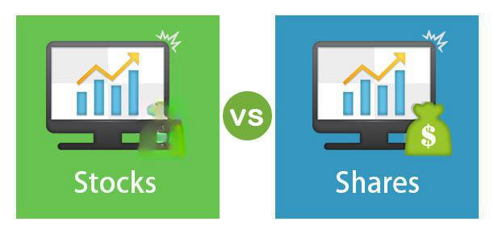

## Table of Contents

## What are shares?

Shares are pieces of a company that people can buy. When you buy a share, you own a small part of that company. Companies sell shares to get money to grow their business. People who buy shares are called shareholders. They hope the company does well so the value of their shares goes up.

Shareholders can also get money from the company through dividends. Dividends are payments made to shareholders from the company's profits. Not all companies pay dividends, but when they do, it's like getting a reward for owning the shares. If many people want to buy the shares, their price can go up. If fewer people want them, the price can go down.

## What are stocks?

Stocks are the same as shares. They are pieces of a company that you can buy. When you buy a stock, you become a part-owner of that company. Companies sell stocks to raise money to help their business grow. People buy stocks hoping that the company will do well and the value of their stocks will increase.

People who own stocks are called stockholders or shareholders. They might also get money from the company through dividends. Dividends are payments made from the company's profits to the people who own the stocks. Not every company pays dividends, but when they do, it's like getting a bonus for owning the stocks. The price of stocks can go up if many people want to buy them, and it can go down if fewer people are interested.

## How are shares and stocks similar?

Shares and stocks are the same thing. They are pieces of a company that people can buy. When you buy a share or a stock, you own a small part of that company. Companies sell them to get money to help their business grow. People who buy them are called shareholders or stockholders. They hope that the company will do well so the value of their shares or stocks goes up.

Shareholders and stockholders can also get money from the company through dividends. Dividends are payments made to them from the company's profits. Not all companies pay dividends, but when they do, it's like getting a reward for owning the shares or stocks. The price of shares or stocks can go up if many people want to buy them. If fewer people want them, the price can go down.

## What is the main difference between shares and stocks?

Shares and stocks are the same thing. They are pieces of a company that you can buy. When you buy a share or a stock, you own a small part of that company. Companies sell them to get money to help their business grow. People who buy them are called shareholders or stockholders. They hope that the company will do well so the value of their shares or stocks goes up.

The terms "shares" and "stocks" are often used in slightly different ways, but this is more about how people talk about them than any real difference. "Shares" usually refers to the pieces of a single company that you can buy. "Stocks," on the other hand, can mean the shares of many different companies that you can buy and sell on a stock market. But at the end of the day, a share is a stock, and a stock is a share.

## Can the terms 'shares' and 'stocks' be used interchangeably?

Yes, the terms 'shares' and 'stocks' can be used interchangeably. They both mean the same thing: pieces of a company that people can buy. When you buy a share or a stock, you become a part-owner of that company. Companies sell them to raise money to help their business grow. People who buy them are called shareholders or stockholders. They hope that the company will do well so the value of their shares or stocks goes up.

Sometimes, people use the word 'shares' to talk about the pieces of a single company. On the other hand, 'stocks' might be used to talk about the shares of many different companies that you can buy and sell on a stock market. But really, a share is a stock, and a stock is a share. They are just different ways to say the same thing.

## How do shares and stocks function within a company?

Shares and stocks are pieces of a company that people can buy. When a company decides to sell shares, it's like cutting a big cake into smaller pieces. Each piece, or share, represents a small part of the whole company. People who buy these shares become part-owners of the company. They are called shareholders or stockholders. The money the company gets from selling shares can be used to grow the business, like buying new equipment or opening new stores.

When a company does well and makes more money, the value of its shares or stocks usually goes up. This means that if shareholders decide to sell their shares, they might get more money than they paid for them. Sometimes, companies also give some of their profits back to shareholders as dividends. Dividends are like little rewards for owning the shares. But if the company doesn't do well, the value of the shares can go down, and shareholders might lose money. So, owning shares or stocks can be a way to make money, but it also comes with risks.

## What are the types of stocks and how do they relate to shares?

There are two main types of stocks: common stocks and preferred stocks. Common stocks are the most common type of stock that people buy. When you own common stocks, you get to vote on important company decisions, like who should be on the board of directors. You also have the chance to make money if the company does well and the stock price goes up. But if the company does badly, the value of your common stocks can go down, and you could lose money. Common stocks are called "common" because they are the most usual type of stock that companies sell.

Preferred stocks are different from common stocks. People who own preferred stocks don't usually get to vote on company decisions, but they have some advantages. One big advantage is that if the company pays dividends, preferred stockholders get their dividends before common stockholders. This makes preferred stocks a bit safer because you know you'll get paid first. But, preferred stocks usually don't go up in value as much as common stocks when the company does well. Both common stocks and preferred stocks are types of shares in a company. When you buy either type, you own a part of the company, but the rights and benefits you get are different depending on which type you own.

## How does one acquire shares and stocks?

You can acquire shares and stocks in a few different ways. The most common way is to buy them through a stockbroker. A stockbroker is someone who helps you buy and sell stocks on the stock market. You can do this online using a computer or a smartphone. All you need to do is set up an account with a stockbroker, put money into your account, and then you can start buying shares of the companies you want to own. Another way to get shares is through a company's initial public offering (IPO). An IPO is when a company first starts selling its shares to the public. You can sign up to buy shares during an IPO, but it can be hard to get them because a lot of people want them.

Another way to acquire shares is through employee stock options. Some companies give their workers the chance to buy shares at a special price. This is a way for the company to reward its employees and make them feel more connected to the company's success. You can also get shares by inheriting them from someone else or by receiving them as a gift. No matter how you get them, owning shares means you have a piece of the company, and you can make money if the company does well.

## What are the risks associated with investing in shares and stocks?

Investing in shares and stocks can be risky because the value of your shares can go up and down a lot. If the company you invested in does not do well, the price of your shares can drop. This means you could lose some or all of the money you put into buying those shares. Sometimes, big events like a global economic crisis can make the value of many stocks go down at the same time. Also, if you need to sell your shares quickly and the price is low, you might not get back as much money as you hoped.

Another risk is that you might not know enough about the companies you are investing in. If you don't do your homework and understand what the company does and how it makes money, you might make bad choices. Some companies might look good at first but then have problems later on. This can hurt the value of your shares. Also, some companies might not pay dividends, so you won't get any extra money from them even if the stock price stays the same. All these things make investing in stocks a bit like gambling – you can win big, but you can also lose big.

## How do shares and stocks impact company ownership and control?

When a company sells shares or stocks, it is giving away pieces of ownership. Each share represents a small part of the company. People who buy these shares become shareholders or stockholders, and together they own the whole company. If someone buys a lot of shares, they own a bigger piece of the company. For example, if you own 1% of the shares, you own 1% of the company. The more shares you own, the more of the company you control.

Shareholders have some control over the company, especially if they own common stocks. They get to vote on important decisions, like who should be on the board of directors. The board of directors makes big choices about how the company should be run. If a shareholder owns a lot of shares, they have more votes and more say in these decisions. But even with a lot of shares, it's hard for one person to control everything unless they own most of the company. So, shares and stocks spread out the ownership and control of a company among many people.

## What are the tax implications of owning shares versus stocks?

Owning shares and stocks can affect your taxes in a few ways. When you make money from selling your shares for more than you paid for them, this is called a capital gain. You have to pay taxes on capital gains. How much tax you pay depends on how long you owned the shares. If you owned them for less than a year, you pay a higher tax rate. If you owned them for more than a year, you pay a lower tax rate. Also, if you get dividends from your shares, you have to pay taxes on those too. But the tax rate on dividends is usually lower than the tax rate on your regular income.

Sometimes, you can lose money when you sell your shares for less than you paid for them. This is called a capital loss. You can use a capital loss to lower your taxes. You can subtract your capital loss from your capital gains. If your losses are more than your gains, you can use some of the loss to lower your regular income, but only up to a certain amount each year. The rules about taxes can be different depending on where you live, so it's a good idea to talk to a tax expert to understand exactly how owning shares will affect your taxes.

## How do market conditions affect the value of shares and stocks?

Market conditions can make the value of shares and stocks go up and down a lot. When the economy is doing well, people feel good about spending and investing money. This can make more people want to buy shares, which can push the prices up. On the other hand, if the economy is not doing well, people might be scared to spend money and might sell their shares. This can make the prices go down. Big events like wars, natural disasters, or changes in government rules can also change how people feel about the market and affect share prices.

Sometimes, the value of shares can change because of things that happen to just one company. If a company does really well and makes a lot of money, its share price might go up. But if the company has problems, like losing money or getting bad news, its share price might go down. Other times, the whole market can move together. For example, if a lot of people think the stock market is going to go down, they might sell their shares all at once, which can make prices drop quickly. So, the value of shares and stocks can change a lot depending on what's happening in the market and with the companies themselves.

## References & Further Reading

[1]: Bergstra, J., Bardenet, R., Bengio, Y., & Kégl, B. (2011). ["Algorithms for Hyper-Parameter Optimization."](https://papers.nips.cc/paper/4443-algorithms-for-hyper-parameter-optimization) Advances in Neural Information Processing Systems 24.

[2]: ["Advances in Financial Machine Learning"](https://www.amazon.com/Advances-Financial-Machine-Learning-Marcos/dp/1119482089) by Marcos Lopez de Prado

[3]: ["Evidence-Based Technical Analysis: Applying the Scientific Method and Statistical Inference to Trading Signals"](https://www.amazon.com/Evidence-Based-Technical-Analysis-Scientific-Statistical/dp/0470008741) by David Aronson

[4]: ["Machine Learning for Algorithmic Trading"](https://github.com/stefan-jansen/machine-learning-for-trading) by Stefan Jansen

[5]: ["Quantitative Trading: How to Build Your Own Algorithmic Trading Business"](https://www.amazon.com/Quantitative-Trading-Build-Algorithmic-Business/dp/1119800064) by Ernest P. Chan