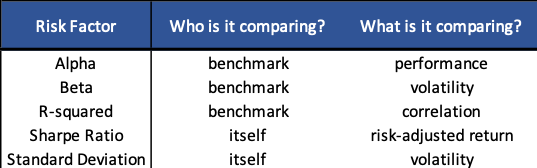

## Table of Contents

## What is the Sharpe Ratio?

The Sharpe Ratio is a way to measure how well an investment is doing compared to how risky it is. It was created by a man named William F. Sharpe. The ratio looks at the return of an investment and subtracts the risk-free rate, which is usually the return you would get from a very safe investment like a government bond. Then, it divides that number by the standard deviation of the investment's returns, which is a way to measure how much the returns go up and down.

A higher Sharpe Ratio means the investment is doing better for the amount of risk you are taking. If the Sharpe Ratio is positive, it means the investment is doing better than a risk-free investment. If it's negative, it's doing worse. The Sharpe Ratio helps investors see if the extra risk they are taking is worth it. For example, if two investments have the same return, but one has a higher Sharpe Ratio, that one is better because it's less risky for the same reward.

## What is Alpha?

Alpha is a measure that shows how well an investment does compared to a benchmark, like a stock market index. It tells you if a fund manager or an investment strategy is doing better than just following the market. If an investment has a positive alpha, it means it's doing better than the benchmark. If it has a negative alpha, it's doing worse.

For example, if the stock market goes up by 10% in a year, but your investment goes up by 12%, your alpha would be positive because you did better than the market. Alpha is important because it helps investors see if they are getting extra returns for the risks they are taking. It's like a scorecard for how smart or lucky an investment choice was.

## How is the Sharpe Ratio calculated?

The Sharpe Ratio is a way to see how good an investment is when you think about the risk. To find the Sharpe Ratio, you start by taking the return of the investment and then you take away the return you would get from a very safe investment, like a government bond. This safe return is called the risk-free rate. After you do that, you divide the difference by the standard deviation of the investment's returns. The standard deviation is a way to measure how much the returns of the investment go up and down.

A higher Sharpe Ratio means the investment is doing a good job of giving you returns for the risk you are taking. If the Sharpe Ratio is positive, it means the investment is doing better than the risk-free investment. If it's negative, it's doing worse. So, the Sharpe Ratio helps you see if the extra risk you are taking with an investment is worth it. For example, if two investments have the same return, but one has a higher Sharpe Ratio, that one is better because it's less risky for the same reward.

## How is Alpha calculated?

Alpha is a number that shows how well an investment is doing compared to a benchmark, like the stock market. To find Alpha, you start by looking at the return of your investment and then you take away the return of the benchmark. After that, you need to think about how much risk you are taking. You do this by using something called the beta, which measures how much your investment moves with the market. You multiply the beta by the difference between the market's return and the risk-free rate, and then you take this away from the difference between your investment's return and the risk-free rate.

The formula for Alpha is: Alpha = (Investment Return - Risk-Free Rate) - Beta * (Market Return - Risk-Free Rate). If Alpha is positive, it means your investment is doing better than the market for the risk you are taking. If Alpha is negative, it means your investment is not doing as well as the market. Alpha helps investors see if a fund manager or an investment strategy is adding value beyond just following the market.

## What does the Sharpe Ratio measure?

The Sharpe Ratio is a way to see how good an investment is when you think about how risky it is. It was made up by a man named William F. Sharpe. To find the Sharpe Ratio, you take the return of the investment and subtract the return you would get from a very safe investment, like a government bond. This safe return is called the risk-free rate. After you do that, you divide the difference by the standard deviation of the investment's returns. The standard deviation is a way to measure how much the returns of the investment go up and down.

A higher Sharpe Ratio means the investment is doing a good job of giving you returns for the risk you are taking. If the Sharpe Ratio is positive, it means the investment is doing better than the risk-free investment. If it's negative, it's doing worse. So, the Sharpe Ratio helps you see if the extra risk you are taking with an investment is worth it. For example, if two investments have the same return, but one has a higher Sharpe Ratio, that one is better because it's less risky for the same reward.

## What does Alpha measure?

Alpha is a number that shows if an investment is doing better or worse than a benchmark, like the stock market. It helps you see if the person managing your investment, or the strategy they're using, is making smart choices that beat just following the market. If your investment has a positive Alpha, it means it's doing better than the market. If it has a negative Alpha, it's doing worse.

To find Alpha, you start by taking the return of your investment and subtracting the return of the benchmark. Then, you need to think about the risk you're taking. You do this by using something called the beta, which shows how much your investment moves with the market. You multiply the beta by the difference between the market's return and a very safe investment's return, called the risk-free rate. After that, you subtract this number from the difference between your investment's return and the risk-free rate. This gives you the Alpha.

## Can the Sharpe Ratio be negative? What does it mean?

Yes, the Sharpe Ratio can be negative. The Sharpe Ratio is a way to see how good an investment is when you think about the risk. To find it, you take the return of the investment and subtract the return you would get from a very safe investment, like a government bond. This safe return is called the risk-free rate. Then, you divide that number by the standard deviation of the investment's returns, which shows how much the returns go up and down. If the Sharpe Ratio is negative, it means the investment is doing worse than the risk-free investment. It's not giving you enough return for the risk you're taking.

A negative Sharpe Ratio tells you that the investment is not worth the risk. It's like paying more for something than it's worth. If you can get a better return from a safe investment, like a government bond, then why take the risk with this other investment? A negative Sharpe Ratio is a warning sign that you might want to look for a better investment that gives you more return for the risk you're taking.

## Can Alpha be negative? What does it mean?

Yes, Alpha can be negative. Alpha is a number that tells you if an investment is doing better or worse than a benchmark, like the stock market. If your investment has a negative Alpha, it means it's not doing as well as the market. It's like trying to run a race and not keeping up with everyone else. You're falling behind.

A negative Alpha means the person managing your investment, or the strategy they're using, isn't making smart choices. They're not beating the market, and you're not getting a good return for the risk you're taking. If you see a negative Alpha, it might be a sign to look for a different investment or a different manager who can do better.

## How do the Sharpe Ratio and Alpha help in evaluating investment performance?

The Sharpe Ratio and Alpha are two important tools that help you see how well your investments are doing. The Sharpe Ratio looks at how much return you're getting from an investment compared to how risky it is. It does this by taking the return of your investment, subtracting the return you would get from a very safe investment like a government bond, and then dividing that by how much the returns of your investment go up and down. A higher Sharpe Ratio means your investment is doing a good job of giving you returns for the risk you're taking. If the Sharpe Ratio is positive, it means your investment is doing better than the safe investment. If it's negative, it's doing worse. This helps you decide if the extra risk you're taking is worth it.

Alpha, on the other hand, tells you if your investment is doing better or worse than the market. It's like a scorecard for how smart or lucky your investment choices are. To find Alpha, you take the return of your investment and subtract the return of the market. Then, you adjust for the risk you're taking by using something called beta, which shows how much your investment moves with the market. If your Alpha is positive, it means your investment is beating the market. If it's negative, it's not doing as well. By looking at Alpha, you can see if the person managing your investment or the strategy they're using is adding value beyond just following the market. Together, the Sharpe Ratio and Alpha give you a clear picture of how well your investments are performing and whether they're worth the risk.

## What are the limitations of using the Sharpe Ratio?

The Sharpe Ratio is a helpful tool, but it has some problems. One big issue is that it thinks all kinds of risk are the same. It only looks at how much the returns of an investment go up and down, called standard deviation. But not all risks are the same. Some risks might make you lose a lot of money all at once, while others might just make your returns go up and down a bit. The Sharpe Ratio can't tell the difference between these types of risks, so it might make an investment look better or worse than it really is.

Another problem is that the Sharpe Ratio assumes that returns follow a normal pattern, which they often don't. In real life, returns can have big jumps or drops that are hard to predict. The Sharpe Ratio doesn't handle these surprises well. Also, it uses something called the risk-free rate, which can change over time. If the risk-free rate goes up or down a lot, it can make the Sharpe Ratio less useful for comparing investments over long periods. So, while the Sharpe Ratio can give you a quick idea of how an investment is doing, it's not perfect and should be used with other tools to get a full picture.

## What are the limitations of using Alpha?

Using Alpha to measure how well an investment is doing has some problems. One big issue is that Alpha depends a lot on the benchmark you choose. If you pick the wrong benchmark, your Alpha might not show the real performance of your investment. For example, if you compare a tech stock to a general market index, the Alpha might not be very useful because the tech stock might behave differently from the overall market. Also, Alpha doesn't tell you about the risk you're taking. It just shows if you're beating the market, but it doesn't say anything about how much risk you took to get that extra return.

Another problem with Alpha is that it can be hard to figure out the right beta to use. Beta measures how much your investment moves with the market, and if you get it wrong, your Alpha won't be accurate. Plus, Alpha looks at past performance, but it doesn't tell you anything about the future. Just because an investment had a good Alpha in the past doesn't mean it will keep doing well. So, while Alpha can give you a quick idea of how an investment is doing compared to the market, it's not perfect and should be used with other tools to get a full picture.

## How can investors use both the Sharpe Ratio and Alpha together for better portfolio management?

Investors can use both the Sharpe Ratio and Alpha together to get a better understanding of their investments. The Sharpe Ratio helps you see if the risk you're taking with an investment is worth it. It does this by comparing the return of your investment to a very safe investment, like a government bond, and then looking at how much the returns go up and down. If the Sharpe Ratio is high, it means you're getting a good return for the risk you're taking. On the other hand, Alpha tells you if your investment is doing better or worse than the market. A positive Alpha means your investment is beating the market, which is good. By looking at both the Sharpe Ratio and Alpha, you can see if your investment is not only beating the market but also doing it in a way that's worth the risk.

Using both the Sharpe Ratio and Alpha together gives you a fuller picture of your investment's performance. For example, if you have an investment with a high Alpha but a low Sharpe Ratio, it means you're beating the market, but you're taking a lot of risk to do it. This might make you think twice about keeping that investment. On the other hand, if you have an investment with a high Sharpe Ratio and a positive Alpha, it's a good sign that you're getting a good return for the risk you're taking and also beating the market. By looking at both measures, you can make smarter choices about which investments to keep, which to sell, and how to balance your portfolio to get the best returns for the risk you're willing to take.

## What is Understanding Alpha in Investment?

Alpha is a key metric that investors and traders use to assess the performance of an investment on a risk-adjusted basis. Essentially, alpha provides a measure of how much value an investment has added or subtracted from a benchmark index. Defined formally, alpha ($\alpha$) can be expressed using the formula:

$$
\alpha = R_i - (R_f + \beta \times (R_m - R_f))
$$

where $R_i$ is the return of the investment, $R_f$ is the risk-free rate, $\beta$ is the measure of an investment's sensitivity to market movements, and $R_m$ is the return of the market.

A positive alpha suggests that the investment has outperformed its benchmark after adjusting for risk, which is indicative of a successful investment strategy. Conversely, a negative alpha implies underperformance, signaling that the investment failed to achieve adequate returns relative to the risk assumed.

Alpha's utility extends beyond traditional investments; it plays a critical role in evaluating the performance of active fund managers. Fund managers aim to produce investments with positive alphas, demonstrating their ability to exceed market performance through skillful decision-making and strategic insights.

In [algorithmic trading](/wiki/algorithmic-trading), alpha is vital for the development of strategies designed to outpace market benchmarks. Algorithmic traders leverage statistical models and [machine learning](/wiki/machine-learning) algorithms to identify market inefficiencies that can be exploited to achieve positive alpha. The task involves formulating strategies that not only aim for superior returns but do so on a risk-adjusted basis. For algorithmic trading to be successful in generating alpha, a comprehensive understanding of market dynamics, trading costs, and execution risks is necessary.

Traders with a focus on relative performance against a benchmark view alpha as an indispensable tool. By consistently measuring and optimizing alpha, traders can refine their strategies to adapt to evolving market conditions, thereby maintaining or enhancing their competitive edge. Understanding and applying alpha enables traders and investors to make informed decisions, ensuring their portfolios remain aligned with anticipated risk-return profiles.

In conclusion, alpha is more than a performance metric; it is a gateway to strategic investment evaluation and development in both traditional and algorithmic trading contexts.

## What is the Sharpe Ratio and how can it be explored?

The Sharpe ratio is a widely used metric in finance that measures the risk-adjusted return of an investment, providing key insights into its performance. Developed by Nobel laureate William F. Sharpe, the ratio is defined by the formula:

$$
\text{Sharpe Ratio} = \frac{R_p - R_f}{\sigma_p}
$$

where $R_p$ represents the expected return of the portfolio, $R_f$ denotes the risk-free rate of return, and $\sigma_p$ is the standard deviation of the portfolio's returns.

A higher Sharpe ratio indicates more favorable risk-adjusted performance. Specifically, it suggests that the investment generates more return per unit of risk, often making it preferable for investors who aim to maximize returns while keeping risk at a manageable level. The risk-free rate is generally the return on short-term government securities, such as U.S. Treasury bills, which are considered to have minimal risk.

In algorithmic trading, the Sharpe ratio becomes invaluable as it allows traders to evaluate the effectiveness of their strategies. By comparing the Sharpe ratios of different strategies, traders can identify whether higher returns are attributed to adept strategy execution or excessive risk-taking. This insight is particularly crucial given the high-frequency nature of algorithmic trading, where small performance differences can lead to significant outcomes over time.

For example, consider a scenario where Strategy A has a Sharpe ratio of 1.2, while Strategy B has a Sharpe ratio of 0.8. All else being equal, Strategy A would generally be considered the superior option, as it implies better returns for every unit of risk taken.

Moreover, incorporating the Sharpe ratio into the development of algorithmic strategies can guide adjustments in trade execution, such as balancing the asset allocation or fine-tuning risk management protocols. Given these attributes, the Sharpe ratio remains a crucial tool for algorithmic traders in identifying and enhancing trading strategies, ensuring they align with both market dynamics and risk tolerance levels.

## What is the conclusion?

Understanding and applying alpha and the Sharpe ratio are crucial for enhancing the evaluation of investment and trading strategies. Alpha assesses an investment's performance against a benchmark, providing insights into its value beyond market movements. A positive alpha indicates superior performance, guiding investors to strategies that may outperform over time. Conversely, a negative alpha warns about potential deficiencies in an investment's strategy or execution.

The Sharpe ratio complements this by measuring risk-adjusted returns, helping traders determine if excess returns are due to skilled management or merely higher risk exposure. Calculated as follows:

$$
\text{Sharpe Ratio} = \frac{R_p - R_f}{\sigma_p}
$$

where $R_p$ is the portfolio return, $R_f$ is the risk-free rate, and $\sigma_p$ is the standard deviation of the portfolio's excess return, this metric clarifies risk-taking levels and strategy efficacy. A higher Sharpe ratio suggests a more reliable strategy that efficiently balances return and risk.

Using alpha and the Sharpe ratio facilitates optimizing algorithmic trading strategies. By consistently evaluating performance, traders can fine-tune strategies to improve results while keeping risks in check. This ensures strategies remain competitive, adapting them to rapidly changing market conditions and aligning with investor expectations.

To maintain effectiveness, strategies need ongoing assessment and adjustment based on these metrics. This continuous process helps traders identify shifts in market dynamics and refine their approaches accordingly, supporting long-term success in trading endeavors. Regular monitoring of alpha and the Sharpe ratio ensures trading tactics stay aligned with both market conditions and strategic goals, fostering an adaptable and robust investment strategy framework.

## References & Further Reading

[1]: Sharpe, W. F. (1994). ["The Sharpe Ratio."](https://web.stanford.edu/~wfsharpe/art/sr/SR.htm) Journal of Portfolio Management, 21(1), 49-58.

[2]: Jensen, M. C. (1968). ["The Performance of Mutual Funds in the Period 1945-1964."](https://onlinelibrary.wiley.com/doi/full/10.1111/j.1540-6261.1968.tb00815.x) Journal of Finance, 23(2), 389-416. 

[3]: Grinold, R. C., & Kahn, R. N. (1999). ["Active Portfolio Management: A Quantitative Approach for Producing Superior Returns and Controlling Risk"](https://www.amazon.com/Active-Portfolio-Management-Quantitative-Controlling/dp/0070248826) by Richard C. Grinold & Ronald N. Kahn

[4]: Lo, A. W. (1999). ["The Three P’s of Total Risk Management."](https://web.mit.edu/~alo/www/Papers/faj2.pdf) Financial Analysts Journal, 55(1), 13-26.

[5]: Treynor, J. L. (1965). ["How to Rate Management of Investment Funds."](https://onlinelibrary.wiley.com/doi/10.1002/9781119196679.ch10) Harvard Business Review, 43(1), 63-75.

[6]: Swensen, D. F. (2005). ["Unconventional Success: A Fundamental Approach to Personal Investment"](https://archive.org/details/unconventionalsu00swen) by David F. Swensen