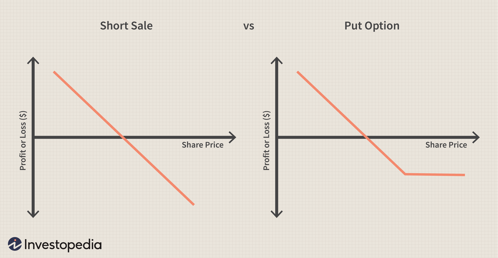

Short selling and short positions play a vital role in the stock market by providing mechanisms for traders to benefit from declining asset prices. At their core, these strategies allow investors to sell securities they do not currently own, with the intention of buying them back at a lower price and profiting from the difference. This speculative maneuver carries significant risks, as there is no theoretical limit to the price of an asset, meaning potential losses are unlimited if the price increases instead of decreases.

Algorithmic trading introduces a new dimension to short selling strategies by applying sophisticated algorithms that automate the decision-making process. These algorithms can analyze large data sets rapidly, optimize entry and exit points for trades, and dynamically manage risk. The use of algorithms allows traders to capitalize on short term market trends and price discrepancies that might be missed by manual trading, enhancing both the complexity and potential effectiveness of short selling strategies.



As traders seek to leverage predictions of declining asset prices, understanding short sales, short positions, and algorithmic trading is indispensable. These elements collectively shape a comprehensive approach to trading in financial markets, providing traders with the tools needed to navigate and potentially profit from volatile market conditions. While algorithmic trading can enhance efficiency and precision, it also necessitates diligent risk management to mitigate the substantial risks inherent in short selling. Consequently, mastering these strategies is essential for any trader aiming to capitalize on equity market fluctuations.

## Table of Contents

## Short Sales and Short Positions in the Stock Market

A short sale in the stock market is a tactical financial maneuver that involves borrowing shares and selling them with the anticipation of repurchasing them at a lower price. The goal of this transaction is to capitalize on declining asset prices. To initiate a short sale, a trader typically borrows shares from a broker, sells them on the open market, and later buys the same quantity of shares to return to the lender. If the asset's price drops as predicted, the trader benefits from the difference between the higher selling price and the lower buying price.

A short position represents the trader’s ongoing obligation to return the borrowed shares. This is a critical component of short selling, as it denotes both the trader's expectation of a price decline and their responsibility to purchase shares in the future to close the position. Short positions are instrumental not only in speculative trading, where traders bet on market declines, but also in hedging strategies, where the goal is to offset potential losses in other investments.

Furthermore, traders can assume short positions through derivatives such as futures or options, which offer advantages distinct from traditional short sales. These financial instruments allow traders to speculate on price movements without dealing with the actual asset's physical delivery. For instance, a put option gives the holder the right, but not the obligation, to sell an asset at a predetermined price before a specified expiration date. In contrast, a futures contract obligates the trader to sell or buy an asset at a set price on a future date. Both methods can define short positions but provide flexibility in managing risks and capital requirements compared to outright short selling.

Understanding the mechanics and strategic motivations behind short sales and short positions is crucial for investors looking to employ these techniques effectively in the stock market. By leveraging these strategies, traders can potentially profit from market downturns or mitigate risks associated with upward price [volatility](/wiki/volatility-trading-strategies) in their investment portfolios.

## Algorithmic Trading: Transforming Short Selling Strategy

Algorithmic trading has revolutionized the approach to short selling in the stock market by leveraging advanced computing power and complex algorithms. These algorithms are programmed to understand intricate market dynamics, allowing for more nuanced and effective execution of short positions. Unlike traditional short selling, where decisions are based primarily on human judgment and analysis, [algorithmic trading](/wiki/algorithmic-trading) provides a data-driven and automated framework that can significantly enhance the efficiency and success of short selling strategies.

Algorithms typically begin by evaluating market conditions through data analysis. They can process vast volumes of historical and real-time data to identify trading opportunities, discern patterns, and forecast potential price movements. The ability to execute trades swiftly based on this analysis gives traders a competitive edge in capturing profitable short selling opportunities.

One core strategy used in algorithmic short selling is [momentum](/wiki/momentum)-based trading. Here, algorithms are designed to identify and capitalize on prevailing market trends. By recognizing the continuation of downward trends, the algorithm can initiate a short sale, anticipatinng that the asset's price will continue to fall. Conversely, mean reversion strategies are based on the premise that asset prices will eventually revert to their historical average. Algorithms deploying this strategy will open short positions when prices are deemed excessively high compared to their average, expecting a future decline in price.

Statistical [arbitrage](/wiki/arbitrage) leverages pricing inefficiencies between correlated assets. For example, if two stocks exhibit a strong correlation and one is overpriced based on historical relationships, an algorithm may short the overpriced stock while taking a long position in the underpriced counterpart, expecting prices to converge.

Sentiment analysis in algorithmic trading utilizes data from news articles, financial reports, and social media to gauge market sentiment. This approach assumes that negative news or sentiment can forecast a decline in an asset's price, thereby prompting the algorithm to execute a short sale.

The dynamic management of risk is another critical dimension of algorithmic trading in short selling. Algorithms can optimize entry and [exit](/wiki/exit-strategy) points by setting thresholds for gains and losses, thus managing exposure to risk. The use of stop-loss orders and dynamic hedging techniques forms part of the algorithmic toolkit to prevent disproportionate losses.

Algorithmic trading transforms short selling into a precise and systematic practice, substantially increasing the likelihood of achieving desired investment outcomes. The integration of these automated strategies in trading platforms reflects the ongoing evolution of the stock market towards more intelligent and data-driven methodologies.

## Mechanics of Short Selling

Short selling is a trading technique that involves selling a financial asset that the seller does not own at the time of the transaction. The process begins with the trader borrowing the asset, typically from a broker or another investor, with the obligation to return the asset at a later date. The trader then sells the borrowed asset in the market with the expectation that the asset's price will decline.

If the asset's price falls as anticipated, the trader can repurchase the asset at the reduced price, returning the borrowed asset to the lender. The profit generated from this transaction is the difference between the sale price and the lower repurchase price, minus any associated borrowing costs and fees. Mathematically, the profit $P$ from a short sale can be expressed as:

$$

P = (S_{\text{sell}} - S_{\text{buy}}) \times Q - C
$$

where:
- $S_{\text{sell}}$ is the price at which the asset was sold.
- $S_{\text{buy}}$ is the price at which the asset was repurchased.
- $Q$ is the quantity of the asset traded.
- $C$ represents any costs or fees associated with borrowing and trading the asset.

Throughout the short selling process, the trader must continually monitor market prices as fluctuations can impact potential profits or exacerbate losses. If the asset's price rises instead of falling, the trader will incur losses when repurchasing the asset at a higher price than the initial selling price. The potential for loss is theoretically unlimited since the asset's price can increase indefinitely.

Traders must also consider the costs associated with borrowing the asset, which usually involves paying interest to the lender. Additionally, brokers often require traders to maintain a margin account and adhere to margin requirements to cover potential losses. This necessitates a robust risk management strategy to ensure that the trader can meet any margin calls and avoid being forced to cover the short position at unfavorable prices.

Once the trader decides to close the position, the repurchase of the asset is typically executed through the same broker that facilitated the borrowing. Upon fulfilling the contractual obligation to return the asset to the lender, the short selling transaction is complete.

## Risks and Rewards of Short Selling

Short selling, a strategy utilized primarily for profiting from an anticipated decline in asset prices, carries with it both significant risks and potential rewards. One of the primary risks associated with short selling is the theoretically unlimited potential for loss. Unlike purchasing an asset where the maximum loss is limited to the initial investment, short selling can lead to losses that exceed the initial amount, as the asset’s price can rise indefinitely. 

Another notable risk is the occurrence of margin calls. Short sellers typically utilize margin accounts, which require a certain level of equity to be maintained. When the market moves against the short position, and the asset's price increases, brokers may issue a margin call demanding additional funds to cover potential losses. Failure to meet these demands could result in the forced liquidation of the position, often at an unfavorable price, thus realizing significant losses.

Market volatility also adds to the complexity and risk of short selling. Prices can move rapidly and unpredictably, which can lead to short squeezes—a scenario where a rapid increase in the asset's price occurs, forcing short sellers to buy back shares at elevated prices, further driving up the price.

On the reward side, short selling provides the opportunity to profit from declining asset prices. By selling borrowed shares at a high price and repurchasing them at a lower price, investors can make a substantial profit if their market predictions are accurate. This method is also used as a hedging tool, protecting other investments in a portfolio against potential losses by offsetting gains and losses across different positions.

Leveraging is another reward associated with short selling, as it allows traders to gain increased market exposure without having to commit a significant amount of initial capital. This can amplify profits when the strategy works as intended, although it equally magnifies losses if the market moves unfavorably.

Regulatory risks also pose a challenge to short sellers, as rules and restrictions can change, impacting the ability to enter or maintain short positions. Regulations, such as the uptick rule, or bans during certain market conditions, can limit the effectiveness of short selling strategies, and traders must stay informed to adapt accordingly.

In summary, while short selling presents the allure of substantial profits from declining markets, it is accompanied by considerable risks that necessitate a thorough understanding and strategic risk management. Balancing these factors is crucial for successful short selling activities.

## Algorithmic Strategies for Short Selling

Algorithmic strategies for short selling employ sophisticated models to identify lucrative opportunities when market prices drop. These strategies use advanced techniques to forecast price movements and optimize trading execution.

Momentum-based algorithms focus on identifying and capitalizing on established trends. These algorithms analyze historical price data to detect trends and predict their continuation. For instance, if an asset's price is consistently falling, a momentum-based strategy might sell short to profit from the continuing decline. The core idea is to exploit market inertia that suggests prices in motion tend to stay in motion. Mathematically, these algorithms often utilize the rate of change or relative strength index (RSI) to quantify momentum.

Mean reversion strategies, on the other hand, operate under the assumption that asset prices eventually revert to their average value. This approach involves identifying overbought or oversold conditions to trigger trades. If an asset's price deviates significantly from its historical average, the strategy anticipates a correction. In practice, Bollinger Bands or moving averages are commonly used to define thresholds for mean reversion trades. The strategy can be coded as follows in Python:

```python
def mean_reversion_signal(price, moving_avg, std_dev, threshold=2):
    upper_band = moving_avg + threshold * std_dev
    lower_band = moving_avg - threshold * std_dev
    if price > upper_band:
        return "Sell Short"
    elif price < lower_band:
        return "Buy Cover"
    else:
        return "Hold"
```

Statistical arbitrage exploits pricing inefficiencies among correlated assets. This strategy relies on statistical methods to model and predict the temporary mispricing between related securities. By short selling the overpriced asset and buying the underpriced one, traders expect to profit as prices converge. The success of [statistical arbitrage](/wiki/statistical-arbitrage) lies in its reliance on correlations and the assumption that deviations will correct over time.

Sentiment analysis utilizes data drawn from news articles, social media, and other sources to gauge market sentiment and anticipate price movements. Techniques in natural language processing (NLP) are integral to this approach, allowing algorithms to analyze large volumes of text and measure market sentiment. By identifying negative sentiment spikes, these algorithms may predict downward price movements, thus providing short selling opportunities.

Incorporating these algorithmic strategies in short selling can enhance a trader’s edge by systematically identifying, executing, and capitalizing on favorable conditions in the stock market. Each method offers a unique perspective on market dynamics, allowing for a diversified approach to executing short trades.

## Risk Management in Algorithmic Short Selling

Effective risk management is crucial in algorithmic short selling, where the combination of advanced technology and complex market dynamics can amplify both opportunities and risks. Central to this approach are strategies that focus on position sizing, implementation of stop-loss mechanisms, and diversification.

### Position Sizing

Position sizing is fundamental in managing risk within algorithmic short selling. It involves determining the appropriate amount of capital to allocate to each trade relative to an investor's total portfolio. This strategy helps mitigate the risk of significant losses. The key considerations for position sizing include an individual’s risk tolerance, the volatility of the asset, and the overall market conditions. A general rule of thumb is to risk no more than a pre-determined percentage of one's capital on a single trade. This can be calculated using the formula:

$$
\text{Position Size} = \frac{\text{Account Risk} \times \text{Account Equity}}{\text{Trade Risk}}
$$

where:
- **Account Risk** is the percentage of the portfolio the trader is willing to risk,
- **Account Equity** represents the total capital available,
- **Trade Risk** is the difference between the entry price and the stop-loss price.

### Stop-Loss Mechanisms

Stop-loss mechanisms are integral in managing downside risk in algorithmic short selling. These are pre-defined conditions set to automatically exit a position once the asset price reaches a certain level. This helps in limiting losses, especially when market movements are adverse and unexpected. In an algorithmic context, stop-loss orders can be executed automatically without the need for human intervention, ensuring prompt responses to unfavorable price changes. An example Python snippet for setting a stop-loss order might look like this:

```python
def calculate_stop_loss(entry_price, risk_percentage):
    return entry_price - (entry_price * (risk_percentage / 100))

# Example usage:
entry_price = 100
risk_percentage = 2
stop_loss_price = calculate_stop_loss(entry_price, risk_percentage)
```

### Diversification

Diversification across various assets and sectors is another powerful risk management tool in algorithmic short selling. By spreading investments across different types of assets and industries, traders can reduce the impact of a poor-performing position on the overall portfolio. The correlations between assets should be considered to ensure true diversification, as highly correlated securities may not offer the desired protective benefits.

By effectively sizing positions, employing stop-loss strategies, and diversifying investments, algorithmic traders can manage risk and optimize their short selling strategies. This strategic approach is vital to maintaining a balanced risk-reward ratio and achieving long-term trading success in the volatile landscape of short selling.

## Example Platforms and Tools for Algorithmic Short Selling

QuantConnect is a prominent platform for traders interested in algorithmic short selling. It allows users to create, backtest, and deploy trading algorithms seamlessly. The platform supports various programming languages, but Python is a preferred choice due to its simplicity and extensive libraries for data analysis and [machine learning](/wiki/machine-learning). QuantConnect provides a cloud-based environment, giving traders access to historical market data for thorough [backtesting](/wiki/backtesting) and supporting integration with major brokerage accounts for live trading.

Alpaca is another notable option, offering API access for commission-free trading, which makes it an attractive choice for those implementing programmatic strategies. Alpaca's API is RESTful, allowing developers to interface with the trading system using conventional HTTP requests. This API access facilitates the automatic execution of trading algorithms, including those devised for short selling. Additionally, Alpaca's paper trading feature is invaluable for testing strategies in a risk-free environment before committing real funds.

[Interactive Brokers](/wiki/interactive-brokers-api) stands out with its API, which supports a wide array of customizable algorithmic trading solutions. The API provides access to comprehensive market data, order placement, and account management facilities, including functionalities specifically for short selling. Traders can employ popular languages such as Python, Java, and C++ to create bespoke trading solutions. Interactive Brokers also allows for the execution of complex strategies across global markets, which enhances its appeal for traders seeking international diversification in their algorithmic approach.

In summary, these platforms offer robust environments for developing and executing algorithmic short selling strategies. QuantConnect, Alpaca, and Interactive Brokers each provide unique advantages catering to both novice and experienced traders looking to leverage the power of automation and data-driven decision-making in the stock market.

## Conclusion

Short selling, when integrated with algorithmic trading, presents a complex and high-stakes approach to maximizing financial gains from falling asset prices. This strategy demands a comprehensive understanding of both market mechanics and the technology that automates trading operations. Implementing short selling algorithms requires precision in coding and a robust analytical framework to predict price movements accurately. Risk management is equally vital, encompassing measures such as position sizing, stop-loss orders, and diversification to mitigate potential losses and avoid exposure to volatile market conditions.

Algorithmic trading platforms play a crucial role in facilitating short selling. These platforms are equipped with advanced tools and APIs that support the development and execution of customized trading strategies. Such infrastructure enables traders to execute trades with greater speed and accuracy, capturing opportunities in rapidly changing markets. By leveraging algorithmic platforms, traders can automate the evaluation of market conditions, optimize entry and exit points, and dynamically manage risk.

Ultimately, the success of short selling through algorithmic trading rests on the trader's ability to integrate sophisticated algorithms with sound strategy and effective risk management. This combination enhances the potential for profit while keeping the inherent risks of short selling under control.

## References & Further Reading

[1]: ["Advances in Financial Machine Learning"](https://www.amazon.com/Advances-Financial-Machine-Learning-Marcos/dp/1119482089) by Marcos Lopez de Prado

[2]: ["Quantitative Trading: How to Build Your Own Algorithmic Trading Business"](https://www.amazon.com/Quantitative-Trading-Build-Algorithmic-Business/dp/1119800064) by Ernest P. Chan

[3]: ["Evidence-Based Technical Analysis: Applying the Scientific Method and Statistical Inference to Trading Signals"](https://www.amazon.com/Evidence-Based-Technical-Analysis-Scientific-Statistical/dp/0470008741) by David Aronson

[4]: ["Machine Learning for Algorithmic Trading"](https://github.com/stefan-jansen/machine-learning-for-trading) by Stefan Jansen

[5]: Hasbrouck, J. (2007). ["Empirical Market Microstructure: The Institutions, Economics, and Econometrics of Securities Trading"](https://academic.oup.com/book/52241) by Joel Hasbrouck

[6]: Koller, T., Goedhart, M., & Wessels, D. (2010). ["Valuation: Measuring and Managing the Value of Companies"](https://www.mckinsey.com/capabilities/strategy-and-corporate-finance/our-insights/valuation-measuring-and-managing-the-value-of-companies) by McKinsey & Company Inc.

[7]: Grinold, R. C., & Kahn, R. N. (2000). ["Active Portfolio Management: A Quantitative Approach for Producing Superior Returns and Controlling Risk"](https://www.amazon.com/Active-Portfolio-Management-Quantitative-Controlling/dp/0070248826) by Richard C. Grinold and Ronald N. Kahn