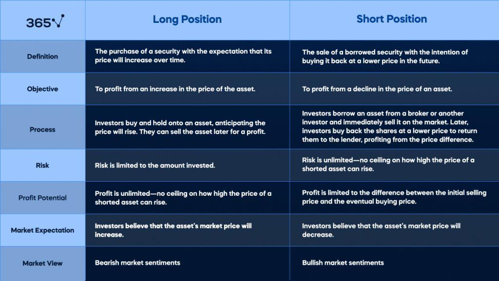

## Table of Contents

## What is a short position in trading?

A short position in trading is when you sell a stock or other asset that you don't actually own. You do this because you believe the price of the asset will go down. You borrow the asset from someone else, sell it at the current price, and then buy it back later at a lower price to return it to the lender. The difference between the price you sold it for and the price you bought it back at is your profit.

For example, if you think the price of a stock that is currently $100 will drop, you can short sell it. You borrow the stock and sell it for $100. If the price then drops to $90, you buy it back at $90, return the stock to the lender, and keep the $10 difference as your profit. However, if the price goes up instead, you will lose money because you have to buy it back at a higher price to return it.

## What is a short sale in trading?

A short sale in trading is when you sell something you don't own, like a stock. You do this because you think the price of the stock will go down. You borrow the stock from someone else, sell it at the current price, and then you plan to buy it back later when the price is lower. The difference between the price you sold it for and the price you bought it back at is your profit.

For example, let's say a stock is worth $50 and you think it will drop. You can short sell it by borrowing the stock and selling it for $50. If the price drops to $40, you buy the stock back at $40, return it to the person you borrowed it from, and keep the $10 difference as your profit. But, if the price goes up instead, you will lose money because you have to buy it back at a higher price to return it.

## How does a short position differ from a short sale?

A short position and a short sale are actually the same thing. Both terms describe when you sell something you don't own, like a stock, because you think its price will go down. You borrow the stock from someone else, sell it at the current price, and then plan to buy it back later when the price is lower. The difference between the price you sold it for and the price you bought it back at is your profit.

For example, if a stock is worth $50 and you think it will drop, you can take a short position or short sell it. You borrow the stock, sell it for $50, and if the price drops to $40, you buy it back at $40, return it to the person you borrowed it from, and keep the $10 difference as your profit. But, if the price goes up instead, you will lose money because you have to buy it back at a higher price to return it.

## What are the basic steps to initiate a short position?

To start a short position, first, you need to find a stock or asset you think will go down in price. You can do this by looking at news, charts, and other information about the stock. Once you've picked the stock, you need to borrow it from someone else, usually through your broker. This is because you can't sell something you don't own without borrowing it first.

After you've borrowed the stock, you sell it at the current market price. You keep the money from the sale for now. You hope the price will go down so you can buy the stock back later at a lower price. When the price drops, you buy the stock back, return it to the person you borrowed it from, and keep the difference between the price you sold it for and the price you bought it back at as your profit. If the price goes up instead, you'll lose money because you'll have to buy it back at a higher price.

## What are the basic steps to execute a short sale?

To start a short sale, you first need to find a stock or asset you think will go down in price. You can do this by looking at news, charts, and other information about the stock. Once you've picked the stock, you need to borrow it from someone else, usually through your broker. This is because you can't sell something you don't own without borrowing it first.

After you've borrowed the stock, you sell it at the current market price. You keep the money from the sale for now. You hope the price will go down so you can buy the stock back later at a lower price. When the price drops, you buy the stock back, return it to the person you borrowed it from, and keep the difference between the price you sold it for and the price you bought it back at as your profit. If the price goes up instead, you'll lose money because you'll have to buy it back at a higher price.

## What are the risks associated with short positions?

Short positions can be risky because the price of the stock you are betting against can go up instead of down. If it goes up, you will lose money because you have to buy the stock back at a higher price to return it to the person you borrowed it from. There is no limit to how high the price can go, so your losses can be much bigger than your possible gains. This is different from buying a stock, where the most you can lose is the money you paid for it.

Another risk is that you might have to return the stock before you want to. This can happen if the person you borrowed the stock from wants it back, or if there is a lot of demand for the stock. If you have to buy the stock back when the price is high, you will lose money. Also, you have to pay fees to borrow the stock, and these fees can add up and eat into your profits or make your losses even bigger.

## What are the risks associated with short sales?

Short sales can be risky because the price of the stock you are betting against might go up instead of down. If it goes up, you will lose money because you have to buy the stock back at a higher price to return it to the person you borrowed it from. There is no limit to how high the price can go, so your losses can be much bigger than your possible gains. This is different from buying a stock, where the most you can lose is the money you paid for it.

Another risk is that you might have to return the stock before you want to. This can happen if the person you borrowed the stock from wants it back, or if there is a lot of demand for the stock. If you have to buy the stock back when the price is high, you will lose money. Also, you have to pay fees to borrow the stock, and these fees can add up and eat into your profits or make your losses even bigger.

## How does margin trading relate to short positions and short sales?

Margin trading is when you borrow money from your broker to buy stocks or other investments. When you take a short position or do a short sale, you are also using margin trading because you are borrowing the stock from your broker instead of buying it with your own money. You need to have a margin account to do this. The broker will usually ask for some money from you as a deposit, called margin, to make sure you can pay back what you borrowed if things go wrong.

The risk with margin trading and short positions or short sales is that if the price of the stock goes up instead of down, you will lose money. And because you borrowed money or stock, you might have to pay back more than you expected. If your losses are big, the broker might ask for more money from you to cover the risk. This is called a margin call. If you can't give the broker more money, they might sell your stocks to get their money back, which can make your losses even bigger.

## Can you explain the concept of short covering and how it applies to both?

Short covering is what happens when someone who has taken a short position or done a short sale decides to buy back the stock they borrowed and sold. They do this to close their position and return the stock to the person they borrowed it from. If the price of the stock has gone down like they hoped, they can buy it back at a lower price and make a profit. But if the price has gone up, they will lose money because they have to buy it back at a higher price.

Short covering applies to both short positions and short sales because they are the same thing. When you take a short position or do a short sale, you are betting that the price of a stock will go down. You borrow the stock, sell it, and then you need to buy it back later to return it. Short covering is the step where you buy the stock back. If a lot of people are short covering at the same time because the price is going up, it can make the price go up even more. This is called a short squeeze, and it can be bad for people who are short because their losses can get bigger quickly.

## What are the regulatory differences between short positions and short sales in different markets?

In different markets around the world, the rules for short positions and short sales can be different. In the United States, the Securities and Exchange Commission (SEC) has rules that say you have to borrow the stock before you can sell it short. They also have rules to stop people from making the price go down too fast by short selling, like the uptick rule, which says you can only sell short if the last price was higher than the one before it. In Europe, the rules are a bit different. The European Securities and Markets Authority (ESMA) says that you have to tell them if you have a big short position, and in some countries, you might need to borrow the stock before selling it short.

In Asia, the rules can be different from country to country. In Japan, you need to borrow the stock before you can sell it short, and you have to tell the Financial Services Agency (FSA) if you have a big short position. In Hong Kong, you can sell short without borrowing the stock first, but you have to make sure you can borrow it by the end of the day. In some countries, like China, short selling is not allowed at all, or it is only allowed for certain stocks. These different rules can make it harder or easier to take a short position or do a short sale, depending on where you are.

## How do short positions and short sales impact the overall market dynamics?

Short positions and short sales can affect the overall market in big ways. When a lot of people think a stock's price will go down and they start short selling it, it can make the stock's price go down even more. This happens because more people are selling the stock than buying it. If the stock's price keeps going down, more people might want to short sell it, making the price go down even faster. This can lead to something called a "bear market," where the prices of many stocks are going down.

On the other hand, if the price of a stock starts to go up instead, people with short positions might get worried and start buying the stock back to close their positions. This is called short covering. If a lot of people are short covering at the same time, it can make the stock's price go up even more quickly. This can lead to a "short squeeze," where the price goes up so fast that people with short positions lose a lot of money. So, short positions and short sales can make the market more unstable, causing big changes in stock prices.

## What advanced strategies can traders use involving short positions and short sales?

Traders can use a strategy called "pairs trading" with short positions and short sales. This means they find two stocks that usually move together, like two companies in the same industry. They buy one stock (go long) and sell the other short (go short). If the stocks move apart from each other, the trader can make money from the difference. For example, if one stock goes up more than the other, the trader makes money from the stock they bought going up and the stock they shorted going down less. This strategy can help traders make money even when the market is not moving much.

Another strategy is "shorting against the box." This is when a trader already owns a stock but thinks its price will go down soon. Instead of selling the stock they own, they short sell the same amount of the stock. This way, they can lock in the current price and wait to see if it goes down. If the price does go down, they can buy back the shorted stock at the lower price and make a profit. This can be useful if the trader wants to keep the stock for the long term but still wants to make money from a short-term price drop.

Traders might also use "hedging" with short positions. This means they use short sales to protect their other investments. For example, if a trader has a lot of stocks in their portfolio and they think the market might go down, they can short sell some stocks or an index to balance out any losses. If the market does go down, the money they make from the short sales can help cover the losses from their other stocks. This way, they can reduce the risk of losing a lot of money if the market goes down.

## What are the Mechanics of Short Selling?

Short selling is a trading technique that involves selling a financial asset that the seller does not own at the time of the transaction. The process begins with the trader borrowing the asset, typically from a broker or another investor, with the obligation to return the asset at a later date. The trader then sells the borrowed asset in the market with the expectation that the asset's price will decline.

If the asset's price falls as anticipated, the trader can repurchase the asset at the reduced price, returning the borrowed asset to the lender. The profit generated from this transaction is the difference between the sale price and the lower repurchase price, minus any associated borrowing costs and fees. Mathematically, the profit $P$ from a short sale can be expressed as:

$$

P = (S_{\text{sell}} - S_{\text{buy}}) \times Q - C
$$

where:
- $S_{\text{sell}}$ is the price at which the asset was sold.
- $S_{\text{buy}}$ is the price at which the asset was repurchased.
- $Q$ is the quantity of the asset traded.
- $C$ represents any costs or fees associated with borrowing and trading the asset.

Throughout the short selling process, the trader must continually monitor market prices as fluctuations can impact potential profits or exacerbate losses. If the asset's price rises instead of falling, the trader will incur losses when repurchasing the asset at a higher price than the initial selling price. The potential for loss is theoretically unlimited since the asset's price can increase indefinitely.

Traders must also consider the costs associated with borrowing the asset, which usually involves paying interest to the lender. Additionally, brokers often require traders to maintain a margin account and adhere to margin requirements to cover potential losses. This necessitates a robust risk management strategy to ensure that the trader can meet any margin calls and avoid being forced to cover the short position at unfavorable prices.

Once the trader decides to close the position, the repurchase of the asset is typically executed through the same broker that facilitated the borrowing. Upon fulfilling the contractual obligation to return the asset to the lender, the short selling transaction is complete.

## What is Risk Management in Algorithmic Short Selling?

Effective risk management is crucial in algorithmic short selling, where the combination of advanced technology and complex market dynamics can amplify both opportunities and risks. Central to this approach are strategies that focus on position sizing, implementation of stop-loss mechanisms, and diversification.

### Position Sizing

Position sizing is fundamental in managing risk within algorithmic short selling. It involves determining the appropriate amount of capital to allocate to each trade relative to an investor's total portfolio. This strategy helps mitigate the risk of significant losses. The key considerations for position sizing include an individual’s risk tolerance, the volatility of the asset, and the overall market conditions. A general rule of thumb is to risk no more than a pre-determined percentage of one's capital on a single trade. This can be calculated using the formula:

$$
\text{Position Size} = \frac{\text{Account Risk} \times \text{Account Equity}}{\text{Trade Risk}}
$$

where:
- **Account Risk** is the percentage of the portfolio the trader is willing to risk,
- **Account Equity** represents the total capital available,
- **Trade Risk** is the difference between the entry price and the stop-loss price.

### Stop-Loss Mechanisms

Stop-loss mechanisms are integral in managing downside risk in algorithmic short selling. These are pre-defined conditions set to automatically exit a position once the asset price reaches a certain level. This helps in limiting losses, especially when market movements are adverse and unexpected. In an algorithmic context, stop-loss orders can be executed automatically without the need for human intervention, ensuring prompt responses to unfavorable price changes. An example Python snippet for setting a stop-loss order might look like this:

```python
def calculate_stop_loss(entry_price, risk_percentage):
    return entry_price - (entry_price * (risk_percentage / 100))

# Example usage:
entry_price = 100
risk_percentage = 2
stop_loss_price = calculate_stop_loss(entry_price, risk_percentage)
```

### Diversification

Diversification across various assets and sectors is another powerful risk management tool in algorithmic short selling. By spreading investments across different types of assets and industries, traders can reduce the impact of a poor-performing position on the overall portfolio. The correlations between assets should be considered to ensure true diversification, as highly correlated securities may not offer the desired protective benefits.

By effectively sizing positions, employing stop-loss strategies, and diversifying investments, algorithmic traders can manage risk and optimize their short selling strategies. This strategic approach is vital to maintaining a balanced risk-reward ratio and achieving long-term trading success in the volatile landscape of short selling.

## References & Further Reading

[1]: ["Advances in Financial Machine Learning"](https://www.amazon.com/Advances-Financial-Machine-Learning-Marcos/dp/1119482089) by Marcos Lopez de Prado

[2]: ["Quantitative Trading: How to Build Your Own Algorithmic Trading Business"](https://www.amazon.com/Quantitative-Trading-Build-Algorithmic-Business/dp/1119800064) by Ernest P. Chan

[3]: ["Evidence-Based Technical Analysis: Applying the Scientific Method and Statistical Inference to Trading Signals"](https://www.amazon.com/Evidence-Based-Technical-Analysis-Scientific-Statistical/dp/0470008741) by David Aronson

[4]: ["Machine Learning for Algorithmic Trading"](https://github.com/stefan-jansen/machine-learning-for-trading) by Stefan Jansen

[5]: Hasbrouck, J. (2007). ["Empirical Market Microstructure: The Institutions, Economics, and Econometrics of Securities Trading"](https://academic.oup.com/book/52241) by Joel Hasbrouck

[6]: Koller, T., Goedhart, M., & Wessels, D. (2010). ["Valuation: Measuring and Managing the Value of Companies"](https://www.mckinsey.com/capabilities/strategy-and-corporate-finance/our-insights/valuation-measuring-and-managing-the-value-of-companies) by McKinsey & Company Inc.

[7]: Grinold, R. C., & Kahn, R. N. (2000). ["Active Portfolio Management: A Quantitative Approach for Producing Superior Returns and Controlling Risk"](https://www.amazon.com/Active-Portfolio-Management-Quantitative-Controlling/dp/0070248826) by Richard C. Grinold and Ronald N. Kahn