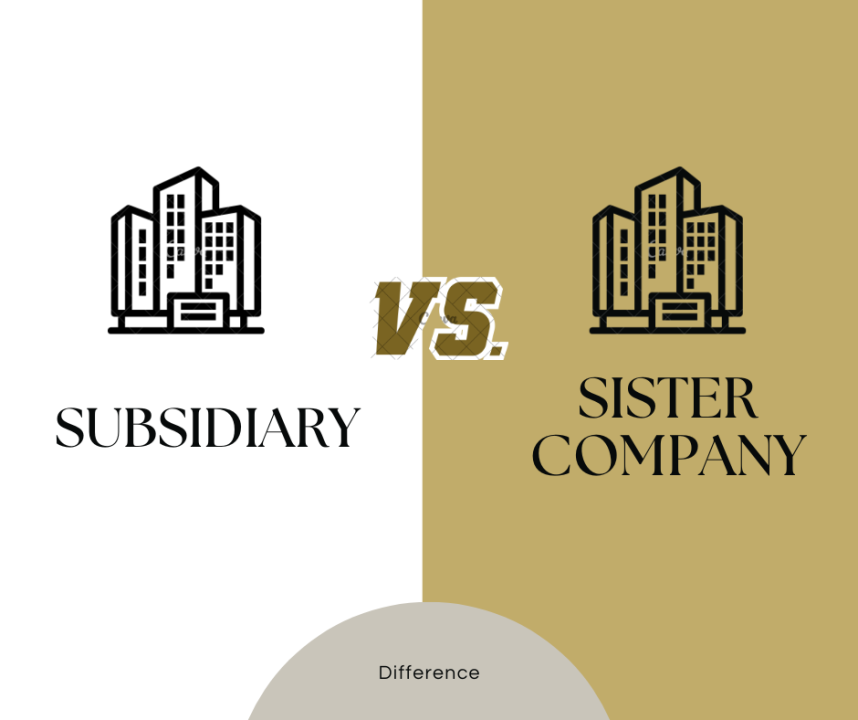

## Table of Contents

## What is a subsidiary?

A subsidiary is a company that is controlled by another company, which is called the parent company. The parent company owns more than half of the subsidiary's shares, which gives them the power to make decisions for the subsidiary. This setup is common in big businesses where the parent company wants to expand into new areas or manage different parts of their business separately.

Subsidiaries can operate in different ways. Some might have a lot of freedom to make their own decisions, while others are more closely managed by the parent company. Even though they are separate companies, subsidiaries often share resources and work together with the parent company to reach common goals. This can help the parent company grow and be successful in different markets or industries.

## What is a sister company?

A sister company is a business that has the same parent company as another business. This means that both companies are owned by the same bigger company, but they are run separately. Sister companies might work in different areas or sell different things, but they are connected because of their common owner.

Even though sister companies are under the same parent, they usually do their own thing. They might share some resources or help each other out, but they make their own decisions and have their own bosses. This setup lets the parent company keep different parts of its business separate while still having control over all of them.

## How is a subsidiary formed?

A subsidiary is formed when one company, called the parent company, buys more than half of the shares of another company. This means the parent company gets control over the other company, which then becomes a subsidiary. The parent company can buy these shares all at once or over time, depending on what they want to do. Sometimes, the parent company might even start a new company from scratch and own it completely right from the beginning.

Once the parent company has control, the subsidiary can start working. The parent company decides how much freedom the subsidiary will have. Some subsidiaries get to make their own decisions and run their business almost like they are independent. Others are more closely watched and managed by the parent company. Either way, the subsidiary is a separate legal entity, which means it has its own responsibilities and can be held accountable for its actions, even though it is controlled by the parent company.

## How is a sister company relationship established?

A sister company relationship is established when two or more companies are owned by the same parent company. This means that the parent company has bought or created these companies and now controls them. The sister companies might be in different industries or offer different products and services, but they all share the same owner.

Even though sister companies have the same parent, they usually operate independently. This means they have their own management teams and make their own business decisions. They might share some resources or work together on projects, but they are separate from each other. The parent company oversees them to make sure they all work towards common goals, but the sister companies are free to run their day-to-day operations on their own.

## Who owns a subsidiary?

A subsidiary is owned by a parent company. The parent company buys more than half of the subsidiary's shares. This gives the parent company control over the subsidiary. They can decide what the subsidiary does and how it works.

Even though the parent company owns the subsidiary, the subsidiary is still its own company. It has its own name and can make some of its own decisions. But the parent company is in charge and can tell the subsidiary what to do if they want to.

## Who owns a sister company?

A sister company is owned by the same parent company as another company. This means that the parent company bought or created both companies and now controls them. The sister companies might be in different businesses or offer different things, but they all have the same owner.

Even though sister companies have the same parent, they usually work on their own. They have their own bosses and make their own decisions about how to run their business. The parent company watches over them to make sure they are all working towards the same goals, but the sister companies can do their own thing every day.

## What is the legal relationship between a parent company and its subsidiary?

A parent company and its subsidiary have a special legal relationship. The parent company owns more than half of the subsidiary's shares, which gives them control over the subsidiary. This means the parent company can make big decisions for the subsidiary, like who runs it and what it does. But even though the parent company is in charge, the subsidiary is still its own separate company. It has its own name and can be held responsible for its own actions.

The parent company and the subsidiary are separate legal entities. This means the subsidiary can sign contracts, own property, and be sued, all on its own. The parent company is not directly responsible for the subsidiary's debts or legal problems, unless they did something wrong or promised to help. But because the parent company owns the subsidiary, they can use their control to help the subsidiary succeed and grow.

## How does the relationship between sister companies differ from that of subsidiaries?

Sister companies and subsidiaries are both part of a bigger company, but they have different relationships. Sister companies are owned by the same parent company, but they work separately from each other. They might be in different businesses or offer different things, but they all have the same owner. Sister companies usually make their own decisions and run their own day-to-day operations. The parent company watches over them to make sure they are all working towards the same goals, but the sister companies have a lot of freedom.

Subsidiaries, on the other hand, are companies that are directly controlled by a parent company. The parent company owns more than half of the subsidiary's shares, which gives them the power to make big decisions for the subsidiary. Subsidiaries can have different levels of freedom, but the parent company is always in charge. Unlike sister companies, subsidiaries are more closely tied to the parent company and might have less independence in how they run their business. Even though they are separate legal entities, the parent company has a lot of say in what the subsidiary does.

## Can a subsidiary have its own subsidiaries?

Yes, a subsidiary can have its own subsidiaries. This happens when a company that is already a subsidiary of a parent company buys more than half of the shares of another company. The new company then becomes a subsidiary of the first subsidiary. This can make things a bit complicated, but it's like having a family tree where one child has its own children.

Even though it's a bit more complex, the main idea stays the same. The parent company at the top still controls everything. The first subsidiary can make decisions for its own subsidiary, but the parent company can step in and guide things if they need to. This setup lets big companies grow and expand into new areas without losing control over their business.

## How do financial statements reflect the operations of subsidiaries versus sister companies?

When it comes to financial statements, subsidiaries are treated differently than sister companies. A subsidiary's financials are often included in the parent company's financial statements. This is called consolidation. It means that the parent company adds the subsidiary's income, expenses, assets, and liabilities to its own. This gives a complete picture of the whole company, including all its parts. If the subsidiary is big or important, its financials might also be shown separately, but they are still part of the parent's overall numbers.

On the other hand, sister companies, even though they have the same parent, usually keep their financial statements separate. Each sister company reports its own income, expenses, assets, and liabilities. The parent company might combine these numbers to see the big picture, but the sister companies' financials are not mixed together like subsidiaries. This way, the parent company can see how each sister company is doing on its own, which helps them make decisions about each part of their business.

## What are the strategic advantages of having subsidiaries over sister companies?

Having subsidiaries gives a company more control over its business. When a company owns a subsidiary, it can make big decisions for that company, like who runs it and what it does. This can be really helpful if the parent company wants to make sure the subsidiary follows its overall plan. For example, if the parent company wants to grow into a new market, it can use the subsidiary to do that. The parent company can also share resources and help the subsidiary succeed, which can make the whole business stronger.

On the other hand, sister companies are more independent. They are owned by the same parent, but they usually run their own business without as much help or control from the parent. This can be good if the parent company wants to keep different parts of its business separate. But if the parent company wants to make sure all its parts work together closely, having subsidiaries might be better. Subsidiaries can help the parent company have a clearer picture of how its business is doing and make it easier to manage everything as one big team.

## How do tax implications differ for subsidiaries compared to sister companies?

When it comes to taxes, subsidiaries and sister companies can have different effects on the parent company. A subsidiary is usually included in the parent company's tax returns. This is called consolidated tax reporting. It means the parent company adds the subsidiary's income and losses to its own when figuring out how much tax to pay. This can help the parent company save money on taxes because they can use the losses from one part of the business to reduce the taxes on profits from another part.

Sister companies, on the other hand, usually file their own tax returns separately. Each sister company reports its own income and pays its own taxes. The parent company might still have to report the income from the sister companies on its own tax return, but it can't use the losses from one sister company to reduce the taxes on another sister company's profits. This can make the tax situation more complicated for the parent company, but it also means each sister company is responsible for its own taxes.

## References & Further Reading

[1]: Bergstra, J., Bardenet, R., Bengio, Y., & Kégl, B. (2011). ["Algorithms for Hyper-Parameter Optimization."](https://papers.nips.cc/paper/4443-algorithms-for-hyper-parameter-optimization) Advances in Neural Information Processing Systems 24.

[2]: ["Advances in Financial Machine Learning"](https://www.amazon.com/Advances-Financial-Machine-Learning-Marcos/dp/1119482089) by Marcos Lopez de Prado

[3]: ["Evidence-Based Technical Analysis: Applying the Scientific Method and Statistical Inference to Trading Signals"](https://www.amazon.com/Evidence-Based-Technical-Analysis-Scientific-Statistical/dp/0470008741) by David Aronson

[4]: ["Machine Learning for Algorithmic Trading"](https://github.com/stefan-jansen/machine-learning-for-trading) by Stefan Jansen

[5]: ["Quantitative Trading: How to Build Your Own Algorithmic Trading Business"](https://www.amazon.com/Quantitative-Trading-Build-Algorithmic-Business/dp/1119800064) by Ernest P. Chan