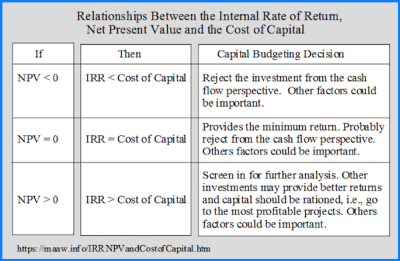

## Table of Contents

## What is WACC and how is it calculated?

WACC stands for Weighted Average Cost of Capital. It's a way to figure out the average rate of return a company needs to pay to its investors for using their money. Think of it like a big basket where you put different types of money the company uses, like loans and stock money, and then you find out how much it costs the company to use that basket.

To calculate WACC, you first need to know the cost of each type of money the company uses. This includes the cost of equity, which is the return shareholders expect, and the cost of debt, which is the interest rate on loans. Then, you figure out how much of the company's money comes from equity and how much comes from debt. You multiply the cost of equity by the portion of the company that's financed by equity, and you do the same for debt. Finally, you add these two numbers together to get the WACC. It's like mixing different juices in the right amounts to make a new drink, where the taste of the drink is the WACC.

## What is IRR and how do you determine it?

IRR stands for Internal Rate of Return. It's a way to figure out how good an investment is by finding the rate at which the investment's profits equal its costs. Imagine you're planting a tree. The IRR is like finding out what growth rate the tree needs to have so that the fruit it produces over time is worth exactly what you spent on planting it.

To determine the IRR, you need to look at all the money coming in and going out over the life of the investment. It's a bit like solving a puzzle because you're trying to find the rate that makes the total value of the money coming in equal to the money going out. You can use a calculator or a computer program to help you find this rate because it involves some tricky math. Once you have the IRR, you can compare it to other rates, like the cost of borrowing money or other investment opportunities, to see if your investment is a good choice.

## Why are WACC and IRR important in financial decision-making?

WACC and IRR are important in financial decision-making because they help businesses figure out if an investment is worth it. WACC tells a company how much it costs to get money from different places like loans and selling stock. It's like knowing the price of different ingredients before you start cooking. If a company knows its WACC, it can see if the money it makes from an investment is more than what it costs to get that money. This helps the company decide if the investment will make them more money than they spend.

IRR, on the other hand, helps a company see how fast their money will grow from an investment. It's like checking if a plant will grow fast enough to give you good fruits. If the IRR of an investment is higher than the WACC, it means the investment will grow the company's money faster than it costs to borrow or raise that money. This is a good sign that the investment is a smart choice. By comparing WACC and IRR, a company can make better choices about where to put their money to grow their business.

## How does WACC differ from IRR in terms of their purpose?

WACC and IRR serve different purposes in financial decision-making. WACC, or Weighted Average Cost of Capital, is used to find out how much it costs a company to get money from different sources like loans and selling stock. It's like figuring out the total price of all the ingredients a chef needs to cook a meal. By knowing the WACC, a company can see if the money they make from an investment is more than what it costs to get that money. This helps them decide if the investment is worth it.

IRR, or Internal Rate of Return, is used to figure out how fast an investment will grow the company's money. It's like checking how quickly a tree will grow to see if it's worth planting. The IRR helps a company see if the growth rate of their money from the investment is good enough. If the IRR is higher than the WACC, it means the investment will grow the company's money faster than it costs to borrow or raise that money, making it a smart choice.

## Can you explain the components of WACC and their impact on the calculation?

WACC, or Weighted Average Cost of Capital, is made up of two main parts: the cost of equity and the cost of debt. The cost of equity is what shareholders expect to earn on their investment in the company. It's like the return someone expects when they buy a piece of the company. The cost of debt is the interest rate the company pays on its loans. It's like the price a company pays to borrow money from a bank or other lenders.

To calculate WACC, you need to know how much of the company's money comes from equity and how much comes from debt. This is called the company's capital structure. You then multiply the cost of equity by the portion of the company that's financed by equity, and you do the same for the cost of debt. But since interest on debt can be deducted from taxes, you adjust the cost of debt by multiplying it by one minus the tax rate. Finally, you add these two numbers together to get the WACC. This gives the company a single number that shows the average cost of all the money it uses, helping them decide if new projects or investments are worth it.

## What are the key assumptions made when calculating IRR?

When calculating IRR, one key assumption is that all cash flows generated by the investment can be reinvested at the same rate as the IRR itself. This means if a project has an IRR of 10%, it's assumed that any money made from the project can be put back into another investment that also gives a 10% return. This might not always be realistic because finding new investments with the same high return can be hard.

Another important assumption is that the timing and amount of cash flows are known and will happen as predicted. This means the IRR calculation assumes that you know exactly when you'll get money back from the investment and how much it will be. In real life, things can change, and the actual cash flows might be different from what was expected. These assumptions help simplify the IRR calculation, but they can also make the results less accurate if the real world doesn't match up with these assumptions.

## How do companies use WACC in evaluating investment projects?

Companies use WACC to figure out if an investment project is worth doing. WACC is like the average cost of all the money a company uses, from loans to selling stock. When a company looks at a new project, they compare the money they expect to make from it to their WACC. If the project's expected return is higher than the WACC, it means the project will make more money than it costs to get the money to do the project. This helps the company decide that the project is a good idea.

For example, if a company's WACC is 8%, they would only want to start projects that are expected to make more than 8% return. This way, they know the project will grow their money faster than it costs to borrow or raise that money. By using WACC, companies can make smarter choices about which projects to invest in, helping them use their money in the best way possible to grow their business.

## In what scenarios might IRR be more appropriate than WACC for project evaluation?

IRR, or Internal Rate of Return, might be more appropriate than WACC for project evaluation when a company wants to see how fast their money will grow from a specific project. Imagine you're deciding whether to plant a tree. You want to know how quickly the tree will grow and give you fruit. IRR helps you figure that out. It's like checking the growth rate of your money. If the IRR is high, it means your money will grow quickly, which can be really important if you're looking at projects that need to pay off fast.

Another scenario where IRR might be better is when you're comparing different projects that don't have the same risk or cost of capital. WACC is based on the whole company's cost of money, but different projects might have different risks. IRR looks at each project on its own, without worrying about the company's overall cost of capital. This makes it easier to compare projects side by side, like choosing between different types of trees to plant based on how fast they'll grow, without thinking about the cost of the land they're planted on.

## What are the limitations of using WACC as a discount rate?

Using WACC as a discount rate has some limitations. One big problem is that WACC is based on the whole company's cost of money, but different projects might have different risks. Imagine you're using the same watering can for all your plants, even though some need more water than others. If a project is riskier than the company's average, using WACC might make the project look better than it really is because the discount rate is too low. On the other hand, if a project is safer, using WACC might make it look worse because the discount rate is too high.

Another limitation is that WACC assumes the company's capital structure stays the same, which isn't always true. Companies can change how much they borrow or how much they raise from selling stock. It's like trying to cook a meal with ingredients that keep changing. If the company's cost of money changes, the WACC changes too, which means the discount rate used to judge projects might not be right anymore. This can lead to wrong decisions about which projects to start.

## How can discrepancies between WACC and IRR affect investment decisions?

When WACC and IRR don't match up, it can make it hard for a company to decide if an investment is a good idea. WACC is like the average cost of all the money a company uses, and if a project's IRR, which is how fast the money grows, is higher than the WACC, the project looks good. But if the IRR is lower than the WACC, it might seem like a bad choice. The problem is, WACC looks at the whole company, but different projects can have different risks. So, if a project is riskier than the company's average, using WACC might make it look better than it really is. On the other hand, if a project is safer, using WACC might make it look worse.

These differences can lead to wrong decisions. For example, a company might say no to a project that could actually be good because the WACC makes it look bad. Or they might say yes to a risky project that doesn't end up working out because the WACC made it look better than it was. It's like trying to pick the right plant to grow based on the average needs of all your plants, which can lead to some plants not getting what they need. By understanding these differences, a company can make smarter choices about where to put their money, helping them grow their business in the best way possible.

## What advanced techniques can be used to adjust WACC for riskier projects?

One way to adjust WACC for riskier projects is by using a risk-adjusted discount rate. This means you change the WACC to make it higher for projects that are more risky. It's like adding more water to a plant that needs it more than others. You can do this by adding a risk premium to the cost of equity in the WACC calculation. The risk premium is extra money you think you should get because the project is riskier. This makes the WACC higher, so the project has to make more money to be worth it.

Another technique is to use scenario analysis or sensitivity analysis. This means you look at different possible futures for the project and see how they change the WACC. It's like checking how a plant might grow in different weather conditions. You can make different guesses about things like interest rates or how much money the project will make, and then see how these guesses change the WACC. This helps you understand how much risk there is and if the project is still a good idea even if things don't go perfectly.

## How do changes in market conditions influence the relationship between WACC and IRR?

Changes in market conditions can make a big difference in how WACC and IRR work together. WACC is like the average cost of all the money a company uses, and it can go up or down depending on things like interest rates or how much people want to buy the company's stock. If interest rates go up, the cost of borrowing money gets higher, which makes WACC go up too. On the other hand, if the economy is doing well and people want to buy more stock, the cost of equity might go down, making WACC lower. These changes mean that the line between a good investment and a bad one can move, because the company's cost of money changes.

When WACC changes, it can affect how IRR looks for a project. IRR is like checking how fast your money will grow from an investment. If WACC goes up because of higher interest rates, a project that looked good before might not look so good anymore because the money it makes has to be more than the new, higher cost of money. On the flip side, if WACC goes down, more projects might look good because they don't have to make as much money to be worth it. So, market conditions can change the game, making companies rethink which projects are worth doing based on how WACC and IRR line up.

## What is the understanding of WACC?

Weighted Average Cost of Capital (WACC) represents the average rate that a company anticipates paying to finance its assets. This metric is pivotal in assessing whether an investment yields adequate returns to justify its costs. Essentially, WACC is the hurdle rate for the company's investment projects. Calculating WACC involves determining the cost of each component of capital, such as equity and debt, then weighting these costs by their respective proportions in the company’s capital structure.

The formula for WACC is expressed as follows:

$$
WACC = \left( \frac{E}{V} \times Re \right) + \left( \frac{D}{V} \times Rd \times (1-T) \right)
$$

Where:
- $E$ is the market value of equity
- $D$ is the market value of debt
- $V$ is the total market value of the company’s financing (equity + debt)
- $Re$ is the cost of equity
- $Rd$ is the cost of debt
- $T$ is the tax rate

### Components of WACC
1. **Cost of Equity (Re):** This is the return that investors expect for investing in the company’s equity. The cost of equity can be estimated using models such as the Capital Asset Pricing Model (CAPM), which considers the risk-free rate, the beta of the stock, and the equity risk premium.

2. **Cost of Debt (Rd):** This is the effective rate that the company pays on its borrowed funds. Usually, the cost of debt is calculated by taking the average yield on its existing debt instruments. Importantly, since interest expenses are tax-deductible, the actual cost of debt is reduced by the company's tax rate, hence the factor $(1-T)$.

3. **Capital Structure Weights ($E/V$ and $D/V$):** These weights represent the proportion of financing that is sourced from equity versus debt. The weights are based on market values rather than book values, as market values more accurately reflect the current economic environment and investor expectations.

### Importance in Financial Decision-Making
WACC is a crucial metric for evaluating whether potential projects can enhance a company's market value. By determining the minimum acceptable return on invested capital, WACC acts as a benchmark for comparing the projected returns of various projects. A project is generally deemed viable if its expected return exceeds WACC, indicating that the project will generate value above the cost of financing it.

Understanding WACC allows companies to optimize their capital structure, minimize cost of capital, and enhance shareholder value. It serves as a fundamental tool in strategic financial planning and capital budgeting, helping businesses to balance the risks and rewards associated with their investment decisions.

## What is Exploring IRR?

The Internal Rate of Return (IRR) is a pivotal financial metric used to evaluate the profitability of potential investments. It is essentially the discount rate that makes the Net Present Value (NPV) of all cash flows from a particular project equal to zero. This implies that IRR represents the rate of growth a project is expected to generate, serving as a benchmark for evaluating multiple investment opportunities.

When businesses consider various projects, IRR becomes a decisive [factor](/wiki/factor-investing) in determining which project to undertake. Specifically, a project is deemed favorable if its IRR exceeds the company's Weighted Average Cost of Capital (WACC). In such cases, the returns generated by the project are anticipated to surpass the requisite cost of funds, thus contributing positively to the company's value. 

The calculation of IRR involves setting the NPV equation to zero and solving for the discount rate, which can be expressed as:

$$
0 = \sum_{t=0}^{n} \frac{C_t}{(1 + \text{IRR})^t}
$$

Where:
- $C_t$ is the net cash flow at time $t$.
- $n$ is the total number of periods.
- IRR is the unknown rate of return that equates NPV to zero.

Finding the IRR is computationally intensive and often requires iterative methods or algorithmic approaches, such as the Newton-Raphson method, due to the non-linear nature of the equation. Python code, using libraries like NumPy, is frequently employed to approximate IRR values efficiently:

```python
import numpy as np

cash_flows = [-1000, 200, 300, 400, 500]  # Example cash flows
irr = np.irr(cash_flows)  # Calculate IRR
print(f"The IRR is {irr:.2%}")
```

This code snippet utilizes NumPy's `irr` function to compute the IRR of a series of cash flows. Decision-makers use IRR to prioritize projects that not only promise higher returns but also align with the firm's strategic financial objectives. By selecting projects with IRR above WACC, companies can optimize their investment portfolios and drive long-term growth.

## What is the difference between WACC and IRR in comparative financial analysis?

The comparison between the Weighted Average Cost of Capital (WACC) and the Internal Rate of Return (IRR) serves as a [fundamental analysis](/wiki/fundamental-analysis) to determine the viability of an investment. WACC represents the average rate a company must pay to finance its assets, effectively setting a benchmark that potential investment returns need to exceed. In contrast, IRR is a measure that evaluates the expected profitability of an investment by calculating the rate of return at which the Net Present Value (NPV) of cash flows becomes zero.

Projects are generally deemed valuable if the IRR surpasses the WACC. This scenario indicates that the expected returns not only compensate for the cost of capital but also generate additional financial value for the company. Mathematically, this relationship can be expressed as:

$$
\text{If } \text{IRR} > \text{WACC, then } \text{NPV} > 0,
$$

implying a positive net gain from the investment. This criterion is crucial for strategic project evaluation and capital budgeting, guiding businesses in the allocation of financial resources toward high-yield projects.

For capital budgeting, the interplay of WACC and IRR is vital as it encompasses risk assessment and growth expectations. Companies leverage these metrics to make informed decisions about which projects to undertake, expand, or abandon. Usually, projects with an IRR that exceeds the company's hurdle rate, often a slight premium over the WACC, warrant further consideration, thus prioritizing investments that promise optimum return relative to their cost.

In summary, analyzing the comparative dynamics of WACC and IRR provides valuable insights into investment decisions. These financial metrics empower businesses to undertake projects that not only recover costs but also enhance shareholder value, fostering long-term corporate growth.

## How do you calculate WACC and what considerations should be taken into account?

The Weighted Average Cost of Capital (WACC) is a fundamental measure in finance, representing the average rate a company expects to pay for financing its assets. Effectively calculating WACC involves determining the proportionate costs of equity and debt, enabling businesses to assess whether potential investments can generate sufficient returns to warrant those costs. This calculation is pivotal for financial analysis and strategic decision-making.

WACC is expressed through the following formula:

$$

WACC = \left(\frac{E}{V} \cdot Re\right) + \left(\frac{D}{V} \cdot Rd \cdot (1 - T)\right) 
$$

Where:
- $E$ is the market value of equity
- $V$ is the total market value of equity and debt (i.e., $E + D$)
- $Re$ is the cost of equity
- $D$ is the market value of debt
- $Rd$ is the cost of debt
- $T$ is the corporate tax rate

### Calculating the Cost of Equity and Debt

#### Cost of Equity ($Re$)
The cost of equity can be estimated using models such as the Capital Asset Pricing Model (CAPM), which is represented as:

$$

Re = Rf + \beta \cdot (Rm - Rf) 
$$

Here:
- $Rf$ is the risk-free rate
- $\beta$ is the beta of the stock, representing its volatility in relation to the market
- $Rm$ is the expected market return

#### Cost of Debt ($Rd$)
The cost of debt is typically easier to determine, often derived from the yield to maturity on existing debt or the [interest rate](/wiki/interest-rate-trading-strategies) on new borrowings.

### Considerations for WACC Calculation

1. **Market Conditions**: Interest rates and economic conditions influence both the cost of equity and debt. Increasing interest rates can raise the cost of debt, while market volatility can affect beta and the associated risk premium.

2. **Tax Rates**: As the formula illustrates, taxes influence the WACC significantly, particularly through the cost of debt. Changes in tax policy can therefore directly affect a company’s WACC.

3. **Company-Specific Financial Strategies**: The capital structure decision—how much debt versus equity a company opts to use—uniquely impacts its WACC. Companies with similar operations in different jurisdictions might experience variations in WACC due to local financial strategies and tax implications.

4. **Estimating Beta**: Accurate calculation of beta is necessary to estimate the cost of equity. Firms often benchmark against industry-specific beta averages to ensure that calculations reflect appropriate risk levels.

Understanding these components and the nuances involved is key to leveraging WACC for informed financial planning and investment evaluation. Mastery of WACC calculation enables businesses to develop strategies that align investment decisions with shareholder value maximization objectives.

## References & Further Reading

[1]: Damodaran, A. (2012). ["Investment Valuation: Tools and Techniques for Determining the Value of Any Asset."](https://books.google.com/books/about/Investment_Valuation.html?id=5SRHAAAAQBAJ) Wiley Finance.

[2]: ["Principles of Corporate Finance"](https://en.wikipedia.org/wiki/Principles_of_Corporate_Finance) by Richard A. Brealey, Stewart C. Myers, and Franklin Allen.

[3]: ["Advances in Financial Machine Learning"](https://www.amazon.com/Advances-Financial-Machine-Learning-Marcos/dp/1119482089) by Marcos Lopez de Prado.

[4]: Fabozzi, F.J., & Markowitz, H.M. (2011). ["The Theory and Practice of Investment Management: Asset Allocation, Valuation, Portfolio Construction, and Strategies."](https://onlinelibrary.wiley.com/doi/book/10.1002/9781118267028) Wiley.

[5]: ["The Intelligent Investor: The Definitive Book on Value Investing."](https://www.amazon.com/Intelligent-Investor-Third-Definitive-Investing/dp/0063423537) by Benjamin Graham.