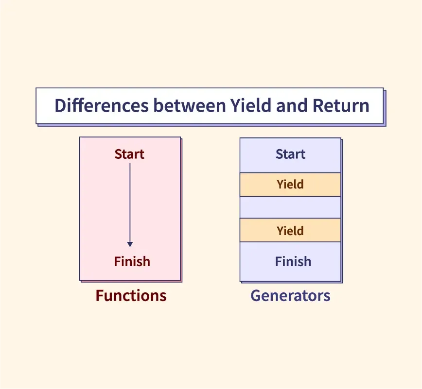

## Table of Contents

## What is yield in the context of investments?

Yield in the context of investments refers to the earnings generated and realized on an investment over a particular period of time. It's often expressed as a percentage based on the investment's cost, current market value, or face value. For example, if you buy a bond for $1,000 that pays $50 annually, the yield would be 5% of the bond's cost.

Understanding yield is important because it helps investors see how much they're earning from their investments compared to other options. Different types of investments, like stocks, bonds, or real estate, can have different ways of calculating yield. For stocks, yield might be based on dividends; for bonds, it could be the interest payments. Knowing the yield helps you decide if an investment is worth it based on the returns it offers.

## What is return in the context of investments?

Return in the context of investments is the money you make or lose from your investment over time. It's like the scorecard that tells you how well your investment is doing. If you buy a stock for $100 and later sell it for $120, your return is $20, which is a good thing. But if you sell it for $80, your return is -$20, meaning you lost money.

Returns can come in different forms. Sometimes, you get money back through dividends if you own stocks, or interest if you have bonds. Other times, your return is the difference between what you paid for an investment and what you sell it for. It's important to look at returns over time because they can go up and down. A good return means your investment is growing, helping you reach your financial goals.

## How is yield calculated?

Yield is calculated by figuring out how much money an investment makes in a year and then dividing that by the investment's value. For example, if you buy a bond for $1,000 and it pays you $50 every year, the yield is $50 divided by $1,000, which equals 5%. This 5% tells you how much you're earning from that bond each year compared to what you paid for it.

Different investments can have different ways to calculate yield. For stocks, yield often comes from dividends. If a stock costs $100 and pays a $4 dividend each year, the yield is $4 divided by $100, which is 4%. For real estate, yield might be the rent you get minus expenses, divided by the property's value. No matter the type of investment, knowing the yield helps you see if it's a good deal compared to other options.

## How is return calculated?

Return is how much money you make or lose on an investment. To calculate it, you take the money you get from selling your investment and subtract the money you paid for it. If you bought a stock for $100 and sold it for $120, your return is $120 minus $100, which is $20. That's a good thing because you made money. But if you sold it for $80, your return is $80 minus $100, which is -$20. That means you lost money.

Returns can also come from other places like dividends or interest. If you own a stock that pays dividends, you add those dividends to the money you get from selling the stock to find your total return. For example, if you bought a stock for $100, it paid $5 in dividends, and you sold it for $110, your total return is $110 plus $5 minus $100, which equals $15. Knowing your return helps you see if your investment is doing well or if you should look for other options.

## Can you give an example of yield for a bond?

Let's say you buy a bond for $1,000. This bond pays you $50 every year. To find the yield, you divide the $50 you get each year by the $1,000 you paid for the bond. That gives you a yield of 5%. This means that for every year you own the bond, you're earning 5% of what you paid for it.

Understanding yield is helpful because it shows you how much money you're making from your bond compared to what you spent. If another bond costs $1,000 but only pays $40 a year, its yield would be 4%. By comparing the yields, you can decide which bond is a better deal for your money.

## Can you give an example of return for a stock?

Let's say you buy a stock for $50. After a year, the stock's price goes up to $60. You decide to sell it. Your return is the difference between what you sold it for and what you paid for it. So, your return is $60 minus $50, which is $10. That's a good thing because you made money.

But returns can also come from other places. If that same stock paid you a $2 dividend during the year, you would add that to your return. So, your total return would be the $10 you made from selling the stock plus the $2 dividend, which equals $12. Knowing your total return helps you see how well your investment did over time.

## What are the different types of yield?

Yield can come in different forms depending on the type of investment. For bonds, the most common type of yield is the coupon yield, which is the interest the bond pays each year divided by its face value. Another type is the current yield, which is the annual interest payment divided by the bond's current market price. This can be different from the coupon yield if the bond's price changes. For stocks, the dividend yield is important. It's the yearly dividend payment divided by the stock's price. This tells you how much income you're getting from the stock compared to what you paid for it.

There are also other types of yield that investors look at. For example, yield to maturity (YTM) for bonds tells you the total return you can expect if you hold the bond until it matures. It takes into account the bond's current market price, its face value, the coupon payments, and the time left until it matures. For real estate, the rental yield is key. It's the annual rent you get from a property minus expenses, divided by the property's value. Knowing these different types of yield helps you compare investments and see which ones might give you the best return for your money.

## What are the different types of return?

Return is how much money you make or lose from an investment. There are different types of return, and they help you understand how well your investment is doing. One type is capital gain, which is the money you make when you sell an investment for more than you paid for it. For example, if you buy a stock for $50 and sell it for $60, your capital gain is $10. Another type is capital loss, which happens when you sell an investment for less than you paid for it. If you sell that same stock for $40, you have a capital loss of $10.

Another important type of return is income return. This is the money you get from an investment without selling it, like dividends from stocks or interest from bonds. If you own a stock that pays $2 in dividends each year, that's your income return. Total return is another type that combines both capital gain or loss and income return. For example, if you bought a stock for $50, it paid $2 in dividends, and you sold it for $60, your total return would be $12 ($10 capital gain plus $2 in dividends).

Understanding these different types of return helps you see the full picture of how your investments are doing. It's like looking at different parts of a puzzle to see if your investment strategy is working. Whether you're looking at capital gains, income returns, or total returns, each type gives you a different way to measure success and plan your next steps.

## How does yield relate to the price of a bond?

Yield and the price of a bond are closely connected. When you buy a bond, you pay a certain price for it. The bond then pays you interest every year. The yield is how much that interest is compared to what you paid for the bond. If the price of the bond goes up, the yield goes down because you're getting the same amount of interest but you paid more for it. If the price of the bond goes down, the yield goes up because you're getting the same interest but you paid less for the bond.

This relationship is important for investors. If you think interest rates will go up, bond prices might go down, so the yield on new bonds could be higher. That means if you buy a bond now and hold onto it, its price might drop, but the yield would go up if you sold it. On the other hand, if you think interest rates will go down, bond prices might go up, and the yield on new bonds could be lower. Knowing how yield and price work together helps you decide when to buy or sell bonds to get the best return on your money.

## How does return relate to the performance of a stock?

Return tells you how well a stock is doing. It's like a report card for your investment. If you buy a stock for $50 and sell it for $60, the return is $10. That's a good thing because you made money. But if you sell it for $40, the return is -$10, which means you lost money. Return is important because it shows if your stock is growing or shrinking in value.

Return can also come from other places, like dividends. If your stock pays you $2 every year, that's part of your return too. If you bought a stock for $50, it paid $2 in dividends, and you sold it for $60, your total return would be $12. That's the $10 you made from selling the stock plus the $2 in dividends. Knowing your total return helps you see how well your stock is doing over time and if it's helping you reach your financial goals.

## What factors can affect the yield of an investment?

The yield of an investment can change because of many things. One big thing is interest rates. If interest rates go up, the yield on new bonds goes up too because they pay more interest. But if you already own a bond, its price might go down to make its yield match the new higher rates. Another thing that can affect yield is how safe people think an investment is. If people think it's risky, they might want a higher yield to take that risk. If it's seen as safe, they might be okay with a lower yield.

The economy can also change yield. When the economy is doing well, people might want to invest in stocks instead of bonds, so bond prices might go down and their yield goes up. When the economy is not doing well, people might want safer investments like bonds, so bond prices might go up and their yield goes down. Also, how long until an investment pays back can affect yield. If you have to wait a long time for your money, you might want a higher yield to make it worth it.

## What advanced metrics should be considered when comparing yield and return across different investment types?

When comparing yield and return across different types of investments, it's helpful to look at some advanced metrics. One important metric is the Sharpe Ratio. This tells you how much return you're getting for the risk you're taking. A higher Sharpe Ratio means you're getting more return for less risk, which is good. Another metric to consider is the Sortino Ratio. It's similar to the Sharpe Ratio but focuses only on the bad risk, or downside risk. This can be useful if you're more worried about losing money than about the ups and downs of your investment.

Another useful metric is the Alpha, which shows how well an investment is doing compared to a benchmark like the stock market. A positive Alpha means your investment is doing better than the market, while a negative Alpha means it's doing worse. Beta is also important because it tells you how much an investment moves with the market. A high Beta means your investment goes up and down a lot with the market, while a low Beta means it's more stable. By looking at these metrics, you can get a better idea of how different investments stack up against each other in terms of yield and return.

## What is the understanding of yield and return?

Yield and return are essential metrics in evaluating investment performance, serving as benchmarks for investors to assess the effectiveness of their financial decisions. Understanding these concepts is crucial for setting financial goals and making informed investment decisions.

Yield refers to the income generated by an investment, typically expressed as a percentage. It can be calculated based on the cost of the investment or its current market value. For instance, in the case of bonds, yield often includes interest income relative to the bond's price. In equities, yield could refer to dividend yield, calculated as the annual dividends received per share divided by the stock price. The formula for yield is:

$$
\text{Yield} = \left( \frac{\text{Income}}{\text{Investment Value}} \right) \times 100
$$

Return, on the other hand, encompasses the total financial gain or loss experienced by an investor over a particular period. This measure includes income (such as interest or dividends) and capital appreciation or depreciation — the change in the market value of the investment. Return provides a holistic view of an investment’s performance by accounting for both income and changes in the asset's value. The return can be calculated using the formula:

$$
\text{Return} = \left( \frac{\text{Final Value of Investment} - \text{Initial Value of Investment}}{\text{Initial Value of Investment}} \right) \times 100
$$

Recognizing the difference between yield and return is essential for investors. Yield is predominantly concerned with the income aspect of an investment, making it particularly relevant for income-focused investments like bonds and dividend stocks. Return, in contrast, provides a comprehensive view of how well an investment has performed overall, taking into account all components of value change.

By understanding and distinguishing these metrics, investors can evaluate investment opportunities more effectively and articulate clearer financial objectives. Deciphering whether a strategy is centered around generating steady income, enhancing capital gains, or balancing both, influences portfolio management and aligns with investor goals.

## References & Further Reading

[1]: Bergstra, J., Bardenet, R., Bengio, Y., & Kégl, B. (2011). ["Algorithms for Hyper-Parameter Optimization."](https://papers.nips.cc/paper/4443-algorithms-for-hyper-parameter-optimization) Advances in Neural Information Processing Systems 24.

[2]: ["Advances in Financial Machine Learning"](https://www.amazon.com/Advances-Financial-Machine-Learning-Marcos/dp/1119482089) by Marcos Lopez de Prado.

[3]: ["Evidence-Based Technical Analysis: Applying the Scientific Method and Statistical Inference to Trading Signals"](https://www.amazon.com/Evidence-Based-Technical-Analysis-Scientific-Statistical/dp/0470008741) by David Aronson.

[4]: ["Machine Learning for Algorithmic Trading"](https://github.com/PacktPublishing/Machine-Learning-for-Algorithmic-Trading-Second-Edition) by Stefan Jansen.

[5]: ["Quantitative Trading: How to Build Your Own Algorithmic Trading Business"](https://books.google.com/books/about/Quantitative_Trading.html?id=j70yEAAAQBAJ) by Ernest P. Chan.