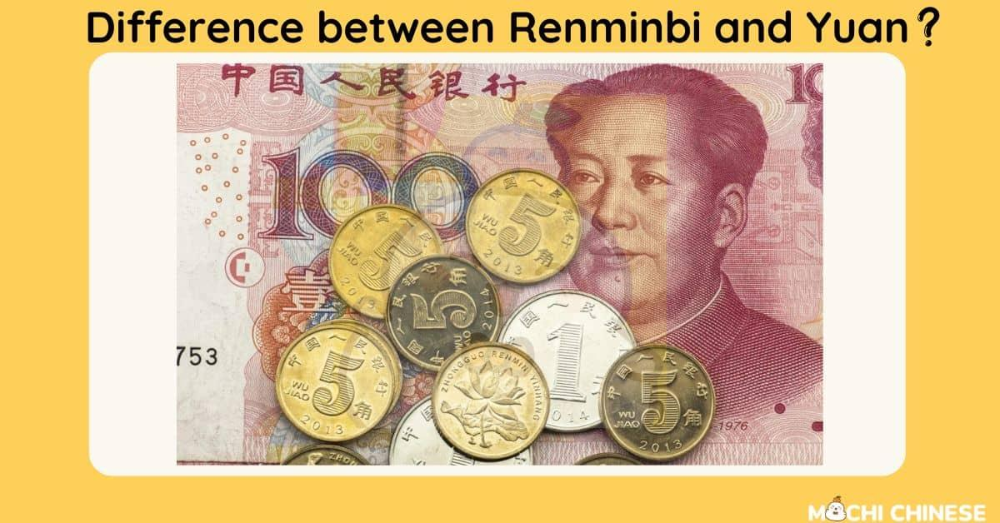

## Table of Contents

## What is the Yuan?

The Yuan is the official currency of China. It is also known as the Renminbi, which means "people's currency" in Chinese. The symbol for the Yuan is ¥, and it is used every day by people in China to buy things like food, clothes, and other goods.

The Yuan is managed by the People's Bank of China. This bank controls how much Yuan is in circulation and its value compared to other currencies. The Yuan is important not just in China, but also around the world because China is a big country with a large economy. Many countries trade with China, so they need to use or exchange their money for Yuan.

## What is the Renminbi?

The Renminbi is the official currency of China. It is also called the Yuan. People in China use the Renminbi every day to buy things they need, like food, clothes, and toys. The word "Renminbi" means "people's currency" in Chinese.

The People's Bank of China is in charge of the Renminbi. They decide how much Renminbi should be available and what its value is compared to other countries' money. Because China is a big country and does a lot of business with other countries, the Renminbi is important not just in China but all over the world.

## Are Yuan and Renminbi the same thing?

Yes, the Yuan and the Renminbi are the same thing. They are both names for China's official money. The word "Renminbi" means "people's currency" in Chinese, and "Yuan" is just another name for the same money.

People in China use the Yuan or Renminbi every day to buy things like food and clothes. The People's Bank of China controls how much of this money is available and what it is worth compared to other countries' money. Because China is a big country that trades a lot with other countries, the Yuan or Renminbi is important all over the world.

## How is the Yuan used in everyday transactions in China?

In China, people use the Yuan every day to buy things they need. When someone goes to a store, they might use Yuan to buy food, clothes, or toys. They can pay with Yuan coins or paper money. Sometimes, they use a card or their phone to pay, but it's still the Yuan that's being used. For example, if someone wants to buy a sandwich, they might give the shopkeeper a 10 Yuan note and get change back in smaller Yuan coins.

The Yuan is also used for bigger things like paying rent or buying a car. People might use online banking to transfer Yuan from their account to someone else's, like when they pay their monthly rent. When someone gets paid at work, they get their salary in Yuan, which they can then use to buy things or save. So, the Yuan is very important for everyday life in China, helping people buy what they need and want.

## What is the official currency of China?

The official currency of China is the Yuan, also known as the Renminbi. It is the money that people in China use every day. They use it to buy things like food, clothes, and toys. The Yuan comes in both coins and paper money. People can also use their cards or phones to pay with Yuan.

The People's Bank of China is in charge of the Yuan. They decide how much Yuan should be available and what it is worth compared to other countries' money. Because China is a big country and trades a lot with other countries, the Yuan is important not just in China but all over the world.

## What are the different denominations of the Yuan?

The Yuan comes in different sizes, called denominations. You can find Yuan in coins and paper money. The coins are 1 Yuan, 5 Jiao (which is half a Yuan), and 1 Jiao (which is one-tenth of a Yuan). There are also smaller coins like 5 Fen and 2 Fen, but they are not used very often anymore.

The paper money comes in bigger amounts. You can get notes of 1 Yuan, 2 Yuan, 5 Yuan, 10 Yuan, 20 Yuan, 50 Yuan, and 100 Yuan. Sometimes, you might see even bigger notes like 200 Yuan or 500 Yuan, but they are not used as much. People use these different sizes of Yuan every day to buy things they need, like food, clothes, and toys.

## How does the exchange rate between the Yuan and other currencies work?

The exchange rate between the Yuan and other currencies tells you how much one Yuan is worth in another currency, like the US dollar or the Euro. The People's Bank of China decides the exchange rate every day. They look at many things to set the rate, like how much other countries want to trade with China and how strong China's economy is. If the exchange rate is 7 Yuan to 1 US dollar, it means you need 7 Yuan to get 1 US dollar.

The exchange rate can change every day. Sometimes the Yuan becomes stronger, which means you need fewer Yuan to get the same amount of another currency. Other times, the Yuan can become weaker, and you need more Yuan to get the same amount of another currency. These changes can affect how much it costs for people in China to buy things from other countries and how much it costs for people in other countries to buy things from China.

## What role does the People's Bank of China play in managing the Yuan and Renminbi?

The People's Bank of China is in charge of the Yuan and Renminbi. They decide how much of this money should be available in the country. They also control the value of the Yuan compared to other countries' money. This is called the exchange rate. The People's Bank of China looks at many things to set the exchange rate, like how much other countries want to trade with China and how strong China's economy is.

The decisions made by the People's Bank of China are important because they affect everyday life in China. If the Yuan becomes stronger, it means that things from other countries might cost less for people in China. But if the Yuan becomes weaker, things from other countries might cost more. The bank's actions also affect how much it costs for people in other countries to buy things from China. This makes the Yuan important not just in China, but all over the world.

## How have historical events influenced the development of the Yuan and Renminbi?

The Yuan and Renminbi have a history that goes back many years. Before the Yuan, China used different kinds of money. In 1949, when the People's Republic of China was founded, they decided to use a new currency called the Renminbi. This was a big change because it helped bring all of China together under one kind of money. Over the years, the Renminbi went through many changes, like when it was divided into different parts called Yuan, Jiao, and Fen.

Important events like the Cultural Revolution in the 1960s and 1970s affected the Yuan a lot. During this time, the economy was not doing well, and the value of the Yuan changed a lot. Later, in the 1980s and 1990s, China started to open up its economy to the rest of the world. This made the Yuan more important in global trade. In 2005, China changed how the Yuan's value was set, making it more flexible compared to other countries' money. All these events helped shape the Yuan into what it is today, used by people every day and important in the world's economy.

## What are the international implications of the Yuan being part of the IMF's SDR basket?

The Yuan being part of the IMF's SDR basket means it is seen as an important currency around the world. The SDR, or Special Drawing Rights, is a type of money used by the International Monetary Fund (IMF) to help countries with their economies. When the Yuan was added to the SDR basket in 2016, it showed that China's economy is strong and that other countries trust the Yuan. This makes it easier for countries to use the Yuan when they trade with China.

This change has big effects on the world's money systems. More countries might start using the Yuan in their trade deals, which can make the Yuan stronger and more important. It also means that China has a bigger role in helping to decide how the world's money works. This can change how countries do business with each other and how they manage their own money.

## How does the digital Yuan (e-CNY) fit into the Renminbi system?

The digital Yuan, also called e-CNY, is a new way to use the Renminbi. It's like having Yuan in a digital form, similar to how you can have money in a bank account that you can use with a card or your phone. The People's Bank of China created the digital Yuan to make it easier for people to pay for things without needing to [carry](/wiki/carry-trading) cash. It works just like regular Yuan, but you can use it online or with your phone to pay for things quickly and easily.

The digital Yuan is part of the same money system as the regular Yuan and Renminbi. This means that 1 digital Yuan is worth the same as 1 regular Yuan. You can change your regular Yuan into digital Yuan and back again. The People's Bank of China controls the digital Yuan just like they do with the regular Yuan, making sure there is enough of it and that it keeps its value. This new way of using money is becoming more popular in China and could change how people around the world think about and use money.

## What are the future prospects for the internationalization of the Yuan and Renminbi?

The future of the Yuan and Renminbi becoming more used around the world looks promising. China is a big country with a strong economy, and more and more countries want to trade with China. As more countries use the Yuan in their trade deals, it becomes more important on the world stage. The digital Yuan, or e-CNY, could also help with this. It's easy to use and can be sent quickly over the internet, making it easier for people in different countries to use the Yuan. If more countries start trusting and using the Yuan, it could become as important as other big currencies like the US dollar or the Euro.

However, there are also challenges to the internationalization of the Yuan. Some countries might be worried about how much control the Chinese government has over the Yuan. They might prefer using other currencies that they think are more stable. Also, the Yuan still needs to be used more freely in global markets. Right now, it's not as easy to buy and sell Yuan as it is with other big currencies. But if China keeps working on making the Yuan easier to use and more trusted, it could become a big player in the world's money system in the future.

## References & Further Reading

[1]: International Monetary Fund. (2016). ["IMF’s Executive Board Completes Review of SDR Basket, Includes Chinese Renminbi."](https://www.imf.org/en/News/Articles/2015/09/14/01/49/pr15540) 

[2]: Hasbrouck, J., & Saar, G. (2013). ["Low-latency trading."](https://papers.ssrn.com/sol3/papers.cfm?abstract_id=1695460) The Review of Financial Studies, 26(7), 1733-1775.

[3]: Aldridge, I. (2013). ["High-Frequency Trading: A Practical Guide to Algorithmic Strategies and Trading Systems."](https://books.google.com/books/about/High_Frequency_Trading.html?id=8QpIsVUMhmEC) John Wiley & Sons.

[4]: Chaboud, A. P., Chiquoine, B., Hjalmarsson, E., & Vega, C. (2014). ["Rise of the Machines: Algorithmic Trading in the Foreign Exchange Market."](https://www.jstor.org/stable/43612951) The Journal of Finance, 69(5), 2045-2084.

[5]: Borio, C. (2019). ["The internationalization of the RMB: new starts, jumps, and tipping points."](https://www.sciencedirect.com/science/article/pii/S1566014116300711) BIS Papers No 112.