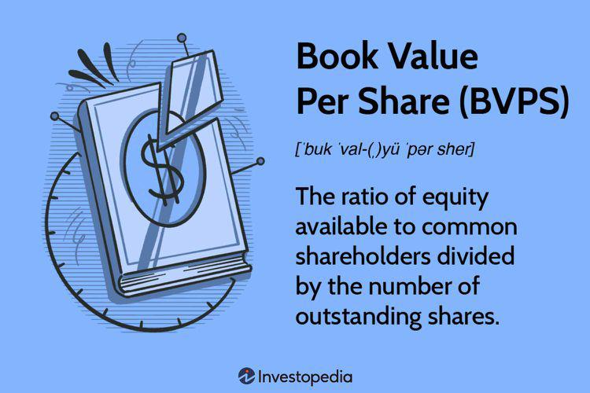

Understanding critical financial metrics is essential for making informed decisions in finance and investment. Book value and net asset value (NAV) are fundamental concepts that serve as indicators of a company's economic health and potential. This article explores these financial metrics, providing insights into their calculation, roles in valuation, and utility in algorithmic trading. 

As financial markets become more complex, integrating these metrics into trading strategies through algorithmic methods offers a strategic advantage. Algorithmic trading allows investors to use these metrics to improve trading efficiency and identify potential opportunities more rapidly than traditional methods. By automating decision-making processes, investors can act on data-driven insights without delay, enhancing portfolio performance.



Whether you're an individual investor, a professional trader, or someone intrigued by the mechanics of financial markets, understanding the synergy between book value, NAV, and algorithmic trading can enhance your investment decisions. These metrics provide a quantitative foundation that, when coupled with the speed and precision of algorithms, can lead to more informed and profitable trading strategies.

Join us as we investigate these concepts, unraveling their importance in shaping modern trading strategies. Through this exploration, we aim to emphasize how integrating traditional financial analysis with contemporary technological solutions can adapt to today's fast-paced market environment, ultimately leading to smarter investment decisions.

## Table of Contents

## Understanding Book Value

Book value represents a company's net asset value and is calculated by subtracting total liabilities from total assets. Essentially, book value provides a static snapshot of a company's worth by evaluating its financial position based on historical cost rather than current market value. This measure is a fundamental aspect of financial analysis, offering crucial insights into a company’s valuation.

For investors, book value serves as a baseline for determining whether a stock is potentially undervalued or overvalued. It reflects the intrinsic value of a company's equity, devoid of market speculation, making it an essential parameter for value investing. The formula for book value is:

$$
\text{Book Value} = \text{Total Assets} - \text{Total Liabilities}
$$

Total assets encompass both tangible assets, like property and equipment, and intangible assets, such as patents and trademarks. Liabilities include all debt and financial obligations. 

To calculate book value accurately, one must thoroughly analyze the company's balance sheet. The balance sheet provides a detailed record of the company's assets, liabilities, and equity at a specific point in time. By scrutinizing this financial statement, investors can assess the components of total assets and liabilities to evaluate the book value comprehensively.

In practical terms, book value assists in comparing stocks within the same sector or industry. For example, if two companies operate in the same market space but one has a significantly lower price-to-book (P/B) ratio, it might indicate that the lower P/B company is undervalued in terms of its book value.

In conclusion, understanding book value is a fundamental step in financial analysis, serving as a foundational concept in evaluating a company's fiscal health. It remains a vital tool for investors seeking to identify undervalued stocks and make informed investment decisions.

## The Role of Book Value in Valuation

Book value serves as a fundamental metric in traditional valuation practices, providing a tangible measure of a company's worth relative to its market valuation. By evaluating book value, investors can determine a company's net asset value based on its balance sheet, serving as a baseline comparison against market value.

The price-to-book (P/B) ratio is a pivotal tool in this valuation process. It is calculated by the formula:

$$
\text{P/B Ratio} = \frac{\text{Market Price per Share}}{\text{Book Value per Share}}
$$

This ratio is instrumental in assessing whether a stock is fairly valued, overvalued, or undervalued in the market. A P/B ratio less than one may indicate that the stock is undervalued, as the market price is less than the company's recorded net asset value. Conversely, a higher P/B ratio might suggest an overvaluation.

Prominent investors, such as Benjamin Graham, have historically utilized the book value as an essential component of value investing strategies. Graham, often referred to as the "father of value investing," emphasized buying securities that appeared underpriced based on intrinsic measures like the book value. By focusing on the intrinsic value relative to market prices, Graham's approach identified undervalued stocks with potential for high returns, as detailed in his seminal work, "The Intelligent Investor."

The application of the P/B ratio becomes particularly pertinent during periods of market corrections, offering investment opportunities previously overlooked. Market corrections can drive stock prices down, leading to potential misalignment between book and market values. This mispricing allows strategic investors to capitalize on discrepancies when the P/B ratio suggests undervaluation.

Historically, the relationship between book value and market value has guided investors in numerous real-world scenarios. During the financial crisis of 2008, for instance, many financial stocks experienced substantial market price declines, leading to significant discrepancies between book values and market values. Investors who recognized undervaluation through low P/B ratios were able to seize profitable opportunities by purchasing stocks that eventually rebounded.

In summary, book value, through the lens of the P/B ratio, remains an indispensable tool for investors to gauge the intrinsic worth of companies and identify investment opportunities. When combined with market trends and events, book value assists in formulating strategies that can navigate the complexities of market fluctuations and uncover latent value in stocks.

## Incorporating Book Value in Algo Trading

Algorithmic trading automates decision-making processes based on predefined rules, and integrating fundamental metrics like book value can enhance these strategies. Book value, often expressed through the price-to-book (P/B) ratio, serves as a critical indicator in identifying mispriced stocks. Algorithmic strategies can leverage this ratio to develop heuristics that execute trades based on perceived stock valuation discrepancies.

The first step in implementing book value metrics in [algorithmic trading](/wiki/algorithmic-trading) involves calculating the P/B ratio, defined by:

$$
\text{P/B Ratio} = \frac{\text{Market Price per Share}}{\text{Book Value per Share}}
$$

This ratio helps identify stocks that may be undervalued or overvalued by comparing a company's market value to its book value.

Once the P/B ratio is integrated within an algorithmic framework, the strategy can automate trading decisions. When a stock's P/B ratio falls below a predefined threshold, indicating a potential undervaluation, the algorithm may trigger a buy order. Conversely, a high P/B ratio might suggest overvaluation, prompting a sell order.

Here is an example of how Python can be employed to build a basic algorithm incorporating book value:

```python
import yfinance as yf  # For more datasets, visit: https://paperswithbacktest.com/datasets

def calculate_pb_ratio(ticker):
    stock = yf.Ticker(ticker)

    market_price = stock.history(period='1d')['Close'][-1]
    book_value_per_share = stock.financials.loc['Total Assets'] - stock.balance_sheet.loc['Total Liab']
    book_value_per_share /= stock.info['sharesOutstanding']

    return market_price / book_value_per_share

def trading_decision(ticker, threshold_low=1.0, threshold_high=3.0):
    pb_ratio = calculate_pb_ratio(ticker)

    if pb_ratio < threshold_low:
        return f"Initiate buy: {ticker}, P/B Ratio: {pb_ratio:.2f}"
    elif pb_ratio > threshold_high:
        return f"Initiate sell: {ticker}, P/B Ratio: {pb_ratio:.2f}"
    else:
        return f"Hold position: {ticker}, P/B Ratio: {pb_ratio:.2f}"

# Example usage
print(trading_decision('AAPL'))
```

This Python script uses the `yfinance` library to fetch current market data and financial [statistics](/wiki/bayesian-statistics), calculating the P/B ratio for any given stock. The `trading_decision` function automates buy and sell decisions based on predefined thresholds, demonstrating practical implementation in a trading algorithm.

Integrating book value metrics into algorithmic trading frameworks not only automates decision-making but also enhances the precision of trading strategies. By leveraging technology, traders can efficiently identify mispriced stocks and optimize investment returns. This approach underscores the significance of combining [fundamental analysis](/wiki/fundamental-analysis) with algorithmic prowess in modern financial markets.

## Tools and Software for Book Value Analysis

In the current landscape of financial analysis, leveraging advanced technology platforms and software is crucial for effective book value computation. Financial markets offer a plethora of data; thus, utilizing the right tools becomes a pivotal [factor](/wiki/factor-investing) in investment success. Platforms such as Bloomberg Terminal, Alpha Vantage, and Quandl provide comprehensive access to both real-time and historical financial data, facilitating robust book value analysis.

Bloomberg Terminal is renowned for its extensive financial datasets and analytical tools, allowing investors and analysts to directly extract information pertinent to company assets and liabilities. This platform supports detailed financial modeling and valuation, making it indispensable for those performing granular book value assessments.

Alpha Vantage offers an API that provides free access to a wide array of financial data, including stock prices, technical indicators, and financial statements. Users can programmatically retrieve data and integrate it into their custom analysis frameworks. For instance, a Python script can be employed to pull the latest balance sheet data, calculate a company's book value, and then compare it across multiple time frames or market conditions:

```python
import requests

def get_balance_sheet(symbol, api_key):
    url = f'https://www.alphavantage.co/query?function=BALANCE_SHEET&symbol={symbol}&apikey={api_key}'
    response = requests.get(url)
    data = response.json()
    return data['annualReports'][0]  # Using most recent annual report

def calculate_book_value(total_assets, total_liabilities):
    return total_assets - total_liabilities

api_key = 'your_api_key_here'
data = get_balance_sheet('AAPL', api_key)
total_assets = float(data['totalAssets'])
total_liabilities = float(data['totalLiabilities'])
book_value = calculate_book_value(total_assets, total_liabilities)
print(f"Book Value: {book_value}")
```

Quandl excels as a platform offering diverse datasets, specifically catered to financial analysis needs. It includes direct access to balance sheets and other economic indicators, streamlining the process of retrieving and manipulating large data volumes for investment analysis.

Incorporating these platforms into trading strategies empowers investors to execute real-time and historical analyses with greater accuracy. The integration of data tools enhances the predictive accuracy of algorithmic trading models. Technological integration allows investors to hold a competitive edge by transforming data into actionable insights, aligning with evolving market dynamics.

Selecting the appropriate tools depends on an investor's specific requirements, such as the need for real-time data access, historical data depth, or specific financial metrics. By understanding the functionalities of platforms like Bloomberg Terminal, Alpha Vantage, and Quandl, investors can tailor their analysis methods, ensuring a comprehensive approach to book value evaluation.

## Conclusion

Book value and net asset value (NAV) are cornerstone metrics in financial analysis, elucidating a company's intrinsic value by assessing its net asset worth. These metrics offer a foundational viewpoint for investors and analysts, aiding in the evaluation of a company's financial health beyond superficial market fluctuations. 

Incorporating these traditional metrics into algorithmic trading underscores the convergence of fundamental and quantitative analyses. Algorithmic trading systems can exploit the insights offered by book value and NAV to identify investment opportunities that might not be immediately apparent through market prices alone. By embedding these metrics into trading algorithms, investors can systematically identify undervalued assets, thus refining their strategic approaches to maximizing returns.

As financial markets grow increasingly complex, the necessity for ongoing learning and adaptation to new technologies becomes evident. The ability to integrate these traditional measures into modern, technology-driven trading systems can be a significant competitive advantage. Leveraging the computational power of modern software, investors can access real-time data to adjust their strategies dynamically, thus responding to market changes with precision and agility.

This synthesis of time-tested financial concepts with advanced technological tools heralds a new era of intelligent investment strategies. It aligns investors' financial objectives with the ever-evolving realities of the markets, enabling more informed and strategic decision-making processes. This integration ensures that while the financial markets continue to evolve, the core principles of value assessment remain relevant, providing a solid foundation for achieving long-term investment success.

## References & Further Reading

[1]: Graham, B. (2003). ["The Intelligent Investor: The Definitive Book on Value Investing."](https://www.amazon.com/Intelligent-Investor-Definitive-Investing-Essentials/dp/0060555661) Harper Business.

[2]: Chan, E. P. (2008). ["Quantitative Trading: How to Build Your Own Algorithmic Trading Business."](https://github.com/ftvision/quant_trading_echan_book) John Wiley & Sons.

[3]: De Prado, M. L. (2018). ["Advances in Financial Machine Learning."](https://www.amazon.com/Advances-Financial-Machine-Learning-Marcos/dp/1119482089) John Wiley & Sons.

[4]: Piotroski, J. D. (2000). ["Value Investing: The Use of Historical Financial Statement Information to Separate Winners from Losers."](https://www.semanticscholar.org/paper/Value-Investing%3A-The-Use-of-Historical-Financial-to-Piotroski/0559e92e06dae21e77ea79d79417b8a1d40be772) Journal of Accounting Research.

[5]: Aronson, D. R. (2007). ["Evidence-Based Technical Analysis: Applying the Scientific Method and Statistical Inference to Trading Signals."](https://onlinelibrary.wiley.com/doi/book/10.1002/9781118268315) John Wiley & Sons.