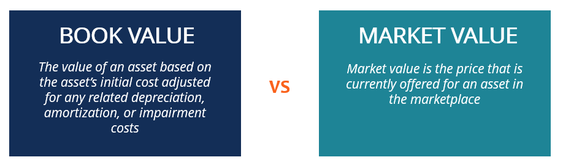

## Table of Contents

## What is Book Value Per Share (BVPS)?

Book Value Per Share (BVPS) is a financial measure that shows how much each share of a company would be worth if all its assets were sold and all its debts were paid off. It is calculated by taking the total equity of the company, which is the value of its assets minus its liabilities, and dividing it by the number of outstanding shares. This gives investors an idea of what the company's shares are worth based on its financial statements.

BVPS is useful for investors who want to see if a company's stock is undervalued or overvalued. If the BVPS is higher than the current market price of the stock, it might mean the stock is undervalued, and could be a good investment. However, BVPS doesn't tell the whole story because it doesn't include intangible assets like brand value or intellectual property, which can be very important for some companies. So, while BVPS is a helpful tool, it should be used along with other financial measures to get a complete picture of a company's value.

## What is Net Asset Value (NAV)?

Net Asset Value (NAV) is the total value of a fund's assets minus its liabilities. It is a way to measure the value of a mutual fund, exchange-traded fund (ETF), or other types of investment funds. To find the NAV, you add up all the investments the fund owns, subtract any money the fund owes, and then divide by the total number of shares in the fund. This gives you the price per share of the fund.

NAV is important because it tells investors what their shares in the fund are worth at the end of each trading day. It's like checking the balance in your bank account. If you want to buy or sell shares in a mutual fund, the price you pay or receive is based on the NAV. This makes it a useful tool for investors to track the performance of their investments and make decisions about buying or selling.

## How is Book Value Per Share calculated?

Book Value Per Share (BVPS) is calculated by taking the total equity of a company and dividing it by the number of outstanding shares. Total equity is found by subtracting the company's total liabilities from its total assets. This gives you the net worth of the company, which is then split evenly among all the shares that are currently owned by shareholders.

For example, if a company has total assets of $10 million and total liabilities of $4 million, its total equity would be $6 million. If the company has 1 million outstanding shares, the Book Value Per Share would be $6 million divided by 1 million shares, which equals $6 per share. This number shows how much each share would be worth if the company were to liquidate all its assets and pay off all its debts.

## How is Net Asset Value calculated?

Net Asset Value (NAV) is a way to find out how much a mutual fund, exchange-traded fund ([ETF](/wiki/etf-trading-strategies)), or other investment fund is worth. To calculate it, you add up the value of all the investments the fund holds. Then, you subtract any money the fund owes, like loans or fees. This gives you the total net value of the fund.

Once you have the total net value, you divide it by the number of shares in the fund. This gives you the price per share, which is the NAV. It's like figuring out how much each piece of a pie is worth after you've paid for the ingredients. The NAV is usually calculated at the end of each trading day and helps investors know what their shares are worth.

## What are the main differences between BVPS and NAV?

Book Value Per Share (BVPS) and Net Asset Value (NAV) are two financial measures that help investors understand the value of their investments, but they are used in different situations. BVPS is used for companies and is calculated by taking the company's total equity, which is the value of its assets minus its liabilities, and dividing it by the number of outstanding shares. This tells investors how much each share would be worth if the company sold all its assets and paid off all its debts. It's a way to see if a company's stock might be undervalued or overvalued based on its financial statements.

On the other hand, NAV is used for investment funds like mutual funds and ETFs. It's calculated by adding up the value of all the investments in the fund, subtracting any liabilities the fund has, and then dividing by the number of shares in the fund. This gives investors the price per share of the fund, which helps them know what their shares are worth at the end of each trading day. While BVPS focuses on the value of a company's shares, NAV focuses on the value of the shares in an investment fund.

Both BVPS and NAV are important tools for investors, but they serve different purposes. BVPS is more about understanding the intrinsic value of a company's stock, while NAV is about tracking the performance of an investment fund. Knowing the difference between these two measures can help investors make better decisions about where to put their money.

## In which industries is BVPS more relevant?

BVPS is more relevant in industries where companies have a lot of physical assets like buildings, machines, or land. These industries include manufacturing, real estate, and utilities. In these sectors, the value of the company's assets is a big part of its overall worth. Investors look at BVPS to see if the stock price is a good deal compared to what the company's assets are worth.

For example, in the real estate industry, a company's value often depends a lot on the properties it owns. If the BVPS is high, it might mean the company's shares are a good buy because the market price is lower than the value of the real estate. In manufacturing, the value of factories and equipment can also make BVPS a useful measure. It helps investors understand if the company's stock is undervalued based on its tangible assets.

## In which industries is NAV more commonly used?

NAV is most commonly used in the investment industry, especially for mutual funds and exchange-traded funds (ETFs). These funds pool money from many investors to buy a variety of assets like stocks, bonds, or other securities. The NAV helps investors know what each share of the fund is worth at the end of each trading day. This is important because it tells them if their investment is growing or shrinking in value.

In the real estate investment trust (REIT) industry, NAV is also widely used. REITs are companies that own or finance income-generating real estate. Investors use NAV to understand the value of the properties owned by the REIT. It helps them decide if the shares of the REIT are a good investment based on the value of the real estate assets.

## How do BVPS and NAV affect investment decisions?

BVPS helps investors decide if a company's stock is a good buy. It tells them how much each share would be worth if the company sold all its stuff and paid off its debts. If the BVPS is higher than the stock's price, it might mean the stock is undervalued. This could be a good time to buy because the stock might go up in value later. But, BVPS only looks at things like buildings and machines, not things like a company's brand or ideas. So, investors need to look at other things too before deciding to buy or sell.

NAV is important for people who invest in funds like mutual funds or ETFs. It shows how much each share of the fund is worth at the end of the day. If the NAV is going up, it means the fund's investments are doing well, and the investor's money is growing. If it's going down, it might be time to think about selling. NAV is also used for real estate investment trusts (REITs) to see if the value of the properties they own makes their shares a good investment. Knowing the NAV helps investors make smart choices about when to buy or sell shares in these funds.

## Can BVPS and NAV be used interchangeably?

No, BVPS and NAV cannot be used interchangeably because they measure different things and are used in different situations. BVPS is used to figure out the value of a company's shares by looking at its total assets minus its liabilities, divided by the number of shares. This helps investors see if a company's stock is a good deal based on what the company owns. BVPS is useful for companies in industries like manufacturing or real estate where they have a lot of physical stuff like buildings or machines.

On the other hand, NAV is used to find out the value of shares in investment funds like mutual funds or ETFs. It adds up all the investments the fund owns, subtracts any money the fund owes, and then divides by the number of shares to get the price per share. NAV helps investors track how their investments in these funds are doing. It's also used for real estate investment trusts (REITs) to see if the value of the properties they own makes their shares a good investment. So, while both measures help with investment decisions, they are not the same and should not be used in place of each other.

## What are the limitations of using BVPS for valuation?

BVPS has some problems when you use it to figure out how much a company is worth. It only looks at the stuff a company owns that you can touch, like buildings and machines. It doesn't count things like a company's good name or smart ideas, which can be very important. So, if a company has a lot of value in things you can't touch, like a tech company with cool software, BVPS might say the company is worth less than it really is.

Also, BVPS can be tricky because it doesn't think about how old the stuff the company owns is. If a company has old machines, they might not be worth as much as BVPS says. Plus, BVPS doesn't care about how much money the company makes or how good it is at making money. A company might have a high BVPS but not be doing well at making profits. So, while BVPS can be a helpful number to look at, it's not the whole story, and you should use other ways to check a company's value too.

## What are the limitations of using NAV for valuation?

Using NAV to figure out how much a fund is worth has some problems. NAV only looks at the things the fund owns that you can buy and sell, like stocks or bonds. It doesn't count things like how well the people running the fund are doing their job, or if the fund's strategy is a good one. So, if a fund has a lot of value in things you can't easily see or measure, like the skills of the fund managers, NAV might not show the whole picture.

Also, NAV can change a lot from day to day because it's based on the prices of the things the fund owns, and those prices can go up and down. This can make it hard to know if the fund is really doing well or not. If you only look at NAV, you might think a fund is doing great because its NAV is high, but if the prices of the things it owns are just temporarily high, you might be tricked into thinking the fund is worth more than it really is. So, while NAV is a helpful number to check, it's not the only thing you should look at when deciding if a fund is a good investment.

## How do market conditions impact the reliability of BVPS and NAV?

Market conditions can make BVPS less reliable because it's based on the value of a company's stuff like buildings and machines. If the market is doing well, these things might be worth more, making BVPS look higher. But if the market is bad, the value of these things can drop, making BVPS look lower even if the company hasn't changed much. Also, BVPS doesn't count things like a company's brand or ideas, which can be really important but can change a lot with market conditions. So, when markets are up and down, BVPS might not give you a clear picture of what a company is really worth.

NAV can also be affected by market conditions because it's based on the prices of the things a fund owns, like stocks or bonds. If the market is going up, the NAV will go up too, making the fund look like it's doing better than it might really be. But if the market is going down, the NAV will drop, and the fund might look worse than it really is. Since NAV changes every day with the market, it can be hard to know if the fund is really doing well or if it's just following the ups and downs of the market. So, when looking at NAV, it's important to think about what's happening in the market to get a better idea of the fund's true value.

## What is Book Value and How Do We Understand It?

Book value represents a company's net asset value and is calculated by subtracting total liabilities from total assets. Essentially, book value provides a static snapshot of a company's worth by evaluating its financial position based on historical cost rather than current market value. This measure is a fundamental aspect of financial analysis, offering crucial insights into a company’s valuation.

For investors, book value serves as a baseline for determining whether a stock is potentially undervalued or overvalued. It reflects the intrinsic value of a company's equity, devoid of market speculation, making it an essential parameter for value investing. The formula for book value is:

$$
\text{Book Value} = \text{Total Assets} - \text{Total Liabilities}
$$

Total assets encompass both tangible assets, like property and equipment, and intangible assets, such as patents and trademarks. Liabilities include all debt and financial obligations. 

To calculate book value accurately, one must thoroughly analyze the company's balance sheet. The balance sheet provides a detailed record of the company's assets, liabilities, and equity at a specific point in time. By scrutinizing this financial statement, investors can assess the components of total assets and liabilities to evaluate the book value comprehensively.

In practical terms, book value assists in comparing stocks within the same sector or industry. For example, if two companies operate in the same market space but one has a significantly lower price-to-book (P/B) ratio, it might indicate that the lower P/B company is undervalued in terms of its book value.

In conclusion, understanding book value is a fundamental step in financial analysis, serving as a foundational concept in evaluating a company's fiscal health. It remains a vital tool for investors seeking to identify undervalued stocks and make informed investment decisions.

## What is the role of book value in valuation?

Book value serves as a fundamental metric in traditional valuation practices, providing a tangible measure of a company's worth relative to its market valuation. By evaluating book value, investors can determine a company's net asset value based on its balance sheet, serving as a baseline comparison against market value.

The price-to-book (P/B) ratio is a pivotal tool in this valuation process. It is calculated by the formula:

$$
\text{P/B Ratio} = \frac{\text{Market Price per Share}}{\text{Book Value per Share}}
$$

This ratio is instrumental in assessing whether a stock is fairly valued, overvalued, or undervalued in the market. A P/B ratio less than one may indicate that the stock is undervalued, as the market price is less than the company's recorded net asset value. Conversely, a higher P/B ratio might suggest an overvaluation.

Prominent investors, such as Benjamin Graham, have historically utilized the book value as an essential component of value investing strategies. Graham, often referred to as the "father of value investing," emphasized buying securities that appeared underpriced based on intrinsic measures like the book value. By focusing on the intrinsic value relative to market prices, Graham's approach identified undervalued stocks with potential for high returns, as detailed in his seminal work, "The Intelligent Investor."

The application of the P/B ratio becomes particularly pertinent during periods of market corrections, offering investment opportunities previously overlooked. Market corrections can drive stock prices down, leading to potential misalignment between book and market values. This mispricing allows strategic investors to capitalize on discrepancies when the P/B ratio suggests undervaluation.

Historically, the relationship between book value and market value has guided investors in numerous real-world scenarios. During the financial crisis of 2008, for instance, many financial stocks experienced substantial market price declines, leading to significant discrepancies between book values and market values. Investors who recognized undervaluation through low P/B ratios were able to seize profitable opportunities by purchasing stocks that eventually rebounded.

In summary, book value, through the lens of the P/B ratio, remains an indispensable tool for investors to gauge the intrinsic worth of companies and identify investment opportunities. When combined with market trends and events, book value assists in formulating strategies that can navigate the complexities of market fluctuations and uncover latent value in stocks.

## How can book value be incorporated into algo trading?

Algorithmic trading automates decision-making processes based on predefined rules, and integrating fundamental metrics like book value can enhance these strategies. Book value, often expressed through the price-to-book (P/B) ratio, serves as a critical indicator in identifying mispriced stocks. Algorithmic strategies can leverage this ratio to develop heuristics that execute trades based on perceived stock valuation discrepancies.

The first step in implementing book value metrics in [algorithmic trading](/wiki/algorithmic-trading) involves calculating the P/B ratio, defined by:

$$
\text{P/B Ratio} = \frac{\text{Market Price per Share}}{\text{Book Value per Share}}
$$

This ratio helps identify stocks that may be undervalued or overvalued by comparing a company's market value to its book value.

Once the P/B ratio is integrated within an algorithmic framework, the strategy can automate trading decisions. When a stock's P/B ratio falls below a predefined threshold, indicating a potential undervaluation, the algorithm may trigger a buy order. Conversely, a high P/B ratio might suggest overvaluation, prompting a sell order.

Here is an example of how Python can be employed to build a basic algorithm incorporating book value:

```python
import yfinance as yf  # For more datasets, visit: https://paperswithbacktest.com/datasets

def calculate_pb_ratio(ticker):
    stock = yf.Ticker(ticker)

    market_price = stock.history(period='1d')['Close'][-1]
    book_value_per_share = stock.financials.loc['Total Assets'] - stock.balance_sheet.loc['Total Liab']
    book_value_per_share /= stock.info['sharesOutstanding']

    return market_price / book_value_per_share

def trading_decision(ticker, threshold_low=1.0, threshold_high=3.0):
    pb_ratio = calculate_pb_ratio(ticker)

    if pb_ratio < threshold_low:
        return f"Initiate buy: {ticker}, P/B Ratio: {pb_ratio:.2f}"
    elif pb_ratio > threshold_high:
        return f"Initiate sell: {ticker}, P/B Ratio: {pb_ratio:.2f}"
    else:
        return f"Hold position: {ticker}, P/B Ratio: {pb_ratio:.2f}"

# Example usage
print(trading_decision('AAPL'))
```

This Python script uses the `yfinance` library to fetch current market data and financial [statistics](/wiki/bayesian-statistics), calculating the P/B ratio for any given stock. The `trading_decision` function automates buy and sell decisions based on predefined thresholds, demonstrating practical implementation in a trading algorithm.

Integrating book value metrics into algorithmic trading frameworks not only automates decision-making but also enhances the precision of trading strategies. By leveraging technology, traders can efficiently identify mispriced stocks and optimize investment returns. This approach underscores the significance of combining [fundamental analysis](/wiki/fundamental-analysis) with algorithmic prowess in modern financial markets.

## References & Further Reading

[1]: Graham, B. (2003). ["The Intelligent Investor: The Definitive Book on Value Investing."](https://www.amazon.com/Intelligent-Investor-Definitive-Investing-Essentials/dp/0060555661) Harper Business.

[2]: Chan, E. P. (2008). ["Quantitative Trading: How to Build Your Own Algorithmic Trading Business."](https://github.com/ftvision/quant_trading_echan_book) John Wiley & Sons.

[3]: De Prado, M. L. (2018). ["Advances in Financial Machine Learning."](https://www.amazon.com/Advances-Financial-Machine-Learning-Marcos/dp/1119482089) John Wiley & Sons.

[4]: Piotroski, J. D. (2000). ["Value Investing: The Use of Historical Financial Statement Information to Separate Winners from Losers."](https://www.semanticscholar.org/paper/Value-Investing%3A-The-Use-of-Historical-Financial-to-Piotroski/0559e92e06dae21e77ea79d79417b8a1d40be772) Journal of Accounting Research.

[5]: Aronson, D. R. (2007). ["Evidence-Based Technical Analysis: Applying the Scientific Method and Statistical Inference to Trading Signals."](https://onlinelibrary.wiley.com/doi/book/10.1002/9781118268315) John Wiley & Sons.