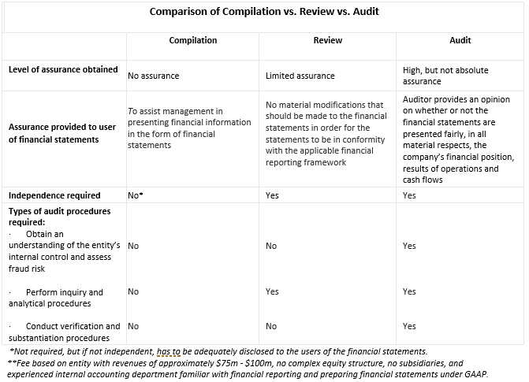

## Table of Contents

## What are financial statements?

Financial statements are reports that show how a business is doing financially. They tell you about the money a company has, the money it owes, and how much money it made or lost over a period of time. These statements are important because they help people like investors, managers, and lenders understand the financial health of a business.

There are three main types of financial statements: the balance sheet, the income statement, and the cash flow statement. The balance sheet shows what a company owns and what it owes at a specific time. The income statement shows how much money the company made and spent over a period of time, like a year. The cash flow statement shows how money moves in and out of the business, which helps to see if the company can pay its bills.

These statements are used by different people for different reasons. Investors use them to decide if they should buy or sell the company's stock. Managers use them to make decisions about how to run the business better. Lenders use them to see if the company can pay back loans. Overall, financial statements are a key tool for understanding and managing a business's finances.

## What is the purpose of financial statements?

Financial statements help people understand how well a business is doing with its money. They show how much money the business has, how much it owes, and if it made or lost money over time. This information is important for different people like investors, managers, and lenders. They use these statements to make decisions about the business. For example, investors might look at them to decide if they should buy or sell the company's stock.

Managers use financial statements to see how the business is doing and to make plans for the future. They can see if the business is making enough money and where they might need to cut costs or invest more. Lenders, like banks, use these statements to decide if they should give the business a loan. They want to know if the business can pay back the money it borrows. Overall, financial statements are a key tool for understanding and managing a business's finances.

## What does it mean for financial statements to be compiled?

When financial statements are compiled, it means that an accountant has put together the financial information of a business into the standard formats like the balance sheet, income statement, and cash flow statement. The accountant does not do a detailed check to make sure everything is correct. They just organize the information that the business gives them.

Compiling financial statements is less thorough than other ways of preparing financial statements, like auditing or reviewing. It's often cheaper and quicker because the accountant does not have to do a lot of extra work to verify the numbers. Businesses might choose to have their financial statements compiled if they want a basic report without spending a lot of time or money.

## What does it mean for financial statements to be certified?

When financial statements are certified, it means that a professional, like an accountant or auditor, has checked them and believes they are accurate and follow the rules. This process is called an audit. The auditor looks at the company's records, checks the numbers, and makes sure everything is correct. If the auditor is satisfied, they give the company a report saying the financial statements are fair and can be trusted.

Certified financial statements are important because they give people confidence in the numbers. Investors, lenders, and others who look at the statements can trust that the information is reliable. This can help the company get loans, attract investors, and make business decisions. Certification adds a level of trust and credibility to the financial statements, which is why many companies choose to have their statements certified.

## Who typically compiles financial statements?

Financial statements are usually put together by accountants or bookkeepers who work for the business. These people gather all the financial information, like how much money the business made, how much it spent, and what it owns and owes. They then organize this information into the standard reports, like the balance sheet, income statement, and cash flow statement. This process is called compiling the financial statements.

Sometimes, a business might hire an outside accountant or accounting firm to compile their financial statements. This can happen if the business does not have its own accounting staff or if they want someone else to look over the numbers. The outside accountant will work with the business to get all the necessary information and then put it into the proper formats. Either way, the goal is to create clear and accurate financial statements that show how the business is doing financially.

## Who can certify financial statements?

Certified financial statements are checked and approved by a professional called an auditor. Usually, this is a certified public accountant (CPA) who works for an independent auditing firm. The auditor looks at the company's financial records, checks the numbers, and makes sure everything follows the rules. If everything is okay, the auditor gives a report saying the financial statements are fair and can be trusted.

Having certified financial statements is important because it shows that the numbers are reliable. Investors, banks, and others who look at the statements can trust that the information is correct. This helps the company get loans, attract investors, and make good business decisions. Certification adds trust and credibility to the financial statements, which is why many companies choose to have their statements certified.

## What is the level of assurance provided by compiled financial statements?

Compiled financial statements provide the lowest level of assurance compared to reviewed or audited statements. When an accountant compiles financial statements, they simply organize the financial information given by the business into standard reports like the balance sheet, income statement, and cash flow statement. The accountant does not check the numbers to make sure they are correct or follow the rules. They just put the information into the right format.

Because of this, people who look at compiled financial statements should be careful. These statements do not come with a guarantee that the numbers are accurate or that the business followed all the rules. They are useful for getting a basic idea of how the business is doing financially, but they do not give the same level of trust as statements that have been reviewed or audited by a professional.

## What is the level of assurance provided by certified financial statements?

Certified financial statements provide a high level of assurance. This means that a professional, called an auditor, has checked the numbers and made sure they are correct and follow the rules. The auditor looks at the company's records and does a lot of work to make sure everything is right. If the auditor is happy with what they find, they give a report saying the financial statements are fair and can be trusted.

This high level of assurance is important because it gives people confidence in the numbers. Investors, banks, and others who look at the statements can trust that the information is reliable. This helps the company get loans, attract investors, and make good business decisions. Certification adds trust and credibility to the financial statements, which is why many companies choose to have their statements certified.

## How does the process of compiling financial statements differ from certifying them?

Compiling financial statements means an accountant takes the numbers the business gives them and puts them into standard reports like the balance sheet, income statement, and cash flow statement. The accountant does not check to make sure the numbers are right or that the business followed all the rules. They just organize the information. This process is quick and cheap, but it does not give much confidence that the numbers are correct. People who look at compiled statements should be careful because they do not come with a guarantee of accuracy.

Certifying financial statements, on the other hand, involves a thorough check by a professional called an auditor. The auditor looks at the company's records, checks the numbers, and makes sure everything follows the rules. If the auditor is happy with what they find, they give a report saying the financial statements are fair and can be trusted. This process takes more time and costs more, but it gives a high level of assurance. People can trust the numbers in certified statements, which is important for investors, banks, and others who use the information to make decisions.

## What are the costs associated with compiling versus certifying financial statements?

Compiling financial statements is usually less expensive than certifying them. When a business chooses to compile its statements, an accountant simply organizes the financial information provided by the business into standard reports. This process does not involve a detailed check of the numbers or making sure the business followed all the rules. Because it is quicker and requires less work, the cost is lower. Businesses might spend a few hundred to a few thousand dollars for compiled statements, depending on the size and complexity of the business.

Certifying financial statements, on the other hand, is more costly. This process involves a thorough audit by a professional auditor, who checks the company's records, verifies the numbers, and ensures everything follows the rules. This detailed work takes more time and requires a higher level of expertise, which is why it costs more. The cost for certified statements can range from a few thousand to tens of thousands of dollars, again depending on the size and complexity of the business. The higher cost reflects the high level of assurance that comes with certified statements, which is valuable for investors and lenders who need to trust the financial information.

## In what situations might a business choose compiled over certified financial statements?

A business might choose compiled financial statements over certified ones when they want to save money and time. Compiling is cheaper because the accountant just puts the numbers into reports without checking them closely. This can be good for small businesses or startups that don't have a lot of money to spend on audits. It's also faster, so if a business needs quick financial reports, compiling is a good choice.

Another situation where a business might go for compiled statements is when they don't need to show their financials to outside people like investors or banks. If the statements are just for internal use, like for the owner or managers to see how the business is doing, compiled statements might be enough. They give a basic picture of the business's finances, which can be useful for making day-to-day decisions without the need for a detailed audit.

## What are the regulatory and legal implications of using compiled versus certified financial statements?

Using compiled financial statements has fewer regulatory and legal requirements than using certified ones. Compiled statements are not checked by an auditor, so they don't have to follow strict rules like certified statements do. This means a business can use compiled statements for internal purposes or to meet basic reporting needs without worrying about a lot of rules. However, if a business needs to show its financials to others, like investors or banks, compiled statements might not be enough. Some regulations or loan agreements might require certified statements because they give more trust in the numbers.

Certified financial statements, on the other hand, come with more regulatory and legal implications. They are checked by an auditor, so they have to follow strict rules and standards. This means businesses that use certified statements have to make sure everything is correct and follows the law. Certified statements are often required by law for public companies, and many private companies need them to meet the demands of investors, lenders, or other stakeholders. Using certified statements can help a business avoid legal problems because they show that the financial information is reliable and trustworthy.

## What is Understanding Financial Reporting?

Financial reporting is a vital process for any organization as it provides a comprehensive snapshot of a company's financial performance and position. This information is crucial for investors, analysts, and other stakeholders who rely on accurate and timely data to make informed decisions. Through financial reporting, companies communicate their financial health and operational results, offering transparency and building trust with the market.

The Securities and Exchange Commission (SEC) plays a significant role in regulating financial reporting standards in the United States. Established to protect investors and maintain fair, orderly, and efficient markets, the SEC mandates that publicly traded companies adhere to strict reporting standards. These regulations are primarily enforced through the Generally Accepted Accounting Principles (GAAP), which standardize the financial reporting process and ensure consistency, comparability, and reliability of financial statements. Public companies are required to file annual (Form 10-K) and quarterly (Form 10-Q) reports with the SEC. These filings include the critical components of financial statements, ensuring that stakeholders have access to essential financial data.

At the core of financial reporting are three indispensable financial statements: the balance sheet, the income statement, and the cash flow statement. Each serves a unique purpose and provides different insights into a company's financial status.

1. **Balance Sheet**: The balance sheet offers a snapshot of a company's financial position at a specific point in time. It details the company's assets, liabilities, and shareholders' equity, following the accounting equation:
$$
   \text{Assets} = \text{Liabilities} + \text{Shareholders' Equity} 

$$

   By assessing the balance sheet, investors can evaluate a company's [liquidity](/wiki/liquidity-risk-premium), leverage, and overall financial stability.

2. **Income Statement**: Also known as the profit and loss statement, the income statement presents a summary of the company's revenues, expenses, and profits over a specific period, typically quarterly or annually. It provides insights into the company's operational efficiency, cost management, and profitability. The bottom line of the income statement, net income, reflects the company's performance, which is calculated as:
$$
   \text{Net Income} = \text{Total Revenue} - \text{Total Expenses}

$$

3. **Cash Flow Statement**: This statement details the cash inflows and outflows from operating, investing, and financing activities over a period. It helps stakeholders understand how the company generates and uses cash, offering a clear picture of liquidity and financial flexibility. The cash flow statement is divided into three sections:

   - **Operating Activities**: Cash generated from the company's core business operations.
   - **Investing Activities**: Cash used for or generated from investment in assets like property, equipment, or financial instruments.
   - **Financing Activities**: Cash generated from or paid out for financing activities such as issuing shares or paying dividends.

The integration of these statements provides a comprehensive view of a company's financial health, facilitating informed decision-making and strategic planning. Proper financial reporting, governed by stringent regulatory standards, not only ensures transparency but also upholds the integrity of financial markets by providing fair and accurate information to all stakeholders involved.

## References & Further Reading

[1]: Arens, A. A., Elder, R. J., & Beasley, M. S. (2019). [Auditing and Assurance Services](https://www.pearsonhighered.com/assets/preface/0/1/3/5/0135176115.pdf). Pearson.

[2]: Karatzas, I., & Shreve, S. E. (1998). [Methods of Mathematical Finance](https://link.springer.com/book/10.1007/978-1-4939-6845-9). Springer.

[3]: "Generally Accepted Accounting Principles (GAAP)." [Standards Overview](https://www.investopedia.com/terms/g/gaap.asp) - Financial Accounting Standards Board (FASB).

[4]: Jiang, G. J., & Lee, C. M. (2006). ["The Effects of Accounting Transparency on the Agency Cost of Debt and Equity."](https://link.springer.com/article/10.1007/s00704-024-05281-2) Management Science, 52(6), 867-884.

[5]: "Securities and Exchange Commission (SEC) Filings." [Official SEC Filings Explanation](https://www.sec.gov/search-filings) - U.S. Securities and Exchange Commission. 

[6]: Kothari, S.P., & Warner, J.B. (2006). ["Econometrics of Event Studies."](https://papers.ssrn.com/sol3/papers.cfm?abstract_id=608601) Handbook of Corporate Finance: Empirical Corporate Finance, 1.

[7]: Titman, S., & Trueman, B. (1986). ["Information Quality and the Valuation of New Issues."](https://www.sciencedirect.com/science/article/pii/0165410186900169) Journal of Accounting and Economics, 8(2), 159–172.