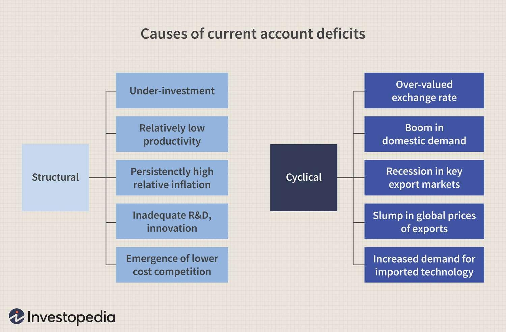

## Table of Contents

## What is a current account deficit?

A current account deficit happens when a country spends more money on imports and other foreign expenses than it earns from its exports and other foreign income. Think of it like a household budget: if you spend more than you earn, you have a deficit. For a country, this means they are buying more goods, services, and investments from other countries than they are selling to them.

This situation isn't always bad. Sometimes, a country might run a deficit because it's investing in its future, like building new factories or improving technology. However, if the deficit is too large or lasts too long, it can cause problems. The country might need to borrow money from other countries, which can lead to debt. Also, a big deficit might make the country's currency weaker, making imports more expensive and possibly leading to inflation.

## What is a trade deficit?

A trade deficit is when a country buys more stuff from other countries than it sells to them. It's like if you spent more money at the store than you made selling things at your own garage sale. For a country, this means they are importing more goods and services than they are exporting.

Having a trade deficit isn't always a bad thing. It can mean that people in the country want to buy things from other places because they are cheaper or better. But if the trade deficit is too big, it can be a problem. The country might need to borrow money to pay for all those imports, which can lead to more debt. Also, a big trade deficit can make the country's money worth less, which can make things from other countries even more expensive.

## How do current account deficits and trade deficits differ?

A current account deficit and a trade deficit are related but not exactly the same. A trade deficit is all about goods and services. It happens when a country buys more stuff from other countries than it sells to them. This is just one part of the current account. The current account looks at everything a country spends and earns with other countries, not just goods and services. It includes things like money sent home by people working abroad, interest payments on loans, and other types of income.

The main difference is that the current account is a bigger picture. It includes the trade deficit, but it also adds in other financial flows. For example, if a country is getting a lot of money from tourists visiting or from people working abroad sending money home, this can help make the current account deficit smaller, even if the trade deficit is still big. So, while a trade deficit is a part of the current account, the current account gives us a more complete view of a country's financial health with the rest of the world.

## What components make up the current account?

The current account is like a big report card that shows how much money a country is making and spending with other countries. It has four main parts. The first part is the trade balance, which is all about the stuff a country buys and sells, like cars and computers. If a country buys more than it sells, it has a trade deficit. The second part is the net income from things like investments and salaries. If people from the country are working abroad and sending money home, or if the country owns businesses in other countries that are making money, this can help the current account.

The third part of the current account is called current transfers. These are payments that don't come from buying or selling stuff, like money sent home by workers abroad or foreign aid. The last part is the services balance, which looks at money made from services, like tourism or banking. If tourists from other countries spend a lot of money visiting, this can help the current account. All these parts together show if a country is spending more money abroad than it's [earning](/wiki/earning-announcement), which means it has a current account deficit, or if it's earning more than it's spending, which means it has a current account surplus.

## What components make up the trade balance?

The trade balance is a part of the current account that looks at the money a country makes and spends on goods and services. Goods are things you can touch, like cars, clothes, and food. Services are things you can't touch, like haircuts, banking, and tourism. When a country sells more goods and services to other countries than it buys from them, it has a trade surplus. If it buys more than it sells, it has a trade deficit.

The trade balance is split into two main parts: the balance of trade in goods and the balance of trade in services. The balance of trade in goods, also called the merchandise trade balance, shows if a country is exporting more physical things than it's importing. The balance of trade in services shows if a country is making more money from services it provides to other countries than it's spending on services from other countries. Together, these two parts tell us if a country has a trade surplus or a trade deficit.

## How do current account deficits affect a country's economy?

When a country has a current account deficit, it means the country is spending more money abroad than it is earning from other countries. This can be okay if the country is using the money to invest in things like new factories or technology that will help it grow in the future. But if the deficit is too big or lasts too long, it can cause problems. The country might need to borrow money from other countries, which can lead to more debt. This borrowing can make people worried about the country's ability to pay back the money, which can make it harder and more expensive for the country to borrow in the future.

A big current account deficit can also make the country's money, or currency, worth less compared to other countries' money. When a country's currency is worth less, it can make things from other countries more expensive. This can lead to higher prices for things people need, which is called inflation. If inflation gets too high, it can make life harder for people in the country because their money doesn't go as far. So, while a current account deficit isn't always bad, it's important for a country to keep an eye on it and make sure it doesn't get too big.

## How do trade deficits impact a country's economy?

When a country has a trade deficit, it means they are buying more things from other countries than they are selling. This isn't always a bad thing. It can mean that people in the country want to buy things from other places because they are cheaper or better. But if the trade deficit gets too big, it can start to cause problems. The country might need to borrow money to pay for all those imports, which can lead to more debt. If the country borrows a lot, other countries might start to worry about whether they will get their money back, which can make borrowing even harder and more expensive.

A big trade deficit can also make the country's money, or currency, worth less compared to other countries' money. When a country's currency is worth less, it can make things from other countries even more expensive. This can lead to higher prices for things people need, which is called inflation. If inflation gets too high, it can make life harder for people in the country because their money doesn't go as far. So, while a trade deficit isn't always bad, it's important for a country to keep an eye on it and make sure it doesn't get too big.

## Can a country have a trade surplus and a current account deficit at the same time?

Yes, a country can have a trade surplus and a current account deficit at the same time. A trade surplus happens when a country sells more stuff to other countries than it buys from them. But the current account looks at more than just buying and selling stuff. It also includes money from things like investments, salaries, and payments that don't come from buying or selling, like money sent home by workers abroad or foreign aid.

So, even if a country is selling more stuff than it's buying, it can still have a current account deficit if it's spending a lot of money on other things. For example, if a country is getting a lot of money from selling cars to other countries but is also paying a lot of money to foreign investors or sending a lot of money abroad for other reasons, it could end up with a current account deficit even though it has a trade surplus.

## What are the common causes of current account deficits?

A current account deficit can happen for a few reasons. One big reason is when a country buys more stuff from other countries than it sells to them. This is called a trade deficit, and it can happen if the country's people want to buy things that are cheaper or better from other places. Another reason is if the country is spending a lot of money on things like investments or paying interest on loans to other countries. If the country is getting a lot of money from tourists or from people working abroad sending money home, but it's still not enough to cover what they're spending, it can lead to a current account deficit.

Sometimes, a current account deficit can also happen because the country's money, or currency, is worth less compared to other countries' money. When a country's currency is worth less, it can make things from other countries more expensive, which can make the deficit bigger. Also, if the country is growing fast and needs to buy a lot of things from other countries to keep up with that growth, it can lead to a current account deficit. So, there are many reasons why a country might have a current account deficit, and it's not always a bad thing if the country is using the money to invest in its future.

## What are the common causes of trade deficits?

A trade deficit happens when a country buys more stuff from other countries than it sells to them. One common reason for this is that people in the country want to buy things that are cheaper or better from other places. If things from other countries are less expensive or of higher quality, people will choose to buy them, leading to more imports than exports. Another reason can be that the country's own products are not as competitive on the world market. This might be because other countries can make things more cheaply or because the country's products are not as good.

Sometimes, a trade deficit can also happen because of the value of the country's money, or currency. If the country's currency is worth less compared to other countries' money, it can make things from other countries more expensive. But if the country's currency is worth more, it can make their own products more expensive for other countries to buy, which can lead to fewer exports. Also, if the country is growing fast and needs to buy a lot of things from other countries to keep up with that growth, it can lead to a trade deficit. So, there are many reasons why a country might have a trade deficit, and it's not always a bad thing if the country is using the money to invest in its future.

## How do governments and policymakers address current account deficits?

Governments and policymakers can address current account deficits in several ways. One way is by trying to make the country's own products more competitive on the world market. They can do this by helping businesses improve their products or by making it cheaper for them to produce things. Another way is by changing the value of the country's money. If the country's money is worth less compared to other countries' money, it can make their own products cheaper for other countries to buy, which can help increase exports. But this can also make things from other countries more expensive, so it's a tricky balance.

Another approach is to try to reduce how much the country spends on imports. Governments can do this by putting taxes on things coming into the country, which makes them more expensive and can make people buy more things made at home. They can also encourage people to save more money instead of spending it on things from other countries. Sometimes, governments will also try to get more money coming into the country from other sources, like tourism or money sent home by people working abroad. All these strategies need to be carefully managed to help fix a current account deficit without causing other problems.

## How do governments and policymakers address trade deficits?

Governments and policymakers can address trade deficits by trying to make the country's own products more competitive. They can help businesses make better products or make it cheaper for them to produce things. This can lead to more exports, which helps reduce the trade deficit. Another way is by changing the value of the country's money. If the country's money is worth less compared to other countries' money, it can make their own products cheaper for other countries to buy, which can help increase exports. But this can also make things from other countries more expensive, so it's a tricky balance.

Another approach is to try to reduce how much the country spends on imports. Governments can do this by putting taxes on things coming into the country, which makes them more expensive and can make people buy more things made at home. They can also encourage people to save more money instead of spending it on things from other countries. Sometimes, governments will also try to get more money coming into the country from other sources, like tourism or money sent home by people working abroad. All these strategies need to be carefully managed to help fix a trade deficit without causing other problems.

## What is the Current Account Deficit and how can we understand it?

The current account is a fundamental component of a country's balance of payments, providing a comprehensive overview of its economic transactions with the rest of the world. It consists of three main elements: the trade balance, net income, and direct transfers. When a nation experiences a current account deficit, it indicates that the value of imports of goods, services, and capital exceeds that of exports. This imbalance can be disconcerting if perceived as unsustainable; however, it does not inherently signify economic weakness. Often, a current account deficit may reflect robust domestic demand for foreign goods and services as well as attractive investment opportunities within the country.

A current account deficit can be expressed mathematically using the equation:

$$
\text{Current Account Balance} = \text{Exports} - (\text{Imports} + \text{Net Income} + \text{Transfers})
$$

Institutions and policymakers scrutinize current account deficits due to their implications for economic stability. Prolonged deficits suggest a reliance on foreign capital, which could lead to increased foreign debt. This scenario might necessitate adjustments in currency valuation or interest rates to maintain balance. However, short-term deficits might result from capital investments that spur future economic growth and productivity.

Several factors contribute to current account deficits, such as exchange rate policies, differences in savings and investment rates, and economic growth disparities between trading partners. For example, countries with strong currencies may find their exports less competitive, leading to increased imports and a subsequent deficit. Additionally, high domestic consumption driven by low-interest rates can result in increased import volumes.

Countries like the United States have historically maintained substantial current account deficits, as they attract significant foreign investment due to a mature and stable economic environment. Conversely, nations such as Greece and Spain witnessed large deficits before the European debt crisis, which were symptomatic of underlying economic vulnerabilities and eventually required fiscal adjustments.

Understanding the causes of current account deficits is crucial. While they can signify economic imbalance, deficits might also indicate economic vitality if driven by sustainable investment and consumption patterns. For policymakers and economists, discerning these nuances is pivotal in crafting responses that ensure long-term economic health.

## What is the Trade Deficit and How Can We Demystify It?

A trade deficit, commonly referred to as a nation's trade balance, arises when a country's import levels surpass its export levels. This means that more goods and services are entering the nation than leaving it, which can have various implications for an economy.

### Nature and Implications of Trade Deficits

A trade deficit is frequently perceived negatively, implying that a country is overly reliant on foreign goods or failing to produce sufficient exportable products. However, trade deficits aren't inherently harmful. They can signify strong domestic consumer demand, suggesting that citizens have sufficient purchasing power to acquire foreign products. Conversely, persistent trade deficits may indicate underlying economic issues, such as a lack of competitiveness or an overvaluation of domestic currency, reflecting deeper imbalances.

### Factors Contributing to Trade Deficits

Several elements influence the occurrence and magnitude of trade deficits:

1. **Currency Valuation**: The strength or weakness of a country's currency plays a pivotal role. A stronger currency makes imports cheaper and exports more expensive, often widening the trade deficit. Conversely, a weaker currency tends to have the opposite effect.

2. **Economic Growth Rates**: Rapid economic growth can lead to increased imports as businesses and consumers invest in foreign goods and technologies. While growth fosters demand, it can also temporarily expand trade deficits.

3. **Domestic Consumption Patterns**: Consumer preferences and spending habits impact trade balances significantly. Nations emphasizing consumer goods imports may exhibit larger trade deficits, emphasizing the need for economic diversification.

### Calculation and Interpretation of Trade Deficits

Calculating a trade deficit involves comparing the total values of exports and imports. The formula is straightforward:

$$
\text{Trade Deficit} = \text{Imports} - \text{Exports}
$$

A positive result indicates a trade deficit, whereas a negative result signifies a trade surplus. While these numbers offer a snapshot, interpreting them requires a nuanced understanding of economic contexts, such as the reasons behind high imports or low exports.

### Impact on Currency Exchange Rates and International Relationships

Trade deficits can influence currency exchange rates because heightened demand for foreign goods often requires converting domestic currency into foreign currency. This increased demand can affect a country's currency valuation, impacting international competitiveness.

Furthermore, persistent trade imbalances can affect diplomatic relationships. Countries with large deficits may face pressure from trading partners to amend trade practices, potentially leading to negotiations and policy shifts.

In conclusion, while trade deficits often provoke concern, they are a multifaceted economic occurrence whose implications depend on broader economic contexts, policy decisions, and international relations. Understanding these nuances aids in comprehensively assessing a nation's economic health.

## References & Further Reading

[1]: ["Advances in Financial Machine Learning"](https://www.amazon.com/Advances-Financial-Machine-Learning-Marcos/dp/1119482089) by Marcos Lopez de Prado

[2]: ["Machine Learning for Algorithmic Trading"](https://github.com/stefan-jansen/machine-learning-for-trading) by Stefan Jansen

[3]: ["Quantitative Trading: How to Build Your Own Algorithmic Trading Business"](https://www.amazon.com/Quantitative-Trading-Build-Algorithmic-Business/dp/1119800064) by Ernest P. Chan

[4]: Gopinath, G., & Helpman, E. (Eds.). (2014). ["Handbook of International Economics Volume 4"](https://shop.elsevier.com/books/handbook-of-international-economics/gopinath/978-0-444-54314-1) Elsevier.

[5]: Dornbusch, R., Fischer, S., & Startz, R. (2013). ["Macroeconomics"](https://books.google.com/books/about/EBOOK_Macroeconomics.html?id=KoZvEAAAQBAJ) (12th Edition). McGraw-Hill Education.