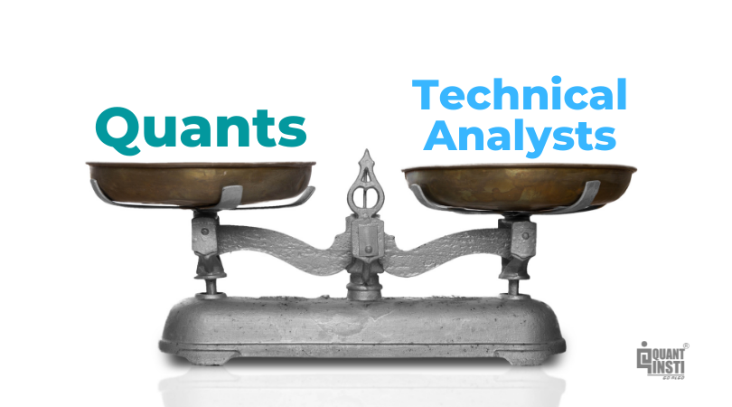

## Table of Contents

## What is a quant?

A quant, short for quantitative analyst, is a person who uses math and computer skills to help make money in finance. They work in banks, investment firms, and other financial places. Quants use numbers and data to predict how the stock market and other financial things will behave. This helps them make smart choices about buying and selling stocks, bonds, and other investments.

Quants often create complex math models and computer programs. These tools help them understand big amounts of data and find patterns that others might miss. By doing this, quants can suggest the best ways to invest money to make more profit and take less risk. Their work is very important in the world of finance because it helps people and companies make better financial decisions.

## What is a technical analyst?

A technical analyst is someone who looks at past prices and trading volumes of stocks, currencies, or other financial things to predict what might happen next. They use charts and other tools to spot patterns in how prices move over time. By studying these patterns, technical analysts try to guess if a stock's price will go up or down in the future.

Technical analysis is different from fundamental analysis, which looks at a company's financial health, like its profits and debts. Technical analysts believe that all the important information about a company is already shown in its price and trading volume. They think that by understanding these price patterns, they can make better decisions about when to buy or sell investments. This approach is popular in trading and helps many investors make choices based on what the market is doing right now.

## What are the primary tools used by quants?

Quants use a lot of math and computer tools to help them make smart decisions about money. They often use something called statistical models. These models help quants understand big sets of numbers and find patterns that can predict what might happen in the future. They also use computer programs to do calculations quickly and to test their ideas many times. These programs can run simulations, which are like practice runs, to see how their strategies might work in real life.

Another important tool for quants is something called machine learning. This is a type of computer program that can learn from data and get better over time. Quants use machine learning to find hidden patterns in the data that they might not see otherwise. They also use something called optimization algorithms. These are special math tools that help find the best way to do things, like how to invest money to make the most profit with the least risk. By using all these tools together, quants can make very detailed and smart plans for investing money.

## What are the primary tools used by technical analysts?

Technical analysts use charts a lot. They look at line charts, bar charts, and candlestick charts to see how prices have moved in the past. These charts help them spot patterns, like when prices go up and down in a certain way. They also use something called technical indicators. These are special calculations that help them understand if a price might go up or down soon. Some common indicators are moving averages, which smooth out price changes over time, and the Relative Strength Index (RSI), which shows if a stock is overbought or oversold.

Another tool technical analysts use is trend lines. They draw lines on charts to show the direction prices are moving. If a price keeps going up, they draw an upward trend line. If it keeps going down, they draw a downward trend line. They also use support and resistance levels. Support is a price level where a stock often stops falling, and resistance is where it often stops rising. By watching these levels, technical analysts can guess when prices might change direction.

## How do quants approach financial markets?

Quants approach financial markets by using math and computers to understand how prices move. They collect a lot of data about stocks, bonds, and other investments. Then, they use special math models to find patterns in this data. These patterns help them predict what might happen next in the market. Quants believe that by understanding these patterns, they can make better choices about when to buy or sell investments.

To do their work, quants use computer programs to run many tests and simulations. These tests help them see how their ideas might work in real life. They also use something called machine learning, which helps their computers learn from the data and get better over time. By using all these tools, quants try to find the best ways to invest money and make more profit while taking less risk. Their approach is very detailed and relies a lot on numbers and technology.

## How do technical analysts approach financial markets?

Technical analysts look at financial markets by studying past price movements and trading volumes. They use charts to see patterns in how prices change over time. By looking at these patterns, they try to guess what might happen next. For example, if they see a pattern that often leads to a price going up, they might decide to buy a stock. They believe that all important information about a company is already shown in its price and volume, so they focus on these numbers instead of things like company profits or news.

To help them make these guesses, technical analysts use special tools called indicators. These are math calculations that show things like whether a stock is overbought or oversold. One common indicator is the moving average, which smooths out price changes to show the overall direction. They also draw trend lines on their charts to see if prices are going up or down over time. By using these tools, technical analysts try to find the best times to buy or sell investments based on what the market is doing right now.

## What kind of educational background is typically required for a quant?

To become a quant, you usually need a strong education in math, computer science, or a related field. Most quants have at least a bachelor's degree, but many have advanced degrees like a master's or a PhD. They study things like calculus, statistics, and programming. These subjects help them understand how to work with numbers and create computer models that can predict what might happen in financial markets.

Besides math and computer skills, quants also need to learn about finance. They often take classes in economics, financial theory, and how markets work. This helps them understand how to use their math and computer skills to make money in the real world. Some quants start in other jobs, like being a software engineer or a researcher, before they move into finance. But no matter how they start, a good education in math, computers, and finance is very important for a quant.

## What kind of educational background is typically required for a technical analyst?

To become a technical analyst, you usually need a good education in finance, economics, or a related field. Many technical analysts have at least a bachelor's degree. They learn about how markets work and how to read financial data. Some technical analysts also study math and statistics to help them understand price patterns better. While a degree is important, many technical analysts also learn a lot on the job by watching markets and trying different strategies.

Besides formal education, technical analysts often get special certifications. One popular certification is the Chartered Market Technician (CMT). To get this, you need to pass exams that test your knowledge of technical analysis. These exams cover things like chart patterns, indicators, and how to use them to make trading decisions. While not everyone needs a certification to work as a technical analyst, it can help show that you know a lot about the job and can make you more attractive to employers.

## Can you explain the mathematical models used by quants?

Quants use different math models to help them understand and predict how prices in financial markets will move. One common type of model is called a statistical model. This model looks at past data to find patterns and then uses those patterns to guess what might happen next. For example, a quant might use a model to see how stock prices have changed in the past and then predict if they will go up or down in the future. These models use things like averages, probabilities, and other math tools to make their predictions.

Another type of model quants use is called a stochastic model. This model deals with random events and tries to predict how they might affect prices. It's like trying to guess what might happen if you flip a coin many times. Quants use these models to understand how things like interest rates or stock prices might change randomly over time. By using these models, quants can make better decisions about buying and selling investments, helping them to make more money and take less risk.

## Can you explain the chart patterns used by technical analysts?

Technical analysts look at charts to find patterns that can help them guess what prices might do next. One common pattern is called a head and shoulders. It looks like a person's head and shoulders on a chart. When they see this pattern, it often means that a price that was going up might start to go down soon. Another pattern is called a double top. It looks like two peaks that are about the same height. This pattern can also mean that a price might start to go down after going up for a while.

Another important pattern is the cup and handle. It looks like a cup with a small handle on the side. When technical analysts see this pattern, it often means that a price might start to go up after being flat or going down. There's also a pattern called a triangle. It can look like a triangle pointing up or down, and it shows that prices are getting squeezed into a smaller range. This can mean that a big move up or down might happen soon. By watching these patterns, technical analysts try to find the best times to buy or sell investments.

## How do quants and technical analysts differ in their risk management strategies?

Quants use math and computer models to manage risk. They look at a lot of data and use special math formulas to predict how much risk they are taking. For example, they might use something called a Value at Risk (VaR) model to guess how much money they could lose on a bad day. Quants also use computer programs to test different ways of investing money to see which ones are less risky. They try to find a balance between making money and not losing too much, using numbers and patterns to guide their decisions.

Technical analysts manage risk by looking at chart patterns and price movements. They use tools like support and resistance levels to guess where prices might stop going up or down. If they see a pattern that often leads to a price drop, they might sell their investments to avoid losing money. Technical analysts also use indicators like the Relative Strength Index (RSI) to see if a stock is overbought or oversold, which can help them decide when to buy or sell to manage risk. Their approach is more about watching what the market is doing right now and reacting to it.

## How do the career paths and job roles of quants and technical analysts compare?

Quants and technical analysts both work in the finance world, but their career paths and job roles are different. Quants usually need a strong education in math, computer science, and finance. They often have advanced degrees like a master's or PhD. Quants start their careers in places like banks, investment firms, or hedge funds. They use math models and computer programs to predict how markets will move and make money. Their job is very technical, and they spend a lot of time working with numbers and data. Quants might also work on creating new models or improving old ones to help their company make better investment decisions.

Technical analysts, on the other hand, focus more on reading charts and understanding price patterns. They usually have a degree in finance or economics, but they also learn a lot on the job. Technical analysts can work in many places, like trading firms, investment companies, or even on their own as traders. Their job involves watching markets closely and using tools like trend lines and indicators to guess where prices might go next. They often need to be good at spotting patterns quickly and making fast decisions based on what they see. While quants use math to predict the future, technical analysts use charts to do the same thing, but their methods and the skills they need are different.

## What is Understanding Technical Analysis?

Technical analysis is an established methodology that attempts to forecast future price movements in financial markets by analyzing historical price and volume data. This approach assumes that all relevant information is already reflected in asset prices, which follow discernible patterns over time. 

Traders utilizing technical analysis depend heavily on chart patterns and trends, seeking to identify repetitive formations that signal potential market shifts. Among the most common chart patterns are head and shoulders, double tops, and flags, each offering distinct predictive implications regarding future market direction. These patterns are often visualized using bar charts, candlestick charts, or line charts to facilitate a clearer understanding of price movements.

Central to technical analysis are technical indicators, mathematical calculations based on historical price and [volume](/wiki/volume-trading-strategy) data. Indicators such as moving averages, Relative Strength Index (RSI), and Moving Average Convergence Divergence (MACD) are frequently employed to discern potential entry or [exit](/wiki/exit-strategy) points in trades. Moving averages, for instance, smooth price data to create a single flowing line representing the average price over a specified period. They help traders identify [momentum](/wiki/momentum) and trend direction, with crossovers commonly triggering buy or sell signals.

Moving average calculations can be represented mathematically. A simple moving average (SMA) is computed as follows:

$$
\text{SMA} = \frac{\sum_{i=1}^{N} P_i}{N}
$$

where $P_i$ is the price at period $i$ and $N$ is the number of periods considered.

Oscillators, another subset of technical indicators, provide insights into overbought or oversold conditions in the market. The RSI, for example, measures the speed and change of price movements. It is typically calculated over a 14-day period and can highlight whether an asset is reaching overextension in terms of its current price direction.

Furthermore, trend analysis is a key aspect of technical analysis, focusing on the direction and strength of price movements. Uptrends indicate a general rise in price, characterized by higher highs and higher lows, whereas downtrends are marked by lower lows and lower highs. Traders may also analyze support and resistance levels, where prices have historically struggled to move below or above a certain point, indicating potential reversals or breakouts.

The primary aim of applying these tools and techniques is to identify optimal entry and exit points in the market, attempting to maximize returns while minimizing risk. This strategic approach to trading underscores technical analysis as a vital component in the decision-making process for many traders and investors.

## What are the key differences between technical and quantitative analysis?

Technical analysis and quantitative analysis differ fundamentally in their approaches and applications within trading. At the core, technical analysis is primarily concerned with understanding price movements and volume data. It relies heavily on historical market data, seeking to identify patterns or trends that can predict future price movements. Traders employing technical analysis use tools like moving averages, oscillators, and chart patterns to pinpoint entry and exit points, generally catering to short-term trading strategies. For instance, a trader might use a 50-day moving average to identify a support level, where the price historically tends to bounce back after hitting that point.

In contrast, quantitative analysis can encompass a broader array of data sources beyond just price and volume. This method leverages mathematical and statistical models, often incorporating complex algorithms and machine learning techniques to find trading opportunities. Quants integrate diverse datasets, which might include financial statements, economic indicators, and even non-traditional data like social media sentiment or weather patterns. The use of such comprehensive data allows quantitative analysis to be applicable to both short-term and long-term trading horizons, effectively bridging tactical maneuvers with strategic investment management.

The mathematical sophistication in quantitative analysis often surpasses the largely heuristic nature of technical analysis. While technical analysts might focus on pattern recognition, quantitative analysts might build predictive models using techniques like regression analysis, Monte Carlo simulations, or neural networks. For example, a quantitative model might use logistic regression to predict market direction based on a set of financial indicators, formulated as follows:

$$
P(Y = 1) = \frac{1}{1 + e^{-(\beta_0 + \beta_1X_1 + \beta_2X_2 + ... + \beta_nX_n)}}
$$

where $P(Y = 1)$ is the probability of a market uptrend, and $X_1, X_2, ..., X_n$ are the input financial indicators.

Implications for traders are significant. While technical analysis provides a more immediate response aligned with market sentiment, its focus on chart patterns may sometimes miss broader contextual insights offered by quantitative analysis. Conversely, quantitative analysis's data-driven approach can offer robust risk management and strategizing capabilities over varying time frames. Traders might benefit from integrating insights from both methodologies; however, adopting quantitative models often requires more advanced skill sets in statistics, programming, and data analysis. Understanding these key differences enables traders to align their strategies with their trading objectives, ensuring they leverage the most appropriate tools for their investment outlook.

## References & Further Reading

[1]: ["Advances in Financial Machine Learning"](https://www.amazon.com/Advances-Financial-Machine-Learning-Marcos/dp/1119482089) by Marcos Lopez de Prado

[2]: ["Evidence-Based Technical Analysis: Applying the Scientific Method and Statistical Inference to Trading Signals"](https://www.amazon.com/Evidence-Based-Technical-Analysis-Scientific-Statistical/dp/0470008741) by David Aronson

[3]: ["Machine Learning for Algorithmic Trading"](https://github.com/stefan-jansen/machine-learning-for-trading) by Stefan Jansen

[4]: ["Quantitative Trading: How to Build Your Own Algorithmic Trading Business"](https://books.google.com/books/about/Quantitative_Trading.html?id=j70yEAAAQBAJ) by Ernest P. Chan

[5]: Bergstra, J., Bardenet, R., Bengio, Y., & Kégl, B. (2011). ["Algorithms for Hyper-Parameter Optimization."](https://dl.acm.org/doi/10.5555/2986459.2986743) Advances in Neural Information Processing Systems 24.