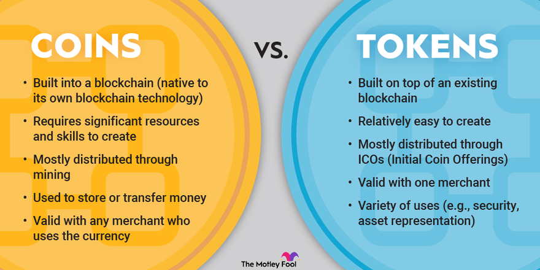

## Table of Contents

## What is a crypto token?

A crypto token is a type of digital asset that exists on a blockchain, which is a secure and decentralized ledger of transactions. Unlike traditional money, which is controlled by banks and governments, crypto tokens are managed by the users of the blockchain. They can be used for various purposes, such as making purchases, investing, or even as a reward for participating in certain activities on the blockchain.

Crypto tokens are often created through a process called an Initial Coin Offering (ICO), where new tokens are sold to the public to raise funds for a project. These tokens can represent anything from a share in a company to a right to use a specific service on the blockchain. Because they are digital and can be easily transferred, crypto tokens have become popular in the world of online finance and technology.

## What is a cryptocurrency?

A cryptocurrency is a type of digital money that you can use to buy things online. It is different from regular money because it is not controlled by banks or governments. Instead, it uses a technology called blockchain, which is like a big, secure list of all the transactions that have ever happened. This makes it very hard for anyone to cheat or steal the money.

People can use cryptocurrencies to send money to each other quickly and cheaply, no matter where they are in the world. Some popular cryptocurrencies include Bitcoin, Ethereum, and Litecoin. You can buy them on special websites called exchanges, and you keep them in a digital wallet on your computer or phone. Just like with regular money, you can use cryptocurrencies to buy things, invest, or save for the future.

## What is a crypto commodity?

A crypto commodity is a type of digital asset that is similar to traditional commodities like gold or oil. It is traded on digital platforms and its value can go up and down based on supply and demand. Unlike regular commodities, crypto commodities exist on a blockchain, which is a secure and decentralized record of transactions.

People use crypto commodities for investing and trading. They can buy and sell them on special websites called exchanges, just like they would with stocks or other financial assets. Because they are digital and can be easily transferred, crypto commodities are popular in the world of online finance and technology.

## How do crypto tokens differ from cryptocurrencies?

Crypto tokens and cryptocurrencies are both types of digital assets that exist on a blockchain, but they have some key differences. A [cryptocurrency](/wiki/cryptocurrency) is like digital money that you can use to buy things online. It's not controlled by banks or governments, and it's mainly used for making payments or as an investment. Bitcoin and Ethereum are examples of cryptocurrencies.

On the other hand, a crypto token often represents something more specific, like a share in a company or the right to use a certain service on the blockchain. Tokens are usually created through an Initial Coin Offering (ICO), where new tokens are sold to raise money for a project. While you can use some tokens for buying things, they are often used for other purposes, like rewarding people for participating in the blockchain's activities or giving them access to special features.

In simple terms, think of cryptocurrencies as digital cash that you can spend or invest, while crypto tokens are more like digital tickets or vouchers that give you certain rights or benefits within a specific blockchain ecosystem.

## Can you explain the primary use of crypto commodities?

Crypto commodities are mainly used for investing and trading. They are digital versions of things like gold or oil, and people buy and sell them on special websites called exchanges. Just like with regular commodities, the price of crypto commodities can go up and down based on how many people want to buy them and how many are available. This makes them popular for people who like to trade and try to make money from the price changes.

Because crypto commodities are on a blockchain, they are very secure and hard to fake. This makes them a good choice for people who want to invest in something that is safe and can be easily traded online. They are different from cryptocurrencies, which are more like digital money you can use to buy things, and crypto tokens, which can give you special rights or benefits within a specific project.

## What are some examples of crypto tokens?

Some examples of crypto tokens are BAT (Basic Attention Token) and LINK (Chainlink). BAT is used in the Brave browser to reward users for watching ads. When you see an ad in the Brave browser, you get BAT tokens that you can use to support your favorite websites or content creators. LINK is used to connect smart contracts on the blockchain with real-world data. If you want to use a smart contract to do something based on real-world information, like the weather or stock prices, you can use LINK to make it happen.

Another example of a crypto token is UNI (Uniswap). UNI is used on the Uniswap platform, which is a place where people can trade different cryptocurrencies without a middleman. When you use Uniswap to trade, you might get UNI tokens as a reward for helping to keep the platform running smoothly. These tokens can be used to vote on changes to the platform or traded for other cryptocurrencies. Each of these tokens has a specific purpose and helps to make the blockchain projects they are part of work better.

## What are some examples of cryptocurrencies?

Some examples of cryptocurrencies are Bitcoin, Ethereum, and Litecoin. Bitcoin is the first and most famous cryptocurrency. People use it to buy things online or as an investment. It's like digital cash that you can send to anyone, anywhere in the world, without a bank. Ethereum is another popular cryptocurrency, but it also lets you do more than just send money. With Ethereum, you can create smart contracts, which are like digital agreements that automatically do what they're supposed to do. Litecoin is similar to Bitcoin but is designed to be faster and easier to use.

These cryptocurrencies are all kept safe on a blockchain, which is like a big, secure list of all the transactions that have ever happened. This makes it very hard for anyone to cheat or steal the money. People can buy and sell these cryptocurrencies on special websites called exchanges, and they keep them in a digital wallet on their computer or phone. Just like with regular money, you can use cryptocurrencies to buy things, invest, or save for the future.

## What are some examples of crypto commodities?

Some examples of crypto commodities are Bitcoin Cash (BCH) and Litecoin (LTC). Bitcoin Cash is like a version of Bitcoin that was made to be faster and easier to use for everyday purchases. It's called a crypto commodity because it acts like a digital version of things like gold or oil, and people trade it on special websites called exchanges. Litecoin is another crypto commodity that is similar to Bitcoin but is designed to be quicker and cheaper to use. People buy and sell Litecoin on exchanges, hoping its value will go up so they can make money.

Another example of a crypto commodity is Ethereum Classic (ETC). Ethereum Classic is like a version of Ethereum that some people decided to keep using after a big change happened. It's also traded on exchanges and is used by people who want to invest in something that is secure and can be easily traded online. Just like with regular commodities, the price of these crypto commodities can go up and down based on how many people want to buy them and how many are available. This makes them popular for people who like to trade and try to make money from the price changes.

## How are crypto tokens created and managed?

Crypto tokens are created through a process called an Initial Coin Offering (ICO). This is when a new project sells its tokens to the public to raise money. People buy these tokens with cryptocurrencies like Bitcoin or Ethereum. The project uses the money to build and grow. After the ICO, the tokens are usually available on special websites called exchanges, where people can buy and sell them.

Once the tokens are created, they are managed on a blockchain. This is like a big, secure list of all the transactions that have ever happened. The blockchain keeps track of who owns the tokens and how they are used. The rules for how the tokens work are written in something called a smart contract. This is like a digital agreement that automatically does what it's supposed to do. People who use the tokens follow these rules, and the blockchain makes sure everything is fair and secure.

## What role do blockchains play in cryptocurrencies and crypto commodities?

Blockchains are very important for cryptocurrencies and crypto commodities. They are like a big, secure list of all the transactions that have ever happened. This list is kept on many computers around the world, so it's very hard for anyone to cheat or steal the money. When you use a cryptocurrency like Bitcoin or a crypto commodity like Bitcoin Cash, the blockchain keeps track of who owns what and makes sure that the money goes where it's supposed to go.

Because blockchains are secure and decentralized, they make cryptocurrencies and crypto commodities safe to use. This means that no one person or group controls the money, and it can be easily sent to anyone, anywhere in the world, without a bank. The blockchain also makes it possible for people to trade these digital assets on special websites called exchanges, where the price can go up and down based on how many people want to buy them and how many are available.

## What are the regulatory differences between crypto tokens, cryptocurrencies, and crypto commodities?

The rules that governments make for crypto tokens, cryptocurrencies, and crypto commodities can be different. Cryptocurrencies like Bitcoin are often seen as a type of money, so they might be treated like regular money by the government. This means there could be rules about how you can buy, sell, or use them. Some places might say you need to pay taxes on them, or they might put limits on how you can use them to protect people from losing money.

Crypto tokens, on the other hand, can be seen as something more like a stock or a voucher. Because they often represent a share in a company or the right to use a service, they might be treated like other investments. This means there could be rules about how they are sold, like needing to tell people about the risks before they buy them. Governments might also watch how these tokens are traded to make sure no one is cheating.

Crypto commodities, like Bitcoin Cash or Litecoin, are a bit different because they are seen as digital versions of things like gold or oil. The rules for them might focus more on how they are traded on special websites called exchanges. Governments might want to make sure these exchanges are fair and safe, so they could put rules in place about how the trading happens and how the prices are set. This helps protect people who are buying and selling these digital assets.

## How do the economic models of crypto tokens, cryptocurrencies, and crypto commodities vary?

The economic models of crypto tokens, cryptocurrencies, and crypto commodities can be different. Cryptocurrencies like Bitcoin are often seen as digital money. Their value can go up and down based on how many people want to buy them and how many are available. People use them to buy things online or as an investment. The supply of cryptocurrencies is usually controlled by a set of rules written into the blockchain, like how many new coins are made each year. This can affect their value because if there are too many coins, they might become less valuable.

Crypto tokens, on the other hand, often have a more specific purpose. They can represent a share in a company or give you the right to use a service on the blockchain. Their economic model might depend on the success of the project they are part of. If the project does well, the value of the token might go up. Tokens are usually created through an Initial Coin Offering (ICO), where people buy them to help fund the project. The supply of tokens can be managed in different ways, depending on what the project needs.

Crypto commodities, like Bitcoin Cash or Litecoin, are seen as digital versions of things like gold or oil. Their economic model is based on trading, where people buy and sell them hoping to make money from price changes. The value of these commodities can go up and down based on supply and demand, just like regular commodities. The supply of crypto commodities might be controlled by the rules of the blockchain they are on, but it can also be affected by how many people are using and trading them.

## References & Further Reading

[1]: Narayanan, A., Bonneau, J., Felten, E., Miller, A., & Goldfeder, S. (2016). ["Bitcoin and Cryptocurrency Technologies: A Comprehensive Introduction."](https://press.princeton.edu/books/hardcover/9780691171692/bitcoin-and-cryptocurrency-technologies) Princeton University Press.

[2]: Antonopoulos, A. M. (2017). ["Mastering Bitcoin: Unlocking Digital Cryptocurrencies."](https://books.google.com/books/about/Mastering_Bitcoin.html?id=IXmrBQAAQBAJ) O'Reilly Media.

[3]: Zohar, A. (2015). ["Bitcoin: under the hood."](https://dl.acm.org/doi/10.1145/2701411) Communications of the ACM, 58(9), 104-113.

[4]: Mougayar, W. (2016). ["The Business Blockchain: Promise, Practice, and Application of the Next Internet Technology."](https://books.google.com/books/about/The_Business_Blockchain.html?id=CEsPDAAAQBAJ) Wiley.

[5]: Fabian Schär, Aleksander Berentsen. (2020). ["Bitcoin, Blockchain, and Cryptoassets: A Comprehensive Introduction."](https://mitpress.mit.edu/9780262539166/bitcoin-blockchain-and-cryptoassets/) MIT Press.

[6]: Tapscott, D., & Tapscott, A. (2018). ["Blockchain Revolution: How the Technology Behind Bitcoin is Changing Money, Business, and the World."](https://www.tandfonline.com/doi/full/10.1080/10686967.2018.1404373) Penguin Random House.

[7]: Lewis, A. (2018). ["The Basics of Bitcoins and Blockchains: An Introduction to Cryptocurrencies and the Technology that Powers Them."](https://www.amazon.com/Basics-Bitcoins-Blockchains-Introduction-Cryptocurrencies/dp/1633538001) Mango.

[8]: Hayes, A., & La Spada, G. (2019). ["Bitcoin Price and Its Marginal Cost of Production: Support for a Fundamental Value."](https://arxiv.org/pdf/1805.07610) International Journal of Economics and Finance.

[9]: De Filippi, P., & Wright, A. (2018). ["Blockchain and the Law: The Rule of Code."](https://www.jstor.org/stable/j.ctv2867sp) Harvard University Press.