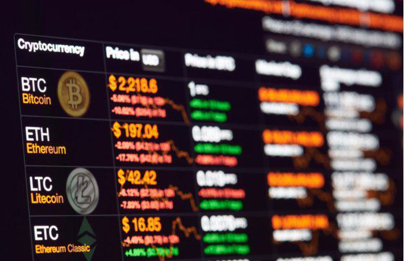

In recent years, the global financial landscape has undergone a profound transformation with the emergence and proliferation of digital currencies. These digital assets are reshaping how we perceive and engage with traditional financial systems. The advent of cryptocurrencies such as Bitcoin and Ethereum has introduced a new era of decentralized finance, where transactions can occur without the need for intermediaries like banks. This decentralization is achieved through blockchain technology, which ensures transparency, security, and immutability of transactions.

This article offers an in-depth exploration of cryptocurrencies, highlighting the intricate attributes of crypto tokens and crypto commodities. Crypto tokens, for instance, extend beyond the basic functionalities of digital currencies by representing assets or access to specific services within a blockchain ecosystem. Meanwhile, crypto commodities serve as digital representations of tangible assets, offering unique opportunities for diversification and hedging in investment portfolios.

Algorithmic trading has gained significant traction in the cryptocurrency ecosystem, driven by the market's inherent volatility and the opportunities it presents for high-frequency trades. This form of trading leverages computer algorithms to execute trades at speeds and volumes unattainable by human traders, contributing to market efficiency and liquidity.

For anyone interested in the evolution of finance, understanding these elements is vital. The landscape of digital finance is filled with both challenges and opportunities, necessitating a comprehensive grasp of the intricacies involved. As we explore these transformative financial instruments, readers will gain insights into their potential impacts on the future of financial markets and individual investment strategies.

## Table of Contents

## Understanding Cryptocurrencies

Cryptocurrencies represent a significant leap forward in the concept of money, blending technology and finance in unprecedented ways. At their core, cryptocurrencies are digital or virtual currencies secured by cryptographic techniques, ensuring the integrity and authenticity of transactions. This cryptographic approach not only provides security but also introduces an element of anonymity often associated with these digital assets.

These currencies operate on decentralized platforms known as blockchains. A blockchain is a distributed ledger enforced by a network of computers, or nodes, spread across the globe. This decentralization distinguishes cryptocurrencies from traditional fiat currencies, as they do not rely on central banking authorities. Instead, transactions and the issuance of new currency units are handled collectively by the network using pre-defined rules encoded into the blockchain's protocol. This structure provides immutability, transparency, and robustness against censorship.

Bitcoin, introduced in 2009 by the pseudonymous entity Satoshi Nakamoto, was the first [cryptocurrency](/wiki/cryptocurrency) and set the precedent for the development of numerous alternative cryptocurrencies, or altcoins. These altcoins offer varied functionalities and purposes, from acting as digital currency to enabling complex financial transactions through smart contracts.

Understanding the mechanics of cryptocurrencies involves grasping how transactions are verified and added to the blockchain. Each transaction is grouped into a block, and before it can be accepted, it must be validated by the network. This process is known as mining in many cryptocurrencies, where miners solve computationally intensive puzzles to validate transactions and are rewarded with newly created coins. The difficulty of these puzzles ensures that any malicious attempt to alter the transaction history would require immense computational power.

Cryptocurrencies are increasingly becoming a preferred method of payment and investment for several reasons. Firstly, they offer low transaction fees compared to traditional financial systems and allow for rapid cross-border transactions without the need for foreign exchange conversions. Secondly, the capped supply of many cryptocurrencies, such as Bitcoin with its 21 million coin limit, introduces a scarcity element that can drive demand and value. 

Moreover, the prospect of decentralization and independence from governmental monetary policies attracts proponents who view cryptocurrencies as a hedge against inflation and political instability. This investment appeal is bolstered by the significant returns seen by early adopters and the growing mainstream acceptance by major corporations and financial institutions.

The impact of cryptocurrencies on global financial systems is profound. They challenge the traditional banking model, provide financial access to unbanked populations, and introduce innovative financial instruments like decentralized finance (DeFi). Cryptocurrencies are reshaping the way transactions are perceived, emphasizing the importance of digital ownership and control over one's financial assets. As the cryptocurrency space evolves, it continues to push the boundaries of traditional finance, offering both opportunities and challenges to existing economic frameworks.

## Diving into Crypto Tokens

Crypto tokens represent assets or utilities within a blockchain ecosystem, serving distinct purposes beyond those of traditional cryptocurrencies like Bitcoin. Unlike Bitcoin, which operates on its own blockchain, tokens are built on existing blockchains such as Ethereum. This distinction allows for greater flexibility and functionality, as tokens can leverage the pre-existing infrastructure of these blockchains.

### Types of Tokens

Tokens are commonly categorized into three types: utility tokens, security tokens, and non-fungible tokens (NFTs).

1. **Utility Tokens:** These tokens are designed to provide access to goods or services within a particular blockchain-based platform. They function as native currencies within their specific ecosystems and are often used to incentivize participation or grant access to proprietary features. A prime example is the Basic Attention Token (BAT), used within the Brave browser ecosystem to reward users for their attention.

2. **Security Tokens:** These represent ownership in an asset or an organization, similar to traditional securities. Security tokens are subject to regulatory scrutiny and compliance because they often denote investment contracts, shares in a company, or entitlements to dividends or interest payments. The issuance of security tokens enables organizations to raise capital while providing investors with a stake or share in the venture.

3. **Non-Fungible Tokens (NFTs):** NFTs are unique digital assets that signify ownership or proof of authenticity of a particular item, often art, music, or other digital collectibles. Unlike fungible tokens, NFTs are not interchangeable because each token holds distinct information that makes it unique. The widespread adoption of NFTs has been driven by their application in digital art, gaming, and entertainment industries.

### Token Interactions and Ecosystem Roles

Tokens interact with their native ecosystems by functioning as a medium of exchange, governing tools, or access keys within blockchain networks. They play a critical role in facilitating operations, promoting community engagement, and driving the decentralized economy. In decentralized finance (DeFi) platforms, for instance, tokens are utilized for lending, borrowing, and [earning](/wiki/earning-announcement) yields. Governance tokens, another subtype, grant holders voting power in decisions affecting the development and operation of decentralized platforms.

### Initial Coin Offerings (ICOs)

Initial Coin Offerings (ICOs) have been a significant mechanism for generating and distributing tokens. During an ICO, blockchain projects raise funds by selling tokens to early backers, often in exchange for established cryptocurrencies like Bitcoin or Ethereum. ICOs enable startups to access capital while offering investors a potential stake in future platform usage or profit. However, the ICO model has faced criticism for insufficient regulatory oversight and fraudulent schemes, leading to calls for more stringent controls and transparency.

Overall, by offering varied utilities and applications, crypto tokens are instrumental in broadening the scope of blockchain technology beyond simple monetary functions. Their integration into decentralized networks paves the way for innovative business models and community-driven ecosystems.

## Exploring Crypto Commodities

Crypto commodities refer to tokenized representations of physical or economic assets that hold intrinsic value. Unlike cryptocurrencies, which serve as digital currencies, crypto commodities are backed by tangible or economic assets, offering a bridge between traditional asset classes and digital finance.

### Examples of Crypto Commodities

Tokenized assets such as gold, oil, or real estate exemplify crypto commodities. For example, a tokenized gold asset represents a specific amount of physical gold stored in a secure vault. This enables fractional ownership and broader access to the physical asset market. Oil tokens can function similarly, representing a barrel of oil or a share in oil reserves, providing [liquidity](/wiki/liquidity-risk-premium) and ease of transfer. Similarly, tokenizing real estate allows fractional ownership of properties, facilitating investment for individuals who might not have the capital to purchase entire properties.

### Differences Between Crypto Commodities and Cryptocurrencies

The primary difference between crypto commodities and cryptocurrencies lies in their valuation basis. Crypto commodities are backed by physical assets, providing inherent value, whereas cryptocurrencies like Bitcoin rely on supply, demand, utility, and consensus within the network. Crypto commodities also integrate more directly with traditional markets due to their backing by tangible assets, offering a familiar valuation method.

### Potential Benefits and Risks

### Benefits

1. **Liquidity and Accessibility**: By converting physical assets into digital tokens, crypto commodities enhance liquidity, allowing for swift trading and access to markets 24/7. This democratizes access to commodity trading, traditionally reserved for larger investors.

2. **Fractional Ownership**: Tokenization allows ownership in fractional amounts, lowering the entry barrier to asset investment and enabling diversification of portfolios.

3. **Transparency and Security**: The blockchain technology underlying crypto commodities provides transparency in transactions and ownership, reducing fraud and increasing security.

### Risks

1. **Regulatory Challenges**: Since this market is relatively nascent, it faces regulatory uncertainty, potentially impacting legal compliance and stability.

2. **Volatility**: Although backed by real assets, token prices can still exhibit significant volatility due to market sentiment and trading activity.

3. **Operational and Technology Risks**: Risks associated with blockchain technology, such as security breaches or smart contract failures, can impact crypto commodities.

### Real-World Applications and Integration with Traditional Markets

Crypto commodities have begun to integrate with traditional markets in significant ways. For instance, tokenized gold is used as a digital substitute in gold trading, providing a digital alternative that simplifies cross-border trade and storage. Moreover, real estate tokens can enable faster, more efficient property transactions, aligning with current trends in digital transformation within the property sector. By offering liquidity and transparency, crypto commodities can augment traditional commodity exchanges, potentially fostering greater market efficiencies.

### Merging Tangible Assets and Blockchain

The merging of tangible assets with blockchain technology through crypto commodities provides new opportunities for asset-backed digital finance. This combination enhances market access, fosters innovation in trading methodologies, and aligns well with shifts towards digital asset management. As technology and regulatory frameworks develop, the role of crypto commodities may expand, presenting alternative investment options and augmenting traditional commodities markets with blockchain’s benefits.

## Algorithmic Trading in the Crypto Market

Algorithmic trading involves the use of computer algorithms to execute trades with high speed and [volume](/wiki/volume-trading-strategy), playing a crucial role in the crypto market where [volatility](/wiki/volatility-trading-strategies) and liquidity are significant. Its importance has grown as traders seek to exploit the rapid price movements and [high frequency](/wiki/high-frequency-trading) of transactions typical of cryptocurrency markets.

### Popular Algorithmic Trading Strategies

1. **Arbitrage**: This strategy involves taking advantage of price discrepancies between different exchanges or markets. For instance, if Bitcoin is cheaper on Exchange A than on Exchange B, a trader could buy it from A and sell it on B to profit from the price difference. High-frequency algorithms can identify and execute such opportunities faster than manual trading.

2. **Market Making**: Market makers provide liquidity by continuously placing buy and sell orders. They profit from the spread between these orders. In highly volatile crypto markets, market-making algorithms need to be finely tuned to adapt to rapid price swings and maintain profitability.

3. **Trend Following**: This strategy attempts to capitalize on market trends by buying assets that are rising and selling assets that are falling. Algorithms monitor market data to identify trends and adjust positions accordingly, taking advantage of the momentum.

### Technological Requirements and Risks

Algorithmic trading in crypto demands robust technological infrastructure. Traders require high-performance computers, low-latency network connections, and sophisticated algorithmic software capable of processing vast amounts of data in real-time. The use of [machine learning](/wiki/machine-learning) models is becoming increasingly common, allowing algorithms to become more predictive and adaptive.

However, with these technological advancements come risks. The complexity of algorithms can lead to unforeseen errors, potentially resulting in significant financial losses. Additionally, crypto market volatility can amplify these risks. A sudden market movement might trigger cascading sell-offs, potentially leading to market crashes exacerbated by [algorithmic trading](/wiki/algorithmic-trading).

### Influence on Digital Asset Exchanges

Algorithmic trading is significantly impacting digital asset exchanges by increasing market efficiency and liquidity. By executing trades rapidly, algorithms help narrow bid-ask spreads, making it cheaper for traders to enter and [exit](/wiki/exit-strategy) positions. This increased efficiency attracts more participants, enhancing the overall liquidity of the market.

Moreover, algorithmic trading is driving the development of new trading platforms equipped to handle high-frequency transactions. These platforms often offer advanced features such as APIs for direct market access, [backtesting](/wiki/backtesting) environments for strategy testing, and real-time analytics for monitoring algorithm performance. As a result, exchanges are evolving to meet the demands of a new era where speed and sophistication are paramount.

In conclusion, algorithmic trading is not only reshaping how trades are executed but is also a catalyst for the evolution of the crypto market infrastructure. It represents a dynamic intersection of technology and finance, posing both opportunities and challenges as the digital asset landscape continues to grow.

## The Future of Cryptocurrencies, Tokens, and Commodities

The intersection of cryptocurrencies, crypto tokens, and crypto commodities is rapidly forming novel financial paradigms, poised to significantly alter the landscape of global finance. Regulatory developments are critical to shaping this evolving space. Governments and financial authorities worldwide recognize the transformative potential of digital assets and are working to establish frameworks that ensure consumer protection, market integrity, and financial stability without stifling innovation. Legislative measures such as the European Union's Markets in Crypto-Assets (MiCA) and the U.S. Infrastructure Investment and Jobs Act are examples of regulatory efforts aimed at providing clarity and structure to the crypto market. The implementation and evolution of these regulations will undoubtedly affect how cryptocurrencies, tokens, and commodities integrate into the broader financial ecosystem.

Emerging trends reveal a growing interest in decentralized finance (DeFi) and non-fungible tokens (NFTs), underpinning a shift towards more decentralized and diversified financial systems. DeFi offers a range of financial services—lending, borrowing, trading—without traditional intermediaries, leveraging smart contracts to execute transactions. As DeFi platforms become more sophisticated, their integration with traditional finance could lead to more robust and inclusive financial systems.

NFTs are revolutionizing ownership concepts, particularly in the digital art and collectibles sector, by providing verifiable digital ownership through blockchain technology. Their rapid adoption raises interesting questions about the tokenization of assets and intellectual property rights, potentially creating new markets and economic models.

Algorithmic trading, rapidly gaining traction in the cryptocurrency markets, is expected to undergo significant advancements with improvements in [artificial intelligence](/wiki/ai-artificial-intelligence) and machine learning. These technologies could enable more sophisticated trading strategies, allowing algorithms to process a greater volume of data at higher speeds, improving trade execution and profitability. The programmability and transparency of blockchain can enhance algorithmic trading by offering access to decentralized exchange platforms and fostering a more open trading environment.

Speculatively, the integration of these digital elements into mainstream finance may culminate in a more interconnected financial system, blurring the lines between traditional assets and digital ones. Cryptocurrency adoption by major financial institutions could lead to an era where digital currencies operate seamlessly alongside fiat currencies, reshaping monetary policies and economic strategies.

In conclusion, the fusion of cryptocurrencies, tokens, and commodities with algorithmic trading technologies heralds a transformative phase for global finance characterized by increased efficiency, transparency, and inclusivity. Navigating this terrain will require a delicate balance between innovation and regulation, presenting both challenges and remarkable opportunities for the future of finance.

## Conclusion

Cryptocurrencies, tokens, and commodities are at the forefront of financial innovation, serving as the pillars of a rapidly evolving digital economy. The intertwining nature of these digital assets and the increasing role of algorithmic trading highlight a fundamental shift in market dynamics, prompting traditional financial systems to adapt. Algorithmic trading, with its capacity to process large volumes of data at high speeds, aligns perfectly with the volatile and liquid nature of cryptocurrency markets. This synergy not only enhances trading efficiency but also influences price discovery and market stability.

For investors, tech enthusiasts, and financial professionals, it is essential to grasp the intricacies of these components. Cryptocurrencies offer a decentralized alternative to traditional currency, with significant implications for global finance. Crypto tokens extend this utility by providing functional roles within blockchain ecosystems, such as facilitating operations or granting access to certain services. Meanwhile, crypto commodities represent tokenized versions of tangible assets, merging physical and digital assets in unprecedented ways.

As these digital formats continue to mature, staying informed about their trends and developments is crucial. The rapid pace of technological advancement means that what is considered cutting-edge today may soon become obsolete. Emerging regulatory landscapes, technological innovations, and shifting consumer preferences will all shape how these assets are integrated into mainstream finance.

In conclusion, the landscape of digital assets presents a blend of challenges and unparalleled opportunities for the future. Navigating this complex terrain requires knowledge and adaptability, ensuring that participants can effectively leverage the benefits while minimizing potential risks. As we progress, the digital assets space will likely redefine not only how financial transactions are conducted but also how value is perceived and exchanged globally.

## References & Further Reading

[1]: Narayanan, A., Bonneau, J., Felten, E., Miller, A., & Goldfeder, S. (2016). ["Bitcoin and Cryptocurrency Technologies: A Comprehensive Introduction."](https://press.princeton.edu/books/hardcover/9780691171692/bitcoin-and-cryptocurrency-technologies) Princeton University Press.

[2]: Antonopoulos, A. M. (2017). ["Mastering Bitcoin: Unlocking Digital Cryptocurrencies."](https://books.google.com/books/about/Mastering_Bitcoin.html?id=IXmrBQAAQBAJ) O'Reilly Media.

[3]: Zohar, A. (2015). ["Bitcoin: under the hood."](https://dl.acm.org/doi/10.1145/2701411) Communications of the ACM, 58(9), 104-113.

[4]: Mougayar, W. (2016). ["The Business Blockchain: Promise, Practice, and Application of the Next Internet Technology."](https://books.google.com/books/about/The_Business_Blockchain.html?id=CEsPDAAAQBAJ) Wiley.

[5]: Fabian Schär, Aleksander Berentsen. (2020). ["Bitcoin, Blockchain, and Cryptoassets: A Comprehensive Introduction."](https://mitpress.mit.edu/9780262539166/bitcoin-blockchain-and-cryptoassets/) MIT Press.

[6]: Tapscott, D., & Tapscott, A. (2018). ["Blockchain Revolution: How the Technology Behind Bitcoin is Changing Money, Business, and the World."](https://www.tandfonline.com/doi/full/10.1080/10686967.2018.1404373) Penguin Random House.

[7]: Lewis, A. (2018). ["The Basics of Bitcoins and Blockchains: An Introduction to Cryptocurrencies and the Technology that Powers Them."](https://www.amazon.com/Basics-Bitcoins-Blockchains-Introduction-Cryptocurrencies/dp/1633538001) Mango.

[8]: Hayes, A., & La Spada, G. (2019). ["Bitcoin Price and Its Marginal Cost of Production: Support for a Fundamental Value."](https://arxiv.org/pdf/1805.07610) International Journal of Economics and Finance.

[9]: De Filippi, P., & Wright, A. (2018). ["Blockchain and the Law: The Rule of Code."](https://www.jstor.org/stable/j.ctv2867sp) Harvard University Press.