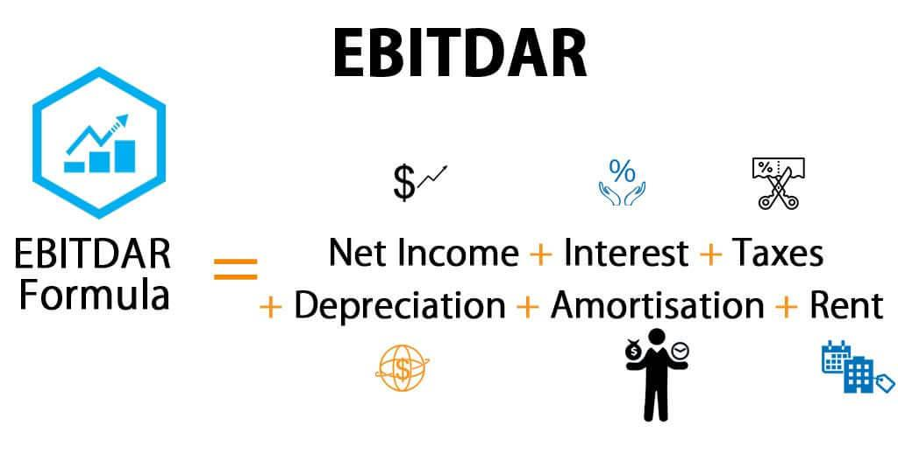

In the complex world of finance, understanding profitability measures is crucial for investors and companies alike. These measures provide insight into a company’s financial health and operational efficiency, helping stakeholders make informed decisions. Among these measures, EBITDA (Earnings Before Interest, Taxes, Depreciation, and Amortization), EBITDAR (EBITDA plus Rental expenses), and EBITDARM (EBITDAR plus Management fees) stand prominently. These key metrics offer varying layers of financial analysis, stripping away certain expenses to reveal a business's core profitability. 

Meanwhile, algorithmic trading is revolutionizing investment strategies by leveraging these and other financial metrics. Through the use of advanced algorithms, traders can process vast amounts of financial data more swiftly and accurately than ever before. This technological advancement allows for the identification of trading opportunities based on solid financial data, thus improving investment outcomes. This article explores the synergy between traditional financial metrics such as EBITDA, EBITDAR, and EBITDARM, and modern algorithmic trading. By understanding how these elements interconnect, investors and financial analysts can glean deeper insights and potentially enhance their investment returns.



## Table of Contents

## Understanding EBITDA, EBITDAR, and EBITDARM

EBITDA stands for Earnings Before Interest, Taxes, Depreciation, and Amortization. It is a widely-used metric for assessing a company's operating performance and provides insight into the profitability generated from core operations. The formula for EBITDA is as follows:

$$
\text{EBITDA} = \text{Net Income} + \text{Interest} + \text{Taxes} + \text{Depreciation} + \text{Amortization}
$$

This metric excludes the effects of financing and accounting decisions, making it easier to compare companies within the same industry, regardless of their capital structure.

EBITDAR expands on EBITDA by adding back rental expenses, which can be significant for companies in sectors like retail or airlines where leasing is common. Including rent in this metric acknowledges that such expenses are integral to operations:

$$
\text{EBITDAR} = \text{EBITDA} + \text{Rent Expenses}
$$

EBITDARM takes this further by also incorporating management fees, providing a tool for sectors where such fees are a notable part of operational costs. This metric is often used in industries like healthcare, where management services might be outsourced:

$$
\text{EBITDARM} = \text{EBITDAR} + \text{Management Fees}
$$

Each of these metrics focuses on gauging a company's core operational profitability by stripping out non-operational expenses, thereby enabling a clearer view of how a business is performing at its core. By understanding and applying these metrics, stakeholders can make more informed decisions regarding the financial health and operational efficiency of a company.

## Uses and Limitations of EBITDA, EBITDAR, and EBITDARM

EBITDA, or Earnings Before Interest, Taxes, Depreciation, and Amortization, is a widely favored metric for evaluating a company's operational efficiency, as it isolates earnings from extraneous or non-operational expenses. Its primary appeal lies in its focus on the core profitability of a business, independent of its capital structure, tax environment, or the accounting decisions related to depreciation and amortization.

EBITDAR, which extends EBITDA by accounting for rental expenses, is particularly useful in industries where leasing or renting constitutes a significant portion of expenses, such as hospitality and airlines. By including these costs, EBITDAR provides an additional layer of insight into a company's operational performance, factoring in significant expenditures that might otherwise distort EBITDA's portrayal of profitability.

EBITDARM further builds on EBITDAR by incorporating management fees into the equation. This variation is particularly relevant for management-intensive industries, enabling analysts to assess profitability without the influence of costs directly tied to management activities.

Despite their utility, these metrics are not without limitations. One major criticism is their potential for manipulation, as they can be adjusted to present a more favorable financial position by excluding certain expenses. This exclusion of real expenses may provide a skewed view of a company's financial health. For instance, failing to account for depreciation and amortization can overlook the ongoing wear and tear on a company's assets, presenting a potentially misleading portrayal of long-term sustainability.

Moreover, EBITDA, EBITDAR, and EBITDARM are not recognized under Generally Accepted Accounting Principles (GAAP), leading to variability in how they are calculated across different organizations. This lack of standardization can complicate comparisons between companies, as differing interpretations and calculations might render the metrics inconsistently.

In conclusion, while EBITDA and its extensions offer valuable insights into a company's operational efficiency, investors must acknowledge their limitations and apply them judiciously. This includes recognizing the metrics' exclusionary nature regarding specific expenses and the absence of standardized calculation methods under GAAP, which can affect comparability and reliability.

## Algorithmic Trading: A New Era in Finance

Algorithmic trading represents a significant shift in the landscape of financial markets, leveraging the power of computers to automate trading decisions through complex algorithms. These algorithms are designed to execute orders in milliseconds, processing vast amounts of market data rapidly to identify profitable trading opportunities. The automation afforded by [algorithmic trading](/wiki/algorithmic-trading) allows for minimizing human error, reducing transaction costs, and ensuring trades are executed at optimal times.

At the core of algorithmic trading systems is the ability to integrate financial metrics, such as EBITDA (Earnings Before Interest, Taxes, Depreciation, and Amortization), to refine decision-making processes. By utilizing EBITDA and other related financial indicators, trading algorithms can be programmed to assess the operational performance of companies. This assessment informs algorithms about the intrinsic value and financial health of potential investment targets, enhancing the robustness of trading strategies.

Algorithmic trading systems apply sophisticated statistical and mathematical models to analyze historical data patterns and predict future price movements. These models range from simple moving averages to advanced [machine learning](/wiki/machine-learning) methods, capable of adjusting to fluctuating market conditions and evolving investment landscapes. For instance, algorithms can be coded using Python, a popular language for financial analysis due to its extensive libraries like NumPy and pandas, which facilitate data manipulation and complex computations:

```python
import numpy as np
import pandas as pd

# Hypothetical example to calculate a simple moving average (SMA)
def calculate_sma(data, window):
    return data.rolling(window=window).mean()

# Sample financial data
price_data = pd.Series([100, 102, 101, 105, 110, 108])

# Calculate a 3-period moving average
sma_3 = calculate_sma(price_data, 3)
print(sma_3)
```

Algorithmic trading enhances efficiency through strategic application of financial metrics, enabling traders to make real-time, data-driven decisions. By integrating metrics such as EBITDA into trading algorithms, investors can better align their strategies with the company’s core operational performance metrics, resulting in more informed and potentially more profitable trades.

## Integrating EBITDA, EBITDAR, and EBITDARM into Algorithmic Trading

EBITDA (Earnings Before Interest, Taxes, Depreciation, and Amortization) and its variants, EBITDAR (adding Rental expenses) and EBITDARM (further including Management fees), offer valuable insight into a company's core profitability by excluding the effects of financing and accounting decisions. In algorithmic trading, these metrics serve as crucial components to model intrinsic company value and develop more informed trading strategies.

By integrating these metrics into algorithmic models, traders can isolate a company's operational performance from extraneous factors. This focus helps in identifying companies with solid core operations, which may be undervalued by the market when standard metrics are less revealing. For instance, using EBITDA-based analysis can be advantageous for evaluating firms in capital-intensive industries, where non-operational costs can obscure true profitability.

Tracking changes in EBITDA, EBITDAR, and EBITDARM enables algorithms to dynamically adjust to evolving market conditions, thereby responding to shifts in a company's operational efficiency. These metrics can trigger buy or sell signals. For instance, a sudden improvement in EBITDA might prompt a buying decision if the algorithm determines it reflects sustainable operational growth rather than a one-time gain.

Implementing this concept programmatically might involve using Python to process quarterly financial data and calculate these metrics:

```python
def calculate_ebitda(net_income, interest, taxes, depreciation, amortization):
    return net_income + interest + taxes + depreciation + amortization

def calculate_ebitdar(ebitda, rental_expenses):
    return ebitda + rental_expenses

def calculate_ebitdarm(ebitdar, management_fees):
    return ebitdar + management_fees

# Example financial data
net_income = 500000
interest = 20000
taxes = 50000
depreciation = 30000
amortization = 15000
rental_expenses = 20000
management_fees = 10000

ebitda = calculate_ebitda(net_income, interest, taxes, depreciation, amortization)
ebitdar = calculate_ebitdar(ebitda, rental_expenses)
ebitdarm = calculate_ebitdarm(ebitdar, management_fees)

print(f"EBITDA: {ebitda}, EBITDAR: {ebitdar}, EBITDARM: {ebitdarm}")
```

By integrating these computations into an algorithmic trading system, traders can harness real-time financial data to optimize strategies, providing a nuanced assessment of a company's ongoing performance. Such systems not only enhance decision-making but also refine the ability to predict market movements based on variations in fundamental financial health.

## Case Study: Practical Application of Algorithmic Trading

In a hypothetical scenario, we explore the application of algorithmic trading using the financial metric EBITDA to make informed investment decisions. To elucidate this process, imagine a trading algorithm designed to evaluate companies within the retail sector, a domain where operational efficiency and core profitability are critical indicators of overall health.

### Financial Data and Decision-Making Process

The algorithm initially gathers and processes historical financial data from publicly listed companies. It specifically focuses on EBITDA, which offers insights into each company's earnings before interest, taxes, depreciation, and amortization—a reflection of the core operating profitability.

Consider a company with the following financials over two consecutive years:

- **Year 1:**
  - Revenue: $500 million
  - Operating expenses: $300 million
  - Depreciation and Amortization: $50 million
  - EBITDA = Revenue - Operating Expenses = $500 million - $300 million = $200 million

- **Year 2:**
  - Revenue: $550 million
  - Operating expenses: $340 million
  - Depreciation and Amortization: $52 million
  - EBITDA = $550 million - $340 million = $210 million

The algorithm uses these EBITDA figures to compute growth rates and assess operational improvements. For instance, the EBITDA growth rate between Year 1 and Year 2 is:

$$
\text{Growth Rate} = \left( \frac{\text{EBITDA (Year 2)} - \text{EBITDA (Year 1)}}{\text{EBITDA (Year 1)}} \right) \times 100 = \left( \frac{210 - 200}{200} \right) \times 100 = 5\%
$$

A positive growth rate signifies enhanced operational efficiency, potentially making the company a desirable investment target.

### Illustration of Automated Systems

In its execution phase, the algorithm sorts companies based on their EBITDA performance and ranks them relative to peers. This ranking allows the system to prioritize companies exhibiting consistent EBITDA growth, indicating robust core operations unaffected by capital structure or non-core expenses.

The trading system operates by continuously monitoring fluctuations in EBITDA and related operational metrics. A Python code snippet typically used for such a task might resemble the following:

```python
import pandas as pd
import numpy as np

# Sample financial data
data = {'Year': ['Year 1', 'Year 2'],
        'Revenue': [500, 550],
        'Operating_Expenses': [300, 340],
        'Depreciation_Amortization': [50, 52]}

df = pd.DataFrame(data)

# Calculate EBITDA
df['EBITDA'] = df['Revenue'] - df['Operating_Expenses']

# Calculate EBITDA Growth Rate
df['EBITDA_Growth_Rate'] = df['EBITDA'].pct_change() * 100

print(df)
```

By integrating such automated analyses, the algorithm can adapt to market changes and recalibrate investment strategies accordingly. In real-time trading scenarios, this process enhances decision-making, minimizes human error, and optimizes the evaluation of company fundamentals, providing a competitive edge in the fast-paced trading environment.

Thus, through the practical application of algorithmic trading, investors employ EBITDA and related metrics to distill a company's intrinsic value, ensuring that investment decisions are both data-driven and objectively quantified.

## Conclusion

Combining traditional financial metrics like EBITDA with algorithmic trading creates robust investment strategies. These metrics, such as EBITDA, EBITDAR, and EBITDARM, offer valuable insights into a company's core operational profitability by highlighting earnings devoid of certain financial and operational costs. When leveraged in algorithmic trading, they provide traders with more precise and faster decision-making abilities, enabling them to identify market opportunities that align with the intrinsic value of companies.

Despite their limitations, such as the potential for manipulation and omission of real expenses, these tools are invaluable for assessing a company's financial health. They serve to balance out the more dynamic and fast-paced nature of algorithmic trading with a steady focus on a company's fundamental operations. Investors should not solely rely on these metrics but instead adopt a multi-faceted approach, integrating a variety of financial metrics to form comprehensive analyses and strategies. This diversified strategy promises greater risk management and investment accuracy, improving the prospects for sustained profitability in a volatile market environment.

## References & Further Reading

1. **"Financial Statement Analysis and Security Valuation" by Stephen H. Penman**  
   This book is an excellent resource for understanding the foundation of financial metrics such as EBITDA, EBITDAR, and EBITDARM, offering guidance on analyzing and interpreting company financial statements to assess value.

2. **"Algorithmic Trading: Winning Strategies and Their Rationale" by Ernest P. Chan**  
   Chan's book details the strategies and thought processes behind algorithmic trading, with insights into how financial metrics can be integrated into automated trading systems to enhance decision-making.

3. **"Algorithmic Trading and DMA: An Introduction to Direct Access Trading Strategies" by Barry Johnson**  
   Johnson explores the mechanics and strategies of algorithmic trading, including fundamental metrics like EBITDA as a core component of financial data analysis.

4. **"Principles of Corporate Finance" by Richard A. Brealey, Stewart C. Myers, and Franklin Allen**  
   This textbook offers comprehensive coverage on corporate finance principles, providing a strong foundation in understanding the context and application of EBITDA and its derivatives.

5. **"Quantitative Trading: How to Build Your Own Algorithmic Trading Business" by Ernie Chan**  
   This book provides practical guidance on setting up algorithmic trading systems, with chapters discussing the importance of financial metrics in developing quantitative models.

6. **"Python for Finance: Analyze Big Financial Data" by Yves Hilpisch**  
   Hilpisch's guide to using Python for financial analysis includes examples and code snippets for integrating financial metrics like EBITDA into trading algorithms, facilitating more robust trading strategies.

7. **"The Intelligent Investor: The Definitive Book on Value Investing" by Benjamin Graham**  
   Although not solely focused on algorithmic trading or specific financial metrics, this book lays the groundwork for understanding the principles of value investing and the importance of financial health indicators such as EBITDA.

8. **"Machine Trading: Deploying Computer Algorithms to Conquer the Markets" by Ernest P. Chan**  
   This book extends on Chan's previous work by describing the deployment of algorithms in live trading environments, illustrating the role financial metrics can play in strategy development.

9. **"The Complete Guide to Capital Markets for Quantitative Professionals" by Alex Kuznetsov**  
   Kuznetsov's book serves as a resource for quantitative traders, explaining capital market operations, the tools used for quantitative analysis, and the importance of metrics like EBITDA in financial modeling.