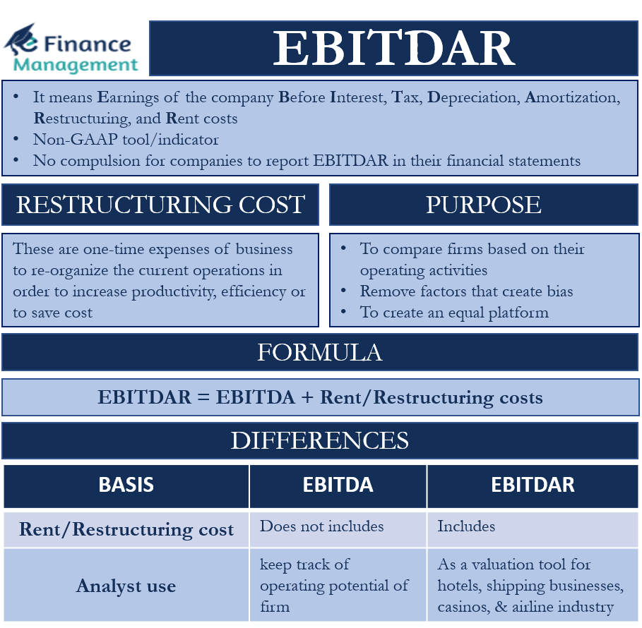

## Table of Contents

## What does EBITDA stand for and what does it measure?

EBITDA stands for Earnings Before Interest, Taxes, Depreciation, and Amortization. It's a way to measure how much money a company is making from its main business activities, without considering some other costs like interest on loans, taxes, and the gradual reduction in value of its assets.

This measure helps people see how well a company is doing at its core business, without the influence of how it's financed or how old its equipment is. It's often used to compare companies in the same industry, because it gives a clearer picture of their operating performance. However, it's not a perfect measure and should be used alongside other financial metrics to get a full understanding of a company's health.

## What is the difference between EBITDA and EBITDAR?

EBITDA stands for Earnings Before Interest, Taxes, Depreciation, and Amortization. It's a way to see how much money a company makes from its main work, without counting some costs like interest on loans, taxes, and the wear and tear on its equipment. It helps people understand how well a company is doing at its core business, without worrying about how it's financed or how old its stuff is.

EBITDAR is similar to EBITDA but adds one more thing it doesn't count: Rent. So, EBITDAR stands for Earnings Before Interest, Taxes, Depreciation, Amortization, and Rent. This measure is often used for businesses that have big rent costs, like airlines or retail stores. It gives a clearer picture of these companies' performance by not including their rent expenses.

Both measures help people compare companies in the same industry more fairly. But remember, they're not perfect and should be used with other financial measures to get the full picture of a company's health.

## How is EBITDARM calculated and what does it include?

EBITDARM stands for Earnings Before Interest, Taxes, Depreciation, Amortization, Rent, and Management fees. It's a way to see how much money a company makes from its main work, without counting some costs like interest on loans, taxes, the wear and tear on its equipment, rent, and fees paid to manage the business. This measure is often used for businesses in industries like healthcare, where rent and management fees can be big costs.

By not including rent and management fees, EBITDARM gives a clearer picture of these companies' performance. It helps people understand how well a company is doing at its core business, without worrying about how it's financed, how old its stuff is, or how much it pays for rent and management. Just like EBITDA and EBITDAR, EBITDARM is not a perfect measure and should be used with other financial measures to get the full picture of a company's health.

## Why might a company use EBITDA instead of net income?

A company might use EBITDA instead of net income because it wants to show how well its main business is doing without including some costs like interest, taxes, and the wear and tear on its equipment. These costs can be different for each company and might not show the real performance of the business. By using EBITDA, a company can give a clearer picture of how much money it's making from its core activities.

For example, if two companies in the same industry have different amounts of debt, their net income might look very different because of the interest they have to pay. But if you look at their EBITDA, you can see how well they're doing at their main business without the influence of how they're financed. This makes it easier to compare companies and see which one is doing better at what they do.

## In which industries is EBITDAR commonly used and why?

EBITDAR is commonly used in industries like airlines and retail. These businesses often have big rent costs for things like airport gates or store locations. By not counting rent, EBITDAR helps show how well these companies are doing at their main work, without the influence of how much they pay for space.

For example, two airlines might have different rent costs because they use different airports. If you just look at their net income, it might seem like one is doing better than the other because of the rent they pay. But if you look at their EBITDAR, you can see how well they're doing at flying people around, without the rent costs getting in the way. This makes it easier to compare airlines and see which one is doing a better job at their core business.

## What specific costs does EBITDARM account for that EBITDA does not?

EBITDARM accounts for rent and management fees, which are not included in EBITDA. Rent is a big cost for some businesses, like hospitals or nursing homes, where they need a lot of space to work. Management fees are what some companies pay to other companies to help run their business. By not counting these costs, EBITDARM shows how well a company is doing at its main work, without the influence of how much it pays for space or help.

For example, two hospitals might have different rent costs because they are in different locations. If you just look at their EBITDA, it might seem like one hospital is doing better than the other because of the rent they pay. But if you look at their EBITDARM, you can see how well they're doing at taking care of patients, without the rent and management fees getting in the way. This makes it easier to compare hospitals and see which one is doing a better job at their core business.

## How do EBITDA, EBITDAR, and EBITDARM help in comparing companies within the same industry?

EBITDA, EBITDAR, and EBITDARM help compare companies in the same industry by showing how much money they make from their main work, without counting some costs. These costs can be different for each company and might not show the real performance of the business. By using these measures, we can see how well companies are doing at their core activities, without the influence of things like how they're financed, how old their stuff is, or how much they pay for rent and management.

For example, if two airlines have different amounts of debt, their net income might look very different because of the interest they have to pay. But if we look at their EBITDA, we can see how well they're doing at flying people around, without the interest costs getting in the way. If we use EBITDAR, we can also ignore the rent they pay for airport gates, which can be different for each airline. And if we use EBITDARM for hospitals, we can ignore both rent and management fees, showing how well they're doing at taking care of patients, without these costs affecting the comparison.

## What are the limitations of using EBITDA as a performance metric?

Using EBITDA as a performance metric has some limitations. One big problem is that it doesn't count important costs like interest, taxes, and the wear and tear on a company's equipment. These costs can be a big deal for a company's money situation. If a company has a lot of debt, the interest it has to pay can really hurt its profits. And if a company's equipment is old, the cost to replace it can be a big hit to its money. So, looking at just EBITDA might make a company look better than it really is.

Another limitation is that EBITDA can be used to hide problems. Some companies might use it to make their performance look better than it is. For example, a company might say it's doing well because its EBITDA is high, but it might be losing money when you count all the costs. This can trick people into thinking the company is doing better than it really is. So, it's important to use EBITDA with other financial measures to get the full picture of a company's health.

## Can you explain a scenario where EBITDAR would be more appropriate than EBITDA?

Imagine two big stores, Store A and Store B, that sell the same things but are in different cities. Store A has to pay a lot of money for rent because it's in a busy shopping center. Store B pays less rent because it's in a smaller town. If we just look at their EBITDA, Store B might look like it's doing better because it doesn't have to pay as much rent. But that's not fair because both stores are doing the same job of selling things, just in different places.

This is where EBITDAR comes in handy. By not counting the rent they pay, EBITDAR shows how well Store A and Store B are doing at selling things, without the rent costs getting in the way. So, if we use EBITDAR, we can see which store is doing a better job at its main work, no matter where it's located. This makes it easier to compare the two stores and see which one is doing better at what they do.

## How do adjustments to EBITDA, EBITDAR, and EBITDARM affect financial analysis?

Adjustments to EBITDA, EBITDAR, and EBITDARM can change how we see a company's performance. When we add or take away costs like interest, taxes, depreciation, amortization, rent, and management fees, we get a different picture of how much money the company is making from its main work. For example, if we don't count rent in EBITDAR, a store in a busy city might look like it's doing as well as a store in a small town, even though the city store pays more rent. These adjustments help us compare companies more fairly, but they can also hide some important costs that affect the company's money situation.

These adjustments can also make it harder to see the full picture of a company's health. If a company has a lot of debt, the interest it pays can be a big cost. And if a company's equipment is old, it might need to spend a lot of money to replace it. By not counting these costs in EBITDA, the company might look better than it really is. So, it's important to use these adjusted measures along with other financial numbers to understand how the company is really doing. This way, we can see both the good and the bad parts of the company's performance.

## What are the potential pitfalls of relying on EBITDARM for financial decision-making?

Relying on EBITDARM for financial decision-making can be tricky because it doesn't count important costs like interest, taxes, depreciation, amortization, rent, and management fees. These costs can be a big deal for a company's money situation. For example, if a hospital has a lot of debt, the interest it has to pay can really hurt its profits. And if the hospital's equipment is old, the cost to replace it can be a big hit to its money. So, looking at just EBITDARM might make a hospital look better than it really is.

Another problem is that some companies might use EBITDARM to hide issues. They might say they're doing well because their EBITDARM is high, but they might be losing money when you count all the costs. This can trick people into thinking the company is doing better than it really is. So, it's important to use EBITDARM with other financial measures to get the full picture of a company's health. This way, you can see both the good and the bad parts of the company's performance.

## How can investors use EBITDA, EBITDAR, and EBITDARM to assess a company's operational efficiency and financial health?

Investors can use EBITDA to get a quick look at how well a company is doing at its main work, without counting costs like interest, taxes, and the wear and tear on its equipment. This helps them see how much money the company is making from what it does best. For example, if an investor is looking at two tech companies, they can use EBITDA to see which one is better at making and selling tech products, without worrying about how much debt each company has or how old their computers are.

EBITDAR is useful when a company has big rent costs, like an airline or a store. By not counting rent, investors can see how well the company is doing at its core business, without the rent costs getting in the way. For example, if an investor is looking at two airlines, they can use EBITDAR to compare how well each airline is doing at flying people around, no matter how much they pay for airport gates. This makes it easier to see which airline is doing a better job at its main work.

EBITDARM goes a step further by also not counting management fees, which can be important for businesses like hospitals. By using EBITDARM, investors can get a clearer picture of how well a hospital is doing at taking care of patients, without the costs of rent and management fees affecting the comparison. However, investors need to remember that these measures don't tell the whole story. They should use EBITDA, EBITDAR, and EBITDARM along with other financial numbers to get a full understanding of a company's operational efficiency and financial health.

## What are EBITDA, EBITDAR, and EBITDARM and how do they differ?

EBITDA stands for Earnings Before Interest, Taxes, Depreciation, and Amortization. It is a widely-used metric for assessing a company's operating performance and provides insight into the profitability generated from core operations. The formula for EBITDA is as follows:

$$
\text{EBITDA} = \text{Net Income} + \text{Interest} + \text{Taxes} + \text{Depreciation} + \text{Amortization}
$$

This metric excludes the effects of financing and accounting decisions, making it easier to compare companies within the same industry, regardless of their capital structure.

EBITDAR expands on EBITDA by adding back rental expenses, which can be significant for companies in sectors like retail or airlines where leasing is common. Including rent in this metric acknowledges that such expenses are integral to operations:

$$
\text{EBITDAR} = \text{EBITDA} + \text{Rent Expenses}
$$

EBITDARM takes this further by also incorporating management fees, providing a tool for sectors where such fees are a notable part of operational costs. This metric is often used in industries like healthcare, where management services might be outsourced:

$$
\text{EBITDARM} = \text{EBITDAR} + \text{Management Fees}
$$

Each of these metrics focuses on gauging a company's core operational profitability by stripping out non-operational expenses, thereby enabling a clearer view of how a business is performing at its core. By understanding and applying these metrics, stakeholders can make more informed decisions regarding the financial health and operational efficiency of a company.

## What is the practical application of algorithmic trading according to the case study?

In a hypothetical scenario, we explore the application of algorithmic trading using the financial metric EBITDA to make informed investment decisions. To elucidate this process, imagine a trading algorithm designed to evaluate companies within the retail sector, a domain where operational efficiency and core profitability are critical indicators of overall health.

### Financial Data and Decision-Making Process

The algorithm initially gathers and processes historical financial data from publicly listed companies. It specifically focuses on EBITDA, which offers insights into each company's earnings before interest, taxes, depreciation, and amortization—a reflection of the core operating profitability.

Consider a company with the following financials over two consecutive years:

- **Year 1:**
  - Revenue: $500 million
  - Operating expenses: $300 million
  - Depreciation and Amortization: $50 million
  - EBITDA = Revenue - Operating Expenses = $500 million - $300 million = $200 million

- **Year 2:**
  - Revenue: $550 million
  - Operating expenses: $340 million
  - Depreciation and Amortization: $52 million
  - EBITDA = $550 million - $340 million = $210 million

The algorithm uses these EBITDA figures to compute growth rates and assess operational improvements. For instance, the EBITDA growth rate between Year 1 and Year 2 is:

$$
\text{Growth Rate} = \left( \frac{\text{EBITDA (Year 2)} - \text{EBITDA (Year 1)}}{\text{EBITDA (Year 1)}} \right) \times 100 = \left( \frac{210 - 200}{200} \right) \times 100 = 5\%
$$

A positive growth rate signifies enhanced operational efficiency, potentially making the company a desirable investment target.

### Illustration of Automated Systems

In its execution phase, the algorithm sorts companies based on their EBITDA performance and ranks them relative to peers. This ranking allows the system to prioritize companies exhibiting consistent EBITDA growth, indicating robust core operations unaffected by capital structure or non-core expenses.

The trading system operates by continuously monitoring fluctuations in EBITDA and related operational metrics. A Python code snippet typically used for such a task might resemble the following:

```python
import pandas as pd
import numpy as np

# Sample financial data
data = {'Year': ['Year 1', 'Year 2'],
        'Revenue': [500, 550],
        'Operating_Expenses': [300, 340],
        'Depreciation_Amortization': [50, 52]}

df = pd.DataFrame(data)

# Calculate EBITDA
df['EBITDA'] = df['Revenue'] - df['Operating_Expenses']

# Calculate EBITDA Growth Rate
df['EBITDA_Growth_Rate'] = df['EBITDA'].pct_change() * 100

print(df)
```

By integrating such automated analyses, the algorithm can adapt to market changes and recalibrate investment strategies accordingly. In real-time trading scenarios, this process enhances decision-making, minimizes human error, and optimizes the evaluation of company fundamentals, providing a competitive edge in the fast-paced trading environment.

Thus, through the practical application of algorithmic trading, investors employ EBITDA and related metrics to distill a company's intrinsic value, ensuring that investment decisions are both data-driven and objectively quantified.

## References & Further Reading

1. **"Financial Statement Analysis and Security Valuation" by Stephen H. Penman**  
   This book is an excellent resource for understanding the foundation of financial metrics such as EBITDA, EBITDAR, and EBITDARM, offering guidance on analyzing and interpreting company financial statements to assess value.

2. **"Algorithmic Trading: Winning Strategies and Their Rationale" by Ernest P. Chan**  
   Chan's book details the strategies and thought processes behind algorithmic trading, with insights into how financial metrics can be integrated into automated trading systems to enhance decision-making.

3. **"Algorithmic Trading and DMA: An Introduction to Direct Access Trading Strategies" by Barry Johnson**  
   Johnson explores the mechanics and strategies of algorithmic trading, including fundamental metrics like EBITDA as a core component of financial data analysis.

4. **"Principles of Corporate Finance" by Richard A. Brealey, Stewart C. Myers, and Franklin Allen**  
   This textbook offers comprehensive coverage on corporate finance principles, providing a strong foundation in understanding the context and application of EBITDA and its derivatives.

5. **"Quantitative Trading: How to Build Your Own Algorithmic Trading Business" by Ernie Chan**  
   This book provides practical guidance on setting up algorithmic trading systems, with chapters discussing the importance of financial metrics in developing quantitative models.

6. **"Python for Finance: Analyze Big Financial Data" by Yves Hilpisch**  
   Hilpisch's guide to using Python for financial analysis includes examples and code snippets for integrating financial metrics like EBITDA into trading algorithms, facilitating more robust trading strategies.

7. **"The Intelligent Investor: The Definitive Book on Value Investing" by Benjamin Graham**  
   Although not solely focused on algorithmic trading or specific financial metrics, this book lays the groundwork for understanding the principles of value investing and the importance of financial health indicators such as EBITDA.

8. **"Machine Trading: Deploying Computer Algorithms to Conquer the Markets" by Ernest P. Chan**  
   This book extends on Chan's previous work by describing the deployment of algorithms in live trading environments, illustrating the role financial metrics can play in strategy development.

9. **"The Complete Guide to Capital Markets for Quantitative Professionals" by Alex Kuznetsov**  
   Kuznetsov's book serves as a resource for quantitative traders, explaining capital market operations, the tools used for quantitative analysis, and the importance of metrics like EBITDA in financial modeling.

