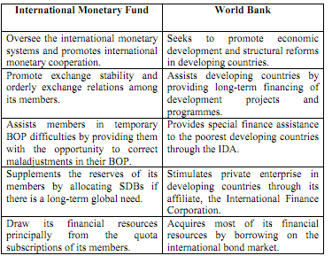

## Table of Contents

## What is the basic purpose of the IMF?

The International Monetary Fund (IMF) helps countries with their money problems. It gives advice and loans to countries that are having trouble with their economy. This helps them to keep their money stable and to grow their economy.

The IMF also keeps an eye on the world's economy. It watches how countries are doing and gives reports on what is happening. This helps everyone understand the global economy better and work together to make it stronger.

## How does the WTO function to promote international trade?

The World Trade Organization (WTO) helps countries trade with each other more easily. It does this by making rules that all countries agree to follow. These rules say that countries should treat each other fairly when they trade. For example, if a country puts a tax on goods coming from another country, it should be the same for all countries, not just one. This helps make sure that trade is fair and that no country is left out.

The WTO also helps countries talk to each other about trade problems. If two countries have a disagreement about trade, they can go to the WTO to help solve it. The WTO listens to both sides and then makes a decision. This way, countries can solve their problems without fighting. By doing all these things, the WTO helps make international trade smoother and more peaceful.

## What are the primary goals of the World Bank?

The World Bank wants to help countries that are poor or developing to grow and get better. It does this by giving money to these countries so they can build things like schools, hospitals, and roads. This helps people in these countries to have better lives and to make more money. The World Bank also helps these countries to use their money wisely and to plan for the future.

Another big goal of the World Bank is to fight poverty around the world. It does this by helping countries to create jobs and to make sure that everyone has enough food and water. The World Bank also works on big problems like climate change and health issues. By doing all these things, the World Bank tries to make the world a better place for everyone.

## How do the funding mechanisms of the IMF, WTO, and World Bank differ?

The IMF gets its money from the countries that are part of it. Each country gives money to the IMF based on how big its economy is. The IMF then uses this money to give loans to countries that need help with their economy. These loans usually have to be paid back with interest. The IMF also keeps some of its money as a reserve to help in big emergencies.

The World Bank also gets its money from the countries that are part of it. But it raises most of its money by selling bonds in financial markets. The money it gets from selling bonds is then used to give loans and grants to poor and developing countries. These loans often have low interest rates and long repayment times, and some of the money is given as grants that do not need to be paid back.

The WTO does not give loans or grants like the IMF and the World Bank. Instead, it is funded by the countries that are part of it through membership fees. These fees are based on each country's share of world trade. The WTO uses this money to run its operations, like helping countries solve trade disagreements and making sure trade rules are followed. The WTO does not directly fund countries but helps them trade better with each other.

## In what ways do the IMF and World Bank collaborate on projects?

The IMF and World Bank work together a lot to help countries that are struggling. When a country has big money problems, the IMF might give it a loan to fix things right away. At the same time, the World Bank might give the country money to build things like schools and roads that will help it grow in the long run. They talk to each other to make sure their help fits well together and doesn't cause problems.

They also work together on special projects that focus on big world problems, like fighting poverty or dealing with climate change. For example, if a country needs help because of a natural disaster, the IMF might give quick money to help with the emergency, while the World Bank could provide money for rebuilding and making the country stronger against future disasters. By working together, they can help countries in a more complete way, covering both immediate needs and long-term goals.

## How does the WTO resolve trade disputes between countries?

When countries have disagreements about trade, they can go to the WTO for help. The WTO has a special system to solve these problems. First, the countries talk to each other to see if they can fix things on their own. If they can't, they can ask the WTO to set up a panel of experts. These experts listen to both sides and then make a decision about who is right and who is wrong.

If a country doesn't like the decision, it can ask for a review by the WTO's Appellate Body, which is like a higher court. The Appellate Body looks at the decision again and can change it if they think it's wrong. Once the final decision is made, the country that broke the rules has to fix the problem. If it doesn't, the other country can take action, like putting extra taxes on goods from the country that broke the rules. This way, the WTO helps countries solve their trade problems fairly and peacefully.

## What role does the IMF play in global financial stability?

The IMF helps keep the world's money safe and stable. It does this by watching how countries are doing with their money and giving advice on how to make things better. If a country is having big money problems, the IMF can give it a loan to help fix things quickly. This helps stop the problem from getting worse and spreading to other countries. By doing this, the IMF makes sure that the world's money system stays strong and doesn't fall apart.

The IMF also helps countries work together on money issues. It gets countries to talk to each other and agree on rules for how to handle their money. This helps everyone understand what's happening and work together to solve problems. By making sure countries follow these rules, the IMF helps keep the world's money stable and helps countries trust each other more. This way, the world's money system can keep running smoothly and help everyone.

## How does the World Bank address issues of poverty and development?

The World Bank works hard to help poor countries and those that are still growing. It gives them money to build important things like schools, hospitals, and roads. This helps people in these countries live better lives and make more money. The World Bank also helps these countries use their money wisely and plan for the future. By doing this, the World Bank helps countries grow and become stronger.

Another big way the World Bank fights poverty is by helping countries create jobs and make sure everyone has enough food and water. It also works on big world problems like climate change and health issues. By helping countries solve these problems, the World Bank makes life better for people everywhere. It wants to make the world a fairer place where everyone can have a good life.

## What are the key differences in the governance structures of the IMF, WTO, and World Bank?

The IMF, WTO, and World Bank each have different ways of being run. The IMF is led by a Board of Governors, where each country that is part of the IMF has one governor. They meet once a year to make big decisions. Day-to-day work is done by the Executive Board, which has 24 members. Some big countries like the U.S. and China have their own seat, while smaller countries share seats. The head of the IMF is called the Managing Director, and they are usually from Europe.

The WTO is also run by a Ministerial Conference, which meets every two years. All member countries send representatives to this meeting to make important decisions. The day-to-day work is handled by the General Council, which includes ambassadors from all member countries. The WTO also has a Director-General, who leads the organization and helps with trade talks. Unlike the IMF, the WTO focuses more on making sure all countries have a say in decisions.

The World Bank is governed by a Board of Governors, similar to the IMF, where each member country has one governor. They meet once a year to set the big goals for the Bank. The daily work is managed by the Board of Executive Directors, which has 25 members. The President of the World Bank, who is usually from the U.S., leads the organization and makes sure its goals are met. The World Bank focuses a lot on helping poor countries, so its governance structure tries to make sure these countries have a voice, even though bigger countries have more power.

## How do the IMF's lending programs influence national economic policies?

When countries borrow money from the IMF, they have to follow certain rules to get the loan. These rules are called "conditions" and they are made to help the country fix its money problems. The IMF might say the country needs to cut spending, raise taxes, or change its money rules. This can be hard for the country because it might have to change its plans or laws. But the IMF thinks these changes will help the country's economy get better in the long run.

These conditions can have a big effect on what the country does with its money. Sometimes, the changes the IMF wants can be unpopular with the people in the country. They might not like having less money to spend or having to pay more taxes. But if the country wants the IMF's help, it has to follow the rules. This can make the country's leaders think carefully about what they do with their money, knowing the IMF is watching and helping them make big decisions.

## What impact does the WTO have on global trade policies and regulations?

The WTO helps make global trade rules that countries agree to follow. It wants trade to be fair and equal for everyone. The WTO makes sure countries don't put too many taxes or limits on goods from other places. This helps countries trade more easily and helps businesses sell their things all over the world. By having clear rules, the WTO makes it easier for countries to know what to expect when they trade with each other.

The WTO also helps countries talk about trade problems and solve them peacefully. If two countries disagree about trade, they can go to the WTO to help them fix it. The WTO listens to both sides and decides what is fair. This stops countries from fighting over trade and helps them work together better. By doing all these things, the WTO makes global trade smoother and helps the world's economy grow.

## How do the World Bank's initiatives affect sustainable development goals?

The World Bank helps countries reach sustainable development goals by giving them money and advice. It focuses on things like ending poverty, making sure everyone has enough food, and fighting climate change. The World Bank gives loans and grants to poor and growing countries so they can build schools, hospitals, and roads. This helps people live better lives and makes countries stronger. By doing this, the World Bank helps countries meet goals like making sure everyone can go to school and has good health care.

The World Bank also works on big world problems like climate change. It helps countries use clean energy and protect their environment. This is important for sustainable development because it helps make sure the world stays a good place to live for future generations. The World Bank's projects often focus on making sure that growth is good for people and the planet. By helping countries plan and use their money wisely, the World Bank plays a big role in making sure they can reach these important goals.

## References & Further Reading

[1]: ["The World Bank: Structure and Policies"](https://archive.org/details/worldbankstructu0000unse) by Primo Braga and Enrique R. Carrasco

[2]: ["IMF and the Global Economy"](https://www.imf.org/en/Publications/WEO/Issues/2024/10/22/world-economic-outlook-october-2024) by James Raymond Vreeland

[3]: ["Understanding the WTO"](https://www.wto-ilibrary.org/content/books/9789287042170s005-c001) - World Trade Organization

[4]: Treleaven, P., Galas, M., & Lalchand, V. (2013). ["Algorithmic Trading Review."](https://www.researchgate.net/publication/262239006_Algorithmic_Trading_Review) Philosophical Transactions of the Royal Society A: Mathematical, Physical and Engineering Sciences.

[5]: Merrin, R. (2012). ["High-Frequency Trading and Market Performance."](https://www.jstor.org/stable/pdf/45286297.pdf) Journal of Financial Markets, 15(4), 171-196.

[6]: ["Flash Boys: A Wall Street Revolt"](https://en.wikipedia.org/wiki/Flash_Boys) by Michael Lewis

[7]: Aldridge, I. (2013). ["High-Frequency Trading: A Practical Guide to Algorithmic Strategies and Trading Systems"](https://www.amazon.com/High-Frequency-Trading-Practical-Algorithmic-Strategies/dp/1118343506) by Irene Aldridge