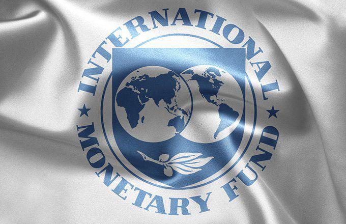

The intersection of global financial frameworks and modern technological advancements presents a unique landscape that is rapidly transforming how financial markets operate. In recent years, the emergence of algorithmic trading has revolutionized the trading environment, enabling transactions at unprecedented speeds and volumes. The World Bank, International Monetary Fund (IMF), and World Trade Organization (WTO) play pivotal roles in this evolving paradigm, influencing global digital financial markets through their policies and frameworks.

The World Bank is actively involved in providing financial and technical assistance to developing nations, often shaping trade policies that impact financial markets globally. Meanwhile, the IMF focuses on ensuring global economic stability through financial support and policy guidance, fostering international monetary cooperation and influencing economic policies that govern algorithmic trading activities. The WTO, by setting international trade rules and resolving disputes, promotes a seamless global trade environment, which is essential for the efficient operation of advanced trading systems like those based on algorithms.

Understanding the involvement of these organizations with algorithmic trading is crucial in the era of globalization, as their influence extends beyond traditional financial markets into digital transactions. As technology continues to advance, the synergy between algorithmic trading and global financial institutions will significantly impact the efficiency, liquidity, and stability of financial markets worldwide. This article explores these dynamics, highlighting the importance of regulatory frameworks, international cooperation, and future developments that will shape the role of algorithmic trading in the global economy.

## Table of Contents

## The Roles of World Bank, IMF, and WTO

The World Bank, International Monetary Fund (IMF), and World Trade Organization (WTO) are three pivotal institutions in the global financial system, each playing distinct yet interconnected roles.

The World Bank primarily focuses on providing financial and technical assistance to developing countries, aiming to reduce poverty and support sustainable development. Its operations involve funding infrastructure projects, supporting social programs, and enhancing economic governance. The World Bank's influence on trade policies often emerges through its development strategies and projects, which can lead to improved trade capacities for developing nations. By doing so, it integrates these countries into the global economy, fostering growth and allowing them to participate more effectively in international trade.

The IMF is tasked with maintaining global economic stability. It does so by offering financial support, policy advice, and capacity development to its member countries. The IMF's interventions are crucial in times of financial crises, where it helps stabilize economies through monetary cooperation. Its policy guidance often shapes the monetary policies of nations, aiming to ensure stability in exchange rates and the global monetary system. The IMF's surveillance function involves monitoring global economic trends, which enables it to provide recommendations and promote sustainable economic growth.

The WTO, on the other hand, sets international trade rules and facilitates trade negotiations among its member states. Its primary functions include overseeing global trade agreements, resolving trade disputes, and promoting fair competition. The WTO's role is crucial in creating a seamless and predictable trade environment, enabling countries to engage in international trade with reduced barriers. By advocating for open trade policies and tackling trade-related issues, the WTO supports global economic integration and development. Its dispute resolution mechanism ensures that trade conflicts are addressed in a structured manner, contributing to a more stable international trade system.

Collectively, the interactions and policies of the World Bank, IMF, and WTO significantly shape the global economic and trade landscape, influencing how countries engage in and benefit from international markets.

## Algorithmic Trading: An Overview

Algorithmic trading utilizes sophisticated computer algorithms to execute trading decisions at speeds and volumes far exceeding human capabilities. These algorithms, often developed using complex mathematical models, analyze vast datasets swiftly to identify trading opportunities and execute transactions based on predefined criteria. This automation allows for the rapid processing of market signals and can include high-frequency trading ([HFT](/wiki/high-frequency-trading-strategies)) strategies, where trades are executed in fractions of a second.

The primary advantages of [algorithmic trading](/wiki/algorithmic-trading) include improved market [liquidity](/wiki/liquidity-risk-premium) and reduced transaction costs. By automating trades, market participants can react quickly to market conditions without the delays inherent in manual trading processes. This efficiency can narrow bid-ask spreads, thus enhancing liquidity. Furthermore, automation reduces the likelihood of human error, helps execute large trade volumes without significant price impact, and optimizes execution strategies to minimize costs.

However, algorithmic trading also introduces several risks. One of the notable concerns is market [volatility](/wiki/volatility-trading-strategies), as the rapid execution of large volumes can lead to significant price swings. This volatility was evidenced in events like the "Flash Crash" of May 6, 2010, when the Dow Jones Industrial Average plunged about 1,000 points within minutes, only to quickly recover. Such incidents underscore the potential for algorithms to misinterpret market conditions or interact in unforeseen ways, potentially leading to systemic risk.

Moreover, algorithmic trading can contribute to market fragmentation and reduced transparency, as the sheer [volume](/wiki/volume-trading-strategy) of trades can obscure true supply and demand dynamics. This lack of transparency might make it challenging for regulators to monitor trading activities efficiently.

Despite these challenges, algorithmic trading continues to evolve, incorporating [machine learning](/wiki/machine-learning) and [artificial intelligence](/wiki/ai-artificial-intelligence) to enhance decision-making processes. These advancements aim not only to improve profitability but also to address some inherent risks by developing more adaptive and resilient strategies.

## Integration of Algorithm Trading in Global Markets

Algorithmic trading has increasingly become a vital component of financial markets globally. This growth trajectory is largely driven by technological innovations and enhanced data processing capabilities. These advancements allow algorithmic trading systems to execute orders at speeds and volumes that far surpass traditional manual trading, creating a robust mechanism for asset movement that significantly optimizes trading efficiency and liquidity.

Algorithmic trading's integration into global markets is facilitated by several factors. Firstly, the expansion of high-frequency trading (HFT) technologies has enabled market participants to exploit microsecond-level price discrepancies. Additionally, the proliferation of machine learning and artificial intelligence algorithms has enhanced the predictive capabilities of these trading systems, further refining their decision-making processes.

However, the widespread adoption of algorithmic trading presents regulatory challenges that necessitate comprehensive oversight. One major concern is its potential to exacerbate market volatility. The 2010 Flash Crash, where the Dow Jones Industrial Average plunged nearly 1,000 points within minutes, is often cited as a cautionary tale of unregulated algorithmic trading environments. Such events emphasize the need for regulatory frameworks that can mitigate systemic risks associated with fast-paced automated trading operations.

To address these issues, regulatory bodies must consider several measures. Ensuring that algorithms are tested and monitored is crucial to safeguard market integrity. Mechanisms like circuit breakers and kill switches can provide essential tools to halt trading during erratic market behaviors, protecting the market from extreme fluctuations. Moreover, international cooperation is essential to harmonize regulations across jurisdictions, given the borderless nature of modern financial markets.

In conclusion, while algorithmic trading continues to drive efficiency in global financial markets, its integration necessitates dynamic regulatory solutions to manage associated risks effectively. These solutions must evolve alongside technological advancements to ensure a secure trading environment that benefits the global economy.

## Impact on Global Trade and Economy

Algorithmic trading, characterized by the use of algorithms to automate trading processes, is reshaping the contours of global trade and the economy. This technology contributes to market efficiency by facilitating faster execution of trades and narrowing bid-ask spreads, which enhances liquidity. In an efficient market, prices reflect all available information almost instantaneously, resulting in more accurate asset valuations. However, the increased speed and volume bring potential risks that can alter trade dynamics significantly.

The impact of algorithmic trading on global trade is multifaceted. Enhanced liquidity and efficient price discovery are beneficial, reducing costs associated with transactions and potentially increasing international trade volumes. For example, the more seamless trading process can attract more participants, including smaller and developing nations, thereby broadening the global economic playing field.

However, the rapid and automated nature of algorithmic trades also incurs volatility risks, such as those witnessed during flash crashes. These occurrences, characterized by dramatic and rapid price drops, demonstrate how algorithms can sometimes react unpredictably to market information, leading to destabilized markets. Such volatility can deter trade by increasing uncertainty around transaction costs and asset values.

The altered dynamics in trade due to algorithmic transactions necessitate careful consideration of international economic balances. Institutions like the International Monetary Fund (IMF) and the World Bank play critical roles in moderating these effects. Their involvement often extends to monitoring and providing guidance on macroeconomic policies to manage systemic risks that arise from innovation in trading technologies. The IMF, in particular, assists with surveillance of global financial markets, ensuring that countries adapt their monetary policies to accommodate such technological shifts while maintaining economic stability.

Furthermore, the World Bank can aid developing economies in adapting to these changes by providing financial and technical support to modernize their financial markets, making them more resilient to the fluctuations caused by algorithmic trading. Through capacity-building initiatives, the World Bank can ensure that developing nations are not disadvantaged in the evolving digital trade landscape. 

In conclusion, while algorithmic trading presents opportunities for enhanced efficiency and increased global trade, it also poses challenges that could disrupt the international economic balance. Institutions like the IMF and the World Bank are pivotal in navigating these challenges by fostering an environment of stability and growth amid rapid technological advancement.

## Regulatory Challenges and International Cooperation

Regulating algorithmic trading presents several challenges, primarily concerning transparency and the prevention of market manipulation. The complexity and speed associated with algorithmic trading often obscure trade intentions, making it difficult for regulators to monitor for manipulative practices effectively. This lack of transparency can result in difficulties identifying inappropriate behavior, such as spoofing or layering, which can distort market prices and undermine market integrity.

One significant hurdle in regulating algorithmic trading is ensuring that trading algorithms operate within established legal and ethical frameworks. These algorithms, capable of executing trades in milliseconds, necessitate robust surveillance systems and legal frameworks to monitor and address potential irregularities. Additionally, ensuring that algorithms comply with existing regulations across different jurisdictions requires harmonization of the legal structures in place, which can be challenging given the pace of technological advancements.

Global cooperation through organizations like the World Trade Organization (WTO) is crucial in creating a uniform regulatory environment that accounts for the rapid advancements in algorithmic trading technologies. The WTO can facilitate dialogues and negotiations among member states to formulate coherent regulatory standards that incorporate technological innovations. This would involve establishing guidelines and principles that maintain market fairness and transparency while promoting financial innovations.

Effective global cooperation can also lead to the development of shared monitoring tools and frameworks that enhance the detection of cross-border algorithmic trading activities that may lead to systemic risks. Such cooperation could involve the creation of a global regulatory sandbox designed to test new technologies and assess their implications on global financial stability. Furthermore, uniform reporting standards and data sharing agreements between nations could improve oversight and foster trust in algorithmic trading systems.

In conclusion, addressing the regulatory challenges posed by algorithmic trading requires not only national efforts but also international collaboration. By working together, countries can develop a comprehensive regulatory infrastructure that effectively balances the need for market integrity with the benefits brought about by advancements in trading technologies.

## Future Prospects and Developments

Future prospects for algorithmic trading, particularly in relation to international trade, indicate increasing incorporation of artificial intelligence (AI) and machine learning technologies. As global markets become more data-driven, AI algorithms enable heightened predictive analytics, improving decision-making speed and accuracy. These advancements can optimize trading patterns, enhance market efficiency, and reduce transaction costs, potentially leading to an overall positive impact on global trade.

The World Bank, International Monetary Fund (IMF), and World Trade Organization (WTO) are likely to adapt policies to support and regulate these technological advancements in trading practices. For the World Bank, incorporating AI-driven algorithmic trading could mean creating new frameworks for financial inclusivity and sustainable development. Initiatives may focus on leveraging technology to empower developing economies by improving access to financial markets and introducing innovative financing solutions.

The IMF is poised to address the challenges and opportunities presented by AI-enhanced trading through its policy guidance and financial assistance programs. By advocating for monetary policies that support technological integration, the IMF can help ensure global economic stability. This may involve developing regulatory measures to manage the risks associated with AI in financial systems, such as the potential for market manipulation or systemic failures.

The WTO's role might evolve towards establishing standardized protocols for AI-driven trading activities. Developing comprehensive global regulations that account for technological advancements will be essential to facilitate seamless international trade. The WTO can coordinate international efforts to harmonize legal standards, ensuring fair competition and transparency in trade practices worldwide.

In practice, these international organizations will need to collaborate to effectively manage the interface between digital innovation and global trade. A joint effort can ensure robustness in regulatory frameworks and sustainable economic growth. Future trends may also include the creation of global coalitions aimed at fostering technological cooperation and sharing best practices.

Ultimately, the evolution of the World Bank, IMF, and WTO in response to algorithmic trading and AI developments is vital for promoting sustainable growth. As these organizations adapt to the digital era, focusing on balanced integration of new technologies will be key to harnessing benefits while minimizing risks to the international economic landscape.

## Conclusion

The synergistic relationship between international financial organizations and algorithmic trading continues to have a profound impact on global financial markets. As algorithmic trading becomes more integral to these markets, the roles of entities such as the World Bank, the International Monetary Fund (IMF), and the World Trade Organization (WTO) become increasingly significant. These organizations have the capacity to guide and influence the global financial ecosystem by introducing policies and frameworks that enhance the benefits of algorithmic trading while minimizing its risks.

Proactive measures are essential to effectively leverage the benefits of algorithmic trading. These measures can include creating robust regulatory frameworks that ensure transparency and prevent market manipulation. Furthermore, ongoing collaboration among international financial organizations can help standardize regulations and foster a more cohesive global trading environment. This collaboration can facilitate the development of uniform practices and guidelines that accommodate the rapid technological advancements characterizing modern financial markets.

Mitigating the risks associated with algorithmic trading requires a multifaceted approach. International cooperation is crucial to ensuring that regulations are not only consistent but also dynamically updated to adapt to new challenges. By building on their respective strengths, the World Bank, IMF, and WTO can lead efforts to develop and implement strategies that safeguard market integrity while supporting innovation and growth.

Looking forward, the successful integration of algorithmic trading into global markets will depend on the agility of these organizations to adapt to technological changes. By fostering an environment of cooperation and proactive policy-making, these institutions can help shape a stable and prosperous future for digital financial markets.

## References & Further Reading

[1]: ["The World Bank: Structure and Policies"](https://archive.org/details/worldbankstructu0000unse) by Primo Braga and Enrique R. Carrasco

[2]: ["IMF and the Global Economy"](https://www.imf.org/en/Publications/WEO/Issues/2024/10/22/world-economic-outlook-october-2024) by James Raymond Vreeland

[3]: ["Understanding the WTO"](https://www.wto-ilibrary.org/content/books/9789287042170s005-c001) - World Trade Organization

[4]: Treleaven, P., Galas, M., & Lalchand, V. (2013). ["Algorithmic Trading Review."](https://www.researchgate.net/publication/262239006_Algorithmic_Trading_Review) Philosophical Transactions of the Royal Society A: Mathematical, Physical and Engineering Sciences.

[5]: Merrin, R. (2012). ["High-Frequency Trading and Market Performance."](https://www.jstor.org/stable/pdf/45286297.pdf) Journal of Financial Markets, 15(4), 171-196.

[6]: ["Flash Boys: A Wall Street Revolt"](https://en.wikipedia.org/wiki/Flash_Boys) by Michael Lewis

[7]: Aldridge, I. (2013). ["High-Frequency Trading: A Practical Guide to Algorithmic Strategies and Trading Systems"](https://www.amazon.com/High-Frequency-Trading-Practical-Algorithmic-Strategies/dp/1118343506) by Irene Aldridge